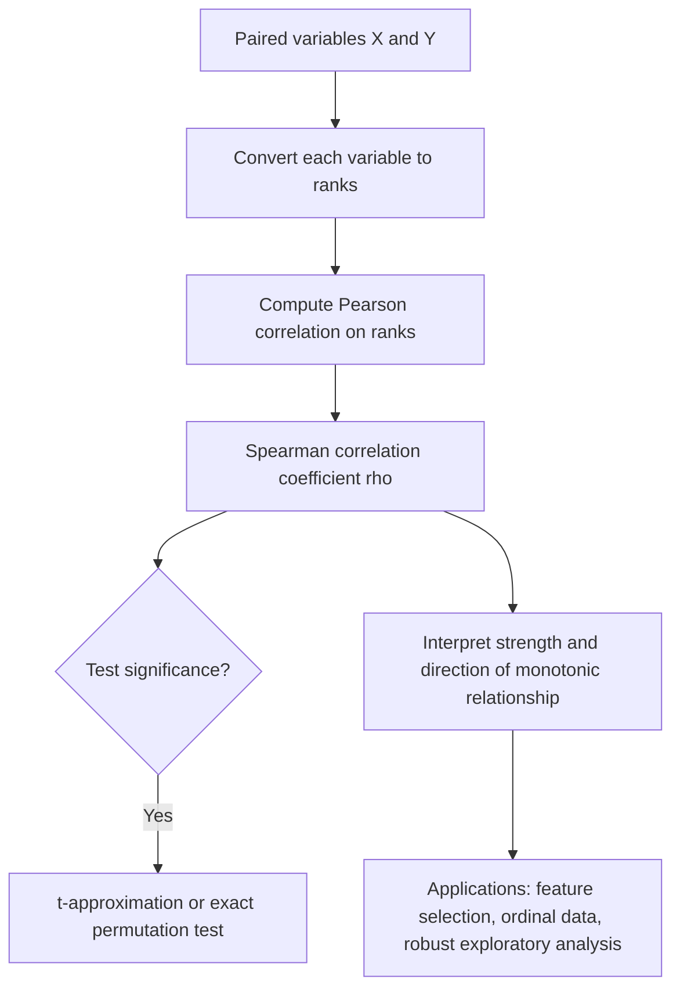

## Spearman Correlation

### Overview

Spearman correlation is a rank-based measure of association that captures the strength and direction of a **monotonic** relationship between two variables, rather than being restricted to strictly linear relationships as with Pearson correlation. By operating on ranks instead of raw values, it is more robust to outliers and better suited to ordinal data or nonlinear-but-monotonic relationships.

### Definition

The **Spearman rank correlation coefficient**, denoted $\rho$ (or $r_s$), is calculated by first converting each variable's values to ranks, then computing the Pearson correlation coefficient on those ranks.

$$\rho = \frac{\text{Cov}(R_X, R_Y)}{\sigma_{R_X}\sigma_{R_Y}}$$

where $R_X$ and $R_Y$ are the rank-transformed versions of $X$ and $Y$.

When there are no tied ranks, this simplifies to the commonly cited computational formula:

$$\rho = 1 - \frac{6\sum_{i=1}^{n} d_i^2}{n(n^2 - 1)}$$

where $d_i$ is the difference between the ranks of the $i$-th paired observations, and $n$ is the number of observations.

**Key Points**
- $\rho$ ranges from $-1$ to $1$, with the same directional interpretation as Pearson correlation: $1$ indicates a perfect increasing monotonic relationship, $-1$ a perfect decreasing monotonic relationship, and $0$ indicates no monotonic association.
- Because it is based on ranks, Spearman correlation captures any monotonic relationship — linear or nonlinear — not just linear ones.
- When there are tied values, ranks are typically assigned as the average of the tied positions, and the simplified formula above should be adjusted or replaced with the direct Pearson-on-ranks computation. [Inference]

### Diagram: Rank Transformation

<svg xmlns="http://www.w3.org/2000/svg" viewBox="0 0 700 280" font-family="Arial, sans-serif">
  <text x="350" y="26" font-size="18" font-weight="bold" text-anchor="middle" fill="#222">Values to Ranks Transformation (svg_diagram)</text>

  <text x="150" y="55" font-size="13" fill="#333" text-anchor="middle">Raw values (nonlinear monotonic)</text>
  <line x1="60" y1="200" x2="260" y2="200" stroke="#ccc" />
  <line x1="60" y1="200" x2="60" y2="80" stroke="#ccc" />
  <circle cx="80" cy="190" r="3" fill="#4a76d4" />
  <circle cx="110" cy="170" r="3" fill="#4a76d4" />
  <circle cx="140" cy="130" r="3" fill="#4a76d4" />
  <circle cx="170" cy="105" r="3" fill="#4a76d4" />
  <circle cx="200" cy="90" r="3" fill="#4a76d4" />
  <path d="M80,190 Q140,175 200,90" fill="none" stroke="#4a76d4" stroke-width="1" stroke-dasharray="3,2" />

  <text x="350" y="140" font-size="20" text-anchor="middle" fill="#333">→</text>
  <text x="350" y="160" font-size="11" text-anchor="middle" fill="#666">rank both</text>
  <text x="350" y="174" font-size="11" text-anchor="middle" fill="#666">variables</text>

  <text x="540" y="55" font-size="13" fill="#333" text-anchor="middle">Ranks (perfectly linear)</text>
  <line x1="450" y1="200" x2="650" y2="200" stroke="#ccc" />
  <line x1="450" y1="200" x2="450" y2="80" stroke="#ccc" />
  <circle cx="470" cy="180" r="3" fill="#3a8a4a" />
  <circle cx="500" cy="160" r="3" fill="#3a8a4a" />
  <circle cx="530" cy="140" r="3" fill="#3a8a4a" />
  <circle cx="560" cy="120" r="3" fill="#3a8a4a" />
  <circle cx="590" cy="100" r="3" fill="#3a8a4a" />
  <line x1="470" y1="180" x2="590" y2="100" stroke="#3a8a4a" stroke-width="1.5" />
</svg>

### Worked Example

Consider the following paired observations:

| $x_i$ | $y_i$ |
|---|---|
| 10 | 15 |
| 20 | 25 |
| 30 | 22 |
| 40 | 40 |
| 50 | 38 |

**Step 1: Assign ranks (1 = smallest)**

| $x_i$ | Rank($x$) | $y_i$ | Rank($y$) | $d_i$ | $d_i^2$ |
|---|---|---|---|---|---|
| 10 | 1 | 15 | 1 | 0 | 0 |
| 20 | 2 | 25 | 3 | -1 | 1 |
| 30 | 3 | 22 | 2 | 1 | 1 |
| 40 | 4 | 40 | 5 | -1 | 1 |
| 50 | 5 | 38 | 4 | 1 | 1 |

**Step 2: Sum squared rank differences**

$$\sum d_i^2 = 0 + 1 + 1 + 1 + 1 = 4$$

**Step 3: Apply the formula**

$$\rho = 1 - \frac{6(4)}{5(25-1)} = 1 - \frac{24}{120} = 1 - 0.2 = 0.8$$

A Spearman correlation of 0.8 indicates a strong positive monotonic relationship between $x$ and $y$, despite the ranks not being in perfect lockstep.

### Hypothesis Testing

For small samples, exact tables or permutation-based methods are typically used to assess the significance of $\rho$. For larger samples, a t-statistic analogous to the Pearson case can be used:

$$t = \rho\sqrt{\frac{n-2}{1-\rho^2}}$$

approximately following a t-distribution with $n-2$ degrees of freedom under the null hypothesis of no monotonic association, particularly as sample size increases. [Inference]

**Key Points**
- Unlike the Pearson significance test, this approach does not require an assumption of bivariate normality, since it is based on ranks rather than raw values.
- For small sample sizes, exact permutation distributions of $\rho$ are often preferred over the t-approximation for more accurate inference. [Inference]

### Key Properties and Assumptions

**Key Points**
- **Captures monotonic, not just linear, relationships:** A relationship like $y = x^3$ would yield a Spearman correlation of exactly 1 (since it is perfectly monotonic), while the Pearson correlation would be less than 1 due to the nonlinearity.
- **Robust to outliers:** Because Spearman correlation depends only on the relative ordering of values rather than their magnitudes, extreme values have limited influence compared to Pearson correlation. [Inference]
- **Works with ordinal data:** Spearman correlation is directly applicable to ordinal variables (ranked categories), where Pearson correlation is not strictly appropriate since it assumes interval or ratio-scaled data.
- **Loses information:** By converting to ranks, Spearman correlation discards information about the actual magnitude of differences between values, retaining only their order. [Inference]
- **Tied ranks:** When many tied values are present, appropriate rank-averaging and correction terms are needed for accurate computation, and this can slightly reduce the coefficient's sensitivity. [Inference]

### Pearson vs. Spearman: Side-by-Side Comparison

| Aspect | Pearson Correlation | Spearman Correlation |
|---|---|---|
| Relationship type detected | Linear only | Any monotonic (linear or nonlinear) |
| Input data | Raw continuous values | Ranks of values |
| Outlier sensitivity | High | Lower |
| Assumes normality (for testing) | Often assumed | Not required |
| Applicable to ordinal data | Not strictly appropriate | Directly applicable |
| Computational basis | Covariance and standard deviations | Covariance and standard deviations of ranks |

### Diagram: When Pearson and Spearman Disagree

<svg xmlns="http://www.w3.org/2000/svg" viewBox="0 0 700 260" font-family="Arial, sans-serif">
  <text x="350" y="26" font-size="18" font-weight="bold" text-anchor="middle" fill="#222">Nonlinear Monotonic Relationship (svg_diagram)</text>

  <line x1="80" y1="220" x2="620" y2="220" stroke="#ccc" stroke-width="1" />
  <line x1="80" y1="220" x2="80" y2="50" stroke="#ccc" stroke-width="1" />

  <path d="M90,210 Q250,200 400,120 T600,60" fill="none" stroke="#4a76d4" stroke-width="2.5" />
  <circle cx="90" cy="210" r="3" fill="#4a76d4" />
  <circle cx="200" cy="205" r="3" fill="#4a76d4" />
  <circle cx="320" cy="170" r="3" fill="#4a76d4" />
  <circle cx="420" cy="110" r="3" fill="#4a76d4" />
  <circle cx="520" cy="80" r="3" fill="#4a76d4" />
  <circle cx="600" cy="60" r="3" fill="#4a76d4" />

  <text x="350" y="245" font-size="12" text-anchor="middle" fill="#666">Spearman rho close to 1 (perfectly monotonic); Pearson r less than 1 (curved, not linear)</text>
</svg>

### Relevance to Machine Learning

**Key Points**
- **Feature selection:** Spearman correlation is often used alongside or instead of Pearson correlation when relationships between features and targets are suspected to be nonlinear but still monotonic.
- **Robust exploratory analysis:** Because of its resistance to outliers, Spearman correlation can offer a more stable view of association in data with extreme values or heavy-tailed distributions. [Inference]
- **Ordinal and ranked data:** Naturally suited to survey data, ratings, and other ordinal measurements where raw numeric differences may not be meaningful.
- **Model diagnostics:** Can be used to detect monotonic (but non-linear) patterns in residuals or relationships that Pearson-based diagnostics might understate. [Inference]
- **Nonparametric statistics:** Spearman correlation is part of a broader family of nonparametric, rank-based methods that make fewer distributional assumptions than their parametric counterparts.

### Conceptual Flow

### Advantages and Limitations

**Key Points**
- **Advantages:**
  - Detects a broader class of relationships (any monotonic association) compared to Pearson's strictly linear focus.
  - More robust to outliers, since extreme values only affect rank position rather than contributing disproportionately large squared deviations. [Inference]
  - Applicable to ordinal data without requiring interval or ratio measurement scales.
- **Limitations:**
  - Discards information about the magnitude of differences between values, retaining only rank order. [Inference]
  - Does not capture non-monotonic relationships (e.g., U-shaped patterns), where the correlation can be misleadingly close to zero despite a strong underlying relationship. [Inference]
  - Computation and interpretation with many tied values requires care and appropriate correction. [Inference]
  - Generally considered less statistically efficient than Pearson correlation when the underlying relationship is genuinely linear and data are well-behaved (e.g., approximately normal), since ranking discards some information. [Inference]

### Practical Considerations

- Visualizing the scatter plot alongside computing both Pearson and Spearman correlations can help identify whether an observed relationship is linear, monotonic-nonlinear, or something more complex (e.g., non-monotonic). [Inference]
- A notably larger Spearman than Pearson correlation for the same data pair can be a signal of a nonlinear-but-monotonic relationship, or of outlier influence on the Pearson estimate. [Inference]
- Kendall's tau is another rank-based alternative, often preferred for smaller sample sizes or when a more directly interpretable measure of concordance is desired. [Inference]

**Next Steps**
- Pearson Correlation
- Kendall's Tau
- Nonparametric Statistical Methods
- Ordinal Data Analysis
- Feature Selection Methods in Machine Learning
- Mutual Information as a Nonlinear Association Measure
- Handling Outliers in Statistical Analysis