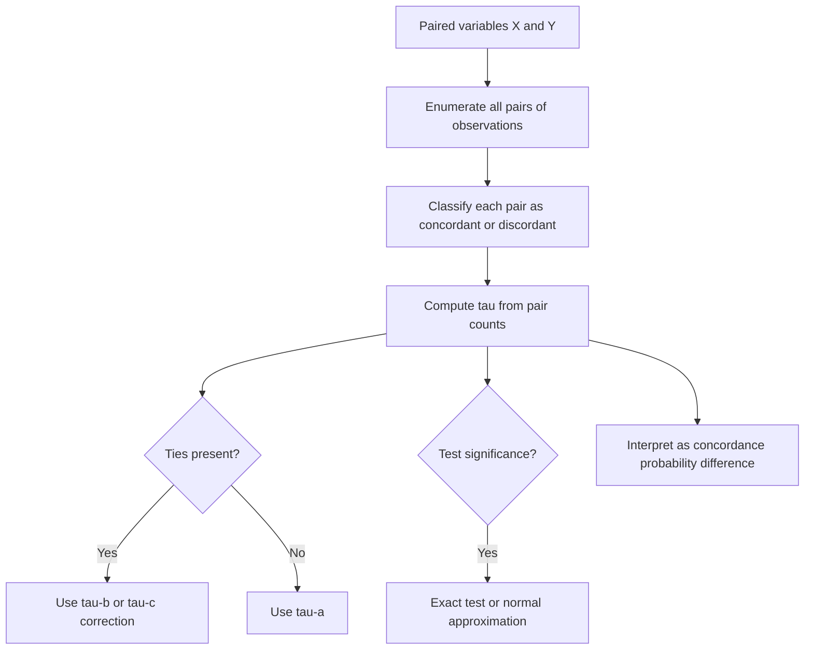

## Kendall's Tau

### Overview

Kendall's tau is a rank-based, nonparametric measure of association between two variables, quantifying the strength of a monotonic relationship based on the concordance and discordance of paired observations. Alongside Spearman correlation, it offers a robust alternative to Pearson correlation when linearity or normality assumptions are questionable, and it is particularly valued for its direct probabilistic interpretation.

### Definition

For $n$ paired observations $(x_i, y_i)$, consider all possible pairs of observations $(i, j)$ with $i \neq j$. Each pair is classified as:

- **Concordant:** if the relative ordering of $x$ and $y$ agrees — i.e., $(x_i - x_j)(y_i - y_j) > 0$.
- **Discordant:** if the relative ordering disagrees — i.e., $(x_i - x_j)(y_i - y_j) < 0$.
- **Tied:** if $x_i = x_j$ or $y_i = y_j$.

**Kendall's tau (tau-a, no tie correction)** is defined as:

$$\tau = \frac{(\text{number of concordant pairs}) - (\text{number of discordant pairs})}{\binom{n}{2}}$$

where $\binom{n}{2} = \frac{n(n-1)}{2}$ is the total number of distinct pairs.

**Key Points**
- $\tau$ ranges from $-1$ to $1$: $1$ indicates perfect agreement in ranking (all pairs concordant), $-1$ indicates perfect disagreement (all pairs discordant), and $0$ indicates no net tendency toward concordance or discordance.
- Unlike Spearman correlation, which is Pearson correlation applied to ranks, Kendall's tau is built directly from pairwise comparisons, giving it a distinct probabilistic interpretation.
- $\tau$ can be interpreted as the difference between the probability that a randomly chosen pair is concordant and the probability that it is discordant.

### Diagram: Concordant vs. Discordant Pairs

<svg xmlns="http://www.w3.org/2000/svg" viewBox="0 0 700 280" font-family="Arial, sans-serif">
  <text x="350" y="26" font-size="18" font-weight="bold" text-anchor="middle" fill="#222">Concordant and Discordant Pairs (svg_diagram)</text>

  <text x="180" y="55" font-size="13" text-anchor="middle" fill="#333">Concordant pair</text>
  <line x1="60" y1="200" x2="300" y2="200" stroke="#ccc" />
  <line x1="60" y1="200" x2="60" y2="80" stroke="#ccc" />
  <circle cx="110" cy="170" r="4" fill="#3a8a4a" />
  <text x="120" y="165" font-size="11" fill="#3a8a4a">i</text>
  <circle cx="220" cy="110" r="4" fill="#3a8a4a" />
  <text x="230" y="105" font-size="11" fill="#3a8a4a">j</text>
  <line x1="110" y1="170" x2="220" y2="110" stroke="#3a8a4a" stroke-width="1.5" stroke-dasharray="4,2" />
  <text x="180" y="230" font-size="11" text-anchor="middle" fill="#555">x and y both increase</text>

  <text x="540" y="55" font-size="13" text-anchor="middle" fill="#333">Discordant pair</text>
  <line x1="420" y1="200" x2="660" y2="200" stroke="#ccc" />
  <line x1="420" y1="200" x2="420" y2="80" stroke="#ccc" />
  <circle cx="470" cy="110" r="4" fill="#d4494a" />
  <text x="480" y="105" font-size="11" fill="#d4494a">i</text>
  <circle cx="580" cy="170" r="4" fill="#d4494a" />
  <text x="590" y="165" font-size="11" fill="#d4494a">j</text>
  <line x1="470" y1="110" x2="580" y2="170" stroke="#d4494a" stroke-width="1.5" stroke-dasharray="4,2" />
  <text x="540" y="230" font-size="11" text-anchor="middle" fill="#555">x increases, y decreases</text>
</svg>

### Worked Example

Consider the paired observations:

| $x_i$ | $y_i$ |
|---|---|
| 1 | 2 |
| 2 | 1 |
| 3 | 4 |
| 4 | 3 |

**Step 1: Enumerate all $\binom{4}{2} = 6$ pairs and classify each**

| Pair | $x$ comparison | $y$ comparison | Type |
|---|---|---|---|
| (1,2) vs (2,1) | increases | decreases | Discordant |
| (1,2) vs (3,4) | increases | increases | Concordant |
| (1,2) vs (4,3) | increases | increases | Concordant |
| (2,1) vs (3,4) | increases | increases | Concordant |
| (2,1) vs (4,3) | increases | increases | Concordant |
| (3,4) vs (4,3) | increases | decreases | Discordant |

**Step 2: Count concordant and discordant pairs**

$$\text{Concordant} = 4, \quad \text{Discordant} = 2$$

**Step 3: Apply the formula**

$$\tau = \frac{4 - 2}{6} = \frac{2}{6} \approx 0.333$$

A tau of approximately 0.33 indicates a moderate positive tendency toward concordance between $x$ and $y$.

### Handling Ties: Tau-b and Tau-c

When tied values are present, the basic tau-a formula can be misleading, since tied pairs are excluded from both the numerator and the fixed denominator. Adjusted versions correct for this:

**Kendall's tau-b** (adjusts for ties in both variables, appropriate for square contingency tables):

$$\tau_b = \frac{P - Q}{\sqrt{(P + Q + T_x)(P + Q + T_y)}}$$

where $P$ is the number of concordant pairs, $Q$ the number of discordant pairs, and $T_x$, $T_y$ are the numbers of pairs tied only on $x$ and only on $y$, respectively.

**Kendall's tau-c (Stuart's tau-c)** is designed for rectangular contingency tables (variables with differing numbers of categories).

**Key Points**
- Tau-b is the most commonly reported variant in general statistical software when ties are present. [Unverified]
- Failing to correct for ties can bias tau-a toward zero in datasets with many repeated values, since tied pairs contribute to neither the concordant nor discordant count. [Inference]
- The choice between tau-a, tau-b, and tau-c depends on the presence and structure of ties in the data. [Inference]

### Hypothesis Testing

For small samples, exact distributions of Kendall's tau under the null hypothesis of no association are typically used. For larger samples, a normal approximation is commonly applied:

$$z = \frac{3\tau\sqrt{n(n-1)}}{\sqrt{2(2n+5)}}$$

which is approximately standard normal under the null hypothesis, for sufficiently large $n$. [Inference]

**Key Points**
- As with Spearman's test, this approach does not require an assumption of bivariate normality.
- Exact p-value tables or permutation-based methods are generally preferred for small sample sizes, where the normal approximation may be less accurate. [Inference]

### Kendall's Tau vs. Spearman's Rho

| Aspect | Kendall's Tau | Spearman's Rho |
|---|---|---|
| Basis | Concordant/discordant pair counts | Pearson correlation on ranks |
| Typical magnitude | Generally smaller in absolute value for the same data | Generally larger in absolute value |
| Interpretation | Direct probability difference (concordance minus discordance) | Analogous to a linear correlation of ranks |
| Sensitivity to small sample errors | Often considered more robust for small samples | Can be more sensitive to small perturbations in rank order [Inference] |
| Computational complexity | $O(n^2)$ for the basic pairwise approach (faster algorithms exist) | $O(n \log n)$, dominated by the ranking step |

**Key Points**
- Kendall's tau and Spearman's rho typically agree in the sign and general magnitude of association, though their numeric values are not directly comparable on the same scale. [Inference]
- Kendall's tau is often preferred in smaller samples or when a more directly interpretable probabilistic statement (excess probability of concordance) is desired.
- Spearman's rho is more commonly used in practice, in part due to its simpler and faster computation for large datasets, though Kendall's tau's statistical properties are considered favorable in certain small-sample settings. [Inference]

### Key Properties and Assumptions

**Key Points**
- **Nonparametric:** Kendall's tau makes no assumption about the underlying distribution of either variable.
- **Robust to outliers:** Because it depends only on the relative ordering of pairs rather than raw magnitudes, extreme values have limited influence on the coefficient. [Inference]
- **Captures monotonic relationships:** Like Spearman's rho, Kendall's tau detects any monotonic association, not just linear ones.
- **Computationally more intensive:** Directly computing tau requires examining all $\binom{n}{2}$ pairs, though efficient $O(n \log n)$ algorithms exist for large datasets. [Inference]

### Relevance to Machine Learning

**Key Points**
- **Feature and target association:** Kendall's tau can be used similarly to Spearman's rho for detecting monotonic relationships between features and a target variable, particularly when robustness to outliers is a priority. [Inference]
- **Ranking model evaluation:** Kendall's tau is used to evaluate the quality of predicted rankings against true rankings, such as in learning-to-rank tasks or recommender system evaluation.
- **Concordance-based evaluation metrics:** The concept of concordant and discordant pairs underlying Kendall's tau is closely related to metrics such as the concordance index (C-index) used in survival analysis and some classification contexts.
- **Small-sample robustness:** In settings with limited data, Kendall's tau's direct pairwise comparison approach can offer more stable estimates compared to some alternatives. [Inference]

### Conceptual Flow

### Advantages and Limitations

**Key Points**
- **Advantages:**
  - Direct, intuitive probabilistic interpretation as the difference between concordance and discordance probabilities.
  - Robust to outliers and does not require distributional assumptions. [Inference]
  - Well-suited to ranking-based evaluation tasks, given its foundation in pairwise comparisons.
- **Limitations:**
  - Computationally more expensive than Spearman's rho for the naive implementation, though efficient algorithms mitigate this for large datasets. [Inference]
  - Like Spearman's rho, only captures monotonic relationships and can miss non-monotonic patterns. [Inference]
  - Interpretation and computation require care when ties are present, necessitating tau-b or tau-c corrections. [Inference]
  - Values of tau are not on the same numeric scale as Pearson or Spearman correlations, which can complicate direct comparison across studies using different measures. [Inference]

### Practical Considerations

- When comparing association strength across multiple studies or methods, it is important to note which correlation measure was used, since Kendall's tau values are typically smaller in magnitude than Spearman's rho for the same underlying relationship. [Inference]
- For small sample sizes or data with many ties, tau-b is generally recommended over the uncorrected tau-a. [Inference]
- In ranking and recommendation system evaluation, Kendall's tau (or closely related concordance-based metrics) offers a natural way to assess how well a predicted ranking matches a true or reference ranking.

**Next Steps**
- Spearman Rank Correlation
- Pearson Correlation
- Concordance Index (C-index) in Survival Analysis
- Nonparametric Statistical Methods
- Ranking Model Evaluation Metrics
- Handling Ties in Rank-Based Statistics
- Learning-to-Rank Methods in Machine Learning