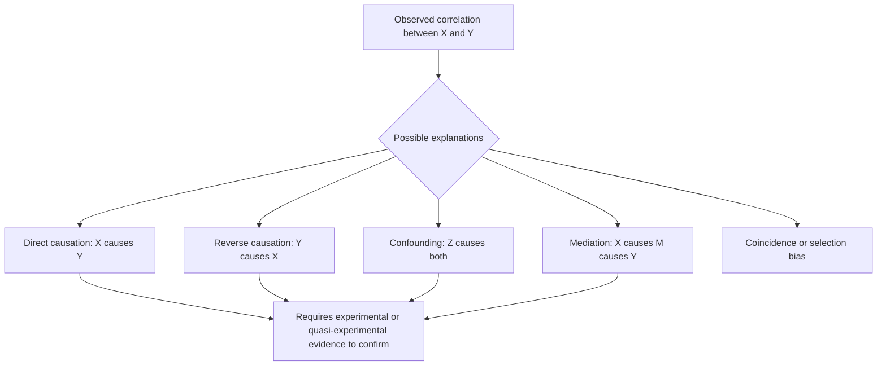

## Causation Versus Correlation

### Overview

The distinction between causation and correlation is one of the most fundamental and frequently misunderstood concepts in statistics and machine learning. Correlation quantifies statistical association between variables, while causation implies that changes in one variable directly produce changes in another. Confusing the two can lead to flawed conclusions, poor decision-making, and models that fail to generalize when the underlying mechanism changes.

### Core Distinction

**Key Points**
- **Correlation** describes a statistical relationship — how two variables tend to vary together — without any claim about the mechanism producing that relationship.
- **Causation** describes a mechanism whereby a change in one variable (the cause) directly produces a change in another (the effect).
- Correlation is a necessary but not sufficient condition for causation: if $X$ causes $Y$, they will typically be correlated, but observing correlation between $X$ and $Y$ does not establish that either one causes the other.
- The phrase "correlation does not imply causation" captures this asymmetry and is a foundational caution in statistical reasoning.

### Why Correlation Can Mislead

**Key Points**
- **Confounding:** A third variable $Z$ may independently influence both $X$ and $Y$, producing an association between them even though neither causes the other directly.
- **Reverse causation:** The presumed direction of causality may be backwards — $Y$ may actually cause $X$, rather than $X$ causing $Y$.
- **Coincidence (spurious correlation):** With enough variables and enough data, some pairs will show strong correlation purely by chance, especially when testing many hypotheses without correction. [Inference]
- **Selection bias:** Non-random sampling or selective inclusion of data can create or distort apparent associations that do not reflect relationships in the broader population. [Inference]
- **Mediation:** $X$ may influence $Y$ only indirectly, through an intermediate variable; correlation alone does not reveal whether a relationship is direct or mediated.

### Diagram: Common Explanations for Observed Correlation

<svg xmlns="http://www.w3.org/2000/svg" viewBox="0 0 700 340" font-family="Arial, sans-serif">
  <text x="350" y="26" font-size="18" font-weight="bold" text-anchor="middle" fill="#222">Why X and Y Might Be Correlated (svg_diagram)</text>

  <text x="120" y="60" font-size="13" fill="#333" text-anchor="middle">Direct causation</text>
  <circle cx="60" cy="110" r="30" fill="#e8f0fe" stroke="#4a76d4" stroke-width="2" />
  <text x="60" y="115" font-size="13" text-anchor="middle">X</text>
  <circle cx="180" cy="110" r="30" fill="#e8f0fe" stroke="#4a76d4" stroke-width="2" />
  <text x="180" y="115" font-size="13" text-anchor="middle">Y</text>
  <line x1="90" y1="110" x2="150" y2="110" stroke="#3a8a4a" stroke-width="2.5" marker-end="url(#arrowc)" />

  <text x="350" y="60" font-size="13" fill="#333" text-anchor="middle">Confounding</text>
  <circle cx="350" cy="70" r="28" fill="#fef3e0" stroke="#d4914a" stroke-width="2" />
  <text x="350" y="75" font-size="12" text-anchor="middle">Z</text>
  <circle cx="290" cy="150" r="28" fill="#e8f0fe" stroke="#4a76d4" stroke-width="2" />
  <text x="290" y="155" font-size="12" text-anchor="middle">X</text>
  <circle cx="410" cy="150" r="28" fill="#e8f0fe" stroke="#4a76d4" stroke-width="2" />
  <text x="410" y="155" font-size="12" text-anchor="middle">Y</text>
  <line x1="335" y1="90" x2="300" y2="125" stroke="#d4494a" stroke-width="2" marker-end="url(#arrowc)" />
  <line x1="365" y1="90" x2="400" y2="125" stroke="#d4494a" stroke-width="2" marker-end="url(#arrowc)" />
  <line x1="318" y1="150" x2="382" y2="150" stroke="#999" stroke-width="1.5" stroke-dasharray="4,3" />

  <text x="600" y="60" font-size="13" fill="#333" text-anchor="middle">Reverse causation</text>
  <circle cx="550" cy="110" r="30" fill="#e8f0fe" stroke="#4a76d4" stroke-width="2" />
  <text x="550" y="115" font-size="13" text-anchor="middle">X</text>
  <circle cx="660" cy="110" r="30" fill="#e8f0fe" stroke="#4a76d4" stroke-width="2" />
  <text x="660" y="115" font-size="13" text-anchor="middle">Y</text>
  <line x1="630" y1="110" x2="580" y2="110" stroke="#d4494a" stroke-width="2.5" marker-end="url(#arrowc)" />

  <text x="120" y="270" font-size="13" fill="#333" text-anchor="middle">Mediation</text>
  <circle cx="60" cy="290" r="26" fill="#e8f0fe" stroke="#4a76d4" stroke-width="2" />
  <text x="60" y="295" font-size="12" text-anchor="middle">X</text>
  <circle cx="150" cy="290" r="26" fill="#e6f4ea" stroke="#3a8a4a" stroke-width="2" />
  <text x="150" y="295" font-size="12" text-anchor="middle">M</text>
  <circle cx="240" cy="290" r="26" fill="#e8f0fe" stroke="#4a76d4" stroke-width="2" />
  <text x="240" y="295" font-size="12" text-anchor="middle">Y</text>
  <line x1="86" y1="290" x2="124" y2="290" stroke="#3a8a4a" stroke-width="2" marker-end="url(#arrowc)" />
  <line x1="176" y1="290" x2="214" y2="290" stroke="#3a8a4a" stroke-width="2" marker-end="url(#arrowc)" />

  <text x="480" y="270" font-size="13" fill="#333" text-anchor="middle">Coincidence</text>
  <circle cx="440" cy="290" r="28" fill="#e8f0fe" stroke="#4a76d4" stroke-width="2" />
  <text x="440" y="295" font-size="12" text-anchor="middle">X</text>
  <circle cx="560" cy="290" r="28" fill="#e8f0fe" stroke="#4a76d4" stroke-width="2" />
  <text x="560" y="295" font-size="12" text-anchor="middle">Y</text>
  <line x1="468" y1="290" x2="532" y2="290" stroke="#999" stroke-width="2" stroke-dasharray="2,4" />

  </svg>

### Classic Illustrative Examples

**Key Points**
- **Ice cream sales and drowning incidents:** Both tend to rise in summer months; the confounding variable is warm weather/season, which independently increases both ice cream consumption and swimming activity (and thus drowning risk). Neither causes the other. [Inference]
- **Firefighters at a fire and fire damage:** More firefighters present is correlated with more property damage, but this is because larger fires require more firefighters, not because firefighters cause damage. This illustrates reverse or confounded causal direction.
- **Standardized test scores and family income:** These are often correlated, but numerous confounding variables (access to resources, school quality, parental education) complicate any simple causal interpretation. [Inference]

These examples illustrate general patterns; specific numerical claims about any particular real-world dataset should be verified rather than assumed. [Unverified]

### Criteria That Support (but Do Not Prove) Causal Claims

While no single observational criterion definitively proves causation, several considerations — originating in part from epidemiological reasoning (e.g., the Bradford Hill criteria) — are commonly used to strengthen causal arguments:

**Key Points**
- **Temporal precedence:** The presumed cause must occur before the presumed effect.
- **Consistency:** The association is observed repeatedly across different studies, populations, or contexts. [Inference]
- **Dose-response relationship:** Larger changes in the presumed cause are associated with larger changes in the effect. [Inference]
- **Plausibility:** A credible mechanism exists that could explain how the cause produces the effect. [Inference]
- **Elimination of alternative explanations:** Confounding, reverse causation, and other alternative explanations have been considered and reasonably ruled out.

These criteria provide supportive evidence but are not a formal proof of causation on their own; they are typically most persuasive when combined with experimental or quasi-experimental evidence. [Inference]

### Establishing Causation: Experimental Approaches

**Key Points**
- **Randomized controlled trials (RCTs):** Randomly assigning units to treatment and control groups breaks the link between the treatment and any confounding variables, since randomization ensures that, on average, confounders are balanced between groups.
- Random assignment is considered a strong method for supporting causal inference specifically because it addresses confounding by design, rather than relying on statistical adjustment after the fact. [Inference]
- Even RCTs have limitations, including possible non-compliance, attrition, and limits to generalizability beyond the studied population and setting. [Inference]

### Establishing Causation: Observational and Quasi-Experimental Approaches

When randomized experiments are impractical or unethical, several statistical approaches attempt to approximate causal inference from observational data:

**Key Points**
- **Regression adjustment / controlling for covariates:** Statistically adjusting for measured confounders (e.g., via multiple regression or partial correlation) to isolate the association attributable to the variable of interest, though this only accounts for **measured** confounders. [Inference]
- **Propensity score matching:** Matches treated and untreated units with similar estimated probabilities of receiving treatment, based on observed covariates, to approximate a randomized comparison. [Inference]
- **Instrumental variables:** Uses a variable that affects the outcome only through its effect on the treatment (and not through other confounding pathways) to isolate a causal effect. [Inference]
- **Difference-in-differences:** Compares changes over time between a treated group and a comparable untreated group, helping control for unobserved but time-invariant confounders. [Inference]
- **Regression discontinuity design:** Exploits a threshold-based assignment rule to compare units just above and below the cutoff, approximating random assignment near the threshold. [Inference]
- All of these methods rely on specific assumptions (e.g., no unmeasured confounding, valid instruments) that cannot be fully verified from the data alone and must be justified based on domain knowledge. [Inference]

### Causal Graphs (Directed Acyclic Graphs)

**Directed Acyclic Graphs (DAGs)** provide a formal graphical framework for representing assumed causal relationships among variables, distinguishing confounders, mediators, and colliders.

**Key Points**
- **Confounder:** A variable that causally influences both the presumed cause and effect; failing to control for it can bias the estimated association.
- **Mediator:** A variable on the causal pathway between the cause and effect; controlling for it can remove genuine indirect causal effects, which may or may not be desired depending on the research question. [Inference]
- **Collider:** A variable that is causally influenced by both the presumed cause and effect; controlling for a collider can introduce spurious association where none existed before ("collider bias"). [Inference]
- DAGs help formalize which variables should and should not be controlled for, given a set of causal assumptions, though the resulting analysis is only as valid as the assumed graph structure itself. [Inference]

### Relevance to Machine Learning

**Key Points**
- **Predictive models are not inherently causal:** A model that predicts $Y$ well from $X$ does not establish that $X$ causes $Y$; the model may be exploiting confounded or spurious associations that could fail under distributional shift. [Inference]
- **Feature importance is not causal importance:** High feature importance scores (e.g., from tree-based models or SHAP values) reflect predictive association within the training distribution, not necessarily a causal effect on the outcome. [Inference]
- **Generalization risk:** Models trained on associations that are not causal may perform poorly when deployed in new environments where the underlying confounding structure differs from the training data. [Inference]
- **Causal machine learning:** A growing area of research combines causal inference frameworks (e.g., DAGs, potential outcomes) with machine learning methods to estimate causal effects (e.g., causal forests, double machine learning) from observational data. [Inference]
- **A/B testing:** In applied machine learning and product settings, randomized A/B tests are often used specifically because they support causal conclusions about the effect of an intervention (e.g., a new feature or algorithm) that purely observational data cannot provide.

### Conceptual Flow

### Advantages and Limitations of Correlational Evidence

**Key Points**
- **Advantages:**
  - Correlational analysis is often faster, cheaper, and more feasible than designing controlled experiments, especially with large observational datasets.
  - Serves as a valuable exploratory tool for generating causal hypotheses that can later be tested more rigorously.
  - Sufficient for many predictive (as opposed to explanatory or interventional) machine learning applications, where the goal is accurate forecasting rather than understanding mechanism. [Inference]
- **Limitations:**
  - Cannot, on its own, distinguish between the multiple possible explanations for an observed association (causation, confounding, reverse causation, coincidence). [Inference]
  - Can lead to flawed interventions if decision-makers act on correlational findings as though they were causal, potentially wasting resources or causing harm. [Inference]
  - Predictive models built on non-causal associations may be fragile to changes in the data-generating process over time or across contexts. [Inference]

### Practical Considerations

- Before acting on an observed correlation — especially for consequential decisions or interventions — it is important to consider plausible confounders, the direction of any potential causal relationship, and whether experimental or quasi-experimental evidence is available or feasible. [Inference]
- When randomized experiments are not possible, being explicit about the assumed causal structure (e.g., via a DAG) can clarify which variables should be controlled for and which should not. [Inference]
- In machine learning practice, distinguishing between models built for pure prediction versus models intended to inform interventions or decisions is important, since the latter typically requires stronger causal justification. [Inference]

**Next Steps**
- Confounding Variables and Bias
- Randomized Controlled Trials and A/B Testing
- Directed Acyclic Graphs and Causal Graphical Models
- Instrumental Variables
- Propensity Score Matching
- Difference-in-Differences and Regression Discontinuity Design
- Causal Machine Learning: Causal Forests and Double Machine Learning