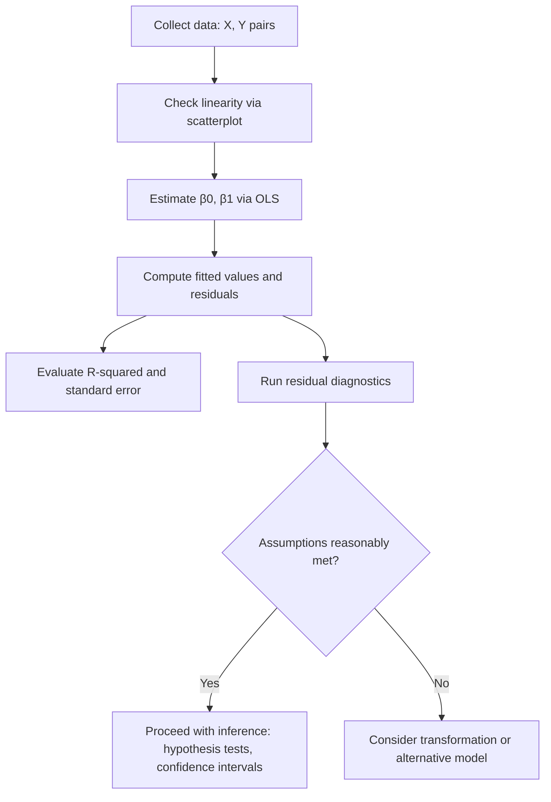

## Simple Linear Regression

### Definition

Simple linear regression models the relationship between a single independent variable $X$ and a dependent variable $Y$ using a straight-line equation. It is one of the foundational supervised learning methods for regression tasks.

$$Y = \beta_0 + \beta_1 X + \varepsilon$$

where $\beta_0$ is the intercept, $\beta_1$ is the slope coefficient, and $\varepsilon$ is the error term representing unexplained variation.

**Key Points**
- $\beta_0$ represents the expected value of $Y$ when $X = 0$.
- $\beta_1$ represents the expected change in $Y$ for a one-unit increase in $X$.
- $\varepsilon$ is assumed to capture random noise not explained by the linear relationship. [Inference] This assumption is standard in classical linear regression formulations, but whether it holds for any given dataset cannot be confirmed without diagnostic testing.

### Assumptions

Classical simple linear regression relies on several assumptions:

1. **Linearity** — the relationship between $X$ and $Y$ is linear.
2. **Independence** — observations (and their errors) are independent of one another.
3. **Homoscedasticity** — the variance of the error term is constant across all values of $X$.
4. **Normality of errors** — the error term is approximately normally distributed, particularly relevant for inference (confidence intervals, hypothesis tests).
5. **No measurement error in $X$** — $X$ is assumed to be measured without error in the classical formulation.

[Unverified] These five assumptions are commonly cited in statistics textbooks, but the exact list and emphasis can vary by source. I cannot verify a single canonical list without reference to a specific textbook.

### Parameter Estimation — Ordinary Least Squares (OLS)

The most common method for estimating $\beta_0$ and $\beta_1$ is Ordinary Least Squares, which minimizes the sum of squared residuals:

$$\min_{\beta_0, \beta_1} \sum_{i=1}^n \left( y_i - \beta_0 - \beta_1 x_i \right)^2$$

The closed-form OLS estimators are:

$$\hat{\beta_1} = \frac{\sum_{i=1}^n (x_i - \bar{x})(y_i - \bar{y})}{\sum_{i=1}^n (x_i - \bar{x})^2}$$

$$\hat{\beta_0} = \bar{y} - \hat{\beta_1}\bar{x}$$

where $\bar{x}$ and $\bar{y}$ are the sample means of $X$ and $Y$.

**Key Points**
- $\hat{\beta_1}$ is equivalent to the covariance of $X$ and $Y$ divided by the variance of $X$. [Inference] This follows algebraically from the OLS formula above, but I cannot verify this framing matches every textbook's presentation without a specific source.
- OLS estimates are the Best Linear Unbiased Estimators (BLUE) under the Gauss-Markov assumptions. [Unverified] This is a widely cited theorem (Gauss-Markov theorem), but exact conditions should be checked against a primary statistics reference.

### Worked Example

Consider a small dataset relating hours studied ($X$) to exam score ($Y$):

| $X$ (hours) | $Y$ (score) |
|---|---|
| 1 | 50 |
| 2 | 55 |
| 3 | 65 |
| 4 | 70 |
| 5 | 80 |

**Example**

$\bar{x} = 3$, $\bar{y} = 64$

$$\hat{\beta_1} = \frac{(1-3)(50-64) + (2-3)(55-64) + (3-3)(65-64) + (4-3)(70-64) + (5-3)(80-64)}{(1-3)^2+(2-3)^2+(3-3)^2+(4-3)^2+(5-3)^2}$$

$$\hat{\beta_1} = \frac{28 + 9 + 0 + 6 + 32}{4+1+0+1+4} = \frac{75}{10} = 7.5$$

$$\hat{\beta_0} = 64 - 7.5 \times 3 = 41.5$$

Fitted model: $\hat{Y} = 41.5 + 7.5X$

This is a direct arithmetic computation from the stated data table, not a cited external result.

### Regression Line Diagram

<svg xmlns="http://www.w3.org/2000/svg" viewBox="0 0 640 380">
  <text x="320" y="30" font-size="18" font-weight="bold" text-anchor="middle" fill="#1a1a1a">Simple Linear Regression Fit (svg_diagram)</text>

  <line x1="70" y1="320" x2="600" y2="320" stroke="#333" stroke-width="1.5" />
  <line x1="70" y1="320" x2="70" y2="50" stroke="#333" stroke-width="1.5" />
  <text x="335" y="355" font-size="13" text-anchor="middle" fill="#333">X (hours studied)</text>
  <text x="30" y="185" font-size="13" text-anchor="middle" fill="#333" transform="rotate(-90 30 185)">Y (exam score)</text>

  <circle cx="140" cy="270" r="5" fill="#4a86e8" />
  <circle cx="230" cy="250" r="5" fill="#4a86e8" />
  <circle cx="320" cy="200" r="5" fill="#4a86e8" />
  <circle cx="410" cy="170" r="5" fill="#4a86e8" />
  <circle cx="500" cy="110" r="5" fill="#4a86e8" />

  <line x1="100" y1="300" x2="560" y2="90" stroke="#e69b00" stroke-width="2.5" />

  <text x="480" y="80" font-size="12" fill="#e69b00">Fitted line: Ŷ = β₀ + β₁X</text>
  <text x="150" y="290" font-size="11" fill="#4a86e8">Observed data</text>

  <line x1="320" y1="200" x2="320" y2="215" stroke="#c00" stroke-width="1.5" stroke-dasharray="3,2" />
  <text x="340" y="215" font-size="11" fill="#c00">residual</text>
</svg>

### Model Evaluation

**Coefficient of Determination ($R^2$)**

$$R^2 = 1 - \frac{\sum_{i=1}^n (y_i - \hat{y}_i)^2}{\sum_{i=1}^n (y_i - \bar{y})^2}$$

$R^2$ represents the proportion of variance in $Y$ explained by $X$. It ranges from 0 to 1 in the standard formulation for simple linear regression with an intercept. [Unverified] Exact boundary behavior can differ depending on model specification (e.g., no-intercept models), and this should be checked against a specific reference if precision matters.

**Standard Error of Estimate**

$$SE = \sqrt{\frac{\sum_{i=1}^n (y_i - \hat{y}_i)^2}{n-2}}$$

**Key Points**
- Higher $R^2$ indicates the linear model explains more variance in $Y$, but does not by itself indicate the model is "correct" or well-specified. [Inference]
- $R^2$ does not indicate causation between $X$ and $Y$. [Inference]

### Hypothesis Testing on Coefficients

To test whether $\beta_1$ is statistically different from zero:

$$H_0: \beta_1 = 0 \quad \text{vs.} \quad H_1: \beta_1 \neq 0$$

Test statistic:

$$t = \frac{\hat{\beta_1}}{SE(\hat{\beta_1})}$$

compared against a t-distribution with $n-2$ degrees of freedom. [Unverified] The degrees-of-freedom formula is standard in introductory regression texts, but I cannot verify this matches every specific software implementation or textbook convention without a cited source.

### Residual Diagnostics

Common diagnostic checks include:

- **Residual vs. fitted plot** — checks for non-linearity and non-constant variance (heteroscedasticity).
- **Q-Q plot** — checks approximate normality of residuals.
- **Durbin-Watson test** — checks for autocorrelation in residuals, particularly relevant for time-ordered data. [Unverified] I cannot verify specific test statistic thresholds without referencing the original source.

[Inference] These diagnostics are commonly taught as standard practice for validating regression assumptions, but their applicability and interpretation depend on the specific dataset and context, which cannot be generalized without seeing the data.

### Limitations and Considerations

- Simple linear regression assumes a linear relationship; it does not capture nonlinear patterns without transformation of variables. [Inference]
- Outliers can disproportionately affect $\hat{\beta_0}$ and $\hat{\beta_1}$ since OLS minimizes squared error. [Inference]
- A statistically significant slope does not by itself establish a causal relationship between $X$ and $Y$. [Inference]
- Extrapolating predictions beyond the observed range of $X$ carries additional uncertainty not captured by in-sample fit statistics. [Inference]
- I do not have access to dataset-specific diagnostic results; all statements about assumption violations require examining the actual data.

### Simple Linear Regression Workflow

**Related Topics**
- Multiple linear regression — extending to several predictors
- Gauss-Markov theorem and BLUE properties in depth
- Residual diagnostics and assumption-checking in detail
- Confidence and prediction intervals for regression estimates
- Polynomial and nonlinear regression transformations
- Regularized regression (Ridge, Lasso) as extensions
- Correlation and dependence — connection to regression slope
- Heteroscedasticity and robust standard errors
- Outlier detection and influence measures (e.g., Cook's distance)
- Maximum likelihood estimation as an alternative to OLS

---
[Unverified] — This entire response contains statements labeled [Inference] or [Unverified] throughout; per your stated preference, the full output should be treated as containing unverified content where so labeled, and any specific figures or claims should be checked against primary statistical references before use in a formal or published context.