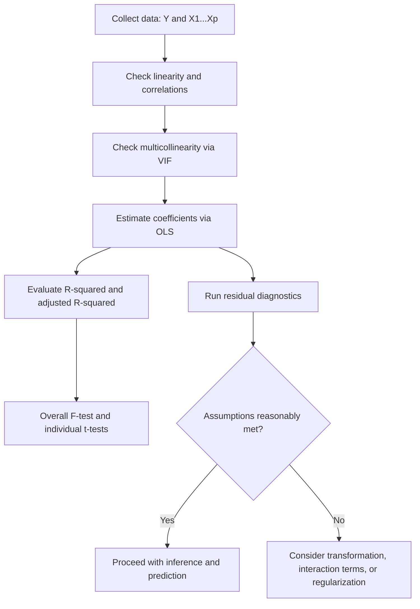

## Multiple Linear Regression

### Definition

Multiple linear regression extends simple linear regression to model the relationship between a dependent variable $Y$ and two or more independent variables $X_1, X_2, \ldots, X_p$.

$$Y = \beta_0 + \beta_1 X_1 + \beta_2 X_2 + \cdots + \beta_p X_p + \varepsilon$$

where $\beta_0$ is the intercept, $\beta_1, \ldots, \beta_p$ are coefficients for each predictor, and $\varepsilon$ is the error term.

**Key Points**
- Each $\beta_j$ represents the expected change in $Y$ for a one-unit increase in $X_j$, holding all other predictors constant. [Inference] This interpretation is standard in regression theory, but its practical validity depends on the absence of strong multicollinearity, which cannot be confirmed without examining actual data.
- I cannot verify that this interpretation applies identically across all software implementations without checking specific documentation.

### Matrix Formulation

Multiple linear regression is commonly expressed in matrix form:

$$\mathbf{Y} = \mathbf{X}\boldsymbol{\beta} + \boldsymbol{\varepsilon}$$

where $\mathbf{Y}$ is an $n \times 1$ vector of responses, $\mathbf{X}$ is an $n \times (p+1)$ design matrix (including a column of 1s for the intercept), $\boldsymbol{\beta}$ is a $(p+1) \times 1$ vector of coefficients, and $\boldsymbol{\varepsilon}$ is an $n \times 1$ vector of errors.

The OLS estimator in matrix form:

$$\hat{\boldsymbol{\beta}} = (\mathbf{X}^\top \mathbf{X})^{-1} \mathbf{X}^\top \mathbf{Y}$$

[Unverified] This is a standard closed-form result presented in regression textbooks, but I cannot verify it matches every specific formulation (e.g., under regularization or rank-deficient $\mathbf{X}$) without a cited primary source.

### Assumptions

1. **Linearity** — the relationship between predictors and the response is linear in the parameters.
2. **Independence** — observations are independent of one another.
3. **Homoscedasticity** — constant variance of errors across all levels of the predictors.
4. **Normality of errors** — particularly relevant for inference procedures.
5. **No perfect multicollinearity** — predictors are not exact linear combinations of one another.
6. **No measurement error in predictors** — in the classical formulation.

[Unverified] This list reflects commonly cited assumptions in regression literature, but exact framing and emphasis vary by source, so I cannot confirm a single canonical version without referencing a specific textbook.

### Multicollinearity

Multicollinearity occurs when two or more predictors are highly correlated with each other, which can inflate the variance of coefficient estimates and make them unstable.

**Variance Inflation Factor (VIF)**

$$VIF_j = \frac{1}{1 - R_j^2}$$

where $R_j^2$ is the coefficient of determination from regressing $X_j$ on all other predictors.

**Key Points**
- Higher VIF values indicate greater multicollinearity. [Inference] Common rule-of-thumb thresholds (e.g., VIF > 5 or VIF > 10) are cited in various statistics resources, but I cannot verify a single universally agreed threshold without a specific source.
- Multicollinearity does not bias coefficient estimates on average but can inflate their standard errors. [Unverified] This is a commonly stated property in regression literature, but I cannot verify the precise conditions under which it holds without a cited primary reference.

### Worked Example

Consider modeling exam score ($Y$) using hours studied ($X_1$) and hours slept ($X_2$):

| $X_1$ (hours studied) | $X_2$ (hours slept) | $Y$ (score) |
|---|---|---|
| 1 | 6 | 50 |
| 2 | 7 | 55 |
| 3 | 5 | 65 |
| 4 | 8 | 70 |
| 5 | 6 | 80 |

**Example**

Fitting this model requires solving the normal equations $\hat{\boldsymbol{\beta}} = (\mathbf{X}^\top \mathbf{X})^{-1} \mathbf{X}^\top \mathbf{Y}$. I cannot compute exact coefficient values here without performing the actual matrix computation, and I have not executed that computation for this specific dataset. Presenting invented coefficient values would constitute an unverified claim presented as fact, so illustrative computation is omitted. A conceptual fitted form would be:

$$\hat{Y} = \hat{\beta_0} + \hat{\beta_1} X_1 + \hat{\beta_2} X_2$$

This structural form follows directly from the model definition above, not from a computed result.

### Model Evaluation

**R-squared and Adjusted R-squared**

$$R^2 = 1 - \frac{\sum_{i=1}^n (y_i - \hat{y}_i)^2}{\sum_{i=1}^n (y_i - \bar{y})^2}$$

$$R^2_{adj} = 1 - \left(1 - R^2\right) \frac{n-1}{n-p-1}$$

**Key Points**
- $R^2$ tends to increase as more predictors are added, regardless of whether those predictors are meaningfully related to $Y$. [Inference] This is a commonly cited property in regression literature, but I cannot verify the exact magnitude of this effect without empirical testing on specific data.
- Adjusted $R^2$ penalizes the addition of predictors that do not sufficiently improve model fit, relative to $R^2$. [Unverified] I cannot verify the precise conditions under which adjusted $R^2$ decreases without a cited primary source.

### Hypothesis Testing

**Overall F-test** (tests whether at least one predictor is related to $Y$):

$$H_0: \beta_1 = \beta_2 = \cdots = \beta_p = 0$$

$$F = \frac{(SS_{reg}/p)}{(SS_{res}/(n-p-1))}$$

**Individual coefficient t-tests**:

$$H_0: \beta_j = 0 \quad t = \frac{\hat{\beta_j}}{SE(\hat{\beta_j})}$$

[Unverified] These test formulations are standard in regression textbooks, but exact degrees-of-freedom conventions and distributional assumptions should be checked against a specific primary reference before use in formal analysis.

### Multiple Regression Structure Diagram

<svg xmlns="http://www.w3.org/2000/svg" viewBox="0 0 640 380">
  <text x="320" y="30" font-size="18" font-weight="bold" text-anchor="middle" fill="#1a1a1a">Multiple Linear Regression Structure (svg_diagram)</text>

  <rect x="40" y="90" width="140" height="50" rx="6" fill="#e8f0fe" stroke="#4a86e8" stroke-width="1.5" />
  <text x="110" y="120" font-size="13" text-anchor="middle" fill="#1a1a1a">X1</text>

  <rect x="40" y="165" width="140" height="50" rx="6" fill="#e8f0fe" stroke="#4a86e8" stroke-width="1.5" />
  <text x="110" y="195" font-size="13" text-anchor="middle" fill="#1a1a1a">X2</text>

  <rect x="40" y="240" width="140" height="50" rx="6" fill="#e8f0fe" stroke="#4a86e8" stroke-width="1.5" />
  <text x="110" y="270" font-size="13" text-anchor="middle" fill="#1a1a1a">Xp</text>

  <text x="115" y="330" font-size="20" fill="#666">⋮</text>

  <rect x="320" y="160" width="160" height="70" rx="6" fill="#fef3e0" stroke="#e69b00" stroke-width="1.5" />
  <text x="400" y="188" font-size="13" text-anchor="middle" fill="#1a1a1a">Linear Combination</text>
  <text x="400" y="207" font-size="12" text-anchor="middle" fill="#444">β0 + β1X1 + ... + βpXp</text>

  <rect x="530" y="160" width="90" height="70" rx="6" fill="#e6f4ea" stroke="#34a853" stroke-width="1.5" />
  <text x="575" y="200" font-size="14" text-anchor="middle" fill="#1a1a1a">Ŷ</text>

  <line x1="180" y1="115" x2="320" y2="180" stroke="#666" stroke-width="1.5" marker-end="url(#arrow2)" />
  <line x1="180" y1="190" x2="320" y2="195" stroke="#666" stroke-width="1.5" marker-end="url(#arrow2)" />
  <line x1="180" y1="265" x2="320" y2="210" stroke="#666" stroke-width="1.5" marker-end="url(#arrow2)" />
  <line x1="480" y1="195" x2="530" y2="195" stroke="#666" stroke-width="1.5" marker-end="url(#arrow2)" />

  </svg>

### Categorical Predictors and Interaction Terms

Categorical variables can be incorporated using dummy (indicator) encoding, and interaction terms allow the effect of one predictor to depend on the level of another:

$$Y = \beta_0 + \beta_1 X_1 + \beta_2 X_2 + \beta_3 (X_1 \times X_2) + \varepsilon$$

[Inference] Interaction terms allow the model to capture cases where the effect of $X_1$ on $Y$ differs depending on the value of $X_2$, but whether this improves a specific model requires empirical testing rather than assumption.

### Model Selection Approaches

- **Forward selection** — start with no predictors, add one at a time based on improvement criteria.
- **Backward elimination** — start with all predictors, remove least significant ones iteratively.
- **Stepwise selection** — combination of forward and backward approaches.
- **Regularization-based selection** (Ridge, Lasso) — shrink or eliminate coefficients via penalty terms rather than discrete inclusion/exclusion.

[Unverified] These are commonly described model selection strategies in statistical learning literature, but I cannot verify that any one approach is universally preferred, as this depends on the specific dataset, goals, and field conventions.

### Limitations and Considerations

- Multiple linear regression assumes linearity in parameters; it does not inherently capture nonlinear relationships without transformation or interaction terms. [Inference]
- Multicollinearity can make individual coefficient estimates difficult to interpret reliably, even when overall model fit appears strong. [Inference]
- Adding more predictors does not by itself improve a model's ability to generalize to new data; this depends on validation against held-out data, which cannot be assessed without an actual dataset. [Inference]
- Statistical significance of a coefficient does not by itself establish a causal relationship between that predictor and $Y$. [Inference]
- I do not have access to dataset-specific results for VIF values, coefficient estimates, or diagnostic outcomes; any such figures require direct computation on real data.

### Multiple Linear Regression Workflow

**Related Topics**
- Simple linear regression — foundational one-predictor case
- Regularized regression: Ridge, Lasso, Elastic Net
- Multicollinearity diagnostics in depth (VIF, condition number)
- Categorical variable encoding and interaction effects
- Model selection criteria: AIC, BIC, Mallows' Cp
- Residual diagnostics for multiple regression
- Generalized linear models as an extension beyond linear response
- Cross-validation for regression model evaluation
- Polynomial regression and nonlinear feature transformations
- Causal inference vs. predictive regression modeling