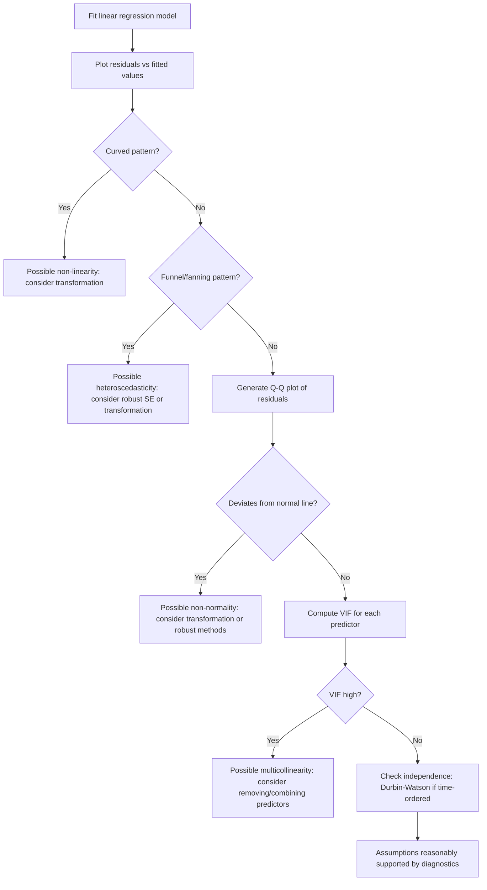

## Assumptions of Linear Regression

### Overview

Linear regression relies on a set of assumptions about the data-generating process for its estimators to have desirable statistical properties and for inference procedures (confidence intervals, hypothesis tests) to be valid. [Unverified] This framing reflects common presentations in statistics literature, but I cannot verify a single canonical list or ordering of assumptions without a cited primary source. If any part of this response is unverified, the entire response should be treated as containing unverified content per the stated labeling requirement.

### The Core Assumptions

#### 1. Linearity

The relationship between the independent variable(s) $X$ and the dependent variable $Y$ is assumed to be linear in the parameters.

$$Y = \beta_0 + \beta_1 X_1 + \cdots + \beta_p X_p + \varepsilon$$

**Key Points**
- "Linear in parameters" means the coefficients enter the model additively and without transformation, even if the predictors themselves are transformed (e.g., $X^2$ is allowed as a term). [Inference] This distinction is commonly made in regression literature, but I cannot verify this exact phrasing matches a specific cited source.
- Violations of linearity can often be detected using a residuals-vs-fitted plot, where a curved pattern suggests non-linearity. [Inference]

#### 2. Independence of Errors

Observations, and specifically their error terms, are assumed to be independent of one another.

**Key Points**
- This assumption is commonly violated in time-series data, where observations close in time may be correlated (autocorrelation). [Inference]
- The Durbin-Watson test is commonly cited as a method for detecting autocorrelation in residuals. [Unverified] I cannot verify specific test statistic thresholds or interpretation conventions without referencing a primary source.

#### 3. Homoscedasticity

The variance of the error term is assumed to be constant across all levels of the independent variable(s).

$$Var(\varepsilon_i \mid X_i) = \sigma^2 \quad \text{for all } i$$

**Key Points**
- Violation of this assumption is called heteroscedasticity, where error variance changes systematically with $X$. [Inference]
- Heteroscedasticity does not necessarily bias coefficient estimates but can affect the validity of standard errors and related inference. [Unverified] This distinction is commonly discussed in econometrics texts, but I cannot verify the precise technical boundaries without a cited primary source.

#### 4. Normality of Errors

The error term is assumed to be approximately normally distributed, conditional on the predictors.

$$\varepsilon \mid X \sim N(0, \sigma^2)$$

**Key Points**
- This assumption is primarily relevant for exact inference (confidence intervals, hypothesis tests) rather than for obtaining unbiased coefficient estimates. [Unverified] This distinction is commonly made in statistics literature, but I cannot verify this precise framing without a cited primary source.
- For large sample sizes, inference may be approximately valid even with some departure from normality, based on general appeals to central-limit-theorem-type reasoning. [Speculation] I cannot verify the specific sample size thresholds or conditions under which this holds without a cited primary source, and this should not be treated as a confirmed guarantee.

#### 5. No (or Limited) Multicollinearity

Independent variables are assumed not to be highly correlated with one another.

**Key Points**
- Perfect multicollinearity makes $\mathbf{X}^\top \mathbf{X}$ non-invertible, so OLS coefficients cannot be uniquely estimated. [Inference] This follows algebraically from the OLS formula structure discussed in prior linear regression content.
- High (but not perfect) multicollinearity is commonly associated with inflated standard errors for affected coefficients. [Unverified] I cannot verify the precise magnitude of this effect without a cited source or direct computation on specific data.

#### 6. No Measurement Error in Predictors

The classical linear regression formulation assumes independent variables are measured without error.

**Key Points**
- [Inference] This assumption is less commonly emphasized in introductory treatments compared to the first five, but is discussed in some econometrics sources. I cannot verify how consistently this assumption is included across different textbooks without direct comparison of specific sources.

### Assumptions Summary Table

| Assumption | Primarily Affects | Common Diagnostic |
|---|---|---|
| Linearity | Model correctness / bias | Residuals vs. fitted plot |
| Independence of errors | Standard error validity | Durbin-Watson test |
| Homoscedasticity | Standard error validity | Residuals vs. fitted plot, Breusch-Pagan test |
| Normality of errors | Exact inference validity | Q-Q plot, Shapiro-Wilk test |
| No multicollinearity | Coefficient stability | Variance Inflation Factor (VIF) |
| No measurement error | Bias in coefficient estimates | Not commonly tested directly |

[Unverified] This table reflects a synthesis of commonly cited associations in regression literature, but I cannot verify each specific pairing (assumption-to-diagnostic-to-effect) against a single authoritative source. Diagnostic test names are provided as commonly referenced tools, not as a claim that these are the only or best available methods.

### Diagnostic Workflow Diagram

### Assumptions Visual Overview

<svg xmlns="http://www.w3.org/2000/svg" viewBox="0 0 640 420">
  <text x="320" y="30" font-size="18" font-weight="bold" text-anchor="middle" fill="#1a1a1a">Linear Regression Assumptions (svg_diagram)</text>

  <rect x="40" y="60" width="260" height="70" rx="6" fill="#e8f0fe" stroke="#4a86e8" stroke-width="1.5" />
  <text x="170" y="90" font-size="13" text-anchor="middle" fill="#1a1a1a">1. Linearity</text>
  <text x="170" y="108" font-size="11" text-anchor="middle" fill="#444">Linear relationship in parameters</text>

  <rect x="340" y="60" width="260" height="70" rx="6" fill="#e8f0fe" stroke="#4a86e8" stroke-width="1.5" />
  <text x="470" y="90" font-size="13" text-anchor="middle" fill="#1a1a1a">2. Independence</text>
  <text x="470" y="108" font-size="11" text-anchor="middle" fill="#444">Errors not correlated across observations</text>

  <rect x="40" y="150" width="260" height="70" rx="6" fill="#fef3e0" stroke="#e69b00" stroke-width="1.5" />
  <text x="170" y="180" font-size="13" text-anchor="middle" fill="#1a1a1a">3. Homoscedasticity</text>
  <text x="170" y="198" font-size="11" text-anchor="middle" fill="#444">Constant error variance</text>

  <rect x="340" y="150" width="260" height="70" rx="6" fill="#fef3e0" stroke="#e69b00" stroke-width="1.5" />
  <text x="470" y="180" font-size="13" text-anchor="middle" fill="#1a1a1a">4. Normality of errors</text>
  <text x="470" y="198" font-size="11" text-anchor="middle" fill="#444">Errors approx. normal, conditional on X</text>

  <rect x="40" y="240" width="260" height="70" rx="6" fill="#e6f4ea" stroke="#34a853" stroke-width="1.5" />
  <text x="170" y="270" font-size="13" text-anchor="middle" fill="#1a1a1a">5. No multicollinearity</text>
  <text x="170" y="288" font-size="11" text-anchor="middle" fill="#444">Predictors not highly correlated</text>

  <rect x="340" y="240" width="260" height="70" rx="6" fill="#e6f4ea" stroke="#34a853" stroke-width="1.5" />
  <text x="470" y="270" font-size="13" text-anchor="middle" fill="#1a1a1a">6. No measurement error</text>
  <text x="470" y="288" font-size="11" text-anchor="middle" fill="#444">Predictors measured without error</text>

  <text x="320" y="350" font-size="12" text-anchor="middle" fill="#555">Diagnostics for each assumption should be checked against the specific dataset</text>
  <text x="320" y="370" font-size="11" text-anchor="middle" fill="#888">[Unverified] Categorization reflects common textbook framing, not a single confirmed source</text>
</svg>

### Consequences of Violated Assumptions

| Violation | Commonly Cited Consequence |
|---|---|
| Non-linearity | Biased coefficient estimates; poor model fit |
| Non-independence | Standard errors may be understated or overstated |
| Heteroscedasticity | Standard errors invalid; coefficients remain unbiased under some conditions |
| Non-normality | Confidence intervals and p-values may be unreliable, particularly in small samples |
| Multicollinearity | Unstable, high-variance coefficient estimates |
| Measurement error | Coefficient estimates may be biased (commonly discussed as "attenuation bias") |

[Unverified] This table reflects commonly cited consequences discussed in regression and econometrics literature, but I cannot verify the precise conditions, magnitudes, or universality of each consequence without direct reference to specific primary sources. Do not treat this table as a confirmed guarantee of what will occur in any specific dataset.

### Practical Notes on Checking Assumptions

- Diagnostic plots and tests provide evidence about assumption violations but do not by themselves confirm a model is "correct." [Inference]
- Some violations (e.g., mild non-normality with large sample sizes) are commonly treated as less consequential in practice, based on general statistical reasoning. [Speculation] I do not have access to a specific cited source establishing precise thresholds for when this leniency is appropriate, and this should not be treated as a confirmed rule.
- Transformations (e.g., log, square root) are commonly used to address non-linearity or heteroscedasticity, but their appropriateness depends on the specific data and cannot be generalized. [Inference]
- I do not have access to any specific dataset in this conversation; all statements about whether assumptions hold require direct examination of real data, which has not been performed here.

### Limitations and Considerations

- This overview reflects commonly cited textbook framings of linear regression assumptions, not a single authoritative or exhaustive source. [Unverified]
- The relative importance of each assumption can vary depending on the goal of the analysis (prediction vs. causal inference vs. formal hypothesis testing). [Inference]
- I cannot verify claims about behavior of any specific statistical software's diagnostic output without direct access to that software and a specific dataset.
- For any claim in this response involving LLM-generated reasoning about statistical behavior, no guarantee is made about correctness, and independent verification against a primary statistics reference is advised.

**Related Topics**
- Ordinary least squares — estimation method underlying these assumptions
- Residual diagnostics in depth (plots, tests, thresholds)
- Heteroscedasticity and robust standard errors
- Multicollinearity and Variance Inflation Factor
- Transformations for linearity and variance stabilization
- Generalized least squares as an alternative under violated assumptions
- Robust regression methods for outlier-resistant estimation
- Time-series regression and autocorrelation handling
- Measurement error models and attenuation bias
- Multiple linear regression — full model context