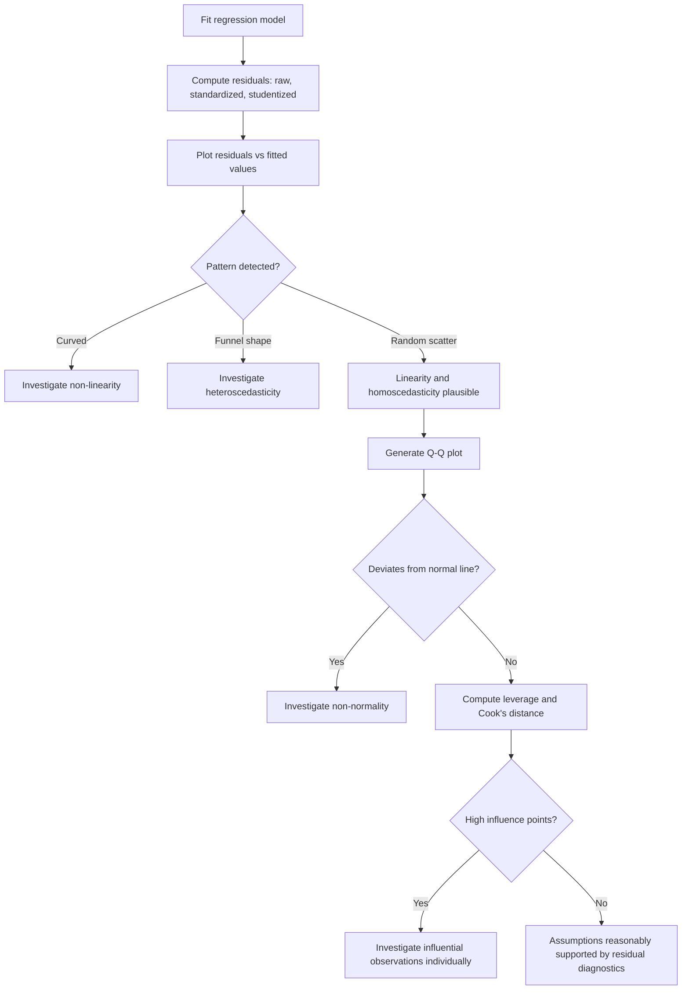

## Residual Analysis

### Definition

Residual analysis is the examination of the differences between observed values and values predicted by a regression model, used to assess whether the model's underlying assumptions are reasonably satisfied.

$$e_i = y_i - \hat{y}_i$$

where $e_i$ is the residual for observation $i$, $y_i$ is the observed value, and $\hat{y}_i$ is the fitted value.

**Key Points**
- Residuals are the empirical (sample) counterpart to the theoretical error term $\varepsilon$; they are not identical to $\varepsilon$ since $\varepsilon$ is unobservable. [Inference] This distinction is commonly made in regression literature, but I cannot verify this exact framing without a cited primary source.
- Residual analysis is used to detect violations of linearity, homoscedasticity, normality, and independence assumptions. [Inference]

### Types of Residuals

#### Raw (Ordinary) Residuals

$$e_i = y_i - \hat{y}_i$$

#### Standardized Residuals

$$e_i^{std} = \frac{e_i}{\hat{\sigma}}$$

where $\hat{\sigma}$ is the estimated standard deviation of the residuals.

#### Studentized Residuals

$$e_i^{stud} = \frac{e_i}{\hat{\sigma}_{(i)} \sqrt{1 - h_{ii}}}$$

where $h_{ii}$ is the leverage of observation $i$ (the diagonal element of the hat matrix), and $\hat{\sigma}_{(i)}$ may refer to an estimate that excludes observation $i$ in some formulations (externally studentized residuals). [Unverified] I cannot verify the exact formula variant, notation, or naming convention used across all statistical sources without a specific cited reference.

**Key Points**
- Studentized residuals account for the fact that residual variance can differ across observations depending on their leverage. [Inference]
- I cannot verify which specific studentization formula (internal vs. external) is used by any particular software package without checking that package's documentation directly.

### Purpose of Residual Analysis

Residual analysis is commonly used to check:

1. **Linearity** — via a residuals-vs-fitted-values plot.
2. **Homoscedasticity** — via a residuals-vs-fitted-values plot or scale-location plot.
3. **Normality of errors** — via a Q-Q plot or histogram of residuals.
4. **Independence** — via a residuals-vs-order (or residuals-vs-time) plot, particularly for sequential data.
5. **Outliers and influential points** — via standardized/studentized residuals and leverage measures.

[Inference] This list reflects commonly taught applications of residual analysis in regression courses, but I cannot verify this is an exhaustive or universally agreed list without a cited primary source.

### Residual Diagnostic Plots

<svg xmlns="http://www.w3.org/2000/svg" viewBox="0 0 680 460">
  <text x="340" y="30" font-size="18" font-weight="bold" text-anchor="middle" fill="#1a1a1a">Common Residual Diagnostic Plots (svg_diagram)</text>

  <rect x="30" y="60" width="290" height="170" fill="#fafafa" stroke="#999" stroke-width="1" />
  <text x="175" y="80" font-size="12" text-anchor="middle" fill="#333">Residuals vs Fitted (good)</text>
  <line x1="50" y1="150" x2="300" y2="150" stroke="#ccc" stroke-width="1" />
  <circle cx="80" cy="140" r="3" fill="#4a86e8" />
  <circle cx="110" cy="160" r="3" fill="#4a86e8" />
  <circle cx="140" cy="145" r="3" fill="#4a86e8" />
  <circle cx="170" cy="155" r="3" fill="#4a86e8" />
  <circle cx="200" cy="140" r="3" fill="#4a86e8" />
  <circle cx="230" cy="160" r="3" fill="#4a86e8" />
  <circle cx="260" cy="145" r="3" fill="#4a86e8" />
  <circle cx="290" cy="155" r="3" fill="#4a86e8" />
  <text x="175" y="215" font-size="11" text-anchor="middle" fill="#555">Random scatter around zero</text>

  <rect x="360" y="60" width="290" height="170" fill="#fafafa" stroke="#999" stroke-width="1" />
  <text x="505" y="80" font-size="12" text-anchor="middle" fill="#333">Residuals vs Fitted (problematic)</text>
  <line x1="380" y1="150" x2="630" y2="150" stroke="#ccc" stroke-width="1" />
  <circle cx="400" cy="180" r="3" fill="#c00" />
  <circle cx="430" cy="160" r="3" fill="#c00" />
  <circle cx="460" cy="140" r="3" fill="#c00" />
  <circle cx="490" cy="120" r="3" fill="#c00" />
  <circle cx="520" cy="130" r="3" fill="#c00" />
  <circle cx="550" cy="150" r="3" fill="#c00" />
  <circle cx="580" cy="170" r="3" fill="#c00" />
  <circle cx="610" cy="190" r="3" fill="#c00" />
  <path d="M400,180 Q505,90 610,190" fill="none" stroke="#c00" stroke-width="1.5" stroke-dasharray="3,2" />
  <text x="505" y="215" font-size="11" text-anchor="middle" fill="#555">Curved pattern suggests non-linearity</text>

  <rect x="30" y="260" width="290" height="170" fill="#fafafa" stroke="#999" stroke-width="1" />
  <text x="175" y="280" font-size="12" text-anchor="middle" fill="#333">Scale-Location (funnel)</text>
  <line x1="50" y1="410" x2="300" y2="340" stroke="#ccc" stroke-width="1" />
  <circle cx="70" cy="400" r="3" fill="#e69b00" />
  <circle cx="100" cy="395" r="3" fill="#e69b00" />
  <circle cx="140" cy="390" r="4" fill="#e69b00" />
  <circle cx="180" cy="360" r="5" fill="#e69b00" />
  <circle cx="220" cy="340" r="6" fill="#e69b00" />
  <circle cx="260" cy="320" r="7" fill="#e69b00" />
  <circle cx="290" cy="300" r="8" fill="#e69b00" />
  <text x="175" y="420" font-size="11" text-anchor="middle" fill="#555">Widening spread suggests heteroscedasticity</text>

  <rect x="360" y="260" width="290" height="170" fill="#fafafa" stroke="#999" stroke-width="1" />
  <text x="505" y="280" font-size="12" text-anchor="middle" fill="#333">Normal Q-Q Plot</text>
  <line x1="380" y1="410" x2="630" y2="300" stroke="#999" stroke-width="1.5" />
  <circle cx="400" cy="400" r="3" fill="#34a853" />
  <circle cx="430" cy="385" r="3" fill="#34a853" />
  <circle cx="460" cy="368" r="3" fill="#34a853" />
  <circle cx="490" cy="352" r="3" fill="#34a853" />
  <circle cx="520" cy="335" r="3" fill="#34a853" />
  <circle cx="550" cy="320" r="3" fill="#34a853" />
  <circle cx="580" cy="308" r="3" fill="#34a853" />
  <text x="505" y="420" font-size="11" text-anchor="middle" fill="#555">Points near line suggest approx. normality</text>
</svg>

### Leverage and Influence

**Leverage** ($h_{ii}$) measures how far an observation's predictor values are from the mean of the predictors; it reflects the potential for an observation to influence the fitted model.

$$h_{ii} = \mathbf{x}_i^\top (\mathbf{X}^\top \mathbf{X})^{-1} \mathbf{x}_i$$

**Cook's Distance** combines residual magnitude and leverage to measure the overall influence of an observation on the fitted model:

$$D_i = \frac{e_i^2}{p \cdot \hat{\sigma}^2} \cdot \frac{h_{ii}}{(1-h_{ii})^2}$$

[Unverified] This formula reflects a commonly cited form of Cook's distance in regression literature, but I cannot verify this exact notation matches every textbook presentation without a cited primary source.

**Key Points**
- High leverage points have unusual predictor values but are not necessarily influential if their residual is small. [Inference]
- High Cook's distance values are commonly used to flag observations that disproportionately affect coefficient estimates, though specific threshold conventions (e.g., $D_i > 4/n$) vary across sources. [Unverified] I cannot verify a single universally accepted threshold without a cited primary reference.

### Formal Diagnostic Tests

| Test | Checks For | Notes |
|---|---|---|
| Breusch-Pagan test | Heteroscedasticity | [Unverified] I cannot verify exact test statistic distribution details without a cited source. |
| White test | Heteroscedasticity | [Unverified] I cannot verify specific implementation variants without a cited source. |
| Durbin-Watson test | Autocorrelation (independence) | [Unverified] I cannot verify specific threshold interpretation conventions without a cited source. |
| Shapiro-Wilk test | Normality of residuals | [Unverified] I cannot verify specific sample size sensitivity details without a cited source. |
| Ramsey RESET test | Non-linearity / omitted variables | [Unverified] I cannot verify exact test construction details without a cited source. |

I do not have access to a specific cited statistics reference to confirm exact formulas, distributions, or threshold values for these tests in this response. Any use of these tests in practice should be verified against a primary statistical source or software documentation.

### Residual Analysis Workflow

### Worked Example (Conceptual)

Using the earlier simple linear regression example ($\hat{Y} = 41.5 + 7.5X$, hours studied vs. exam score):

**Example**

| $X$ | $Y$ | $\hat{Y}$ | $e_i = Y - \hat{Y}$ |
|---|---|---|---|
| 1 | 50 | 49.0 | 1.0 |
| 2 | 55 | 56.5 | -1.5 |
| 3 | 65 | 64.0 | 1.0 |
| 4 | 70 | 71.5 | -1.5 |
| 5 | 80 | 79.0 | 1.0 |

This table applies the fitted equation from the earlier simple linear regression example ($\hat{\beta_0}=41.5$, $\hat{\beta_1}=7.5$) directly to the same $X$ values, computed here arithmetically rather than sourced externally. With only five data points, this example is illustrative only and not sufficient for drawing statistical conclusions about assumption violations. [Inference]

### Common Pitfalls in Residual Analysis

- Over-interpreting patterns in very small datasets, where random scatter can appear structured by chance. [Inference]
- Treating a "clean-looking" residual plot as confirmation that all assumptions hold, rather than as an absence of detected evidence against them. [Inference]
- Removing influential observations without investigating why they are influential, which can introduce bias or hide genuine data issues. [Inference]
- Relying solely on formal tests (e.g., Shapiro-Wilk) without visual inspection, since formal tests can be overly sensitive in large samples or underpowered in small samples. [Speculation] I cannot verify specific sample size thresholds for these sensitivity issues without a cited primary source, and this should not be treated as a confirmed rule.

### Limitations and Considerations

- Residual analysis provides diagnostic evidence, not confirmation, about whether model assumptions hold. [Inference]
- Visual diagnostic plots involve subjective judgment in interpretation, which can vary between analysts. [Inference]
- I do not have access to any specific real dataset in this conversation; all diagnostic conclusions require direct computation on actual data, which has not been performed here beyond the small illustrative example above.
- Formal test thresholds and exact statistical properties referenced in this document require verification against primary statistical sources or software documentation before use in formal analysis.

**Related Topics**
- Assumptions of linear regression — full context for what residual analysis checks
- Heteroscedasticity and robust standard errors
- Outlier detection and influence measures (Cook's distance, DFFITS, DFBETAS)
- Q-Q plots and normality testing in depth
- Autocorrelation and time-series regression diagnostics
- Transformations to address non-linearity or non-constant variance
- Leverage and the hat matrix in depth
- Robust regression methods for outlier-resistant estimation
- Generalized least squares under heteroscedasticity
- Ordinary least squares — estimation method being diagnosed