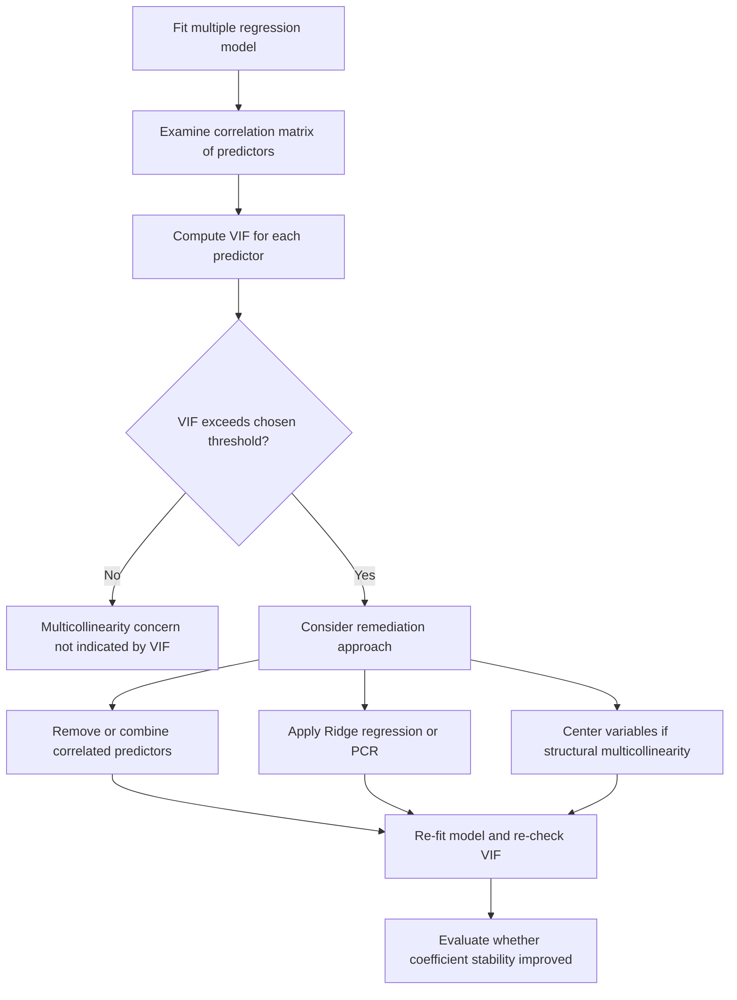

## Multicollinearity

### Definition

Multicollinearity refers to a condition in regression analysis where two or more independent variables are highly correlated with one another, making it difficult to isolate the individual effect of each predictor on the response variable.

**Key Points**
- Multicollinearity does not violate the linearity, independence, or homoscedasticity assumptions directly; it is a separate data condition affecting coefficient estimation. [Inference] I cannot verify this precise categorization matches every regression textbook's framing without a cited primary source.
- Perfect multicollinearity occurs when one predictor is an exact linear combination of others; near (or "high") multicollinearity occurs when predictors are strongly but not perfectly correlated. [Inference]

### Mathematical Basis

Multicollinearity relates to the invertibility of $\mathbf{X}^\top \mathbf{X}$ in the OLS formula:

$$\hat{\boldsymbol{\beta}} = (\mathbf{X}^\top \mathbf{X})^{-1} \mathbf{X}^\top \mathbf{Y}$$

**Key Points**
- Under perfect multicollinearity, $\mathbf{X}^\top \mathbf{X}$ becomes singular (non-invertible), so a unique OLS solution cannot be computed. [Inference] This follows algebraically from properties of matrix invertibility, consistent with prior discussion in the Ordinary Least Squares topic.
- Under high (imperfect) multicollinearity, $\mathbf{X}^\top \mathbf{X}$ remains invertible but becomes ill-conditioned, which is commonly associated with inflated variance in coefficient estimates. [Unverified] I cannot verify the precise mathematical threshold at which "ill-conditioned" becomes practically problematic without a cited primary source.

### Types of Multicollinearity

#### Perfect Multicollinearity

One predictor is an exact linear function of one or more other predictors (e.g., $X_3 = 2X_1 + 3X_2$). This makes coefficient estimation impossible via standard OLS. [Inference]

#### High (Imperfect) Multicollinearity

Predictors are strongly correlated but not perfectly so. Coefficients can still be estimated, but with inflated standard errors. [Inference] I cannot verify the exact correlation magnitude at which multicollinearity becomes "high" without a cited primary source, as this designation appears to vary across texts.

#### Structural Multicollinearity

Arises from the model specification itself, such as including a variable and its square ($X$ and $X^2$) or interaction terms without centering. [Unverified] I cannot verify this specific terminology ("structural multicollinearity") is used consistently across statistics sources without a cited primary reference.

### Detecting Multicollinearity

#### Correlation Matrix

Examining pairwise correlations between predictors can reveal obvious cases of high multicollinearity, though it does not detect multicollinearity involving combinations of three or more variables. [Inference]

#### Variance Inflation Factor (VIF)

$$VIF_j = \frac{1}{1 - R_j^2}$$

where $R_j^2$ is obtained by regressing predictor $X_j$ on all other predictors.

**Key Points**
- Commonly cited rule-of-thumb thresholds include VIF > 5 or VIF > 10 as indicating problematic multicollinearity. [Unverified] I cannot verify a single universally agreed threshold without a cited primary source; different fields and textbooks appear to use different cutoffs.
- $VIF_j = 1$ indicates no correlation between $X_j$ and the other predictors. [Inference] This follows algebraically from the formula when $R_j^2 = 0$.

#### Tolerance

$$Tolerance_j = \frac{1}{VIF_j} = 1 - R_j^2$$

Low tolerance values (commonly associated with values below 0.1 or 0.2 in some sources) are said to indicate potential multicollinearity concerns. [Unverified] I cannot verify a specific universally accepted threshold without a cited primary source.

#### Condition Number / Condition Index

Derived from the eigenvalues of $\mathbf{X}^\top \mathbf{X}$, this diagnostic assesses the overall sensitivity of the matrix to small changes in the data. [Unverified] I cannot verify the exact computational formula or threshold conventions without a cited primary source.

### Multicollinearity Diagnostic Diagram

<svg xmlns="http://www.w3.org/2000/svg" viewBox="0 0 640 380">
  <text x="320" y="30" font-size="18" font-weight="bold" text-anchor="middle" fill="#1a1a1a">Multicollinearity: Predictor Overlap (svg_diagram)</text>

  <text x="160" y="70" font-size="13" text-anchor="middle" fill="#333">Low multicollinearity</text>
  <circle cx="120" cy="160" r="70" fill="#e8f0fe" fill-opacity="0.6" stroke="#4a86e8" stroke-width="2" />
  <circle cx="220" cy="160" r="70" fill="#fef3e0" fill-opacity="0.6" stroke="#e69b00" stroke-width="2" />
  <text x="90" y="165" font-size="12" fill="#1a1a1a">X1</text>
  <text x="250" y="165" font-size="12" fill="#1a1a1a">X2</text>

  <text x="480" y="70" font-size="13" text-anchor="middle" fill="#333">High multicollinearity</text>
  <circle cx="440" cy="160" r="70" fill="#e8f0fe" fill-opacity="0.6" stroke="#4a86e8" stroke-width="2" />
  <circle cx="490" cy="160" r="70" fill="#fef3e0" fill-opacity="0.6" stroke="#e69b00" stroke-width="2" />
  <text x="410" y="165" font-size="12" fill="#1a1a1a">X1</text>
  <text x="510" y="165" font-size="12" fill="#1a1a1a">X2</text>

  <text x="320" y="290" font-size="12" text-anchor="middle" fill="#555">Greater overlap represents higher shared variance between predictors</text>
  <text x="320" y="310" font-size="11" text-anchor="middle" fill="#888">[Inference] Conceptual illustration, not derived from a specific dataset</text>
</svg>

### Consequences of Multicollinearity

- Coefficient estimates can become unstable, with large changes resulting from small changes in the data or model specification. [Inference]
- Standard errors of affected coefficients tend to increase, which can reduce statistical power to detect individually significant predictors. [Unverified] I cannot verify the precise magnitude of this effect without a cited source or direct computation on specific data.
- The overall model fit (e.g., $R^2$) and overall predictions may remain reasonably reliable even when individual coefficients are unstable. [Unverified] This is a commonly stated distinction in regression literature, but I cannot verify the precise conditions under which it holds without a cited primary source.
- Signs of coefficients can appear counterintuitive (e.g., a predictor expected to have a positive effect showing a negative coefficient) under high multicollinearity. [Inference]

I cannot verify specific numerical magnitudes for these consequences without access to a specific dataset or cited empirical study.

### Addressing Multicollinearity

| Approach | Description |
|---|---|
| Remove one of the correlated predictors | Reduces redundancy but discards potentially relevant information |
| Combine correlated predictors | E.g., via an index or principal component |
| Principal Component Regression (PCR) | Uses orthogonal components instead of original correlated predictors |
| Ridge regression | Adds an L2 penalty term, which can stabilize coefficient estimates under multicollinearity |
| Increase sample size | May help reduce standard error inflation in some cases |
| Centering variables | Commonly recommended for structural multicollinearity involving interaction or polynomial terms |

[Unverified] This table reflects commonly cited remedies discussed in regression and machine learning literature, but I cannot verify the comparative effectiveness of these approaches without cited benchmark sources. The appropriateness of any specific remedy depends on the goals of the analysis (prediction vs. interpretation) and cannot be generalized without examining the specific data and modeling context.

### Multicollinearity Detection and Remediation Workflow

### Multicollinearity vs. Model Prediction Accuracy

**Key Points**
- Multicollinearity primarily affects the interpretability and stability of individual coefficient estimates, not necessarily the predictive accuracy of the model as a whole. [Unverified] This is a commonly stated distinction in applied regression and machine learning literature, but I cannot verify the precise boundary conditions under which predictive accuracy remains unaffected without a cited primary source.
- If the goal of an analysis is prediction rather than explaining individual predictor effects, some practitioners consider multicollinearity a lesser concern. [Inference] I cannot verify this represents a consensus view across the field without a cited primary source, and this should be treated as one perspective rather than an established rule.

### Limitations and Considerations

- Diagnostic thresholds (VIF, tolerance, condition number) referenced in this document are commonly cited rules of thumb, not universally fixed statistical cutoffs. [Unverified]
- Multicollinearity is a matter of degree rather than a binary present/absent condition, and judgment about its practical severity depends on the specific research context. [Inference]
- I do not have access to any specific dataset in this conversation; all diagnostic values (VIF, correlation coefficients, condition numbers) require direct computation on real data, which has not been performed here.
- Claims about behavior of any specific statistical software's multicollinearity diagnostics require verification against that software's documentation.

**Related Topics**
- Ordinary least squares — invertibility of X^T X in depth
- Ridge regression and regularized least squares
- Principal Component Analysis and Principal Component Regression
- Variance Inflation Factor — computation and interpretation in depth
- Assumptions of linear regression — broader assumption context
- Multiple linear regression — full model context
- Feature selection methods for correlated predictors
- Condition number and eigenvalue-based diagnostics
- Interaction terms and centering to reduce structural multicollinearity
- Elastic Net regression combining L1 and L2 penalties