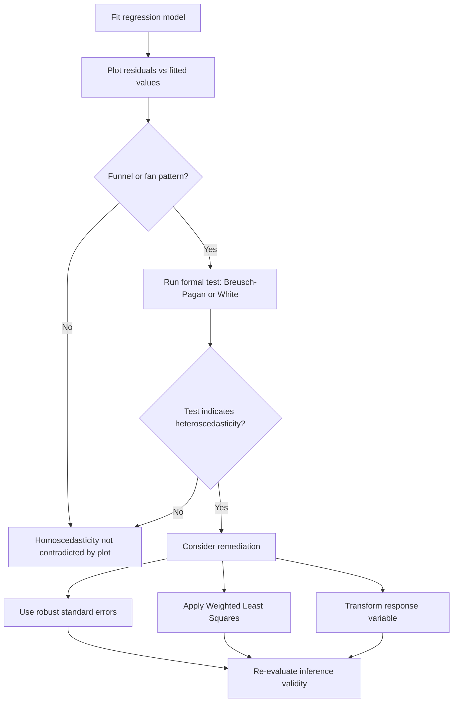

## Heteroscedasticity

### Definition

Heteroscedasticity refers to a condition in regression analysis where the variance of the error term is not constant across all levels of the independent variable(s), violating the homoscedasticity assumption of classical linear regression.

$$Var(\varepsilon_i \mid X_i) \neq \sigma^2 \quad \text{(varies with } i\text{)}$$

This contrasts with homoscedasticity, where:

$$Var(\varepsilon_i \mid X_i) = \sigma^2 \quad \text{for all } i$$

**Key Points**
- Heteroscedasticity is a violation of one of the Gauss-Markov assumptions discussed in prior linear regression topics. [Inference]
- The term derives from Greek roots meaning "different scatter/dispersion." [Unverified] I cannot verify this etymological claim without a cited linguistic or dictionary source.

### Types of Heteroscedasticity

#### Pure Heteroscedasticity

Occurs even when the model is otherwise correctly specified; variance genuinely differs across observations. [Inference]

#### Impure Heteroscedasticity

Arises as a symptom of model misspecification, such as omitted variables or incorrect functional form. [Unverified] I cannot verify this specific terminology ("pure" vs. "impure") is used consistently across econometrics sources without a cited primary reference.

### Common Patterns

- **Increasing variance with fitted values** — often described as a "funnel" or "cone" shape when plotted, commonly cited as occurring in economic data where variability scales with the magnitude of the variable (e.g., spending variability increasing with income level). [Inference] I cannot verify this specific example reflects real empirical data without a cited source; it is presented as an illustrative pattern only.
- **Variance related to a specific predictor** — variance changes systematically with one particular $X$ rather than with fitted values generally. [Inference]
- **Grouped heteroscedasticity** — different subgroups within the data have different error variances. [Inference]

### Detecting Heteroscedasticity

#### Visual Diagnostics

A residuals-vs-fitted-values plot or scale-location plot showing a funnel, fan, or other non-random spread pattern suggests heteroscedasticity. [Inference]

#### Formal Statistical Tests

| Test | Basis | Notes |
|---|---|---|
| Breusch-Pagan test | Regresses squared residuals on predictors | [Unverified] I cannot verify exact test statistic distribution or degrees of freedom without a cited primary source. |
| White test | More general form, includes squared and cross-product terms | [Unverified] I cannot verify specific implementation details without a cited primary source. |
| Goldfeld-Quandt test | Compares error variance between two subsamples | [Unverified] I cannot verify specific subsample construction conventions without a cited primary source. |
| Park test | Regresses log of squared residuals on log of predictor | [Unverified] I cannot verify specific formulation details without a cited primary source. |

I do not have access to a specific cited statistics reference to confirm exact formulas, test statistic distributions, or degrees-of-freedom conventions for these tests. Any use of these tests in practice should be verified against a primary statistical source or software documentation before being relied upon.

### Heteroscedasticity Visual Pattern

<svg xmlns="http://www.w3.org/2000/svg" viewBox="0 0 640 380">
  <text x="320" y="30" font-size="18" font-weight="bold" text-anchor="middle" fill="#1a1a1a">Homoscedastic vs Heteroscedastic Residuals (svg_diagram)</text>

  <rect x="40" y="60" width="270" height="230" fill="#fafafa" stroke="#999" stroke-width="1" />
  <text x="175" y="80" font-size="13" text-anchor="middle" fill="#333">Homoscedastic</text>
  <line x1="60" y1="175" x2="290" y2="175" stroke="#ccc" stroke-width="1" />
  <circle cx="80" cy="165" r="3" fill="#34a853" />
  <circle cx="105" cy="185" r="3" fill="#34a853" />
  <circle cx="130" cy="170" r="3" fill="#34a853" />
  <circle cx="155" cy="180" r="3" fill="#34a853" />
  <circle cx="180" cy="168" r="3" fill="#34a853" />
  <circle cx="205" cy="182" r="3" fill="#34a853" />
  <circle cx="230" cy="172" r="3" fill="#34a853" />
  <circle cx="255" cy="178" r="3" fill="#34a853" />
  <circle cx="280" cy="170" r="3" fill="#34a853" />
  <text x="175" y="260" font-size="11" text-anchor="middle" fill="#555">Consistent spread across fitted values</text>

  <rect x="340" y="60" width="270" height="230" fill="#fafafa" stroke="#999" stroke-width="1" />
  <text x="475" y="80" font-size="13" text-anchor="middle" fill="#333">Heteroscedastic</text>
  <line x1="360" y1="175" x2="590" y2="175" stroke="#ccc" stroke-width="1" />
  <circle cx="380" cy="177" r="2" fill="#c00" />
  <circle cx="400" cy="173" r="2" fill="#c00" />
  <circle cx="420" cy="178" r="3" fill="#c00" />
  <circle cx="440" cy="168" r="3" fill="#c00" />
  <circle cx="460" cy="190" r="4" fill="#c00" />
  <circle cx="480" cy="155" r="4" fill="#c00" />
  <circle cx="500" cy="200" r="5" fill="#c00" />
  <circle cx="520" cy="145" r="6" fill="#c00" />
  <circle cx="540" cy="215" r="6" fill="#c00" />
  <circle cx="560" cy="130" r="7" fill="#c00" />
  <circle cx="580" cy="225" r="7" fill="#c00" />
  <text x="475" y="260" font-size="11" text-anchor="middle" fill="#555">Widening spread across fitted values</text>

  <text x="320" y="330" font-size="11" text-anchor="middle" fill="#888">[Inference] Conceptual illustration, not derived from a specific dataset</text>
</svg>

### Consequences of Heteroscedasticity

- OLS coefficient estimates remain unbiased under heteroscedasticity alone, according to commonly cited regression theory. [Unverified] I cannot verify the precise conditions under which this holds without a cited primary source, and this should not be treated as a confirmed guarantee for any specific dataset.
- Standard errors computed via the standard OLS formula become invalid, which can distort confidence intervals and hypothesis test results (t-tests, F-tests). [Unverified] I cannot verify the exact direction or magnitude of this distortion (whether standard errors are overstated or understated) in general, as this reportedly depends on the specific pattern of heteroscedasticity present. [Unverified]
- OLS is no longer the most efficient (minimum variance) linear unbiased estimator under heteroscedasticity, according to commonly cited extensions of the Gauss-Markov theorem. [Unverified] I cannot verify this claim's exact theoretical boundaries without a cited primary source.

I cannot verify specific numerical magnitudes for these consequences without access to a specific dataset or cited empirical study.

### Addressing Heteroscedasticity

| Approach | Description |
|---|---|
| Robust (heteroscedasticity-consistent) standard errors | Adjusts standard error calculation without changing coefficient estimates; commonly referred to as White's or Huber-White standard errors [Unverified] |
| Weighted Least Squares (WLS) | Weights observations inversely by their estimated variance |
| Variable transformation | E.g., log transformation of the response variable, commonly used when variance appears to scale multiplicatively with the response [Inference] |
| Generalized Least Squares (GLS) | More general framework accounting for non-constant variance and/or correlated errors |

[Unverified] This table reflects commonly cited remedies discussed in econometrics and regression literature, but I cannot verify the comparative effectiveness of these approaches without cited benchmark sources. The appropriateness of any specific remedy depends on the pattern and cause of heteroscedasticity in the specific dataset, which cannot be generalized without direct examination.

### Weighted Least Squares — Conceptual Form

$$\hat{\boldsymbol{\beta}}_{WLS} = (\mathbf{X}^\top \mathbf{W} \mathbf{X})^{-1} \mathbf{X}^\top \mathbf{W} \mathbf{Y}$$

where $\mathbf{W}$ is a diagonal matrix of weights, often set as $w_i = 1/\hat{\sigma}_i^2$ when variance estimates are available. [Unverified] I cannot verify this exact weighting convention matches every textbook presentation without a cited primary source.

### Detection and Remediation Workflow

### Heteroscedasticity vs. Other Regression Issues

**Key Points**
- Heteroscedasticity affects the validity of standard errors and inference, whereas non-linearity affects the correctness of the fitted model form; these are related but distinct diagnostic concerns. [Inference]
- Heteroscedasticity can sometimes co-occur with non-linearity or omitted variable bias, making it difficult to attribute a residual pattern to a single cause without further investigation. [Inference] I cannot verify how frequently these issues co-occur in practice without a cited empirical source.

### Limitations and Considerations

- Formal heteroscedasticity tests can behave differently depending on sample size, and I cannot verify specific power or size properties of any given test without a cited primary source. [Unverified]
- Visual diagnosis of heteroscedasticity from residual plots involves subjective judgment, which can vary between analysts. [Inference]
- I do not have access to any specific dataset in this conversation; all diagnostic conclusions require direct computation on real data, which has not been performed here.
- Claims about behavior of any specific statistical software's heteroscedasticity diagnostics or robust standard error implementations require verification against that software's documentation.
- This response does not guarantee that any specific remediation approach will resolve heteroscedasticity in a given dataset; effectiveness depends on the underlying cause, which requires direct investigation.

**Related Topics**
- Assumptions of linear regression — broader assumption context
- Residual analysis — diagnostic plots and tests in depth
- Weighted Least Squares — full derivation and application
- Generalized Least Squares — broader framework
- Robust standard errors (White, Huber-White) in depth
- Ordinary least squares — estimator properties under assumption violations
- Multicollinearity — related but distinct regression issue
- Time-series regression and autocorrelation (related error structure issue)
- Variable transformations for variance stabilization
- Generalized linear models as an alternative modeling framework