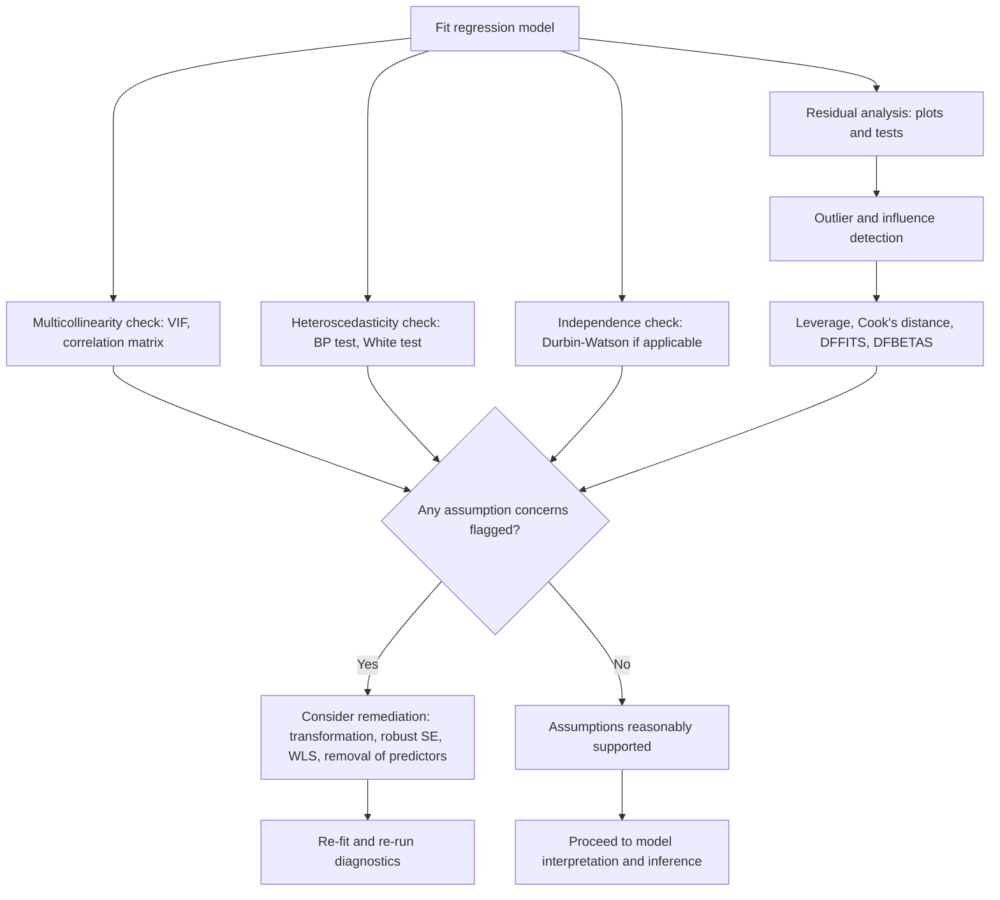

## Regression Diagnostics

### Definition

Regression diagnostics comprise the collective set of tools, plots, statistics, and tests used to evaluate whether a fitted regression model satisfies its underlying assumptions and to identify problematic data points that may unduly influence the model.

[Unverified] This definition synthesizes commonly described purposes of regression diagnostics across statistics literature, but I do not have access to a single canonical source confirming this exact framing.

**Key Points**
- Regression diagnostics is an umbrella term encompassing residual analysis, multicollinearity checks, heteroscedasticity tests, and influence/outlier detection, among others. [Inference]
- Diagnostics do not "prove" a model is correct; they provide evidence that either supports or contradicts stated assumptions. [Inference]

### Scope of Regression Diagnostics

| Diagnostic Category | What It Assesses | Related Prior Topic |
|---|---|---|
| Residual analysis | Linearity, homoscedasticity, normality | Residual Analysis |
| Multicollinearity checks | Predictor redundancy/correlation | Multicollinearity |
| Heteroscedasticity tests | Constant error variance | Heteroscedasticity |
| Independence checks | Correlation between error terms | Assumptions of Linear Regression |
| Influence/outlier detection | Individual observations' impact on the fit | Residual Analysis (leverage, Cook's distance) |
| Goodness-of-fit measures | Overall model adequacy | Simple/Multiple Linear Regression |

[Unverified] This categorization is a synthesis based on commonly discussed regression topics, not a confirmed single-source taxonomy. I cannot verify that all statistics texts organize diagnostics into exactly these categories.

### Outlier Detection

An outlier is an observation whose response value deviates substantially from what the model predicts, though the specific numerical threshold for "substantial" is not fixed. [Inference]

**Common Outlier Indicators**
- Standardized residuals with absolute value greater than approximately 2 or 3, cited as a common (but not universal) rule of thumb. [Unverified] I cannot verify a single agreed-upon threshold without a cited primary source.
- Studentized residuals exceeding critical values from a t-distribution. [Unverified] I cannot verify exact critical value conventions without a cited primary source.

### Leverage and Influence (Recap and Extension)

Leverage ($h_{ii}$) and Cook's distance were introduced under Residual Analysis. Additional influence diagnostics include:

#### DFFITS

Measures the change in a fitted value when an observation is removed, scaled by an estimate of standard error.

$$DFFITS_i = \frac{\hat{y}_i - \hat{y}_{i(i)}}{\sqrt{s_{(i)}^2 h_{ii}}}$$

where $\hat{y}_{i(i)}$ is the fitted value for observation $i$ when that observation is excluded from model fitting, and $s_{(i)}^2$ is the residual variance estimate excluding observation $i$. [Unverified] I cannot verify this exact formula matches every textbook notation without a cited primary source.

#### DFBETAS

Measures the change in each individual regression coefficient when an observation is removed, scaled by its standard error.

$$DFBETAS_{j(i)} = \frac{\hat{\beta}_j - \hat{\beta}_{j(i)}}{SE(\hat{\beta}_{j(i)})}$$

[Unverified] I cannot verify this exact formula matches every textbook notation without a cited primary source.

**Key Points**
- DFFITS and DFBETAS are described as "leave-one-out" style diagnostics, since they compare model results with and without each individual observation. [Inference]
- Commonly cited threshold conventions exist (e.g., $|DFFITS_i| > 2\sqrt{p/n}$) but I cannot verify a single universally accepted cutoff without a cited primary source. [Unverified]

### Regression Diagnostics Overview Diagram

<svg xmlns="http://www.w3.org/2000/svg" viewBox="0 0 680 440">
  <text x="340" y="30" font-size="18" font-weight="bold" text-anchor="middle" fill="#1a1a1a">Regression Diagnostics Map (svg_diagram)</text>

  <rect x="260" y="60" width="160" height="55" rx="6" fill="#333" fill-opacity="0.85" />
  <text x="340" y="93" font-size="13" text-anchor="middle" fill="#fff">Fitted Regression Model</text>

  <rect x="30" y="160" width="160" height="60" rx="6" fill="#e8f0fe" stroke="#4a86e8" stroke-width="1.5" />
  <text x="110" y="185" font-size="12" text-anchor="middle" fill="#1a1a1a">Residual Analysis</text>
  <text x="110" y="203" font-size="10" text-anchor="middle" fill="#444">linearity, normality</text>

  <rect x="210" y="160" width="160" height="60" rx="6" fill="#fef3e0" stroke="#e69b00" stroke-width="1.5" />
  <text x="290" y="185" font-size="12" text-anchor="middle" fill="#1a1a1a">Heteroscedasticity</text>
  <text x="290" y="203" font-size="10" text-anchor="middle" fill="#444">variance stability</text>

  <rect x="390" y="160" width="160" height="60" rx="6" fill="#e6f4ea" stroke="#34a853" stroke-width="1.5" />
  <text x="470" y="185" font-size="12" text-anchor="middle" fill="#1a1a1a">Multicollinearity</text>
  <text x="470" y="203" font-size="10" text-anchor="middle" fill="#444">predictor redundancy</text>

  <rect x="200" y="270" width="180" height="60" rx="6" fill="#fbe4e6" stroke="#c0392b" stroke-width="1.5" />
  <text x="290" y="295" font-size="12" text-anchor="middle" fill="#1a1a1a">Influence / Outliers</text>
  <text x="290" y="313" font-size="10" text-anchor="middle" fill="#444">leverage, Cook's D, DFFITS</text>

  <line x1="340" y1="115" x2="110" y2="160" stroke="#666" stroke-width="1.3" marker-end="url(#a1)" />
  <line x1="340" y1="115" x2="290" y2="160" stroke="#666" stroke-width="1.3" marker-end="url(#a1)" />
  <line x1="340" y1="115" x2="470" y2="160" stroke="#666" stroke-width="1.3" marker-end="url(#a1)" />
  <line x1="110" y1="220" x2="270" y2="270" stroke="#666" stroke-width="1.3" marker-end="url(#a1)" />
  <line x1="470" y1="220" x2="320" y2="270" stroke="#666" stroke-width="1.3" marker-end="url(#a1)" />

  <text x="340" y="400" font-size="11" text-anchor="middle" fill="#888">[Inference] Conceptual map, not derived from a specific dataset or single confirmed source</text>
</svg>

### Goodness-of-Fit Diagnostics

Beyond assumption checks, diagnostics also assess overall model adequacy:

- **$R^2$ and Adjusted $R^2$** — proportion of variance explained (discussed under Multiple Linear Regression).
- **AIC / BIC** — information criteria balancing model fit against complexity, commonly used for comparing competing model specifications. [Unverified] I cannot verify exact formula conventions or interpretation thresholds without a cited primary source.
- **Root Mean Squared Error (RMSE)** — commonly used to assess average prediction error magnitude, particularly relevant in predictive (rather than purely inferential) contexts. [Inference]

$$AIC = -2\ln(\hat{L}) + 2k \qquad BIC = -2\ln(\hat{L}) + k\ln(n)$$

where $\hat{L}$ is the maximized likelihood and $k$ is the number of estimated parameters. [Unverified] I cannot verify this exact formula matches every textbook's notation or scaling convention without a cited primary source.

### Comprehensive Diagnostic Workflow

### Diagnostic Summary Table

| Diagnostic | Detects | Typical Remedy |
|---|---|---|
| Residuals vs. fitted plot | Non-linearity, heteroscedasticity | Transformation, added variables |
| Q-Q plot | Non-normality of residuals | Transformation, robust methods |
| VIF | Multicollinearity | Remove/combine predictors, Ridge regression |
| Breusch-Pagan / White test | Heteroscedasticity | Robust SE, WLS |
| Durbin-Watson test | Autocorrelation | GLS, time-series-specific models |
| Cook's distance / DFFITS / DFBETAS | Influential observations | Investigate; consider removal with justification |
| AIC / BIC | Overall model adequacy vs. complexity | Model comparison / selection |

[Unverified] This summary table synthesizes commonly cited associations from regression and econometrics literature, but I cannot verify each specific pairing against a single authoritative source. Remedies listed are commonly discussed options, not guaranteed solutions for any specific dataset.

### Practical Sequencing Considerations

**Key Points**
- Diagnostics are commonly run after model fitting but often require iterative refitting as issues are identified and addressed. [Inference]
- No fixed universal order exists for running diagnostics; the sequence in the workflow diagram above reflects one common pedagogical presentation, not a mandated procedure. [Unverified] I cannot verify that all practitioners or texts follow this exact sequence without a cited primary source.
- Some diagnostics interact — e.g., addressing non-linearity via transformation can also change apparent heteroscedasticity patterns — making single-pass diagnostic conclusions potentially unreliable. [Inference]

### Limitations and Considerations

- This overview synthesizes diagnostic concepts discussed across prior related topics (Residual Analysis, Multicollinearity, Heteroscedasticity, Assumptions of Linear Regression); it does not introduce independently verified new formulas beyond what standard regression literature commonly describes. [Unverified]
- Threshold values cited throughout (VIF, Cook's distance, DFFITS, standardized residuals) are commonly referenced rules of thumb, not fixed statistical laws. [Unverified]
- I do not have access to any specific dataset in this conversation; all diagnostic conclusions require direct computation on real data, which has not been performed here.
- Claims about behavior of any specific statistical software's diagnostic output (e.g., R's `plot.lm()`, Python's `statsmodels`) require verification against that software's documentation directly.
- No outcome of applying these diagnostics to a real dataset is guaranteed; results depend entirely on the specific data examined.

**Related Topics**
- Residual analysis — detailed plots and interpretation
- Multicollinearity — VIF and remediation in depth
- Heteroscedasticity — tests and remediation in depth
- Assumptions of linear regression — foundational context
- Influence measures: Cook's distance, DFFITS, DFBETAS in depth
- Model selection criteria: AIC, BIC, Mallows' Cp
- Robust regression methods for outlier resistance
- Generalized least squares under assumption violations
- Cross-validation as a complementary model evaluation approach
- Ordinary least squares — estimator being diagnosed