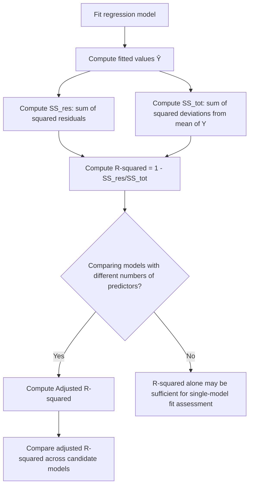

## R-Squared and Adjusted R-Squared

### Definition

R-squared ($R^2$), also called the coefficient of determination, measures the proportion of variance in the dependent variable that is explained by the independent variable(s) in a regression model.

$$R^2 = 1 - \frac{SS_{res}}{SS_{tot}} = 1 - \frac{\sum_{i=1}^n (y_i - \hat{y}_i)^2}{\sum_{i=1}^n (y_i - \bar{y})^2}$$

where $SS_{res}$ is the residual sum of squares and $SS_{tot}$ is the total sum of squares.

**Key Points**
- $R^2$ ranges from 0 to 1 in the standard formulation for models fit with OLS and including an intercept. [Unverified] I cannot verify this range holds universally across all model specifications (e.g., models without an intercept, or non-OLS fitting methods) without a cited primary source.
- An $R^2$ of 1 indicates the model explains all variance in $Y$; an $R^2$ of 0 indicates the model explains none of the variance beyond the mean. [Inference] This follows algebraically from the formula's boundary conditions.

### Alternative Formulation

$R^2$ can also be expressed as the squared correlation between observed and predicted values in simple linear regression:

$$R^2 = \left( \frac{\sum_{i=1}^n (x_i - \bar{x})(y_i - \bar{y})}{\sqrt{\sum_{i=1}^n (x_i - \bar{x})^2 \sum_{i=1}^n (y_i - \bar{y})^2}} \right)^2$$

[Unverified] This equivalence between $R^2$ and squared Pearson correlation is commonly cited for simple linear regression specifically, but I cannot verify it extends identically to multiple regression without a cited primary source.

### Why Adjusted R-Squared Exists

**Key Points**
- $R^2$ mechanically tends to increase (or at minimum, not decrease) as additional predictors are added to a model, regardless of whether those predictors have a genuine relationship with $Y$. [Inference] This is a commonly cited mathematical property of OLS, but I cannot verify the exact magnitude of this effect without a cited primary source or direct computation.
- This property makes raw $R^2$ potentially misleading when comparing models with different numbers of predictors. [Inference]

Adjusted $R^2$ introduces a penalty for the number of predictors in the model:

$$R^2_{adj} = 1 - \left(1 - R^2\right)\frac{n-1}{n-p-1}$$

where $n$ is the sample size and $p$ is the number of predictors (excluding the intercept).

**Key Points**
- Adjusted $R^2$ can decrease when a newly added predictor does not sufficiently improve model fit, unlike raw $R^2$. [Unverified] I cannot verify the precise mathematical conditions under which this decrease occurs without a cited primary source, though it follows generally from the penalty term structure in the formula.
- Adjusted $R^2$ can be lower than $R^2$, and in some formulations can theoretically become negative. [Unverified] I cannot verify the exact conditions producing a negative value without a cited primary source.

### Worked Example (Conceptual)

**Example**

Suppose a model with $n = 20$ observations and $p = 3$ predictors has $R^2 = 0.75$.

$$R^2_{adj} = 1 - (1 - 0.75)\frac{20-1}{20-3-1} = 1 - (0.25)\frac{19}{16} = 1 - 0.297 = 0.703$$

This is a direct arithmetic computation from the stated hypothetical values, not a result from a real dataset.

### R-Squared vs. Adjusted R-Squared Comparison

<svg xmlns="http://www.w3.org/2000/svg" viewBox="0 0 640 380">
  <text x="320" y="30" font-size="18" font-weight="bold" text-anchor="middle" fill="#1a1a1a">R² vs Adjusted R² as Predictors Increase (svg_diagram)</text>

  <line x1="70" y1="320" x2="590" y2="320" stroke="#333" stroke-width="1.5" />
  <line x1="70" y1="320" x2="70" y2="60" stroke="#333" stroke-width="1.5" />
  <text x="330" y="355" font-size="13" text-anchor="middle" fill="#333">Number of predictors added</text>
  <text x="30" y="190" font-size="13" text-anchor="middle" fill="#333" transform="rotate(-90 30 190)">Value</text>

  <path d="M100,260 L200,220 L300,190 L400,170 L500,155" fill="none" stroke="#4a86e8" stroke-width="2.5" />
  <circle cx="100" cy="260" r="4" fill="#4a86e8" />
  <circle cx="200" cy="220" r="4" fill="#4a86e8" />
  <circle cx="300" cy="190" r="4" fill="#4a86e8" />
  <circle cx="400" cy="170" r="4" fill="#4a86e8" />
  <circle cx="500" cy="155" r="4" fill="#4a86e8" />
  <text x="510" y="150" font-size="12" fill="#4a86e8">R²</text>

  <path d="M100,265 L200,230 L300,215 L400,225 L500,240" fill="none" stroke="#e69b00" stroke-width="2.5" stroke-dasharray="5,3" />
  <circle cx="100" cy="265" r="4" fill="#e69b00" />
  <circle cx="200" cy="230" r="4" fill="#e69b00" />
  <circle cx="300" cy="215" r="4" fill="#e69b00" />
  <circle cx="400" cy="225" r="4" fill="#e69b00" />
  <circle cx="500" cy="240" r="4" fill="#e69b00" />
  <text x="510" y="245" font-size="12" fill="#e69b00">Adjusted R²</text>

  <text x="330" y="90" font-size="11" text-anchor="middle" fill="#888">[Inference] Illustrative conceptual pattern, not derived from real data</text>
</svg>

### Interpretation Cautions

**Key Points**
- A high $R^2$ does not by itself confirm that the model's functional form is correct, that assumptions are satisfied, or that predictors are causally related to $Y$. [Inference]
- A low $R^2$ does not necessarily mean a model is useless; in some fields (e.g., social sciences), lower $R^2$ values are reportedly common and still considered informative. [Unverified] I cannot verify typical $R^2$ magnitudes by field without a cited empirical source, and this should not be treated as a confirmed benchmark.
- $R^2$ is sensitive to the range of $X$ values observed; restricting the range of $X$ can artificially lower $R^2$ even if the underlying relationship is unchanged. [Inference]
- Comparing $R^2$ values across models fit on different datasets (e.g., different sample sizes or different subsets) is not generally considered a valid comparison. [Inference]

I cannot verify field-specific benchmark $R^2$ values or comparative study results without a cited primary source.

### Limitations Common to Both Measures

- Neither $R^2$ nor adjusted $R^2$ indicates whether coefficient estimates are unbiased or whether other regression assumptions (linearity, homoscedasticity, independence) are satisfied. [Inference]
- Neither measure detects omitted variable bias. [Inference]
- Adding irrelevant predictors can sometimes still increase adjusted $R^2$ by chance in small samples, even though the penalty term is designed to discourage this. [Speculation] I cannot verify the specific probability or sample-size conditions under which this occurs without a cited primary source, and this should not be treated as an established rule.
- Neither $R^2$ nor adjusted $R^2$ is typically considered sufficient on its own for model selection; they are commonly used alongside other criteria such as AIC, BIC, and cross-validation. [Inference]

### R-Squared Calculation Workflow

### When to Prefer Adjusted R-Squared

| Scenario | Preferred Measure |
|---|---|
| Comparing models with different numbers of predictors | Adjusted $R^2$ |
| Reporting fit for a single, already-selected model | Either, though adjusted $R^2$ is commonly reported alongside $R^2$ |
| Communicating "percent of variance explained" to a general audience | $R^2$, due to more intuitive interpretation [Inference] |
| Model selection among competing specifications | Adjusted $R^2$, though commonly supplemented with AIC/BIC or cross-validation [Inference] |

[Unverified] This table reflects commonly cited practical guidance in regression literature, but I cannot verify it represents a universally agreed consensus without a cited primary source.

### Limitations and Considerations

- I cannot verify specific numerical $R^2$ or adjusted $R^2$ benchmarks for any particular field, dataset, or application without a cited source or direct computation.
- The formulas presented reflect commonly cited standard forms in regression literature, but exact notation may vary by textbook or software package. [Unverified]
- Neither measure should be used as the sole criterion for judging model adequacy; this reflects a commonly stated principle in statistics education, but I cannot verify a single authoritative source establishing this as a formal rule. [Inference]
- Claims about behavior of any specific statistical software's $R^2$ or adjusted $R^2$ output require verification against that software's documentation directly.

**Related Topics**
- Multiple linear regression — full model context
- Ordinary least squares — estimation method underlying these measures
- AIC, BIC, and information-criteria-based model selection
- Cross-validation for out-of-sample model evaluation
- Residual analysis — related diagnostic context
- Overfitting and model complexity tradeoffs
- F-test for overall model significance
- Adjusted R-squared vs. predicted R-squared (PRESS statistic)
- Mallows' Cp as an alternative model comparison criterion
- Simple linear regression — foundational single-predictor case