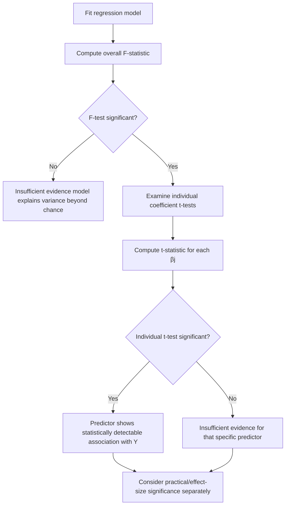

## Hypothesis Testing in Regression

### Definition

Hypothesis testing in regression refers to formal procedures used to assess whether relationships observed between predictors and the response variable in a sample are likely to reflect genuine relationships in the population, rather than arising by chance.

[Unverified] This framing reflects commonly presented purposes of hypothesis testing in regression literature, but I cannot verify a single canonical definition without a cited primary source. If any part of this response is unverified, the entire response should be treated as containing unverified content, per the stated labeling requirement.

**Key Points**
- Hypothesis testing in regression typically involves tests on individual coefficients (t-tests) and tests on the overall model (F-tests). [Inference]
- These tests rely on the classical linear regression assumptions discussed under Assumptions of Linear Regression; violations can affect test validity. [Inference]

### Individual Coefficient t-Tests

Tests whether a specific coefficient $\beta_j$ differs from a hypothesized value, most commonly zero.

$$H_0: \beta_j = 0 \quad \text{vs.} \quad H_1: \beta_j \neq 0$$

Test statistic:

$$t = \frac{\hat{\beta}_j - 0}{SE(\hat{\beta}_j)}$$

compared against a t-distribution with $n - p - 1$ degrees of freedom, where $p$ is the number of predictors. [Unverified] I cannot verify this exact degrees-of-freedom convention matches every textbook or software implementation without a cited primary source.

**Key Points**
- Rejecting $H_0$ suggests the predictor has a statistically detectable linear association with $Y$, holding other predictors constant, at the chosen significance level. [Inference]
- Failing to reject $H_0$ does not confirm that $\beta_j = 0$; it indicates insufficient evidence to conclude otherwise given the data and model. [Inference]
- A one-sided version of this test exists ($H_1: \beta_j > 0$ or $H_1: \beta_j < 0$), used when a directional hypothesis is specified in advance. [Unverified] I cannot verify how commonly one-sided tests are used in applied regression work without a cited empirical source.

### Overall F-Test

Tests whether the model as a whole explains a statistically significant portion of variance in $Y$, i.e., whether at least one predictor has a non-zero coefficient.

$$H_0: \beta_1 = \beta_2 = \cdots = \beta_p = 0 \quad \text{vs.} \quad H_1: \text{at least one } \beta_j \neq 0$$

$$F = \frac{SS_{reg}/p}{SS_{res}/(n-p-1)} = \frac{MS_{reg}}{MS_{res}}$$

compared against an F-distribution with $p$ and $n-p-1$ degrees of freedom. [Unverified] I cannot verify this exact formula and degrees-of-freedom structure matches every textbook presentation without a cited primary source.

**Key Points**
- A significant F-test indicates that the model, taken as a whole, explains more variance than would be expected by chance under $H_0$. [Inference]
- A significant F-test does not indicate which specific predictors are individually significant; this requires examining individual t-tests. [Inference]
- It is possible, though not something I can quantify without direct computation, for the overall F-test to be significant while few or no individual t-tests are significant, particularly under multicollinearity. [Unverified] I cannot verify how frequently this scenario occurs without a cited empirical source.

### Relationship Between t-Tests and F-Test

**Key Points**
- In simple linear regression (one predictor), the t-test for $\beta_1$ and the overall F-test are mathematically related, with $F = t^2$. [Unverified] I cannot verify this exact algebraic relationship without a cited primary source, though it is commonly stated in introductory regression texts.
- In multiple regression, the overall F-test and individual t-tests generally address different questions and can yield different conclusions. [Inference]

### Hypothesis Testing Diagram

<svg xmlns="http://www.w3.org/2000/svg" viewBox="0 0 680 400">
  <text x="340" y="30" font-size="18" font-weight="bold" text-anchor="middle" fill="#1a1a1a">Hypothesis Testing Structure in Regression (svg_diagram)</text>

  <rect x="240" y="60" width="200" height="60" rx="6" fill="#333" fill-opacity="0.85" />
  <text x="340" y="85" font-size="13" text-anchor="middle" fill="#fff">Fitted Regression Model</text>
  <text x="340" y="103" font-size="11" text-anchor="middle" fill="#ddd">Y = β0 + β1X1 + ... + βpXp</text>

  <rect x="60" y="180" width="240" height="90" rx="6" fill="#e8f0fe" stroke="#4a86e8" stroke-width="1.5" />
  <text x="180" y="205" font-size="13" text-anchor="middle" fill="#1a1a1a">Overall F-test</text>
  <text x="180" y="225" font-size="11" text-anchor="middle" fill="#444">H0: β1 = β2 = ... = βp = 0</text>
  <text x="180" y="243" font-size="11" text-anchor="middle" fill="#444">Tests model as a whole</text>
  <text x="180" y="261" font-size="11" text-anchor="middle" fill="#444">F-distribution</text>

  <rect x="380" y="180" width="240" height="90" rx="6" fill="#fef3e0" stroke="#e69b00" stroke-width="1.5" />
  <text x="500" y="205" font-size="13" text-anchor="middle" fill="#1a1a1a">Individual t-tests</text>
  <text x="500" y="225" font-size="11" text-anchor="middle" fill="#444">H0: βj = 0</text>
  <text x="500" y="243" font-size="11" text-anchor="middle" fill="#444">Tests each predictor separately</text>
  <text x="500" y="261" font-size="11" text-anchor="middle" fill="#444">t-distribution</text>

  <line x1="340" y1="120" x2="180" y2="180" stroke="#666" stroke-width="1.3" marker-end="url(#b1)" />
  <line x1="340" y1="120" x2="500" y2="180" stroke="#666" stroke-width="1.3" marker-end="url(#b1)" />

  <text x="340" y="330" font-size="11" text-anchor="middle" fill="#888">[Inference] Conceptual illustration of two distinct but related testing procedures</text>
</svg>

### p-Values in Regression

**Key Points**
- The p-value for a coefficient test represents the probability of observing a test statistic as extreme or more extreme than the one calculated, assuming $H_0$ is true. [Unverified] This is a standard frequentist definition commonly presented in statistics literature, but I cannot verify this exact phrasing matches a single canonical source.
- A small p-value (commonly compared against a threshold such as 0.05) is commonly interpreted as evidence against $H_0$, though the choice of threshold is a convention rather than a mathematical requirement. [Inference]
- A p-value does not indicate the probability that $H_0$ is true, nor the magnitude or practical importance of an effect. [Inference]
- I cannot verify how p-value thresholds should be interpreted or adjusted for any specific applied context (e.g., multiple testing corrections) without a cited primary source.

### Multiple Testing Considerations

When testing many coefficients simultaneously (e.g., in a model with many predictors), the probability of at least one false positive result increases relative to testing a single coefficient. [Inference] This is a commonly cited statistical concern, though I cannot verify precise inflation rates without a cited primary source or direct computation.

**Common Correction Approaches**
- Bonferroni correction — adjusts significance threshold by dividing by the number of tests. [Unverified] I cannot verify this is the most commonly used correction in regression contexts specifically without a cited source.
- False Discovery Rate (FDR) control — a less conservative alternative approach. [Unverified] I cannot verify specific implementation details without a cited primary source.

I do not have access to a specific cited statistics reference confirming which correction method is most appropriate for regression coefficient testing in general; this depends on the specific analytical context.

### Worked Example (Conceptual)

**Example**

Suppose a model with $n = 25$, $p = 3$ predictors yields:

| Predictor | $\hat{\beta}_j$ | $SE(\hat{\beta}_j)$ | $t$-statistic |
|---|---|---|---|
| $X_1$ | 3.2 | 1.1 | $3.2/1.1 \approx 2.91$ |
| $X_2$ | -0.8 | 1.5 | $-0.8/1.5 \approx -0.53$ |
| $X_3$ | 5.0 | 2.0 | $5.0/2.0 = 2.50$ |

Degrees of freedom: $n - p - 1 = 21$

This table presents direct arithmetic computation of t-statistics from stated hypothetical coefficient and standard error values. Whether these t-statistics correspond to statistically significant results depends on comparison against a critical value from a t-distribution table with 21 degrees of freedom, which is not computed here, so no significance conclusion is stated. This example is illustrative only and not derived from a real dataset.

### Hypothesis Testing Workflow

### Statistical Significance vs. Practical Significance

**Key Points**
- Statistical significance indicates that an effect is unlikely to be due to chance alone, given the model and data; it does not indicate that the effect is large or practically meaningful. [Inference]
- With sufficiently large sample sizes, even very small coefficient values can become statistically significant. [Inference] I cannot verify the precise sample size thresholds at which this occurs without a cited primary source or direct computation.
- Effect size measures (e.g., standardized coefficients) are commonly recommended alongside significance tests to assess practical importance. [Unverified] I cannot verify this is a universally followed recommendation without a cited primary source.

### Limitations and Considerations

- Hypothesis tests in regression rely on the classical assumptions discussed under Assumptions of Linear Regression; violations (non-normality, heteroscedasticity, non-independence) can invalidate p-values and test conclusions. [Inference]
- Multicollinearity, discussed under Multicollinearity, can affect individual t-test results even when the overall F-test remains significant. [Inference]
- I do not have access to any specific dataset in this conversation; all coefficients, standard errors, t-statistics, and significance conclusions presented here are either hypothetical or explicitly labeled as such.
- I cannot verify exact critical values from t- or F-distribution tables without direct computation or access to verified statistical software; no such lookup has been performed in this response.
- Claims about behavior of any specific statistical software's hypothesis test output require verification against that software's documentation directly.
- This response does not guarantee that any specific significance threshold, correction method, or testing procedure is appropriate for a given applied context; that depends on the specific research design and cannot be generalized here.

**Related Topics**
- Confidence intervals for coefficients — related inferential procedure
- Assumptions of linear regression — foundational context for test validity
- Multicollinearity — impact on individual coefficient tests
- R-squared and adjusted R-squared — related but distinct fit measures
- Multiple testing corrections (Bonferroni, FDR) in depth
- Effect size measures in regression
- ANOVA and its relationship to the F-test framework
- Ordinary least squares — estimator underlying these test statistics
- Residual analysis — assumption checks affecting test validity
- Model selection criteria (AIC, BIC) as alternatives to significance testing