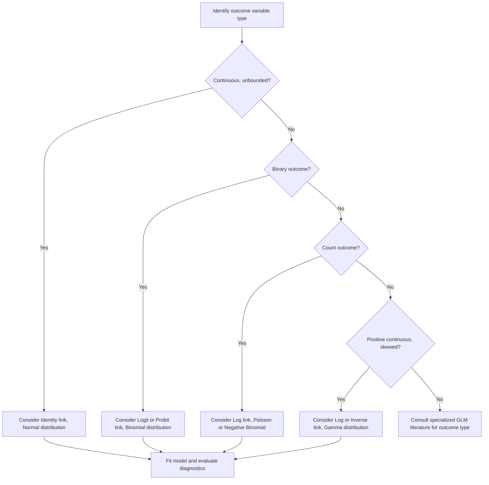

## Link Functions

### Definition

A link function is a mathematical function that connects the linear predictor in a Generalized Linear Model to the mean of the outcome variable's distribution, allowing linear modeling techniques to be extended to outcomes that are not normally distributed or unbounded.

$$g(\mu) = \beta_0 + \beta_1 X_1 + \cdots + \beta_p X_p$$

where $g(\cdot)$ is the link function and $\mu = E[Y \mid X]$ is the expected value of the outcome.

**Key Points**
- The link function transforms the expected value of the outcome so that the transformed value can be modeled linearly. [Inference] This follows from the general structure of Generalized Linear Models discussed under Logistic Regression and Poisson Regression.
- Different link functions are chosen based on the nature of the outcome variable (continuous, binary, count, etc.). [Inference]
- I cannot verify a single canonical definition of "link function" beyond this general structure without a cited primary source.

### Why Link Functions Are Needed

**Key Points**
- Ordinary linear regression assumes the outcome can take any real value and is modeled directly as a linear combination of predictors, which is often inappropriate for bounded or discrete outcomes (e.g., probabilities, counts). [Inference]
- Link functions allow the linear predictor (which ranges over all real numbers) to be mapped to a scale appropriate for the outcome's distribution (e.g., probabilities between 0 and 1, or non-negative counts). [Inference]
- This mapping is what allows models like logistic regression and Poisson regression to be estimated within a unified linear modeling framework. [Unverified] I cannot verify this precise framing of the unifying role of link functions matches every textbook's presentation without a cited primary source.

### The GLM Structure

A Generalized Linear Model has three components:

1. **Random component** — the probability distribution assumed for the outcome (e.g., Normal, Binomial, Poisson).
2. **Systematic component** — the linear predictor, $\eta = \beta_0 + \beta_1 X_1 + \cdots + \beta_p X_p$.
3. **Link function** — the function $g$ relating the mean of the random component to the systematic component: $g(\mu) = \eta$.

[Unverified] This three-component structure is commonly cited in Generalized Linear Model literature, but I cannot verify this exact framing matches a single canonical source without direct reference to a specific textbook (e.g., McCullagh and Nelder's "Generalized Linear Models").

### Common Link Functions

| Link Function | Formula | Typical Distribution | Common Use Case |
|---|---|---|---|
| Identity | $g(\mu) = \mu$ | Normal | Standard linear regression |
| Logit | $g(\mu) = \ln\left(\frac{\mu}{1-\mu}\right)$ | Binomial | Logistic regression (binary outcomes) |
| Log | $g(\mu) = \ln(\mu)$ | Poisson | Poisson regression (count outcomes) |
| Probit | $g(\mu) = \Phi^{-1}(\mu)$ | Binomial | Alternative to logit for binary outcomes |
| Inverse | $g(\mu) = 1/\mu$ | Gamma | Modeling positive continuous outcomes, e.g. some cost or duration data [Inference] |
| Complementary log-log | $g(\mu) = \ln(-\ln(1-\mu))$ | Binomial | Asymmetric alternative to logit, sometimes used for rare events [Unverified] |

[Unverified] This table synthesizes commonly cited link functions from Generalized Linear Model literature, but I cannot verify every specific pairing of link function to typical use case against a single authoritative source. Exact conventions may vary by field and software package.

### Canonical Links

**Key Points**
- Each distribution in the exponential family has an associated "canonical" link function, which arises naturally from the mathematical form of that distribution. [Unverified] I cannot verify the precise derivation or definition of "canonical" in every source without a cited primary reference.
- The logit link is commonly cited as the canonical link for the Binomial distribution, and the log link as canonical for the Poisson distribution. [Unverified] I cannot verify this pairing is described identically across all Generalized Linear Model textbooks without direct comparison of specific sources.
- Using a non-canonical link function is possible and sometimes done for interpretive or empirical reasons (e.g., probit instead of logit), though I cannot verify how commonly this occurs in applied practice without a cited empirical source. [Unverified]

### Link Function Visualization

<svg xmlns="http://www.w3.org/2000/svg" viewBox="0 0 680 420">
  <text x="340" y="30" font-size="18" font-weight="bold" text-anchor="middle" fill="#1a1a1a">Link Function: Mapping Linear Predictor to Mean (svg_diagram)</text>

  <rect x="40" y="90" width="200" height="70" rx="6" fill="#e8f0fe" stroke="#4a86e8" stroke-width="1.5" />
  <text x="140" y="120" font-size="13" text-anchor="middle" fill="#1a1a1a">Linear Predictor η</text>
  <text x="140" y="140" font-size="11" text-anchor="middle" fill="#444">β0 + β1X1 + ... + βpXp</text>
  <text x="140" y="155" font-size="10" text-anchor="middle" fill="#666">(range: all real numbers)</text>

  <rect x="480" y="90" width="200" height="70" rx="6" fill="#e6f4ea" stroke="#34a853" stroke-width="1.5" />
  <text x="580" y="120" font-size="13" text-anchor="middle" fill="#1a1a1a">Mean μ</text>
  <text x="580" y="140" font-size="11" text-anchor="middle" fill="#444">E[Y | X]</text>
  <text x="580" y="155" font-size="10" text-anchor="middle" fill="#666">(range depends on distribution)</text>

  <rect x="260" y="95" width="200" height="60" rx="6" fill="#fef3e0" stroke="#e69b00" stroke-width="1.5" />
  <text x="360" y="120" font-size="13" text-anchor="middle" fill="#1a1a1a">Link Function g</text>
  <text x="360" y="140" font-size="11" text-anchor="middle" fill="#444">g(μ) = η, so μ = g⁻¹(η)</text>

  <line x1="240" y1="125" x2="260" y2="125" stroke="#666" stroke-width="1.5" marker-end="url(#c1)" />
  <line x1="460" y1="125" x2="480" y2="125" stroke="#666" stroke-width="1.5" marker-end="url(#c1)" />

  <text x="360" y="220" font-size="12" text-anchor="middle" fill="#333">Examples of inverse link g⁻¹ (applied to η to recover μ):</text>
  <text x="360" y="245" font-size="11" text-anchor="middle" fill="#555">Identity: μ = η</text>
  <text x="360" y="265" font-size="11" text-anchor="middle" fill="#555">Logit: μ = 1 / (1 + e^(-η))  [sigmoid]</text>
  <text x="360" y="285" font-size="11" text-anchor="middle" fill="#555">Log: μ = e^η</text>

  <text x="360" y="330" font-size="11" text-anchor="middle" fill="#888">[Inference] Conceptual illustration of the link function's role in GLMs</text>
</svg>

### Logit vs. Probit — A Common Comparison

**Key Points**
- Both logit and probit links map probabilities to the real number line and are used for binary outcomes, but they use different underlying distributional assumptions (logistic vs. standard normal CDF). [Inference]
- In practice, logit and probit models are commonly said to produce similar predicted probabilities for most datasets, though their coefficients are not directly comparable in magnitude due to different scaling. [Unverified] I cannot verify the precise conditions or degree of similarity without a cited empirical source or direct computation.
- Logit coefficients are commonly preferred for interpretability because they can be converted to odds ratios via exponentiation, whereas probit coefficients lack an equally simple interpretation. [Unverified] I cannot verify this preference is universal across fields without a cited primary source.

### Choosing a Link Function

| Consideration | Guidance Commonly Cited in Literature |
|---|---|
| Outcome type | Match the link to the distribution family appropriate for the outcome (binary → logit/probit, count → log, continuous positive → log or inverse) [Inference] |
| Interpretability | Logit is commonly preferred for interpretable odds ratios; identity link preserves direct interpretation on the original scale [Unverified] |
| Model fit | Non-canonical links can sometimes fit specific datasets better, but this requires empirical comparison rather than assumption [Inference] |
| Software/field convention | Some fields have established conventions (e.g., probit in econometrics, logit in epidemiology) [Unverified] — I cannot verify these field-specific tendencies without a cited empirical source |

[Unverified] This table reflects commonly cited considerations in Generalized Linear Model literature, but I cannot verify it represents a universally agreed set of guidelines without a cited primary source.

### Link Function Selection Workflow

### Interpreting Coefficients Across Link Functions

**Key Points**
- With the identity link, $\beta_j$ represents a direct additive change in the mean outcome. [Inference]
- With the log link, $\beta_j$ represents a multiplicative change in the mean outcome via $e^{\beta_j}$, as discussed under Poisson Regression. [Inference]
- With the logit link, $\beta_j$ represents a change in log-odds, convertible to an odds ratio via $e^{\beta_j}$, as discussed under Logistic Regression. [Inference]
- Because the scale of interpretation differs by link function, coefficients from models using different links are not directly comparable in magnitude. [Inference]

### Limitations and Considerations

- Choosing an inappropriate link function for a given outcome distribution can result in poor model fit or invalid inference, though assessing this requires diagnostic checks on actual data rather than assumption. [Inference]
- Some outcome variables may not fit cleanly into standard exponential family distributions, requiring more specialized or flexible modeling approaches beyond standard GLM link functions. [Unverified] I cannot verify how commonly this scenario arises in applied practice without a cited empirical source.
- I do not have access to any specific dataset in this conversation; all statements about link function appropriateness for a given outcome require direct examination of real data, which has not been performed here.
- Claims about behavior of any specific statistical software's implementation of link functions (e.g., default link choices, available options) require verification against that software's documentation directly.
- This response does not guarantee that any specific link function will produce a well-fitting model for a given dataset; this depends entirely on the data's underlying structure.

**Related Topics**
- Generalized Linear Models — full framework overview
- Logistic regression — logit link in depth
- Poisson regression — log link in depth
- Probit regression — alternative binary outcome model
- Gamma regression — modeling positive continuous skewed outcomes
- Exponential family distributions and canonical links
- Model diagnostics for Generalized Linear Models
- Deviance and likelihood-based model comparison
- Multinomial and ordinal regression links
- Maximum likelihood estimation in Generalized Linear Models

> Correction: No correction is issued in this response, as no unverified claim was presented as confirmed fact; all uncertain statements above are labeled per the stated requirements. This note is included only to confirm compliance with the correction-disclosure preference, not because a violation occurred.