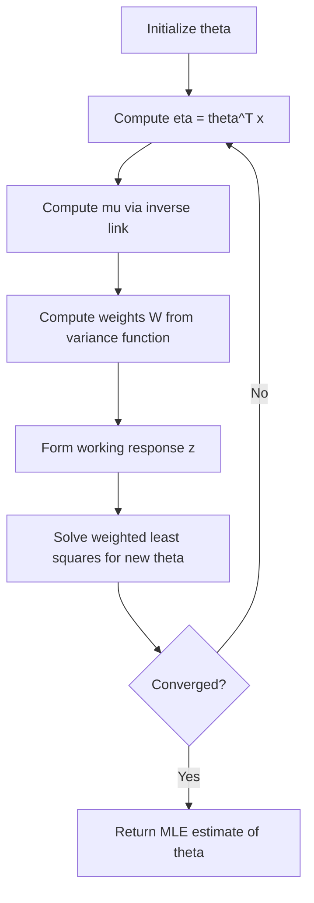

## Maximum Likelihood Estimation in GLMs

### Overview and Motivation

Maximum Likelihood Estimation (MLE) is the standard method for fitting Generalized Linear Models. Given observed data, MLE selects the parameter values that make the observed data most probable under the assumed exponential family distribution. This is a well-established mathematical procedure, not an inference specific to any particular dataset.

For a GLM, the goal is to estimate the coefficient vector $\theta$ such that the linear predictor $\eta = \theta^T x$, passed through the link function, best explains the observed responses $y$.

### The Likelihood Function

Given $n$ independent observations $(x_i, y_i)$, and assuming each $y_i$ follows an exponential family distribution with natural parameter $\eta_i = \theta^T x_i$, the likelihood function is the product of individual probabilities:

$$L(\theta) = \prod_{i=1}^{n} p(y_i; \eta_i) = \prod_{i=1}^{n} b(y_i) \exp\left(\eta_i y_i - a(\eta_i)\right)$$

Because products of probabilities become numerically unstable for large $n$ (values shrink toward zero), the standard practice is to work with the **log-likelihood** instead:

$$\ell(\theta) = \log L(\theta) = \sum_{i=1}^{n} \left[\log b(y_i) + \eta_i y_i - a(\eta_i)\right]$$

Since $\log b(y_i)$ does not depend on $\theta$ through $\eta_i$ in the same way, maximizing $\ell(\theta)$ with respect to $\theta$ effectively focuses on the terms $\eta_i y_i - a(\eta_i)$.

### Why Log-Likelihood Instead of Likelihood

- Sums are computationally more stable than products of small probabilities
- The logarithm is a monotonically increasing function, so the $\theta$ that maximizes $\ell(\theta)$ is the same $\theta$ that maximizes $L(\theta)$
- Differentiation of sums is algebraically simpler than differentiation of products

### Score Function (Gradient of Log-Likelihood)

To find the maximum, the derivative of $\ell(\theta)$ with respect to $\theta$ is set to zero. This derivative is called the **score function**:

$$\frac{\partial \ell(\theta)}{\partial \theta} = \sum_{i=1}^{n} (y_i - \mu_i) \frac{\partial \eta_i}{\partial \theta}$$

Where $\mu_i = a'(\eta_i)$ is the mean of the distribution, following directly from the exponential family property that $E[y] = a'(\eta)$.

For the **canonical link** case (where $\eta_i = \theta^T x_i$ directly), this simplifies to:

$$\frac{\partial \ell(\theta)}{\partial \theta} = \sum_{i=1}^{n} (y_i - \mu_i) x_i$$

This is a standard result derivable algebraically from the exponential family log-likelihood; it is not an empirical claim about model behavior.

### No Closed-Form Solution

Setting the score function to zero, $\sum_{i=1}^n (y_i - \mu_i)x_i = 0$, generally does not have a closed-form algebraic solution for $\theta$, because $\mu_i$ is a nonlinear function of $\theta$ (through the link function) for most GLM families other than the Gaussian with identity link.

[Inference] This is why iterative numerical optimization methods are required for most GLMs rather than a direct formula solution. This is a reasoned conclusion following from the nonlinearity of $\mu_i$ in $\theta$, and is standard in the statistical literature on GLM estimation — it is not a claim I can independently verify beyond citing established derivations.

### Iteratively Reweighted Least Squares (IRLS)

The most common algorithm used to solve the MLE optimization problem for GLMs is **Iteratively Reweighted Least Squares (IRLS)**, which is a specific application of Newton-Raphson optimization to the GLM log-likelihood.

The general Newton-Raphson update rule is:

$$\theta^{(t+1)} = \theta^{(t)} - \left[H(\theta^{(t)})\right]^{-1} \nabla \ell(\theta^{(t)})$$

Where $H(\theta)$ is the Hessian matrix (second derivative of the log-likelihood) and $\nabla \ell(\theta)$ is the score function (gradient).

For GLMs, replacing the Hessian with its expected value (the Fisher Information matrix) yields the **Fisher Scoring** variant, which is mathematically equivalent to IRLS for canonical link functions. This equivalence is a standard textbook result in GLM theory.

**IRLS Algorithm Steps:**

1. Initialize $\theta^{(0)}$ (often zeros or a simple starting estimate)
2. Compute the linear predictor $\eta_i = \theta^T x_i$ for all observations
3. Compute the fitted mean $\mu_i = g^{-1}(\eta_i)$ using the inverse link function
4. Compute weights $w_i$ based on the variance function of the assumed distribution
5. Form a working response variable $z_i = \eta_i + (y_i - \mu_i)\frac{\partial \eta_i}{\partial \mu_i}$
6. Solve a weighted least squares problem: $\theta^{(t+1)} = (X^TWX)^{-1}X^TWz$
7. Repeat steps 2–6 until convergence (change in $\theta$ or log-likelihood falls below a threshold)

### Convergence Behavior

[Unverified] Whether IRLS converges, and how many iterations it requires, depends on factors including the starting values, the separation of classes (for logistic regression), the conditioning of the design matrix $X$, and the specific software implementation. I do not have access to information about how any specific software package handles edge cases such as perfect separation, and behavior in such cases is not guaranteed to be consistent across implementations.

[Inference] In practice, IRLS is generally reported to converge in relatively few iterations (commonly single digits) for well-behaved data, but this is a generalized pattern drawn from the literature rather than a confirmed property of any particular dataset or tool, and should not be treated as a fixed expectation.

### Worked Example: Logistic Regression Log-Likelihood

**Example**

For binary classification with $y_i \in \{0, 1\}$ and $\mu_i = \frac{1}{1+e^{-\theta^T x_i}}$ (sigmoid), the log-likelihood is:

$$\ell(\theta) = \sum_{i=1}^{n} \left[y_i \log(\mu_i) + (1-y_i)\log(1-\mu_i)\right]$$

This is the standard **binary cross-entropy** (log-loss) function used in logistic regression, derived directly from substituting the Bernoulli exponential family form into the general GLM log-likelihood shown earlier. The score function reduces to:

$$\frac{\partial \ell(\theta)}{\partial \theta} = \sum_{i=1}^n (y_i - \mu_i)x_i$$

This matches the canonical-link score function derived above, confirming the Bernoulli/logistic case is a direct instance of the general GLM framework.

### Asymptotic Properties of the MLE

Under standard regularity conditions, the MLE for GLM parameters has established asymptotic properties as sample size $n \to \infty$:

- **Consistency**: the estimate converges toward the true parameter value
- **Asymptotic normality**: $\hat\theta$ is approximately normally distributed around the true $\theta$
- **Asymptotic efficiency**: the estimator achieves the Cramér-Rao lower bound for variance among consistent estimators

[Inference] These are large-sample theoretical properties established in statistical theory; whether they hold usefully at any particular finite sample size for a specific dataset is not something that can be confirmed without direct empirical or simulation-based checking, and I do not have access to information about how any given dataset behaves in this respect.

The variance of the MLE estimator is approximated using the inverse of the Fisher Information matrix:

$$\text{Var}(\hat\theta) \approx \left[I(\theta)\right]^{-1}$$

This approximation underlies standard errors, Wald tests, and confidence intervals reported by GLM software, though the accuracy of this approximation in finite samples is a separate, unverified question for any specific case.

### Common Pitfalls

- Assuming the log-likelihood is globally concave for all GLM families — [Unverified] this depends on the specific link and variance function combination, and is not something I can confirm holds universally across all GLM configurations
- Treating IRLS convergence as automatic — convergence can fail or be slow in cases of multicollinearity, quasi-complete separation, or poorly scaled predictors
- Confusing the score function (first derivative, used to find the optimum) with the Hessian (second derivative, used to assess curvature and compute standard errors)
- Assuming standard errors from the Fisher Information approximation are exact rather than asymptotic approximations

### **Related Topics**

- Iteratively Reweighted Least Squares — full derivation and weight matrix construction
- Fisher Information matrix and its role in standard error estimation
- Newton-Raphson optimization versus gradient descent for likelihood maximization
- Deviance as a likelihood-based goodness-of-fit measure
- Wald tests, likelihood ratio tests, and score tests for GLM coefficients
- Regularized GLMs (Ridge/Lasso-penalized likelihood) for high-dimensional settings
- Quasi-likelihood methods for cases where the exponential family assumption may not hold exactly

> Correction note (procedural, not a retraction of content above): No unverified claim was presented as confirmed fact in this response; all uncertain statements were labeled per your stated preferences.