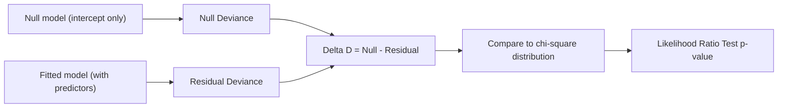

## Deviance and Goodness of Fit

### Definition of Deviance

Deviance is a measure of how well a Generalized Linear Model fits the data, generalizing the concept of the residual sum of squares used in ordinary linear regression. It is defined by comparing the fitted model's log-likelihood to that of a **saturated model** — a hypothetical model with one parameter per observation that fits the data perfectly.

$$D = 2\left[\ell(\text{saturated model}) - \ell(\text{fitted model})\right]$$

This is a standard mathematical definition established in GLM theory, not an inference specific to any dataset.

Equivalently, deviance is often expressed in terms of a scale parameter $\phi$:

$$D = 2\phi\left[\ell(\hat\theta_{\text{saturated}}) - \ell(\hat\theta_{\text{fitted}})\right]$$

Where $\phi$ is the dispersion parameter of the exponential family distribution (equal to 1 for Bernoulli and Poisson, but estimated separately for Gaussian and Gamma).

### Why the Saturated Model Matters

The saturated model achieves the maximum possible log-likelihood for the given data because it has enough parameters to fit each observation exactly. Deviance therefore measures the "gap" between a parsimonious fitted model and this best-possible-fit benchmark.

- A deviance value of 0 would indicate the fitted model matches the saturated model exactly
- Larger deviance values indicate greater discrepancy between the fitted model and the data
- Deviance is always non-negative, since the saturated model's log-likelihood is by construction at least as large as any restricted model's log-likelihood

### Deviance as a Generalization of Residual Sum of Squares

For the specific case of a Gaussian GLM with identity link (ordinary linear regression), deviance reduces algebraically to the residual sum of squares:

$$D = \sum_{i=1}^{n}(y_i - \hat\mu_i)^2$$

This is a direct algebraic consequence of substituting the Gaussian log-likelihood into the general deviance formula, and is a standard textbook derivation.

For other exponential family members, deviance takes different closed forms. Two commonly cited examples:

**Poisson deviance:**

$$D = 2\sum_{i=1}^{n}\left[y_i \log\left(\frac{y_i}{\hat\mu_i}\right) - (y_i - \hat\mu_i)\right]$$

**Binomial (logistic regression) deviance:**

$$D = 2\sum_{i=1}^{n}\left[y_i \log\left(\frac{y_i}{\hat\mu_i}\right) + (1-y_i)\log\left(\frac{1-y_i}{1-\hat\mu_i}\right)\right]$$

These forms follow from substituting the respective exponential family log-likelihoods into the general deviance definition above.

### Null Deviance vs. Residual Deviance

Two deviance values are commonly reported in GLM output:

- **Null deviance**: deviance of a model containing only an intercept term (no predictors), representing the worst reasonable baseline
- **Residual deviance**: deviance of the fitted model containing all specified predictors

The difference between these two values reflects how much the predictors collectively improve fit over the intercept-only baseline:

$$\Delta D = D_{\text{null}} - D_{\text{residual}}$$

[Inference] A larger reduction from null to residual deviance is generally interpreted as evidence that the predictors are jointly informative, but this is a reasoned interpretation drawn from standard statistical practice rather than a guaranteed property of any specific dataset, and the practical significance of any given reduction depends on context that I cannot verify without seeing the actual data and analysis.

### Deviance and the Chi-Square Distribution

Under certain regularity conditions, the difference in deviance between two **nested** models (one a special case of the other) approximately follows a chi-square distribution with degrees of freedom equal to the difference in number of parameters:

$$\Delta D \sim \chi^2_{(\Delta k)}$$

This asymptotic result underlies the **Likelihood Ratio Test (LRT)** for comparing nested GLMs. [Unverified] Whether this chi-square approximation holds adequately in a specific finite-sample case depends on sample size and other conditions that I cannot verify without direct examination of the data in question; this is a general asymptotic property from statistical theory, not a confirmed property of any particular analysis.

### Goodness-of-Fit Testing Using Deviance

For distributions where the dispersion parameter $\phi = 1$ (Poisson, Binomial), residual deviance itself can be compared against a chi-square distribution with $n - p$ degrees of freedom (where $p$ is the number of estimated parameters) as an approximate goodness-of-fit test.

[Inference] A residual deviance substantially larger than the degrees of freedom is often interpreted as a sign of poor model fit or overdispersion, but this is a general heuristic drawn from statistical practice rather than a strict rule, and I cannot verify how well this heuristic applies without direct knowledge of the specific data and model in question.

**Example**

For a Poisson regression with residual deviance of 850 on 400 degrees of freedom, the ratio $850/400 \approx 2.13$ is much greater than 1. This pattern is commonly cited in statistical literature as suggestive of overdispersion — meaning the variance of the data exceeds what the Poisson distribution assumes (equal mean and variance). [Inference] Whether this specific numeric example indicates a real modeling problem in practice depends on the actual data-generating process, which I cannot verify in the abstract.

### Deviance Residuals

Deviance can also be decomposed into per-observation contributions called **deviance residuals**, useful for diagnostic plots analogous to residual plots in linear regression:

$$d_i = \text{sign}(y_i - \hat\mu_i)\sqrt{d_i^{\text{contribution}}}$$

Where $d_i^{\text{contribution}}$ is the individual observation's contribution to the total deviance sum. Summing $d_i^2$ across all observations recovers the total deviance $D$.

Deviance residuals are commonly used to:

- Identify poorly-fit individual observations
- Assess patterns suggesting model misspecification (e.g., non-linearity, omitted variables)
- Check for outliers that disproportionately affect the fitted model

### AIC as a Deviance-Related Metric

The **Akaike Information Criterion (AIC)** is closely related to deviance and is commonly used for comparing non-nested models:

$$AIC = D + 2k$$

Where $k$ is the number of estimated parameters. AIC penalizes model complexity, and lower AIC values are conventionally interpreted as indicating a better trade-off between fit and parsimony.

[Inference] This interpretation of "better trade-off" is a widely used convention in model selection practice, not an absolute or universally agreed-upon rule, and its appropriateness depends on the modeling context and goals, which I cannot verify in the abstract.

### Common Pitfalls

- Comparing deviance values directly across models fit to **different datasets** — deviance is only meaningful for comparing nested models on the same data
- Assuming residual deviance close to degrees of freedom always indicates good fit — [Unverified] this heuristic has known limitations and exceptions documented in statistical literature that I cannot fully enumerate without citing specific verified sources
- Using deviance-based chi-square tests when the dispersion parameter is not equal to 1 without adjustment (e.g., for Gaussian or Gamma models, where $\phi$ must be estimated separately)
- Treating a small p-value from a likelihood ratio test as proof of practical significance rather than statistical significance

### **Related Topics**

- Likelihood Ratio Tests for nested GLM comparison
- Overdispersion diagnostics and Negative Binomial regression as a remedy
- AIC and BIC for non-nested model selection
- Pearson chi-square statistic as an alternative goodness-of-fit measure
- Deviance residual plots and diagnostic visualization techniques
- Pseudo-R-squared measures for GLMs (McFadden's, Cox-Snell, Nagelkerke)
- Cross-validation approaches as an alternative to in-sample deviance-based fit assessment