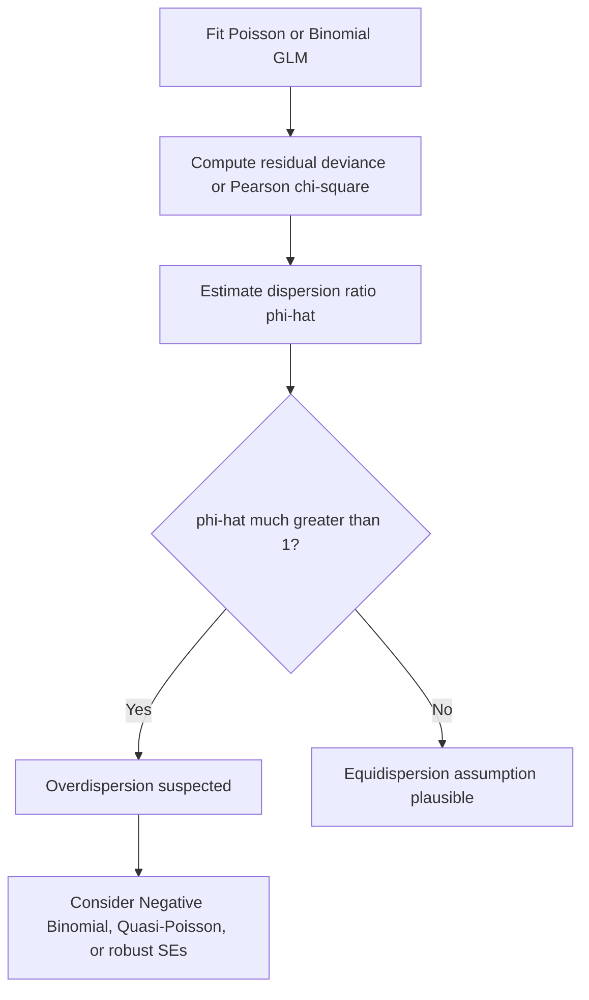

## Overdispersion

### Definition

Overdispersion occurs when the observed variance in a dataset exceeds what a specified statistical model predicts, based on its assumed mean-variance relationship. This concept is most commonly discussed in the context of Poisson and Binomial regression models, both of which impose a fixed, restrictive relationship between mean and variance.

This is a standard definition established in statistical theory, not an inference specific to any dataset.

### The Poisson Mean-Variance Assumption

The Poisson distribution assumes **equidispersion** — that the variance equals the mean:

$$\text{Var}(y) = E(y) = \mu$$

This is a defining mathematical property of the Poisson distribution, derivable directly from its exponential family form (as shown in the earlier session on exponential family distributions, where $a(\eta) = e^{\eta}$ and both the first and second derivatives of $a(\eta)$ equal $\lambda$).

When real count data has variance substantially greater than its mean, fitting a Poisson model to that data violates this built-in assumption, producing overdispersion.

### The Binomial Mean-Variance Assumption

Similarly, the Binomial distribution assumes:

$$\text{Var}(y) = n\mu(1-\mu)$$

Where $\mu$ is the success probability. When observed variance exceeds this quantity, the same overdispersion problem arises in logistic-type models.

### Consequences of Overdispersion

If overdispersion is present but not accounted for, several downstream problems can occur:

- **Underestimated standard errors**: parameter standard errors are computed assuming the Poisson/Binomial variance structure, so if true variance is higher, reported standard errors will be too small
- **Overstated statistical significance**: smaller standard errors mechanically produce smaller p-values, which can lead to incorrectly rejecting null hypotheses
- **Misleading confidence intervals**: intervals computed under the wrong variance assumption will be narrower than appropriate

[Inference] These consequences follow logically from the mathematical relationship between variance and standard error estimation in GLMs. This is a reasoned conclusion based on established statistical theory, not a confirmed empirical claim about any specific dataset or software implementation.

### Detecting Overdispersion

**Method 1: Deviance-to-degrees-of-freedom ratio**

As introduced in the prior session on deviance, one common diagnostic is:

$$\hat\phi = \frac{D}{n-p}$$

Where $D$ is the residual deviance, $n$ is the sample size, and $p$ is the number of estimated parameters. A ratio substantially greater than 1 is commonly cited in statistical literature as suggestive of overdispersion.

[Inference] This is a widely used heuristic in applied statistics, not a strict statistical test with guaranteed properties, and whether a specific ratio value indicates a real problem depends on context I cannot verify in the abstract.

**Method 2: Pearson chi-square statistic**

An alternative diagnostic uses the Pearson residuals instead of deviance residuals:

$$X^2 = \sum_{i=1}^{n} \frac{(y_i - \hat\mu_i)^2}{\hat\mu_i}$$

$$\hat\phi_{\text{Pearson}} = \frac{X^2}{n-p}$$

[Unverified] Whether the Pearson-based or deviance-based dispersion estimate is preferable in a given analysis is discussed differently across statistical sources, and I do not have access to information that would let me confirm a single universally preferred method.

**Method 3: Formal statistical tests**

Tests such as the score test for overdispersion (comparing a Poisson model against a Negative Binomial alternative) exist in the statistical literature. [Unverified] I cannot verify the specific implementation details or availability of such tests across different software packages without direct documentation access.

### Remedies for Overdispersion

**Negative Binomial Regression**

The Negative Binomial distribution introduces an additional dispersion parameter, allowing variance to exceed the mean:

$$\text{Var}(y) = \mu + \alpha\mu^2$$

Where $\alpha$ is an estimated dispersion parameter. When $\alpha = 0$, this reduces to the Poisson case. This is a standard mathematical extension documented in statistical literature on count data models.

[Inference] Negative Binomial regression is generally recommended in statistical literature as a remedy when overdispersion is detected in count data, because it directly models the excess variance rather than assuming it away. This is a reasoned recommendation based on the model's mathematical structure, not a claim that it is universally the correct choice for every overdispersed dataset — that depends on the specific data-generating process, which I cannot verify in the abstract.

**Quasi-Poisson Models**

An alternative approach retains the Poisson mean structure but relaxes the variance assumption by introducing a multiplicative dispersion parameter $\phi$:

$$\text{Var}(y) = \phi\mu$$

This does not change the point estimates of coefficients compared to standard Poisson regression, but inflates standard errors by a factor of $\sqrt{\hat\phi}$, correcting the understatement of uncertainty described above.

[Unverified] Whether coefficient point estimates are literally identical between Poisson and Quasi-Poisson fits in all software implementations is a detail I cannot confirm without checking specific documentation.

**Robust (Sandwich) Standard Errors**

A third approach keeps the Poisson model as specified but computes standard errors using a robust "sandwich" estimator that does not rely on the Poisson variance assumption being correct.

[Inference] This approach is often used as a computationally convenient alternative to re-specifying the model entirely, based on general statistical practice, but I cannot verify its adequacy for any specific dataset without direct analysis.

### Comparing Remedies

| Approach | Changes Point Estimates? | Adds Parameters? | Addresses Root Cause? |
|---|---|---|---|
| Quasi-Poisson | No | Yes (dispersion scalar) | Partially — corrects SEs only |
| Negative Binomial | Yes (potentially) | Yes (dispersion parameter) | Yes — models variance structure directly |
| Robust standard errors | No | No | Partially — corrects SEs only |

[Unverified] The relative merits of these three approaches are discussed differently across statistical sources, and selecting among them for a specific analysis depends on the nature of the overdispersion and the analytical goals, which I do not have information about in the abstract.

### Underdispersion

The reverse phenomenon, **underdispersion** (observed variance less than the mean), is less commonly encountered but is also documented in statistical literature. [Unverified] I do not have access to detailed comparative information about the relative frequency of underdispersion versus overdispersion across different applied domains. The Conway-Maxwell-Poisson distribution is one model sometimes cited as capable of handling both over- and underdispersion.

### Worked Example

**Example**

Suppose a Poisson regression modeling the number of customer support tickets per day yields:

- Residual deviance: 620
- Degrees of freedom: 310

$$\hat\phi = \frac{620}{310} = 2.0$$

This ratio suggests the observed variance is roughly double what the Poisson model assumes. [Inference] Based on the commonly cited heuristic described above, this would typically prompt an analyst to consider Negative Binomial regression or robust standard errors rather than proceeding with unadjusted Poisson output. Whether this specific numeric threshold would warrant action in a real analysis depends on the actual data and context, which I cannot verify in the abstract.

### Common Pitfalls

- Assuming overdispersion only affects Poisson models — [Unverified] Binomial/logistic models can also exhibit overdispersion (sometimes called extra-binomial variation), and I cannot confirm the relative prevalence of this issue across applied fields without direct source access
- Using Quasi-Poisson when the underlying data-generating process is better represented by Negative Binomial, or vice versa, without checking which assumption fits the data structure
- Ignoring overdispersion diagnostics entirely and reporting standard Poisson/Binomial standard errors without verification
- Assuming a dispersion ratio near 1 rules out all model misspecification — dispersion diagnostics address variance structure specifically, not other forms of misfit such as omitted variables or non-linearity

### **Related Topics**

- Negative Binomial regression — full derivation and parameter interpretation
- Zero-inflated and hurdle models for count data with excess zeros
- Quasi-likelihood estimation theory
- Robust and sandwich variance estimators in regression
- Score tests for overdispersion (e.g., Cameron-Trivedi test)
- Conway-Maxwell-Poisson distribution for flexible dispersion modeling
- Model selection between Poisson, Quasi-Poisson, and Negative Binomial using AIC/BIC