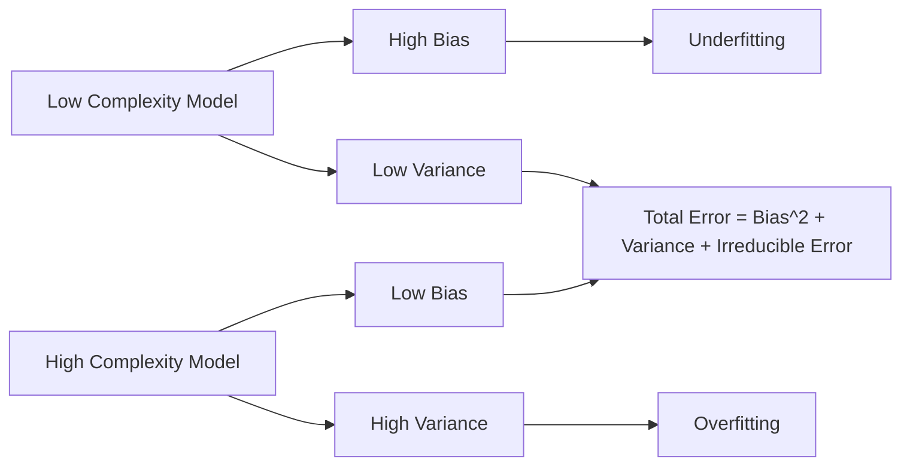

## Bias-Variance Tradeoff

### Definition

The bias-variance tradeoff is a foundational concept in statistical learning describing the decomposition of a model's expected prediction error into three components: bias, variance, and irreducible error. This decomposition is a standard mathematical result in statistical learning theory, not an inference specific to any dataset.

For a model predicting a target $y = f(x) + \epsilon$, where $\epsilon$ is random noise with mean 0 and variance $\sigma^2$, the expected squared prediction error at a point $x$ for a fitted model $\hat{f}(x)$ is:

$$E\left[(y - \hat{f}(x))^2\right] = \left(\text{Bias}[\hat{f}(x)]\right)^2 + \text{Var}[\hat{f}(x)] + \sigma^2$$

This is a standard algebraic decomposition derivable from the definitions of bias and variance, and is presented in most statistical learning textbooks in this form.

### Defining Bias

Bias measures the systematic difference between the average prediction of a model (across different training sets) and the true underlying function:

$$\text{Bias}[\hat{f}(x)] = E[\hat{f}(x)] - f(x)$$

High bias typically arises from models that are too simple to capture the true structure of the data — a phenomenon commonly referred to as **underfitting**.

### Defining Variance

Variance measures how much the model's predictions fluctuate across different training datasets drawn from the same underlying distribution:

$$\text{Var}[\hat{f}(x)] = E\left[\left(\hat{f}(x) - E[\hat{f}(x)]\right)^2\right]$$

High variance typically arises from models that are overly flexible and fit noise specific to the training data — a phenomenon commonly referred to as **overfitting**.

### Irreducible Error

The term $\sigma^2$ represents noise inherent to the data-generating process itself, which no model can reduce regardless of its specification. This is a defining property of the decomposition's mathematical structure, following from the assumption that $\epsilon$ has fixed variance $\sigma^2$ independent of $\hat{f}$.

### The Tradeoff Relationship

[Inference] As model complexity increases, bias tends to decrease while variance tends to increase, and vice versa — this is a commonly described pattern in statistical learning literature, reasoned from how flexible models can fit training data more closely (reducing bias) at the cost of sensitivity to the specific training sample (increasing variance). This is a generalized pattern described in the literature, not a confirmed property that holds identically for every model class or dataset, and I cannot verify how this tradeoff manifests for any specific unseen dataset without direct analysis.

### Visualizing the Tradeoff

<svg xmlns="http://www.w3.org/2000/svg" viewBox="0 0 800 460">
  <text x="400" y="30" text-anchor="middle" font-size="18" font-weight="bold" fill="#1a1a1a">Bias-Variance Tradeoff (svg_diagram)</text>

  <line x1="80" y1="400" x2="750" y2="400" stroke="#333" stroke-width="1.5" />
  <line x1="80" y1="400" x2="80" y2="60" stroke="#333" stroke-width="1.5" />
  <text x="415" y="435" text-anchor="middle" font-size="12" fill="#333">Model Complexity →</text>
  <text x="35" y="230" text-anchor="middle" font-size="12" fill="#333" transform="rotate(-90 35 230)">Error →</text>

  <path d="M 100 380 C 250 340, 350 300, 750 60" fill="none" stroke="#b91c1c" stroke-width="2.5" />
  <text x="600" y="100" font-size="12" fill="#b91c1c" font-weight="bold">Variance</text>

  <path d="M 100 80 C 250 150, 400 320, 750 380" fill="none" stroke="#1d4ed8" stroke-width="2.5" />
  <text x="600" y="360" font-size="12" fill="#1d4ed8" font-weight="bold">Bias^2</text>

  <path d="M 100 220 C 250 190, 350 170, 420 165 C 500 175, 600 220, 750 290" fill="none" stroke="#15803d" stroke-width="3" />
  <text x="450" y="150" font-size="12" fill="#15803d" font-weight="bold">Total Error</text>

  <line x1="380" y1="60" x2="380" y2="400" stroke="#888" stroke-width="1" stroke-dasharray="4,4" />
  <text x="380" y="420" text-anchor="middle" font-size="11" fill="#555">Optimal Complexity</text>

  <line x1="80" y1="340" x2="750" y2="340" stroke="#999" stroke-width="1" stroke-dasharray="2,3" />
  <text x="720" y="332" font-size="10" fill="#666">Irreducible Error</text>
</svg>

[Unverified] The exact shape of these curves (rate of increase/decrease, point of intersection) varies by model class, dataset, and problem, and I cannot confirm the specific curve shape for any real dataset without direct empirical analysis. This diagram illustrates the generalized conceptual pattern commonly presented in statistical learning literature, not a measured result from any specific data.

### Relationship to Model Complexity Choices

**Example**

Polynomial regression provides a common illustrative case:

- A degree-1 (linear) model fit to genuinely nonlinear data will typically exhibit high bias, since it cannot represent curvature in the true relationship
- A degree-15 polynomial fit to a small dataset will typically exhibit high variance, since it can fit noise patterns unique to the training sample
- A degree-3 or degree-4 model might balance these two error sources more effectively for data generated from a moderately nonlinear process

[Inference] This example illustrates the general conceptual pattern described in statistical learning literature. The specific optimal degree for any real dataset cannot be determined without direct cross-validation or similar empirical procedures on that data — I cannot verify what the "correct" complexity level would be without such analysis.

### Connection to GLMs Specifically

In the context of Generalized Linear Models, the bias-variance tradeoff manifests through choices such as:

- **Number and form of predictors included** — adding more predictors or higher-order terms (interactions, polynomial terms) tends to reduce bias but increase variance
- **Regularization strength** — in penalized GLMs (Ridge, Lasso, Elastic Net), the regularization parameter $\lambda$ directly controls this tradeoff by shrinking coefficients toward zero
- **Link function and distributional assumptions** — [Unverified] misspecifying the link function or exponential family distribution can introduce bias, though I do not have access to a general quantitative framework for how this specific type of misspecification trades off against variance across all cases

### Regularization as a Tradeoff Control Mechanism

In penalized regression, the objective function combines the negative log-likelihood with a penalty term:

$$\theta_{\text{ridge}} = \arg\min_\theta \left[-\ell(\theta) + \lambda\sum_{j=1}^p \theta_j^2\right]$$

As $\lambda$ increases:

- Coefficient estimates shrink toward zero, generally increasing bias
- The model becomes less sensitive to fluctuations in the training data, generally decreasing variance

[Inference] This relationship between $\lambda$ and the bias-variance tradeoff is a widely described property of Ridge regression in statistical learning literature, reasoned from the mathematical effect of the penalty term on coefficient magnitude. I cannot verify the specific optimal value of $\lambda$ for any given dataset without empirical validation such as cross-validation.

### Estimating Bias and Variance in Practice

Directly computing bias and variance requires knowledge of the true function $f(x)$, which is unavailable for real data. As a result, practitioners commonly use indirect empirical proxies:

- **Cross-validation error** — used as a proxy for total expected prediction error
- **Learning curves** — plotting training error and validation error against training set size or model complexity can suggest whether a model is in a high-bias or high-variance regime
- **Train-test gap** — a large gap between training and validation error is commonly interpreted as suggestive of high variance (overfitting), while high error on both is commonly interpreted as suggestive of high bias (underfitting)

[Inference] These are commonly used diagnostic heuristics described in applied statistical learning practice, not formal guarantees. Whether a specific train-test gap indicates overfitting for any particular dataset depends on factors I cannot verify without direct examination of that data.

### Common Pitfalls

- Treating the bias-variance tradeoff as a strict, universal law that applies identically to every model class — [Unverified] some modern machine learning literature discusses phenomena such as "double descent" that complicate this classical picture in certain high-capacity model settings, and I do not have sufficiently verified detail to describe this phenomenon's mechanics with confidence here
- Assuming lower training error always implies better model performance — training error does not account for variance/overfitting risk
- Selecting model complexity based on training error alone rather than validation or cross-validation error
- Assuming regularization always improves out-of-sample performance — [Inference] this depends on whether the added bias is outweighed by the reduction in variance for the specific dataset in question, which cannot be confirmed without empirical testing

### **Related Topics**

- Ridge, Lasso, and Elastic Net regularization for GLMs
- Cross-validation techniques for model selection and complexity tuning
- Learning curves as a diagnostic tool for bias vs. variance regimes
- Double descent phenomenon in high-capacity models
- Regularization path algorithms and hyperparameter tuning (grid search, random search)
- Ensemble methods (bagging, boosting) as variance/bias reduction strategies
- Model selection criteria (AIC, BIC, cross-validation) in the context of complexity control