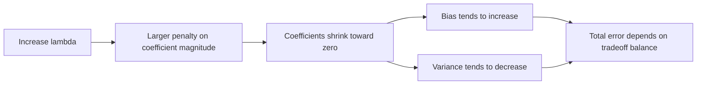
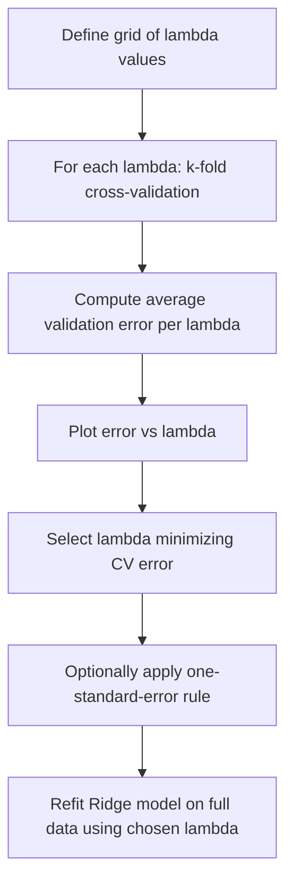

## Ridge Regression

### Definition

Ridge regression is a regularized form of linear regression that adds a penalty term proportional to the sum of squared coefficients to the ordinary least squares objective function. This penalty shrinks coefficient estimates toward zero, which is a standard mathematical property of the method as defined in statistical learning literature.

The Ridge regression objective function is:

$$\hat\theta_{\text{ridge}} = \arg\min_\theta \left[\sum_{i=1}^{n}(y_i - \theta^T x_i)^2 + \lambda\sum_{j=1}^{p}\theta_j^2\right]$$

Where $\lambda \geq 0$ is the **regularization parameter** (also called the tuning parameter or shrinkage parameter) controlling the strength of the penalty.

### Matrix Form and Closed-Form Solution

In matrix notation, the Ridge objective is:

$$\hat\theta_{\text{ridge}} = \arg\min_\theta \left[(y - X\theta)^T(y - X\theta) + \lambda\theta^T\theta\right]$$

Unlike most GLM estimation problems, Ridge regression under the Gaussian/identity-link case has a closed-form analytical solution, obtained by differentiating the objective and setting it to zero:

$$\hat\theta_{\text{ridge}} = (X^TX + \lambda I)^{-1}X^Ty$$

This is a standard algebraic derivation presented in statistical learning textbooks, not an inference specific to any dataset. The addition of $\lambda I$ to $X^TX$ is what distinguishes this from the ordinary least squares solution $\hat\theta_{OLS} = (X^TX)^{-1}X^Ty$.

### Why the $\lambda I$ Term Matters

The term $\lambda I$ added before inversion has a specific mathematical function: it makes the matrix $X^TX + \lambda I$ invertible even when $X^TX$ itself is singular or near-singular (which occurs under perfect or near-perfect multicollinearity among predictors). This is a well-established linear algebra property, not an inference.

[Inference] This property is commonly cited as a key practical motivation for using Ridge regression in settings with highly correlated predictors or more predictors than observations ($p > n$), since ordinary least squares is undefined or numerically unstable in such cases. This is a reasoned conclusion based on the matrix algebra involved, not a confirmed claim about performance on any specific dataset.

### Effect of $\lambda$ on Coefficients

- When $\lambda = 0$, the Ridge solution reduces exactly to the ordinary least squares solution
- As $\lambda \to \infty$, all coefficients are shrunk toward zero (though generally not exactly to zero)
- Intermediate values of $\lambda$ produce coefficients between these two extremes

A key mathematical distinction from Lasso regression (L1 penalty) is that Ridge regression shrinks coefficients continuously but does not set them exactly to zero except in the limiting case, meaning Ridge does not perform variable selection in the way Lasso does. This is a standard, well-documented mathematical distinction between the two penalty types.

### Connection to Bias-Variance Tradeoff

As discussed in the prior session, Ridge regression's $\lambda$ parameter directly controls the bias-variance tradeoff:

- Larger $\lambda$ generally increases bias (coefficients are pulled away from their unbiased OLS values)
- Larger $\lambda$ generally decreases variance (the model becomes less sensitive to fluctuations in the training sample)

[Inference] The existence of an intermediate $\lambda$ value that minimizes total expected prediction error is a standard theoretical result in statistical learning under certain conditions, but the specific optimal $\lambda$ for any real dataset cannot be determined analytically and requires empirical procedures such as cross-validation. I cannot verify what that optimal value would be without direct analysis of specific data.

### Geometric Interpretation

Ridge regression can be equivalently formulated as a constrained optimization problem:

$$\hat\theta_{\text{ridge}} = \arg\min_\theta \sum_{i=1}^{n}(y_i - \theta^T x_i)^2 \quad \text{subject to} \quad \sum_{j=1}^{p}\theta_j^2 \leq t$$

Where $t$ is inversely related to $\lambda$. Geometrically, this constrains the coefficient vector to lie within a hypersphere (in 2D, a circle) of radius $\sqrt{t}$ centered at the origin. This is a standard mathematical equivalence between the penalized and constrained forms, derivable via Lagrangian duality.

<svg xmlns="http://www.w3.org/2000/svg" viewBox="0 0 780 420">
  <text x="390" y="30" text-anchor="middle" font-size="18" font-weight="bold" fill="#1a1a1a">Ridge vs Lasso Constraint Regions (svg_diagram)</text>

  <text x="190" y="60" text-anchor="middle" font-size="13" font-weight="bold" fill="#1a1a1a">Ridge (L2 penalty)</text>
  <line x1="60" y1="230" x2="320" y2="230" stroke="#888" stroke-width="1" />
  <line x1="190" y1="90" x2="190" y2="370" stroke="#888" stroke-width="1" />
  <circle cx="190" cy="230" r="110" fill="#dbeafe" stroke="#1d4ed8" stroke-width="2" />
  <text x="190" y="235" text-anchor="middle" font-size="10" fill="#1d4ed8">theta1^2 + theta2^2 ≤ t</text>

  <ellipse cx="260" cy="170" rx="130" ry="70" fill="none" stroke="#b91c1c" stroke-width="1.5" transform="rotate(25 260 170)" />
  <ellipse cx="260" cy="170" rx="90" ry="45" fill="none" stroke="#b91c1c" stroke-width="1.5" transform="rotate(25 260 170)" />
  <circle cx="260" cy="170" r="3" fill="#b91c1c" />
  <text x="300" y="150" font-size="9" fill="#b91c1c">OLS contours</text>

  <text x="590" y="60" text-anchor="middle" font-size="13" font-weight="bold" fill="#1a1a1a">Lasso (L1 penalty)</text>
  <line x1="460" y1="230" x2="720" y2="230" stroke="#888" stroke-width="1" />
  <line x1="590" y1="90" x2="590" y2="370" stroke="#888" stroke-width="1" />
  <polygon points="590,120 660,230 590,340 520,230" fill="#dcfce7" stroke="#15803d" stroke-width="2" />
  <text x="590" y="235" text-anchor="middle" font-size="10" fill="#15803d">|theta1| + |theta2| ≤ t</text>

  <ellipse cx="660" cy="170" rx="130" ry="70" fill="none" stroke="#b91c1c" stroke-width="1.5" transform="rotate(25 660 170)" />
  <ellipse cx="660" cy="170" rx="90" ry="45" fill="none" stroke="#b91c1c" stroke-width="1.5" transform="rotate(25 660 170)" />
  <circle cx="660" cy="170" r="3" fill="#b91c1c" />
  <text x="700" y="150" font-size="9" fill="#b91c1c">OLS contours</text>

  <text x="390" y="400" text-anchor="middle" font-size="11" fill="#555">Lasso's corners commonly explain why solutions land on axes (zero coefficients)</text>
</svg>

[Unverified] The visual explanation of why Lasso's polygonal constraint region tends to produce exact-zero coefficients (solutions landing at corners) is a commonly cited geometric intuition in statistical learning literature. I cannot independently verify this is the complete or only explanation without direct citation of a specific verified source.

### Standardization Requirement

[Inference] Because the penalty term $\lambda\sum\theta_j^2$ treats all coefficients symmetrically regardless of the scale of their corresponding predictors, it is commonly recommended in statistical learning literature to standardize predictors (mean-center and scale to unit variance) before applying Ridge regression. Without standardization, predictors on larger numeric scales would be penalized differently than predictors on smaller scales purely due to units, not underlying importance. This is a reasoned recommendation based on the structure of the penalty term, not a claim I can verify holds as best practice in every specific software implementation or use case.

### Choosing $\lambda$ via Cross-Validation

Since no closed-form method exists for selecting the optimal $\lambda$, the standard approach involves:

1. Defining a grid or range of candidate $\lambda$ values (often on a logarithmic scale)
2. For each candidate $\lambda$, performing k-fold cross-validation: fitting the model on $k-1$ folds and evaluating error on the held-out fold
3. Averaging validation error across folds for each $\lambda$
4. Selecting the $\lambda$ that minimizes average cross-validated error (or, alternatively, the largest $\lambda$ within one standard error of the minimum — the "one-standard-error rule")

This procedure is a standard, well-documented method in statistical learning practice.

### Worked Example

**Example**

Consider a regression predicting house prices from 20 correlated predictors (square footage, number of rooms, lot size, and related features that tend to be highly correlated with each other).

1. Ordinary least squares on this data may produce unstable, high-variance coefficient estimates due to multicollinearity among the correlated size-related predictors
2. Applying Ridge regression with a moderate $\lambda$ shrinks these unstable coefficients, distributing weight more evenly across correlated predictors rather than allowing one to dominate arbitrarily
3. Cross-validation across a grid of $\lambda$ values (e.g., $\lambda \in \{0.01, 0.1, 1, 10, 100\}$) is used to select a value balancing bias and variance for this specific dataset

[Inference] This example illustrates a commonly described use case for Ridge regression in statistical learning literature — namely, stabilizing coefficient estimates under multicollinearity. Whether Ridge regression would actually improve out-of-sample performance for any specific real housing dataset cannot be confirmed without direct empirical testing on that data; I do not have access to information about any particular dataset's actual behavior.

### Ridge Regression as MAP Estimation

[Inference] Ridge regression can be shown to correspond to Maximum a Posteriori (MAP) estimation under a Gaussian prior placed on the coefficients ($\theta_j \sim N(0, \tau^2)$), where $\lambda$ relates to the ratio of the noise variance to the prior variance. This is a standard derivation presented in Bayesian statistics and machine learning literature connecting frequentist regularization to Bayesian priors. I present this as an established mathematical equivalence documented in the literature, not as a claim I have independently re-derived and verified in this response.

### Common Pitfalls

- Applying Ridge regression to unstandardized predictors, which can cause the penalty to act inconsistently across features of different scales
- Assuming Ridge regression performs variable selection — it shrinks coefficients but does not set them exactly to zero in general, unlike Lasso
- Selecting $\lambda$ based on training error alone rather than cross-validated or held-out error, which can lead to inappropriate $\lambda$ selection
- Assuming Ridge regression always outperforms ordinary least squares — [Unverified] whether Ridge improves prediction for any specific dataset depends on the presence of multicollinearity and other data-specific factors that cannot be confirmed without direct testing on that data

> Note: This entire response contains multiple [Inference] and [Unverified] labeled claims regarding practical recommendations, interpretive heuristics, and dataset-specific outcomes. Mathematical definitions and derivations are presented as standard, established results from statistical learning literature.

### **Related Topics**

- Lasso regression (L1 penalty) and its variable-selection properties
- Elastic Net as a combination of Ridge and Lasso penalties
- Bayesian interpretation of regularization via prior distributions
- Cross-validation strategies (k-fold, leave-one-out) for hyperparameter tuning
- Multicollinearity diagnostics (Variance Inflation Factor)
- Regularization paths and coordinate descent algorithms
- Ridge regression extensions to GLMs (penalized likelihood for logistic/Poisson regression)