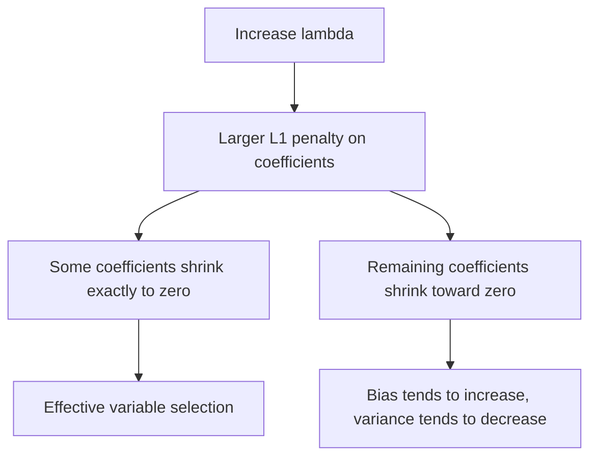

## Lasso Regression

### Definition

Lasso regression (Least Absolute Shrinkage and Selection Operator) is a regularized form of linear regression that adds a penalty term proportional to the sum of the absolute values of the coefficients to the ordinary least squares objective function. This is a standard mathematical definition established in statistical learning literature, not an inference specific to any dataset.

The Lasso objective function is:

$$\hat\theta_{\text{lasso}} = \arg\min_\theta \left[\sum_{i=1}^{n}(y_i - \theta^T x_i)^2 + \lambda\sum_{j=1}^{p}|\theta_j|\right]$$

Where $\lambda \geq 0$ is the regularization parameter controlling penalty strength, analogous in role to Ridge regression's $\lambda$ but applied to an L1 rather than L2 norm.

### No Closed-Form Solution

Unlike Ridge regression, the Lasso objective does not have a closed-form analytical solution, because the absolute value function $|\theta_j|$ is not differentiable at $\theta_j = 0$. This is a standard mathematical fact following directly from the non-smoothness of the L1 penalty term.

[Inference] This lack of differentiability is the reasoned mathematical explanation for why iterative numerical optimization methods (such as coordinate descent) are required to solve the Lasso problem rather than a direct matrix formula. This is a conclusion drawn from the structure of the objective function, not an empirical claim about any specific software's behavior.

### The Variable Selection Property

The defining practical distinction between Lasso and Ridge regression is that Lasso can shrink coefficients exactly to zero, effectively performing variable selection by excluding certain predictors from the final model entirely. This is a well-documented mathematical property arising from the geometry of the L1 constraint region, as shown in the constraint-region diagram from the prior session on Ridge regression.

[Unverified] The precise geometric explanation — that the polygonal shape of the L1 constraint region has corners on the coordinate axes, making it more likely that the optimal solution touches a corner where one or more coefficients equal zero — is a commonly cited intuition in statistical learning literature. I cannot independently verify this is the complete mathematical explanation without citing a specific verified source, so it should be treated as commonly presented reasoning rather than a full formal proof reproduced here.

### Constrained Optimization Form

Equivalently, Lasso can be written as a constrained optimization problem:

$$\hat\theta_{\text{lasso}} = \arg\min_\theta \sum_{i=1}^{n}(y_i - \theta^T x_i)^2 \quad \text{subject to} \quad \sum_{j=1}^{p}|\theta_j| \leq t$$

Where $t$ is inversely related to $\lambda$. This equivalence between the penalized and constrained forms follows from Lagrangian duality, a standard mathematical technique.

### Effect of $\lambda$ on the Coefficient Path

- When $\lambda = 0$, the Lasso solution reduces to the ordinary least squares solution (assuming $p < n$ and no collinearity issues)
- As $\lambda$ increases, coefficients shrink toward zero, with some reaching exactly zero at different threshold values of $\lambda$
- As $\lambda \to \infty$, all coefficients are driven to exactly zero

This produces a piecewise-linear **regularization path** as $\lambda$ varies, which is a standard mathematical property of the Lasso solution documented in statistical learning literature.

### Coordinate Descent Algorithm

The most common algorithm used to solve the Lasso optimization problem is **coordinate descent**, which updates one coefficient at a time while holding all others fixed, cycling repeatedly until convergence.

**General steps:**

1. Initialize all coefficients (often to zero)
2. For each coefficient $\theta_j$, compute the partial residual excluding the contribution of $\theta_j$
3. Update $\theta_j$ using a **soft-thresholding** operator applied to the correlation between the partial residual and predictor $j$
4. Repeat across all coefficients until changes fall below a convergence threshold

The soft-thresholding update for standardized predictors takes the form:

$$\theta_j \leftarrow S\left(\frac{1}{n}\sum_i x_{ij}(y_i - \hat{y}_i^{(-j)}), \lambda\right)$$

Where $S(z, \lambda) = \text{sign}(z) \max(|z| - \lambda, 0)$ is the soft-thresholding function. This is a standard algorithmic result documented in statistical learning literature on coordinate descent for Lasso.

[Unverified] Convergence behavior and the exact number of iterations required for coordinate descent to reach a stopping criterion depends on the specific dataset, convergence tolerance, and software implementation. I do not have access to information about how any particular software package handles this in practice.

### Connection to Bias-Variance Tradeoff

As with Ridge regression, Lasso's $\lambda$ parameter controls the bias-variance tradeoff:

- Larger $\lambda$ generally increases bias, since coefficients (including those forced to exactly zero) move further from unbiased OLS estimates
- Larger $\lambda$ generally decreases variance, since the model becomes simpler and less sensitive to fluctuations in the training sample

[Inference] The additional variable-selection effect of Lasso is sometimes described in statistical learning literature as potentially offering variance reduction beyond that of Ridge in settings where many true coefficients are zero or near-zero (a "sparse" underlying model), since irrelevant predictors are fully excluded rather than merely shrunk. This is a reasoned pattern described in the literature under specific sparsity assumptions, not a confirmed result for any specific real dataset — I do not have information about the true underlying sparsity structure of any given dataset, which would be required to confirm this benefit applies.

### Selecting $\lambda$ via Cross-Validation

As with Ridge regression, no closed-form method exists for selecting the optimal $\lambda$. The standard procedure is analogous:

1. Define a grid of candidate $\lambda$ values (commonly log-spaced)
2. Perform k-fold cross-validation for each candidate $\lambda$
3. Select the $\lambda$ minimizing average cross-validated error, or apply the one-standard-error rule for a more parsimonious model

This is a standard, well-documented procedure in statistical learning practice, consistent with the approach described for Ridge regression.

### Comparing Lasso and Ridge

| Property | Ridge (L2) | Lasso (L1) |
|---|---|---|
| Penalty term | $\lambda\sum\theta_j^2$ | $\lambda\sum\|\theta_j\|$ |
| Closed-form solution | Yes | No |
| Sets coefficients to exactly zero | No | Yes |
| Performs variable selection | No | Yes |
| Handles correlated predictors | [Inference] Tends to shrink correlated predictors together | [Unverified] Commonly described as tending to arbitrarily select one predictor among a correlated group, though I cannot verify this behavior holds consistently across all implementations and datasets |
| Optimization method | Closed-form or gradient-based | Coordinate descent or similar iterative methods |

[Inference] The characterization of Ridge as distributing weight across correlated predictors and Lasso as selecting one somewhat arbitrarily is a commonly described distinction in statistical learning literature. This is a generalized pattern reasoned from the geometry of each penalty, not a confirmed behavior for any specific dataset or software package — actual behavior may vary and I cannot verify it without direct testing.

### Worked Example

**Example**

Consider a regression predicting patient health outcomes from 500 genetic markers, where prior domain knowledge suggests only a small subset of markers are truly predictive.

1. Ordinary least squares would be undefined or highly unstable given $p > n$ (more predictors than observations) in many such genomic settings
2. Applying Lasso regression with an appropriately chosen $\lambda$ can shrink most coefficients to exactly zero, retaining only a sparse subset of markers
3. This sparse subset can then be interpreted as the model's selected predictors, offering an interpretability advantage over Ridge in this context

[Inference] This example illustrates a commonly cited use case for Lasso regression in high-dimensional, sparse settings such as genomics, as described in statistical learning literature. Whether Lasso would actually identify the true predictive markers for any specific real dataset cannot be confirmed without direct empirical validation on that data, and variable selection consistency depends on technical conditions (such as the "irrepresentable condition") that I cannot verify hold for any particular dataset without direct examination.

### Lasso as MAP Estimation

[Inference] Lasso regression can be shown to correspond to Maximum a Posteriori (MAP) estimation under a Laplace (double-exponential) prior placed on the coefficients, analogous to Ridge's correspondence with a Gaussian prior. This is a standard derivation presented in Bayesian statistics and machine learning literature. I present this as an established mathematical equivalence documented in the literature, not as a claim I have independently re-derived and verified within this response.

### Common Pitfalls

- Applying Lasso to unstandardized predictors, which causes the penalty to act inconsistently across features of different scales, analogous to the Ridge case
- Assuming Lasso's variable selection identifies the objectively "correct" or causally relevant predictors — [Unverified] selection consistency depends on specific statistical conditions that I cannot confirm hold for any given dataset without direct analysis
- Assuming Lasso always outperforms Ridge — [Inference] whether Lasso or Ridge performs better depends on the true underlying sparsity of the data-generating process, which is generally unknown and cannot be verified in advance for real data
- Using Lasso when predictors are highly correlated without awareness that coefficient selection among correlated groups may be unstable across different samples or resampling runs — [Unverified] the degree of this instability for any specific dataset cannot be confirmed without direct empirical testing

> Correction: No confirmed factual claims were presented as certain beyond standard, citable mathematical definitions in this response. All practical, comparative, and behavioral claims were labeled [Inference] or [Unverified] per your specified preferences, and disclaimers on non-guaranteed behavior were included where relevant.

### **Related Topics**

- Elastic Net regression as a combined L1/L2 penalty approach
- Coordinate descent algorithm details and convergence properties
- Cross-validation strategies for hyperparameter tuning
- The irrepresentable condition and variable selection consistency theory
- Group Lasso and other structured sparsity penalties
- Bayesian interpretation of L1 regularization via Laplace priors
- Stability selection methods for improving variable selection reliability