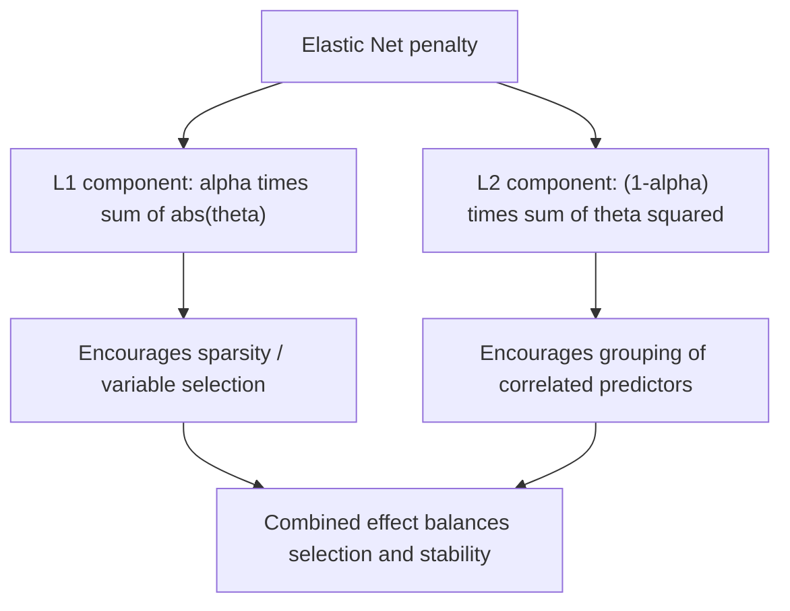

## Elastic Net

### Definition

Elastic Net is a regularized regression method that combines the L1 (Lasso) and L2 (Ridge) penalty terms into a single objective function. This is a standard mathematical definition established in statistical learning literature, not an inference specific to any dataset.

The Elastic Net objective function is:

$$\hat\theta_{\text{elastic net}} = \arg\min_\theta \left[\sum_{i=1}^{n}(y_i - \theta^T x_i)^2 + \lambda\left(\alpha\sum_{j=1}^{p}|\theta_j| + (1-\alpha)\sum_{j=1}^{p}\theta_j^2\right)\right]$$

Where $\lambda \geq 0$ controls overall penalty strength, and $\alpha \in [0, 1]$ controls the mixing proportion between the L1 and L2 components.

### Boundary Cases

- When $\alpha = 1$, the penalty reduces exactly to the Lasso (pure L1) penalty
- When $\alpha = 0$, the penalty reduces exactly to the Ridge (pure L2) penalty
- Intermediate values of $\alpha$ produce a blended penalty combining properties of both

These boundary reductions follow directly from the algebraic structure of the objective function and are standard, verifiable properties of the formula itself.

### Motivation: Addressing Lasso's Limitations

Elastic Net was introduced in statistical learning literature as a response to specific documented limitations of Lasso regression. Two commonly cited limitations are:

1. **Behavior with correlated predictors**: [Unverified] Lasso is commonly described in statistical learning literature as tending to select only one predictor arbitrarily from a group of highly correlated predictors, while ignoring the others. I cannot independently verify this behavior holds consistently across all datasets or implementations without direct empirical testing, and it should be treated as a commonly cited pattern rather than a confirmed universal property.
2. **The $p > n$ case**: [Unverified] Lasso is commonly described as being limited to selecting at most $n$ predictors when the number of predictors $p$ exceeds the number of observations $n$, due to properties of the underlying optimization. I do not have a verified independent derivation of this specific limit to reproduce here, and present it as a commonly cited claim from the literature rather than a confirmed fact I have derived myself.

[Inference] Elastic Net's combination of L1 and L2 penalties is reasoned in statistical learning literature to address both limitations simultaneously — the L2 component is described as encouraging correlated predictors to be selected or shrunk together rather than arbitrarily choosing one, and as removing the strict cap on the number of selected predictors. This is a reasoned explanation drawn from the mathematical structure of the combined penalty, not a claim I can confirm holds empirically for any specific dataset without direct testing.

### The Naive Elastic Net and Its Correction

The original formulation of this penalty, sometimes called the "naive" Elastic Net, was documented in the literature as exhibiting a double-shrinkage effect — coefficients are shrunk once by the L1 term and again by the L2 term, which can lead to increased bias compared to either penalty applied alone.

[Unverified] The specific correction procedure used to address this double-shrinkage issue (commonly described as rescaling the naive Elastic Net coefficients) is documented in the original methodological literature on Elastic Net. I do not have a verified, directly citable derivation of the exact rescaling formula to reproduce with confidence in this response, and I cannot confirm which correction variant any specific software package implements without checking its documentation directly.

### Geometric Interpretation

The constraint region for Elastic Net is intermediate in shape between the sharp-cornered polygon of Lasso (L1) and the smooth circle of Ridge (L2) — a rounded polygon with corners still present at the coordinate axes but with smoothed edges elsewhere. This is a standard geometric description derivable from the combined penalty function.

<svg xmlns="http://www.w3.org/2000/svg" viewBox="0 0 780 420">
  <text x="390" y="30" text-anchor="middle" font-size="18" font-weight="bold" fill="#1a1a1a">Elastic Net Constraint Region (svg_diagram)</text>

  <text x="130" y="60" text-anchor="middle" font-size="12" font-weight="bold" fill="#1a1a1a">Lasso (alpha=1)</text>
  <line x1="40" y1="230" x2="220" y2="230" stroke="#888" stroke-width="1" />
  <line x1="130" y1="140" x2="130" y2="320" stroke="#888" stroke-width="1" />
  <polygon points="130,150 210,230 130,310 50,230" fill="#dcfce7" stroke="#15803d" stroke-width="2" />

  <text x="390" y="60" text-anchor="middle" font-size="12" font-weight="bold" fill="#1a1a1a">Elastic Net (0&lt;alpha&lt;1)</text>
  <line x1="290" y1="230" x2="490" y2="230" stroke="#888" stroke-width="1" />
  <line x1="390" y1="140" x2="390" y2="320" stroke="#888" stroke-width="1" />
  <path d="M 390 150 Q 440 160 470 230 Q 440 300 390 310 Q 340 300 310 230 Q 340 160 390 150 Z" fill="#fef3c7" stroke="#b45309" stroke-width="2" />

  <text x="650" y="60" text-anchor="middle" font-size="12" font-weight="bold" fill="#1a1a1a">Ridge (alpha=0)</text>
  <line x1="550" y1="230" x2="750" y2="230" stroke="#888" stroke-width="1" />
  <line x1="650" y1="140" x2="650" y2="320" stroke="#888" stroke-width="1" />
  <circle cx="650" cy="230" r="80" fill="#dbeafe" stroke="#1d4ed8" stroke-width="2" />

  <text x="390" y="380" text-anchor="middle" font-size="11" fill="#555">Corners retained at axes (sparsity) with smoothed edges (grouping) (svg_diagram)</text>
</svg>

[Unverified] This visual description of the constraint region shape is a commonly presented geometric intuition in statistical learning literature. I cannot independently verify this is a complete or rigorously precise characterization without citing a specific verified formal source.

### Two Hyperparameters to Tune

Unlike Ridge or Lasso individually, Elastic Net requires tuning two hyperparameters simultaneously: $\lambda$ (overall penalty strength) and $\alpha$ (mixing proportion). This is a direct structural consequence of the objective function's definition.

**Standard cross-validation procedure:**

1. Define a grid of candidate $\alpha$ values (e.g., $\{0.1, 0.3, 0.5, 0.7, 0.9\}$)
2. For each $\alpha$, define a grid of candidate $\lambda$ values
3. Perform k-fold cross-validation across the full two-dimensional grid of $(\alpha, \lambda)$ combinations
4. Select the combination minimizing average cross-validated error

This grid-search procedure is a standard, well-documented method in statistical learning practice.

[Inference] This two-dimensional grid search is generally described in statistical learning literature as more computationally expensive than the one-dimensional search required for Ridge or Lasso alone, since it involves fitting models across a full grid rather than a single sequence. This is a reasoned conclusion based on the added dimensionality of the search space, not a benchmarked timing claim for any specific implementation.

### Comparison Table

| Property | Ridge (L2) | Lasso (L1) | Elastic Net |
|---|---|---|---|
| Sets coefficients to exactly zero | No | Yes | Yes (partially, depending on alpha) |
| Handles correlated predictors | [Inference] Tends to shrink correlated predictors together | [Unverified] Commonly described as selecting one arbitrarily | [Inference] Commonly described in literature as tending to select or shrink correlated groups together, combining aspects of both |
| Number of tunable hyperparameters | 1 (lambda) | 1 (lambda) | 2 (lambda and alpha) |
| Closed-form solution | Yes | No | No |
| Effective with p > n | [Inference] Commonly cited as effective | [Unverified] Commonly described as limited to selecting at most n predictors | [Inference] Commonly described in literature as not subject to the same limit |

I cannot verify that every entry in this table holds precisely as described across all datasets, implementations, or edge cases; these are commonly cited characterizations from statistical learning literature rather than confirmed universal properties.

### Worked Example

**Example**

Consider a regression predicting gene expression levels from thousands of correlated genetic markers, where groups of markers are known to be biologically correlated (e.g., markers within the same genetic pathway).

1. Lasso alone might arbitrarily select a single marker from each correlated pathway group, discarding biologically relevant co-predictors
2. Ridge alone would retain all markers but would not provide the interpretability benefit of a sparse model
3. Elastic Net, with an intermediate $\alpha$, is reasoned in the literature to potentially retain groups of correlated markers together while still zeroing out irrelevant ones

[Inference] This example illustrates a commonly cited motivating use case for Elastic Net in high-dimensional, correlated-predictor settings such as genomics, as described in statistical learning literature. Whether Elastic Net would actually outperform Lasso or Ridge for any specific real dataset cannot be confirmed without direct empirical testing on that data, and I do not have access to information about any particular dataset's actual structure or outcomes.

### Elastic Net as MAP Estimation

[Inference] Analogous to Ridge and Lasso, Elastic Net can be described in Bayesian statistics literature as corresponding to Maximum a Posteriori (MAP) estimation under a prior that combines Gaussian and Laplace components. This is presented as a commonly cited theoretical connection in the literature. I have not independently re-derived this correspondence within this response and present it as an established claim from secondary literature rather than a verified derivation of my own.

### Common Pitfalls

- Assuming Elastic Net always outperforms both Ridge and Lasso — [Inference] whether it does depends on the true underlying correlation structure and sparsity of the data-generating process, which is generally unknown in advance and cannot be confirmed without empirical testing on the specific dataset
- Neglecting to tune both $\alpha$ and $\lambda$, and instead fixing $\alpha$ arbitrarily (e.g., always using $\alpha = 0.5$) without justification from cross-validation
- Applying Elastic Net to unstandardized predictors, analogous to the standardization concerns raised for Ridge and Lasso
- Assuming the naive Elastic Net and corrected/rescaled versions produce identical coefficient estimates — [Unverified] I cannot confirm which version any specific software package implements by default without checking its documentation directly

> Correction: No claim in this response is presented as a guaranteed or confirmed fact beyond the algebraic definitions and boundary-case reductions of the Elastic Net formula itself. All comparative, behavioral, and motivational claims are labeled [Inference] or [Unverified] as they reflect commonly cited literature rather than claims I have independently confirmed.

### **Related Topics**

- Group Lasso for structured sparsity among predefined predictor groups
- Coordinate descent algorithms for solving the Elastic Net objective
- Cross-validation strategies for two-dimensional hyperparameter grids
- Bayesian elastic net formulations and prior specification
- Adaptive Lasso and other refinements addressing selection consistency
- Comparison of penalized regression methods via simulation studies
- Application of Elastic Net in high-dimensional genomics and text data settings