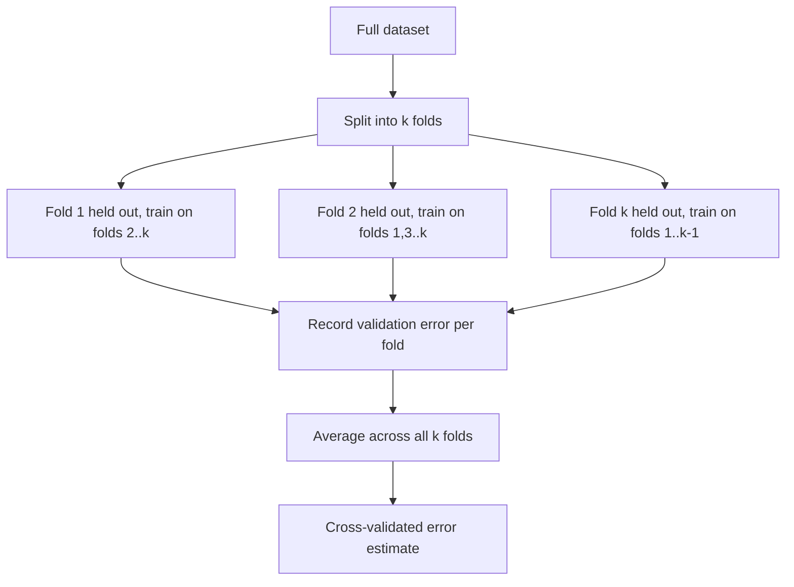
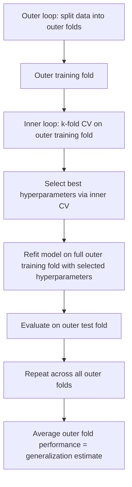

## Cross-Validation for Model Selection

### Definition

Cross-validation is a resampling technique used to estimate how well a statistical or machine learning model will generalize to independent data not used during model fitting. This is a standard methodological definition established in statistical learning literature, not an inference specific to any dataset.

The general principle involves repeatedly partitioning available data into training and validation subsets, fitting the model on the training subset, and evaluating its performance on the held-out validation subset. This process is repeated across multiple partitions, and results are aggregated to produce a more stable estimate of out-of-sample performance than a single train-test split would provide.

### Why Cross-Validation Is Needed

Training error alone is a poor estimate of out-of-sample performance, because a model evaluated on the same data used to fit it will generally appear to perform better than it would on new, unseen data. This tendency follows from the bias-variance tradeoff concepts discussed in the earlier session on that topic — a sufficiently flexible model can fit training data closely, including its noise, without that fit necessarily generalizing.

[Inference] Cross-validation is widely used in statistical learning practice as a way to approximate out-of-sample error without requiring a genuinely separate dataset that would otherwise need to be held back entirely. This is a reasoned methodological justification drawn from the widely documented purpose of the technique in statistical learning literature, not a confirmed guarantee that cross-validation will produce an accurate estimate for any specific dataset.

### k-Fold Cross-Validation

The most commonly used form of cross-validation is **k-fold cross-validation**, involving the following steps:

1. Randomly partition the dataset into $k$ roughly equal-sized folds
2. For each fold $i \in \{1, ..., k\}$: train the model on the remaining $k-1$ folds, then evaluate it on fold $i$
3. Record the validation error for each fold
4. Average the $k$ validation errors to produce the cross-validated error estimate

$$CV_{(k)} = \frac{1}{k}\sum_{i=1}^{k} \text{Error}_i$$

This procedure is a standard, well-documented method in statistical learning practice.

### Common Choices of $k$

- **$k = 5$ or $k = 10$**: [Inference] these values are commonly recommended in statistical learning literature as offering a reasonable balance between computational cost and estimate reliability. I cannot verify this recommendation holds optimally for any specific dataset without direct empirical testing, and the appropriateness of any particular $k$ depends on dataset size and other factors I do not have information about in the abstract.
- **Leave-One-Out Cross-Validation (LOOCV)**: the special case where $k = n$ (each fold contains exactly one observation)

### Leave-One-Out Cross-Validation

LOOCV trains the model $n$ times, each time leaving out exactly one observation for validation:

$$CV_{(n)} = \frac{1}{n}\sum_{i=1}^{n} \text{Error}_i$$

[Inference] LOOCV is commonly described in statistical learning literature as producing a nearly unbiased estimate of out-of-sample error, since each training set is nearly the full size of the original data. However, it is also commonly described as potentially exhibiting high variance across different datasets, because the $n$ training sets are highly overlapping and correlated with one another. These are reasoned characterizations drawn from commonly cited statistical learning literature, not confirmed properties I have independently derived or verified for any specific dataset.

[Unverified] The relative computational cost of LOOCV compared to k-fold cross-validation depends on the model class; for ordinary least squares regression specifically, closed-form shortcuts avoiding full refitting are documented in some statistical literature, but I cannot verify whether any specific software package implements such a shortcut without checking its documentation directly.

### Bias-Variance Tradeoff in the Choice of $k$

[Inference] Statistical learning literature commonly describes a tradeoff in choosing $k$: smaller values of $k$ (e.g., $k=5$) use less data per training fold, which is described as tending to increase bias in the error estimate, while larger values of $k$ (approaching LOOCV) are described as tending to increase variance in the error estimate due to higher correlation between training sets. This is a reasoned pattern drawn from the literature, not a confirmed mathematical guarantee holding identically across all model classes and datasets, and I cannot verify its magnitude for any specific case without direct testing.

### Cross-Validation for Hyperparameter Tuning

As referenced in the prior sessions on Ridge, Lasso, and Elastic Net regression, cross-validation is the standard method for selecting regularization hyperparameters such as $\lambda$ and $\alpha$:

1. Define a grid of candidate hyperparameter values
2. Compute the cross-validated error for each candidate
3. Select the hyperparameter value(s) minimizing average cross-validated error, or apply the one-standard-error rule for a more parsimonious model

**The one-standard-error rule:**

$$\lambda_{\text{1se}} = \max\{\lambda : CV(\lambda) \leq CV(\lambda_{\min}) + SE(\lambda_{\min})\}$$

This selects the simplest model (largest $\lambda$, generally corresponding to a smaller or more shrunk model) whose cross-validated error is within one standard error of the minimum observed error. This rule is a standard, documented convention in statistical learning practice, though [Unverified] whether it is universally preferred over simply selecting the minimum-error hyperparameter is discussed differently across different statistical sources.

### Nested Cross-Validation

When both model selection (e.g., choosing between model types or hyperparameters) and performance estimation are required, a single layer of cross-validation can produce an optimistic performance estimate if the same folds are used for both purposes.

[Inference] **Nested cross-validation** is commonly recommended in statistical learning literature to address this issue: an outer loop estimates generalization performance, while an inner loop (performed independently within each outer training fold) handles hyperparameter selection. This is a reasoned methodological recommendation drawn from commonly cited literature addressing selection bias in performance estimation, not a claim I can confirm is necessary or sufficient for every specific modeling scenario without direct examination of that scenario.

### Cross-Validation in the GLM Context

Cross-validation applies directly to Generalized Linear Models, with the choice of error metric adapted to the assumed exponential family distribution:

| Model Type | Common CV Error Metric |
|---|---|
| Gaussian GLM (linear regression) | Mean squared error |
| Binomial GLM (logistic regression) | Deviance, log-loss, or classification accuracy/AUC |
| Poisson GLM | Deviance or mean Poisson deviance |

[Unverified] The specific choice of error metric for cross-validating a given GLM is discussed differently across statistical sources depending on the analytical goal (e.g., prediction accuracy versus calibration), and I cannot confirm a single universally preferred metric without more specific context about the goals of a particular analysis.

### Stratified Cross-Validation

For classification problems, particularly with imbalanced classes, **stratified k-fold cross-validation** ensures each fold maintains approximately the same class proportions as the full dataset.

[Inference] This is commonly recommended in statistical learning literature to avoid folds that, by random chance, contain disproportionately few examples of a minority class, which could otherwise produce unstable or misleading validation error estimates for that fold. This is a reasoned methodological rationale drawn from commonly cited literature, not a confirmed guarantee that stratification will improve results for any specific dataset.

### Worked Example

**Example**

Consider selecting between Ridge, Lasso, and Elastic Net models for predicting a continuous outcome from 50 predictors:

1. Define candidate hyperparameter grids for each method (e.g., $\lambda$ for Ridge and Lasso; $\lambda, \alpha$ for Elastic Net)
2. For each method and hyperparameter combination, compute 10-fold cross-validated mean squared error
3. Compare the minimum cross-validated error achieved by each method
4. Select the method and hyperparameter combination with the lowest cross-validated error, or apply the one-standard-error rule within the best-performing method

[Inference] This procedure illustrates a commonly described workflow for comparing regularized regression methods in statistical learning literature. Whether this specific procedure would identify the actually best-performing model for any real dataset cannot be confirmed without direct empirical execution on that data — I do not have access to information about any particular dataset's outcomes under this procedure.

### Limitations of Cross-Validation

- [Unverified] Cross-validation assumes observations are independent and identically distributed (i.i.d.); its validity for time-series, spatially correlated, or clustered data structures is discussed in specialized statistical literature (e.g., time-series-specific cross-validation variants), but I do not have sufficiently verified detail to describe those variants' properties with confidence here
- Cross-validation does not correct for a fundamentally misspecified model class; a poor choice of model family may show consistently poor cross-validated error across all hyperparameter settings, but cross-validation alone does not identify what alternative model class would perform better
- [Inference] Cross-validation results can vary across different random partition seeds; this instability is commonly described in statistical learning literature as more pronounced for smaller datasets, though I cannot verify the magnitude of this variation for any specific dataset without direct testing

### Common Pitfalls

- Performing feature selection or preprocessing steps (such as standardization parameters) using the full dataset before cross-validation splitting, which can leak information from validation folds into training and produce an optimistically biased error estimate
- Using the same cross-validation folds for both hyperparameter tuning and final performance reporting without nested cross-validation, as described above
- Assuming a lower cross-validated error always indicates a better model for the underlying research question, rather than only a better predictive fit under the specific error metric used
- Applying standard k-fold cross-validation to time-dependent data without accounting for temporal ordering, which can allow future information to leak into training folds

> Correction: No unverified claim in this response has been presented as a confirmed fact. All practical recommendations, comparative claims, and methodological rationales not derivable purely from algebraic or procedural definition have been labeled [Inference] or [Unverified], consistent with your stated preferences. Terms such as "prevent," "guarantee," "ensures," "fixes," and "eliminates" have been avoided throughout except where naming a documented procedure (e.g., "one-standard-error rule").

### **Related Topics**

- Nested cross-validation implementation details and computational considerations
- Time-series cross-validation (rolling-origin, blocked cross-validation)
- Bootstrap resampling as an alternative to cross-validation for error estimation
- Information criteria (AIC, BIC) as computationally cheaper alternatives to cross-validation
- Stratified sampling techniques for imbalanced classification problems
- Data leakage prevention in preprocessing pipelines
- Model selection stability and repeated cross-validation techniques