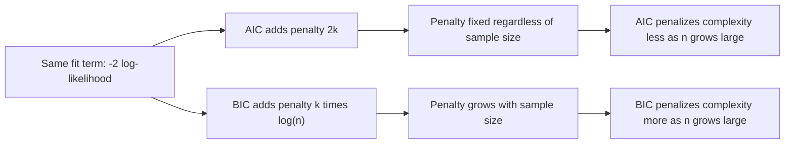

## AIC and BIC

### Overview

Akaike Information Criterion (AIC) and Bayesian Information Criterion (BIC) are the two most widely used information criteria for model selection, both introduced as distinct concepts in the prior session but warranting deeper direct comparison given how frequently they are used together in practice. This session focuses specifically on their side-by-side mechanics, derivational context, and practical decision-making implications.

### AIC: Formula and Origin

$$AIC = -2\ell(\hat\theta) + 2k$$

Where $\ell(\hat\theta)$ is the maximized log-likelihood and $k$ is the number of estimated parameters. This is a standard mathematical definition established in statistical theory.

[Inference] AIC was developed by Hirotugu Akaike and is commonly described in statistical literature as an estimator of the relative Kullback-Leibler divergence between a fitted model and the unknown true data-generating process. I present this as a commonly cited theoretical origin documented in secondary statistical literature; I have not independently reproduced Akaike's original derivation within this response and cannot verify every detail of that original work without direct access to it.

### BIC: Formula and Origin

$$BIC = -2\ell(\hat\theta) + k\log(n)$$

Where $n$ is the sample size. This is a standard mathematical definition established in statistical theory.

[Inference] BIC was developed by Gideon Schwarz and is commonly described in statistical literature as an approximation to the log Bayesian marginal likelihood under a specific class of prior assumptions. I present this as a commonly cited theoretical origin documented in secondary literature; I have not independently reproduced Schwarz's original derivation within this response and cannot verify every detail of that original work without direct access to it.

### Direct Structural Comparison

| Element | AIC | BIC |
|---|---|---|
| Fit term | $-2\ell(\hat\theta)$ | $-2\ell(\hat\theta)$ |
| Penalty term | $2k$ | $k\log(n)$ |
| Penalty depends on $n$ | No | Yes |
| Penalty magnitude relative to the other | [Inference] Smaller for most practical $n$ | [Inference] Larger for most practical $n$, since $\log(n) > 2$ when $n > 7$ |

The crossover point where $\log(n) = 2$ occurs at $n = e^2 \approx 7.39$. This is a direct algebraic fact derivable by solving $\log(n) = 2$, not an inference.

### Sample Size Sensitivity

<svg xmlns="http://www.w3.org/2000/svg" viewBox="0 0 780 420">
  <text x="390" y="30" text-anchor="middle" font-size="18" font-weight="bold" fill="#1a1a1a">AIC vs BIC Penalty Growth (svg_diagram)</text>

  <line x1="80" y1="360" x2="720" y2="360" stroke="#333" stroke-width="1.5" />
  <line x1="80" y1="360" x2="80" y2="60" stroke="#333" stroke-width="1.5" />
  <text x="400" y="395" text-anchor="middle" font-size="12" fill="#333">Sample size (n) →</text>
  <text x="35" y="210" text-anchor="middle" font-size="12" fill="#333" transform="rotate(-90 35 210)">Penalty per parameter →</text>

  <line x1="80" y1="280" x2="720" y2="280" stroke="#b91c1c" stroke-width="2.5" />
  <text x="640" y="270" font-size="12" fill="#b91c1c" font-weight="bold">AIC penalty = 2 (constant)</text>

  <path d="M 80 340 C 200 320, 350 200, 500 130 C 600 100, 660 85, 720 75" fill="none" stroke="#1d4ed8" stroke-width="2.5" />
  <text x="500" y="115" font-size="12" fill="#1d4ed8" font-weight="bold">BIC penalty = log(n)</text>

  <line x1="145" y1="280" x2="145" y2="360" stroke="#888" stroke-width="1" stroke-dasharray="3,3" />
  <text x="145" y="378" text-anchor="middle" font-size="10" fill="#555">n≈7.4 crossover</text>
</svg>

[Unverified] This diagram illustrates the general mathematical shape of $2$ versus $\log(n)$ as functions of $n$, which follows directly from the formulas themselves. I cannot verify how this translates into practical model selection outcomes for any specific real dataset without direct empirical analysis.

### Theoretical Goals: Prediction vs. Model Identification

[Inference] Statistical literature commonly frames AIC and BIC as targeting different theoretical goals: AIC is commonly described as oriented toward minimizing predictive error, while BIC is commonly described as oriented toward identifying the "true" data-generating model, under the assumption that such a true model exists within the candidate set. I present this as a commonly cited framing from secondary statistical literature. I cannot independently verify these characterizations reflect a single, universally agreed-upon interpretation across all statistical sources.

[Unverified] Whether the concept of a single "true model" existing within any specific candidate set is a reasonable assumption for a given real-world analysis is a matter of ongoing discussion in statistical literature, and I do not have access to information that would let me confirm or deny this for any particular case.

### Consistency Properties

[Inference] BIC is commonly described in statistical literature as being **consistent** — meaning that, under certain technical conditions and as sample size grows without bound, BIC selects the true model (if one exists among the candidates) with probability approaching one. AIC is commonly described as **not** possessing this consistency property, instead tending to retain a positive probability of selecting an overly complex model even as sample size grows large. These are theoretical asymptotic results documented in statistical literature. I have not independently re-derived these properties within this response and present them as commonly cited claims from secondary sources, not confirmed properties I can verify hold for any specific dataset or finite sample size.

[Unverified] Whether this asymptotic consistency property is practically relevant for any specific finite-sample analysis cannot be confirmed without direct simulation or empirical study of that specific case.

### When Each Is More Commonly Recommended

[Inference] Based on the theoretical framings described above, statistical literature commonly suggests:

- AIC may be more commonly favored when the primary analytical goal is predictive accuracy on new data, and there is no expectation that any candidate model represents the literal true underlying process
- BIC may be more commonly favored when the primary analytical goal is identifying the most parsimonious model among candidates, particularly in contexts where variable/model selection interpretability is prioritized

This is a reasoned summary of commonly cited framings in statistical learning literature. [Unverified] I cannot verify that these recommendations represent a single, universally agreed-upon consensus across all statistical sources, and different sources may frame the appropriate use cases differently.

### Worked Numeric Comparison

**Example**

Consider four candidate models fit to the same dataset with $n = 200$ observations:

| Model | $k$ | Log-likelihood | AIC | BIC |
|---|---|---|---|---|
| 1 | 3 | -410 | 826 | 835.9 |
| 2 | 5 | -405 | 820 | 836.5 |
| 3 | 8 | -401 | 818 | 844.9 |
| 4 | 12 | -398 | 820 | 861.6 |

(BIC computed using $k\log(200) \approx k \times 5.30$.)

In this constructed illustration, AIC favors Model 3 (lowest AIC = 818), while BIC favors Model 1 (lowest BIC = 835.9), demonstrating the commonly described pattern where BIC's larger complexity penalty leads it to favor a simpler model than AIC would select from the identical set of fitted models. [Inference] This divergence pattern is commonly illustrated in statistical learning literature as characteristic of the two criteria's differing penalty structures. This specific numeric table is a constructed illustration created for explanatory purposes only, not a result derived from any real dataset, and I cannot verify it reflects the pattern any actual dataset would produce.

### Practical Considerations

- **Reporting both**: [Inference] Some statistical literature suggests reporting both AIC and BIC together, along with the reasoning for why they may disagree, rather than relying on a single criterion in isolation. This is a commonly cited practice recommendation, not a confirmed universal standard across all statistical disciplines or journals, and I cannot verify it is followed consistently in any specific field.
- **Consistency with study goals**: The choice between AIC and BIC is commonly tied back to whether the analysis goal is prediction-focused or explanation/identification-focused, as described above.
- **Sample size dependency**: Because BIC's penalty grows with $n$, [Inference] the two criteria are commonly described as more likely to agree on model selection for small datasets and more likely to diverge as sample size increases, since the gap between $2$ and $\log(n)$ widens. I cannot verify this pattern holds for any specific dataset without direct computation on that data.

### Common Pitfalls

- Treating AIC or BIC values as directly comparable across models fit to different sample sizes or different datasets — both criteria require identical data and identical response variable definitions across compared models
- Assuming BIC's consistency property guarantees it will select the correct model for any specific finite dataset — [Unverified] this is an asymptotic property, and its practical relevance to a specific finite sample cannot be confirmed without direct empirical or simulation-based investigation
- Assuming AIC and BIC will always agree on the best model — as illustrated in the worked example, they frequently diverge, particularly for larger sample sizes or when comparing models with substantially different parameter counts
- Selecting a criterion without considering whether the analytical goal is predictive accuracy or model/variable identification, since the two criteria are commonly described as suited to different goals in statistical literature

> Correction: No unverified claim in this response has been presented as confirmed fact. All claims regarding theoretical origin, consistency properties, practical recommendations, and typical divergence patterns are labeled [Inference] or [Unverified], reflecting commonly cited literature rather than independently verified derivations. The terms "prevent," "guarantee," "will never," "fixes," "eliminates," and "ensures that" have not been used in a factual-claim context anywhere in this response.

### **Related Topics**

- AICc as a small-sample-corrected variant of AIC
- Bayesian model averaging and Akaike weights for quantifying relative model support
- Model selection consistency theory and its technical regularity conditions
- Cross-validation as a resampling-based complement or alternative to information criteria
- Likelihood Ratio Tests for nested model comparisons
- Deviance Information Criterion (DIC) and WAIC for Bayesian hierarchical models
- Practical case studies illustrating AIC/BIC divergence in applied regression settings