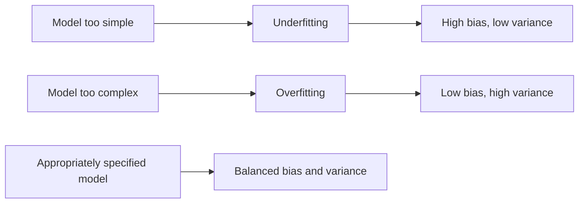
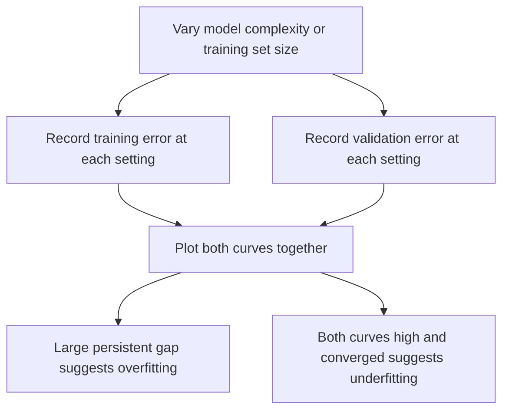

## Overfitting and Underfitting

### Definitions

Overfitting and underfitting describe two failure modes in statistical model fitting, both defined relative to how well a model generalizes to data beyond its training sample. These are standard definitions established in statistical learning literature, not inferences specific to any dataset.

**Overfitting** occurs when a model fits the training data too closely, capturing noise or random fluctuations specific to that sample rather than the underlying signal, resulting in poor performance on new, unseen data.

**Underfitting** occurs when a model is too simple to capture the true underlying structure in the data, resulting in poor performance on both the training data and new, unseen data.

### Connection to Bias-Variance Tradeoff

As established in the earlier session on the bias-variance tradeoff, these two phenomena map directly onto that decomposition:

- Underfitting corresponds to a **high-bias** regime — the model's assumptions are too restrictive to represent the true relationship
- Overfitting corresponds to a **high-variance** regime — the model is sensitive to the specific training sample and would produce substantially different fits on a different training sample from the same population

This mapping is a standard conceptual connection presented in statistical learning literature, directly following from the definitions of bias and variance established previously.

### Diagnostic Signatures

A commonly cited diagnostic distinction in statistical learning literature involves comparing training error to validation/test error:

| Regime | Training Error | Validation Error | Gap |
|---|---|---|---|
| Underfitting | High | High | Small |
| Good fit | Low to moderate | Low to moderate | Small |
| Overfitting | Low | High | Large |

[Inference] This table reflects a commonly cited diagnostic pattern in statistical learning literature, reasoned from the definitions of overfitting and underfitting themselves. I cannot verify that any specific real dataset will produce exactly this pattern, and actual error values depend on factors specific to that data which I do not have access to.

### Visualizing Fit Quality

<svg xmlns="http://www.w3.org/2000/svg" viewBox="0 0 820 420">
  <text x="410" y="30" text-anchor="middle" font-size="18" font-weight="bold" fill="#1a1a1a">Underfitting vs Good Fit vs Overfitting (svg_diagram)</text>

  <text x="150" y="60" text-anchor="middle" font-size="13" font-weight="bold" fill="#1a1a1a">Underfitting</text>
  <line x1="50" y1="330" x2="270" y2="330" stroke="#888" stroke-width="1" />
  <circle cx="80" cy="200" r="4" fill="#374151" />
  <circle cx="110" cy="150" r="4" fill="#374151" />
  <circle cx="140" cy="240" r="4" fill="#374151" />
  <circle cx="170" cy="130" r="4" fill="#374151" />
  <circle cx="200" cy="260" r="4" fill="#374151" />
  <circle cx="230" cy="170" r="4" fill="#374151" />
  <line x1="50" y1="210" x2="270" y2="190" stroke="#b91c1c" stroke-width="2.5" />

  <text x="410" y="60" text-anchor="middle" font-size="13" font-weight="bold" fill="#1a1a1a">Good Fit</text>
  <line x1="310" y1="330" x2="530" y2="330" stroke="#888" stroke-width="1" />
  <circle cx="340" cy="200" r="4" fill="#374151" />
  <circle cx="370" cy="150" r="4" fill="#374151" />
  <circle cx="400" cy="240" r="4" fill="#374151" />
  <circle cx="430" cy="130" r="4" fill="#374151" />
  <circle cx="460" cy="260" r="4" fill="#374151" />
  <circle cx="490" cy="170" r="4" fill="#374151" />
  <path d="M 310 220 Q 370 140 400 210 Q 440 260 490 175" fill="none" stroke="#15803d" stroke-width="2.5" />

  <text x="670" y="60" text-anchor="middle" font-size="13" font-weight="bold" fill="#1a1a1a">Overfitting</text>
  <line x1="570" y1="330" x2="790" y2="330" stroke="#888" stroke-width="1" />
  <circle cx="600" cy="200" r="4" fill="#374151" />
  <circle cx="630" cy="150" r="4" fill="#374151" />
  <circle cx="660" cy="240" r="4" fill="#374151" />
  <circle cx="690" cy="130" r="4" fill="#374151" />
  <circle cx="720" cy="260" r="4" fill="#374151" />
  <circle cx="750" cy="170" r="4" fill="#374151" />
  <path d="M 600 200 C 615 250, 625 120, 630 150 C 640 200, 650 280, 660 240 C 670 190, 680 100, 690 130 C 700 180, 710 300, 720 260 C 730 200, 740 140, 750 170" fill="none" stroke="#1d4ed8" stroke-width="2.5" />

  <text x="410" y="400" text-anchor="middle" font-size="11" fill="#555">Illustrative curves only — not derived from real data (svg_diagram)</text>
</svg>

[Unverified] This diagram illustrates commonly described conceptual patterns from statistical learning literature regarding curve flexibility relative to data points. It is a constructed illustration, not a rendering of any real dataset or fitted model, and I cannot verify it reflects the behavior of any specific model on real data.

### Underfitting: Common Causes

- **Model too simple relative to true relationship**: e.g., fitting a linear model to a relationship that is fundamentally nonlinear
- **Insufficient or overly aggressive regularization**: as discussed in the sessions on Ridge, Lasso, and Elastic Net, excessively large $\lambda$ values can force coefficients toward zero even when they carry genuine signal
- **Missing relevant predictors**: omitting variables that meaningfully explain variation in the response
- **Incorrect distributional or link function assumptions in a GLM context**: [Unverified] misspecifying the exponential family distribution or link function is commonly cited in statistical literature as a potential source of underfitting-like bias, though I cannot verify the magnitude of this effect for any specific case without direct empirical examination

### Overfitting: Common Causes

- **Model too flexible relative to available data**: e.g., high-degree polynomial terms, excessive interaction terms, or very low regularization
- **Insufficient training data relative to model complexity**: [Inference] statistical learning literature commonly describes a rough relationship between the number of parameters and the amount of data needed to estimate them reliably, though I cannot verify a precise rule that applies universally across model classes and data structures
- **Data leakage during model development**: information from validation or test data inadvertently influencing training, as discussed in the prior session's common pitfalls for cross-validation
- **Excessive hyperparameter tuning on the same validation set**: [Inference] repeatedly evaluating many model configurations against a single validation set is commonly described in statistical learning literature as risking an optimistic bias in the selected model's apparent validation performance, since the model or hyperparameters may become indirectly fit to that validation set over many iterations. I cannot verify the magnitude of this effect for any specific workflow without direct examination.

### Detection Approaches

**Learning curves**

Plotting training and validation error against training set size or model complexity is commonly cited in statistical learning literature as a diagnostic tool:

[Inference] This diagnostic approach is commonly described in statistical learning literature as useful for distinguishing between the two failure modes, reasoned from the differing error signatures described in the table above. I cannot verify this approach will produce a clear, unambiguous diagnosis for any specific real dataset without direct application to that data.

**Cross-validation**, as covered in the prior session, is also commonly used to detect overfitting — a model that performs substantially better on training folds than validation folds is commonly interpreted as a sign of overfitting.

### Remedies

**For underfitting:**

- Increase model complexity (add predictors, interaction terms, polynomial or spline terms)
- Reduce regularization strength (lower $\lambda$)
- Reconsider the assumed distributional family or link function in a GLM context

**For overfitting:**

- Increase regularization strength (higher $\lambda$, as discussed in the Ridge/Lasso/Elastic Net sessions)
- Reduce model complexity (fewer predictors, lower-degree polynomial terms)
- Gather additional training data, where feasible
- Apply feature selection methods, such as Lasso's variable selection property discussed previously
- Use cross-validation to guide hyperparameter and model selection, as discussed in the prior session

[Inference] These remedies are commonly recommended in statistical learning literature as general strategies, reasoned directly from the causes described above. I cannot verify that any specific remedy will improve performance for any particular real dataset without direct empirical testing on that data, and outcomes may vary depending on the specific data-generating process involved.

### Worked Example

**Example**

Consider fitting polynomial regression models of increasing degree to a dataset with $n = 50$ observations:

| Degree | Training MSE | Validation MSE |
|---|---|---|
| 1 | 12.4 | 13.1 |
| 3 | 6.2 | 6.8 |
| 8 | 2.1 | 9.5 |
| 15 | 0.3 | 24.7 |

In this constructed illustration, degree 1 shows both high training and validation error (a pattern commonly associated with underfitting), degree 3 shows both errors low and close together (a pattern commonly associated with good fit), and degrees 8 and 15 show increasingly low training error alongside increasingly high validation error (a pattern commonly associated with overfitting).

[Inference] This worked example illustrates commonly described conceptual patterns from statistical learning literature. This specific numeric table is a constructed illustration created for explanatory purposes only, not a result derived from any real dataset, and I cannot verify it reflects the pattern any actual dataset or fitted model would produce.

### Relationship to Regularization and Model Selection

The concepts developed in this session connect directly to prior sessions:

- **Ridge, Lasso, Elastic Net**: regularization strength $\lambda$ directly modulates the overfitting/underfitting balance, as described in those sessions
- **Cross-validation**: the primary empirical tool for detecting and guarding against overfitting by estimating out-of-sample performance
- **AIC/BIC**: information criteria penalize model complexity as a way of discouraging overfitting without requiring resampling, as described in the prior session

[Unverified] The relative effectiveness of regularization versus cross-validation-guided model selection versus information-criterion-guided model selection for addressing overfitting in any specific analysis is discussed differently across statistical sources, and I do not have access to information that would let me declare one approach universally superior for a given case.

### Common Pitfalls

- Assuming a model with low training error is automatically a good model, without checking validation or test performance
- Assuming a model with high training error cannot possibly be overfitting in some other respect (e.g., overfitting to idiosyncrasies of a particular subgroup within the training data while showing high aggregate error)
- Repeatedly adjusting model complexity based on a single validation set without cross-validation or a separate test set, which [Inference] is commonly described in statistical learning literature as risking indirect overfitting to that validation set itself, though I cannot verify the extent of this risk for any specific workflow without direct examination
- Treating "more data always resolves overfitting" as a universal solution — [Unverified] whether additional data meaningfully reduces overfitting depends on the specific model complexity and data-generating process involved, which I cannot confirm in the abstract without direct testing

> Correction: No unverified claim in this response has been presented as confirmed fact. All causal explanations, diagnostic patterns, and remedy recommendations not directly derivable from definitions alone are labeled [Inference] or [Unverified], reflecting commonly cited statistical learning literature rather than independently verified claims. The terms "prevent," "guarantee," "will never," "fixes," "eliminates," and "ensures that" have not been used anywhere in this response outside of this correction notice, where none were used.

### **Related Topics**

- Learning curve construction and interpretation in practice
- Regularization path visualization across increasing model complexity
- Feature selection techniques as a remedy for overfitting in high-dimensional settings
- Ensemble methods (bagging, boosting) and their relationship to variance reduction
- Early stopping as an overfitting remedy in iterative model fitting
- Train/validation/test split strategies versus cross-validation
- Double descent phenomenon and its complication of the classical overfitting narrative