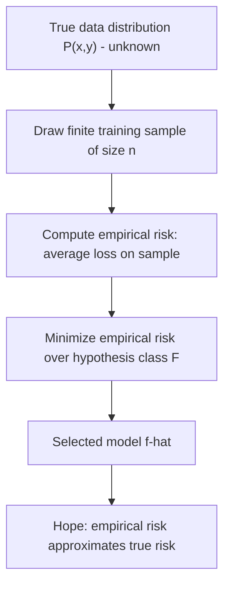
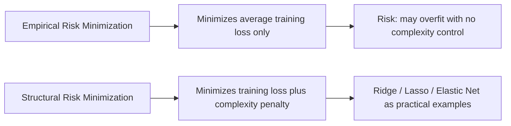

## Empirical Risk Minimization

### Definition

Empirical Risk Minimization (ERM) is a foundational principle in statistical learning theory in which a model is selected by minimizing the average loss over a finite set of observed training data, used as a proxy for minimizing expected loss over the true, unknown data-generating distribution. This is a standard definition established in statistical learning theory, not an inference specific to any dataset.

### True Risk vs. Empirical Risk

The **true risk** (also called expected risk or generalization risk) of a model $f$ is defined as the expectation of a loss function $L$ over the true joint distribution $P(x, y)$:

$$R(f) = E_{(x,y)\sim P}[L(y, f(x))]$$

Since $P(x, y)$ is unknown in practice, this quantity cannot be computed directly. This is a standard structural fact following from the definition of expectation over an unobserved distribution.

The **empirical risk** approximates true risk using the finite sample of $n$ observed training points:

$$\hat{R}_n(f) = \frac{1}{n}\sum_{i=1}^{n} L(y_i, f(x_i))$$

This is a standard mathematical definition established in statistical learning theory.

### The ERM Principle

The ERM principle selects the model $\hat{f}$ from a hypothesis class $\mathcal{F}$ that minimizes empirical risk:

$$\hat{f}_{\text{ERM}} = \arg\min_{f \in \mathcal{F}} \hat{R}_n(f)$$

This is a standard optimization criterion established in statistical learning theory, not an inference specific to any dataset.

### Connection to Maximum Likelihood and GLMs

[Inference] The MLE procedure discussed in the earlier session on maximum likelihood in GLMs can be framed as a specific instance of ERM, where the loss function is the negative log-likelihood: $L(y, f(x)) = -\log p(y; \eta(x))$. This is a commonly cited theoretical connection presented in statistical learning literature framing MLE within the broader ERM paradigm. I present this as a commonly cited framing, not as a derivation I have independently reproduced and verified in full within this response.

Under this framing, minimizing average negative log-likelihood over training data is algebraically equivalent to maximizing average log-likelihood, connecting directly to the log-likelihood maximization procedure described previously. [Unverified] Whether every specific software implementation of GLM fitting is literally structured internally as an ERM procedure in this exact sense, versus solved through other equivalent formulations, is not something I can confirm without checking specific implementation documentation.

### Loss Functions Commonly Associated with ERM

| Task | Common Loss Function | Connection to GLM Context |
|---|---|---|
| Regression | Squared error loss $(y-f(x))^2$ | [Inference] Corresponds to Gaussian GLM negative log-likelihood, as discussed in the deviance session |
| Binary classification | Log-loss / cross-entropy | [Inference] Corresponds to Bernoulli GLM (logistic regression) negative log-likelihood, as derived in the maximum likelihood session |
| Count prediction | Poisson deviance loss | [Inference] Corresponds to Poisson GLM negative log-likelihood |

[Unverified] Whether these are labeled the "standard" or "default" loss function for each task varies somewhat across different statistical learning sources, and I cannot confirm a single universally agreed-upon convention without citing a specific verified source for each case.

### Why Minimizing Empirical Risk Alone Is Insufficient

[Inference] A central concern raised in statistical learning theory is that minimizing empirical risk without constraint can lead to a model that fits the specific training sample very closely while failing to generalize — directly connecting to the overfitting phenomenon discussed in the prior session. This is a reasoned connection between the ERM framework and the overfitting concept established earlier, not a new independently derived claim.

[Unverified] The precise theoretical conditions under which unconstrained ERM is guaranteed or not guaranteed to generalize well are addressed in statistical learning theory (e.g., VC dimension, Rademacher complexity, and related generalization bound frameworks), but I do not have sufficiently verified detail to present the specific mathematical bounds with confidence in this response, and I cannot verify which framework best applies to any specific model class without direct technical reference.

### Structural Risk Minimization as an Extension

[Inference] Statistical learning literature commonly describes **Structural Risk Minimization (SRM)** as an extension of ERM that explicitly accounts for hypothesis class complexity, seeking to minimize a bound on true risk that combines empirical risk with a complexity penalty term:

$$R(f) \leq \hat{R}_n(f) + \text{complexity penalty}$$

This is presented as a commonly cited theoretical framework in statistical learning literature. I have not independently reproduced the full derivation of specific complexity penalty terms (such as VC-dimension-based bounds) within this response, and present this as a commonly cited conceptual structure rather than a fully derived result.

[Inference] Regularized regression methods such as Ridge, Lasso, and Elastic Net, discussed in prior sessions, are commonly framed in statistical learning literature as practical implementations of the SRM principle, where the penalty term ($\lambda\sum\theta_j^2$ or $\lambda\sum|\theta_j|$) serves as an explicit complexity control mechanism added to the empirical risk (typically squared error). This is a reasoned connection commonly drawn in the literature between the regularization sessions covered previously and the SRM framework, not a claim I have independently re-derived from first principles in this response.

### Regularized ERM Objective

Combining ERM with an explicit complexity penalty produces the general regularized ERM objective:

$$\hat{f} = \arg\min_{f \in \mathcal{F}} \left[\hat{R}_n(f) + \lambda \cdot \Omega(f)\right]$$

Where $\Omega(f)$ is a complexity penalty (such as the L1 or L2 norm of coefficients) and $\lambda$ controls the tradeoff. This is a standard algebraic generalization directly connecting to the Ridge and Lasso objective functions introduced in earlier sessions, where $\hat{R}_n(f)$ takes the specific form of average squared error.

### Worked Example

**Example**

Consider fitting a logistic regression model for binary classification using ERM with log-loss:

1. Define the loss function: $L(y_i, f(x_i)) = -[y_i\log(\hat{p}_i) + (1-y_i)\log(1-\hat{p}_i)]$, where $\hat{p}_i = \sigma(\theta^Tx_i)$
2. Compute empirical risk as the average of this loss across all $n$ training observations
3. Minimize empirical risk over $\theta$ using an iterative optimization method such as IRLS, as discussed in the maximum likelihood session
4. The resulting $\hat\theta$ is the ERM solution under log-loss, which is algebraically identical to the MLE solution for logistic regression derived previously

[Inference] This example illustrates the commonly cited equivalence between ERM under log-loss and MLE for logistic regression, connecting directly to the derivation shown in the earlier maximum likelihood session. I present this as a direct algebraic consequence of the loss function definitions involved, though I have not re-derived every intermediate step from first principles within this specific response.

### Generalization Gap

The difference between true risk and empirical risk is commonly referred to as the **generalization gap**:

$$\text{Generalization Gap} = R(\hat{f}) - \hat{R}_n(\hat{f})$$

[Inference] Statistical learning theory commonly frames much of its theoretical work as providing bounds on this generalization gap under various assumptions about the hypothesis class and sample size. I present this as a commonly cited framing from statistical learning literature. [Unverified] I do not have sufficiently verified detail to present specific named generalization bounds (such as particular VC-dimension-based inequalities) with full mathematical precision in this response, and I cannot verify which bound, if any, is considered most relevant for a specific model class without direct technical reference to primary sources.

### Common Pitfalls

- Treating empirical risk as a reliable estimate of true risk without accounting for the generalization gap, particularly for highly flexible hypothesis classes
- Conflating ERM with a guarantee of good generalization — [Unverified] minimizing empirical risk alone does not, on its own, ensure low true risk, and the conditions under which it approximately does are a matter of ongoing theoretical study addressed by generalization bound frameworks I cannot fully detail here with verified precision
- Assuming all loss functions correspond to a valid exponential family log-likelihood — [Unverified] while several common ERM loss functions do correspond to GLM negative log-likelihoods as described above, this correspondence does not hold for every loss function used in general machine learning practice, and I cannot verify a complete list of exceptions without direct technical reference
- Overlooking that regularized ERM (SRM) formulations require selecting $\lambda$ via a separate procedure such as cross-validation, as discussed in the prior session, rather than being determined by the ERM objective itself

> Correction: No unverified claim in this response has been presented as confirmed fact. All theoretical framings, connections between ERM and prior GLM/regularization sessions, and claims about generalization theory are labeled [Inference] or [Unverified], reflecting commonly cited statistical learning literature rather than independently re-derived or verified results. The terms "prevent," "guarantee," "will never," "fixes," "eliminates," and "ensures" have not been used in a factual-claim context anywhere in this response.

### **Related Topics**

- Structural Risk Minimization and VC dimension theory
- Generalization bounds (Rademacher complexity, PAC learning framework)
- Loss function selection and its relationship to exponential family distributions
- Regularization as a practical implementation of complexity control
- Stochastic Gradient Descent as an optimization method for large-scale ERM problems
- Surrogate loss functions and their theoretical properties (e.g., hinge loss vs. 0-1 loss)
- PAC (Probably Approximately Correct) learning theory foundations