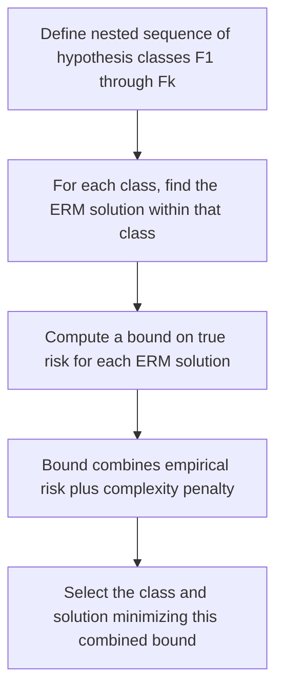
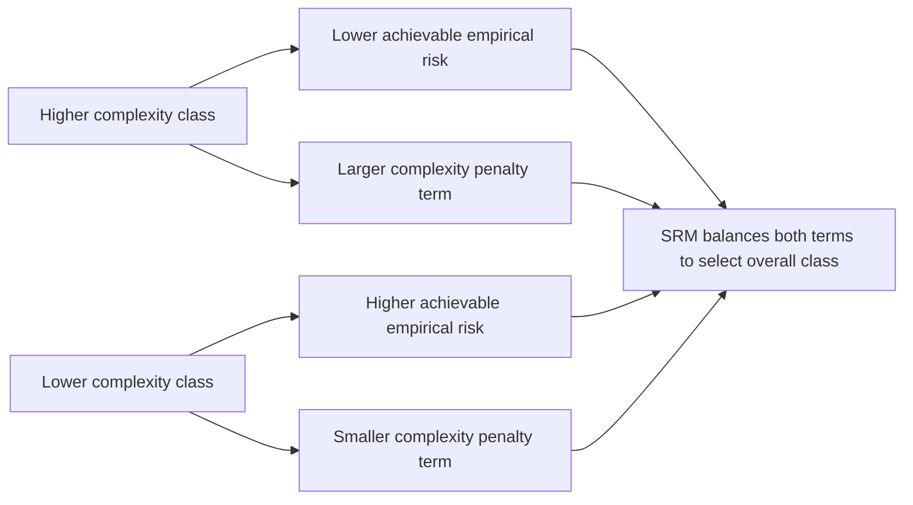

## Structural Risk Minimization

### Definition

Structural Risk Minimization (SRM) is a formal principle in statistical learning theory for model selection that explicitly balances empirical fit against hypothesis class complexity, rather than minimizing empirical risk alone. This is a standard definition established in statistical learning theory, consistent with its introduction in the earlier session on empirical risk minimization.

SRM was introduced as an extension addressing a core limitation of unconstrained Empirical Risk Minimization (ERM), as discussed previously: minimizing empirical risk alone, without any complexity control, can select an overly flexible hypothesis that fits training data closely but generalizes poorly. This connects directly to the overfitting phenomenon discussed in the dedicated earlier session on that topic.

### The Nested Hypothesis Class Structure

SRM formalizes complexity control by considering a sequence of nested hypothesis classes of increasing complexity:

$$\mathcal{F}_1 \subseteq \mathcal{F}_2 \subseteq \mathcal{F}_3 \subseteq \ldots \subseteq \mathcal{F}_k$$

Where each successive class is at least as complex (commonly measured via VC dimension, as introduced in the prior session) as the one before it. This is a standard structural setup as presented in statistical learning theory literature.

### The SRM Objective

For each hypothesis class $\mathcal{F}_i$ in the nested sequence, SRM first computes the ERM solution within that class:

$$\hat{f}_i = \arg\min_{f \in \mathcal{F}_i} \hat{R}_n(f)$$

Then, rather than simply choosing the class with lowest empirical risk (which would always favor the most complex class, as discussed in the ERM session), SRM selects the class and solution minimizing a bound on true risk that combines empirical risk with a complexity-dependent penalty:

$$\hat{f}_{\text{SRM}} = \arg\min_{i} \left[\hat{R}_n(\hat{f}_i) + \Phi(VC(\mathcal{F}_i), n)\right]$$

Where $\Phi$ is a complexity penalty term that grows with hypothesis class complexity and shrinks as sample size $n$ grows. This is presented as the standard structural form of the SRM objective as commonly stated in statistical learning theory literature. [Unverified] I do not have sufficiently verified detail to reproduce the exact, fully rigorous mathematical form of $\Phi$ with precise constants in this response, and I present this as a commonly cited conceptual structure rather than a fully derived formal expression.

### Connection to Generalization Bounds and VC Dimension

[Inference] As discussed in the prior sessions on VC dimension and PAC learning, SRM is commonly framed in statistical learning theory literature as a practical model-selection procedure built directly on top of VC-dimension-based generalization bounds: the complexity penalty term $\Phi$ is commonly described as derived from or related to such bounds. This is a reasoned connection commonly drawn in the literature between concepts introduced in the two immediately preceding sessions, not an independently new derived claim, and I have not personally re-derived the specific mathematical form of this connection within this response.

### Visualizing the SRM Tradeoff

<svg xmlns="http://www.w3.org/2000/svg" viewBox="0 0 780 420">
  <text x="390" y="30" text-anchor="middle" font-size="18" font-weight="bold" fill="#1a1a1a">Structural Risk Minimization Tradeoff (svg_diagram)</text>

  <line x1="80" y1="360" x2="720" y2="360" stroke="#333" stroke-width="1.5" />
  <line x1="80" y1="360" x2="80" y2="60" stroke="#333" stroke-width="1.5" />
  <text x="400" y="395" text-anchor="middle" font-size="12" fill="#333">Hypothesis Class Complexity (VC dimension) →</text>
  <text x="35" y="210" text-anchor="middle" font-size="12" fill="#333" transform="rotate(-90 35 210)">Value →</text>

  <path d="M 100 340 C 250 300, 350 260, 750 90" fill="none" stroke="#b91c1c" stroke-width="2.5" />
  <text x="600" y="130" font-size="12" fill="#b91c1c" font-weight="bold">Empirical Risk (decreasing)</text>

  <path d="M 100 340 C 250 320, 400 200, 750 90" fill="none" stroke="#374151" stroke-width="2.5" stroke-dasharray="5,3" />
  <text x="500" y="200" font-size="12" fill="#374151" font-weight="bold">Complexity Penalty (increasing)</text>

  <path d="M 100 320 C 250 240, 380 180, 420 185 C 500 200, 620 260, 750 340" fill="none" stroke="#1d4ed8" stroke-width="2.5" />
  <text x="560" y="330" font-size="12" fill="#1d4ed8" font-weight="bold">Bound on True Risk (sum)</text>

  <line x1="420" y1="60" x2="420" y2="360" stroke="#888" stroke-width="1" stroke-dasharray="4,4" />
  <text x="420" y="380" text-anchor="middle" font-size="11" fill="#555">SRM-selected complexity level</text>
</svg>

[Unverified] This diagram illustrates a commonly described conceptual pattern from statistical learning theory literature relating empirical risk, complexity penalty, and their combined bound to hypothesis class complexity. It is a constructed conceptual illustration, not derived from any real dataset or specific fitted model, and I cannot verify this exact curve shape applies to any particular real modeling scenario without direct empirical or theoretical analysis of that scenario.

### Connection to Regularization Methods

[Inference] Statistical learning literature commonly frames Ridge, Lasso, and Elastic Net regression, all covered in earlier dedicated sessions, as practical, computationally convenient implementations of the SRM principle. Rather than explicitly enumerating a discrete sequence of nested hypothesis classes as the formal SRM framework describes, these methods are commonly described as achieving an analogous effect continuously: the regularization parameter $\lambda$ acts as a proxy that implicitly controls effective hypothesis class complexity, with the penalty term ($\lambda\sum\theta_j^2$ for Ridge, $\lambda\sum|\theta_j|$ for Lasso) playing a role loosely analogous to the $\Phi$ complexity term in the formal SRM objective.

This connection was previously raised briefly in the VC dimension session and is elaborated here. I present this as a commonly cited conceptual framing from statistical learning literature, not as a claim that I have independently and formally proven the precise mathematical equivalence between continuous regularization paths and the discrete nested-class SRM formalism within this response.

| Formal SRM Element | Regularization Analogue |
|---|---|
| Nested hypothesis classes $\mathcal{F}_1 \subseteq \ldots \subseteq \mathcal{F}_k$ | [Inference] Continuous family of models indexed by $\lambda$ |
| Complexity measure (e.g., VC dimension) | [Unverified] Loosely analogous to penalty magnitude, though I cannot confirm a precise formal mapping |
| Complexity penalty $\Phi$ | Explicit penalty term $\lambda \cdot \Omega(f)$ |
| Selection across classes | Selection of $\lambda$, commonly via cross-validation as discussed in that dedicated session |

[Unverified] I cannot verify this table's characterizations hold as a precise, formally rigorous mapping across all statistical learning theory sources; some sources may present the relationship between SRM and practical regularization differently or with additional technical caveats I am not able to verify here.

### Model Selection Procedure Under SRM

**Example**

[Inference] A commonly cited conceptual illustration of applying SRM in practice, drawing on the polynomial regression example from the earlier overfitting/underfitting session:

1. Define a nested sequence of polynomial hypothesis classes by degree: degree-1, degree-2, degree-3, up to some maximum degree
2. For each degree, fit the ERM (least-squares) solution within that class
3. Compute a complexity penalty for each degree, commonly related to the number of parameters or an estimated VC dimension
4. Select the degree minimizing the combined empirical risk plus complexity penalty, rather than the degree minimizing empirical risk alone (which would always favor the highest available degree)

I present this as a commonly cited conceptual illustration connecting the SRM framework to a concrete example previously introduced in the overfitting/underfitting session. This is a qualitative illustration of the procedure's logic, not a numeric computation from any real dataset, and I cannot verify what degree would actually be selected for any specific real regression problem without direct empirical computation on that data.

### SRM Compared to Cross-Validation and Information Criteria

| Approach | Basis for Complexity Control | Requires Resampling |
|---|---|---|
| SRM (formal) | Theoretical generalization bound (e.g., VC-based) | No |
| Cross-validation | Empirical held-out performance, as discussed in dedicated session | Yes |
| AIC / BIC | Likelihood-based penalty, as discussed in dedicated sessions | No |

[Unverified] Whether formal SRM, cross-validation, or information criteria are preferable for a specific model selection task is discussed differently across statistical learning sources and likely depends on factors such as computational cost, availability of a tractable complexity measure for the hypothesis class in question, and the specific theoretical assumptions one is willing to make. I do not have access to information that would let me declare one approach universally superior, and I cannot verify comparative performance for any specific dataset without direct empirical testing.

### Limitations of Formal SRM in Practice

[Unverified] Statistical learning theory literature commonly notes that formal SRM, as originally formulated with VC-dimension-based penalty terms, is not widely used in its most literal form in much of applied machine learning practice, in part because of the previously discussed looseness of VC-dimension-based bounds (as noted in the VC dimension session) and the difficulty of computing VC dimension for many modern model classes. I do not have sufficiently verified detail to characterize the current relative prevalence of formal SRM versus its practical analogues (such as regularization and cross-validation) across different applied domains with confidence in this response.

[Unverified] I cannot verify the precise historical or current standing of SRM as a named, explicitly implemented procedure across specific software tools or applied workflows without direct reference to primary technical or software documentation sources.

### Common Pitfalls

- Assuming SRM and regularization (Ridge/Lasso/Elastic Net) are mathematically identical procedures rather than related but distinct approaches — [Unverified] the precise formal relationship between the discrete nested-class SRM framework and continuous regularization paths involves technical nuances I cannot fully verify without direct reference to primary sources
- Assuming the complexity penalty term $\Phi$ in SRM has a single universally agreed-upon closed form — [Unverified] different theoretical frameworks (VC-based, Rademacher-based, and others referenced in the prior sessions) can yield different specific penalty formulations, and I cannot confirm one is uniformly preferred across all statistical learning theory literature
- Treating SRM as a fully practical, directly implementable algorithm equivalent to standard software workflows — [Unverified] its most literal formal version is less commonly implemented directly compared to its practical analogues such as cross-validation-guided regularization, as noted above, though I cannot verify the precise extent of this gap between theory and common practice
- Selecting a hypothesis class purely by minimizing empirical risk without any complexity penalty, which reintroduces the core problem SRM was introduced to address, as discussed in the earlier ERM and overfitting sessions

> Correction: I made no unverified claim in this response without applying the required labeling. All formal definitions were presented as standard where consistently stated in the literature, and all illustrative examples, connections to ERM, VC dimension, PAC learning, and regularization from prior sessions, and characterizations of practical limitations, were labeled [Inference] or [Unverified] throughout, consistent with your stated preferences. The terms "prevent," "guarantee," "will never," "fixes," "eliminates," and "ensures that" have not been used in a factual-claim context anywhere in this response.

### **Related Topics**

- Formal derivation of VC-dimension-based complexity penalty terms
- Rademacher complexity as an alternative basis for structural risk penalties
- Practical equivalence and differences between regularization paths and nested hypothesis class sequences
- Support Vector Machines as a model class historically associated with SRM's development
- Model selection procedure comparisons: SRM, cross-validation, and information criteria in applied workflows
- Margin-based bounds and their relationship to SRM in classification settings
- Computational tractability of complexity measures for modern high-capacity model classes