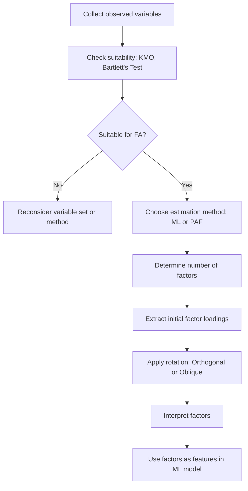

## Factor Analysis

### Overview

Factor analysis is a statistical method used to describe variability among observed, correlated variables in terms of a smaller number of unobserved variables called factors. It is widely used in machine learning for dimensionality reduction, feature engineering, and uncovering latent structure in data.

**Key Points**

- Assumes observed variables are linear combinations of underlying latent factors plus noise
- Distinct from Principal Component Analysis (PCA): factor analysis models shared variance (common variance), while PCA captures total variance
- Commonly used in psychometrics, social sciences, finance, and increasingly in ML pipelines for feature reduction and interpretability
- [Inference] The choice between PCA and factor analysis often depends on whether the goal is variance summarization (PCA) or explaining correlations via latent constructs (factor analysis)

### Mathematical Formulation

The factor analysis model expresses each observed variable as a linear function of common factors and a unique error term.

$$x = \mu + Lf + \epsilon$$

Where:

- $x$ is the vector of observed variables ($p \times 1$)
- $\mu$ is the mean vector
- $L$ is the factor loading matrix ($p \times k$)
- $f$ is the vector of common factors ($k \times 1$), typically assumed $f \sim N(0, I)$
- $\epsilon$ is the vector of unique/specific factors (errors), assumed uncorrelated with $f$

The covariance structure implied by this model is:

$$\Sigma = LL^T + \Psi$$

Where $\Psi$ is a diagonal matrix of unique variances (specific to each observed variable).

**Key Points**

- $k$ (number of factors) is typically much smaller than $p$ (number of observed variables)
- $\Psi$ being diagonal is a core assumption: it implies all correlation among observed variables is explained by the common factors, not by shared unique variance
- [Unverified] The exact numerical estimates for $L$ and $\Psi$ depend on the estimation method used (e.g., Maximum Likelihood vs. Principal Axis Factoring), and results can vary across implementations

### Assumptions

- Variables are continuous and approximately interval-scaled
- Relationships between variables are linear
- Multivariate normality is assumed for Maximum Likelihood estimation specifically
- Adequate sample size relative to the number of variables (commonly cited rules of thumb such as 5–10 observations per variable exist, but [Unverified] as a universal standard — recommendations vary across sources)
- Sufficient inter-variable correlation must exist; otherwise, factor analysis is not meaningful

**Key Points**

- The Kaiser-Meyer-Olkin (KMO) test and Bartlett's Test of Sphericity are commonly used to assess whether data is suitable for factor analysis
- KMO values closer to 1 indicate that variables share enough common variance for factor analysis to be appropriate
- Bartlett's test checks whether the correlation matrix significantly differs from an identity matrix

### Estimation Methods

**Principal Axis Factoring (PAF)**

- Iteratively estimates communalities and extracts factors from the reduced correlation matrix
- Does not assume multivariate normality

**Maximum Likelihood (ML)**

- Assumes multivariate normality
- Allows for statistical significance testing of the number of factors
- Provides fit indices (e.g., chi-square goodness-of-fit)

**Key Points**

- [Inference] ML estimation is often preferred when formal hypothesis testing of model fit is required, while PAF may be used when normality assumptions are questionable
- Both methods require an iterative optimization procedure, and convergence is not guaranteed in all cases [Unverified]

### Determining the Number of Factors

Several heuristics and statistical criteria exist:

- **Kaiser Criterion**: Retain factors with eigenvalues greater than 1
- **Scree Plot**: Visual inspection of eigenvalues to identify an "elbow" point
- **Parallel Analysis**: Compares observed eigenvalues to those generated from random data
- **Model Fit Indices** (for ML): Chi-square test, RMSEA, and other fit statistics

**Key Points**

- The Kaiser Criterion is widely used but has been criticized in academic literature for potentially over- or under-extracting factors [Unverified — criticism sourced from various methodological papers, not independently confirmed here]
- Parallel Analysis is generally regarded as more statistically robust than the Kaiser Criterion [Inference], though the degree of superiority depends on the dataset

<svg xmlns="http://www.w3.org/2000/svg" viewBox="0 0 700 420">
<text x="350" y="30" font-size="18" font-weight="bold" text-anchor="middle" fill="#1a1a1a">Factor Analysis Structure (svg_diagram)</text>

<circle cx="150" cy="120" r="35" fill="#a8d5ba" stroke="#333" stroke-width="1.5" />
<text x="150" y="125" font-size="13" text-anchor="middle" fill="#1a1a1a">Factor 1</text>
<circle cx="150" cy="260" r="35" fill="#a8d5ba" stroke="#333" stroke-width="1.5" />
<text x="150" y="265" font-size="13" text-anchor="middle" fill="#1a1a1a">Factor 2</text>

<rect x="400" y="40" width="90" height="40" fill="#bcd4f0" stroke="#333" stroke-width="1.5" />
<text x="445" y="65" font-size="12" text-anchor="middle" fill="#1a1a1a">X1</text>
<rect x="400" y="110" width="90" height="40" fill="#bcd4f0" stroke="#333" stroke-width="1.5" />
<text x="445" y="135" font-size="12" text-anchor="middle" fill="#1a1a1a">X2</text>
<rect x="400" y="180" width="90" height="40" fill="#bcd4f0" stroke="#333" stroke-width="1.5" />
<text x="445" y="205" font-size="12" text-anchor="middle" fill="#1a1a1a">X3</text>
<rect x="400" y="250" width="90" height="40" fill="#bcd4f0" stroke="#333" stroke-width="1.5" />
<text x="445" y="275" font-size="12" text-anchor="middle" fill="#1a1a1a">X4</text>
<rect x="400" y="320" width="90" height="40" fill="#bcd4f0" stroke="#333" stroke-width="1.5" />
<text x="445" y="345" font-size="12" text-anchor="middle" fill="#1a1a1a">X5</text>

<text x="600" y="65" font-size="12" fill="#555">ε1</text>

<text x="600" y="135" font-size="12" fill="#555">ε2</text>

<text x="600" y="205" font-size="12" fill="#555">ε3</text>

<text x="600" y="275" font-size="12" fill="#555">ε4</text>

<text x="600" y="345" font-size="12" fill="#555">ε5</text>

<line x1="580" y1="60" x2="400" y2="60" stroke="#999" stroke-width="1" />
<line x1="580" y1="130" x2="400" y2="130" stroke="#999" stroke-width="1" />
<line x1="580" y1="200" x2="400" y2="200" stroke="#999" stroke-width="1" />
<line x1="580" y1="270" x2="400" y2="270" stroke="#999" stroke-width="1" />
<line x1="580" y1="340" x2="400" y2="340" stroke="#999" stroke-width="1" />

<line x1="185" y1="120" x2="400" y2="60" stroke="#333" stroke-width="1" />
<line x1="185" y1="120" x2="400" y2="130" stroke="#333" stroke-width="1" />
<line x1="185" y1="120" x2="400" y2="200" stroke="#333" stroke-width="1" />

<line x1="185" y1="260" x2="400" y2="200" stroke="#333" stroke-width="1" />
<line x1="185" y1="260" x2="400" y2="270" stroke="#333" stroke-width="1" />
<line x1="185" y1="260" x2="400" y2="340" stroke="#333" stroke-width="1" />

<text x="270" y="80" font-size="10" fill="#333">λ11</text>

<text x="270" y="115" font-size="10" fill="#333">λ12</text>

<text x="270" y="240" font-size="10" fill="#333">λ23</text>

<text x="270" y="280" font-size="10" fill="#333">λ24</text>

<text x="20" y="400" font-size="11" fill="#555">Circles = latent factors | Rectangles = observed variables | ε = unique/error variance</text>

</svg>

### Factor Rotation

Raw factor solutions are often difficult to interpret. Rotation methods redistribute variance across factors to produce a more interpretable structure without altering the model's overall fit.

**Orthogonal Rotation (e.g., Varimax)**

- Factors remain uncorrelated after rotation
- Simplifies interpretation by maximizing variance of squared loadings within factors

**Oblique Rotation (e.g., Promax, Oblimin)**

- Allows factors to correlate
- [Inference] Often considered more realistic in behavioral and social science contexts, where underlying constructs are rarely fully independent

**Key Points**

- Rotation does not change the model's fit statistics or the amount of variance explained overall — it only changes the distribution of variance among factors
- Choice of rotation method should be guided by theoretical expectations about whether factors are conceptually independent [Unverified as a strict rule; practice varies by field]

### Factor Analysis vs. Principal Component Analysis

| Aspect | Factor Analysis | PCA |
| --- | --- | --- |
| Goal | Explain correlations via latent factors | Maximize explained variance |
| Variance modeled | Common (shared) variance only | Total variance |
| Error term | Explicit unique/error variance ($\Psi$) | No explicit error term |
| Interpretability | Designed for latent construct interpretation | Components may not correspond to meaningful constructs |
| Typical use case | Psychometrics, latent trait modeling | Dimensionality reduction, preprocessing for ML |

**Key Points**

- [Inference] In machine learning pipelines, PCA is more commonly used for pure dimensionality reduction, while factor analysis is more common when the researcher hypothesizes an underlying causal or latent structure
- Both methods can produce similar results when unique variances are small relative to common variances, but this is not guaranteed to hold in all datasets [Unverified]

### Application in Machine Learning

- **Dimensionality reduction**: Reducing feature space while preserving explanatory structure
- **Feature engineering**: Creating latent composite features from correlated raw variables
- **Noise reduction**: Separating common signal from variable-specific noise
- **Exploratory data analysis**: Identifying underlying constructs in survey-based or sensor-based datasets

**Example**

Suppose a dataset contains five correlated financial indicators (e.g., debt ratio, liquidity ratio, profit margin, asset turnover, equity ratio). Factor analysis might reveal that these five variables are explained by two latent factors — for instance, a "solvency" factor and a "profitability" factor. These two factors could then be used as reduced-dimension inputs to a downstream ML model instead of the original five correlated variables.

[Inference] This kind of factor-based dimensionality reduction may improve model interpretability and reduce multicollinearity in downstream regression-based models, though the degree of improvement is dataset-dependent and not guaranteed.

### Process Flow

### Limitations

- Sensitive to sample size and multicollinearity structure
- Factor interpretation is subjective and depends on domain expertise
- Model assumes linear relationships; nonlinear latent structures are not well captured [Unverified whether all real-world data conforms to this assumption]
- Results can vary substantially depending on estimation method, rotation choice, and number of factors selected
- [Speculation] Some practitioners consider factor analysis less favored than modern nonlinear dimensionality reduction techniques (e.g., autoencoders) for large-scale ML applications, though this preference is not universally documented

### Conclusion

Factor analysis provides a structured framework for identifying latent variables that explain correlations among observed features. While conceptually similar to PCA, it differs in its explicit modeling of shared versus unique variance, making it particularly useful when a researcher hypothesizes an underlying construct driving observed correlations. Its effectiveness depends heavily on data suitability, estimation method, and careful interpretation of rotated factor loadings.

**Related Topics**

- Principal Component Analysis (PCA) — comparative deep dive
- Independent Component Analysis (ICA)
- Structural Equation Modeling (SEM)
- Canonical Correlation Analysis
- Latent Class Analysis
- Dimensionality reduction techniques in ML (t-SNE, UMAP, Autoencoders)
- Multicollinearity diagnostics in regression