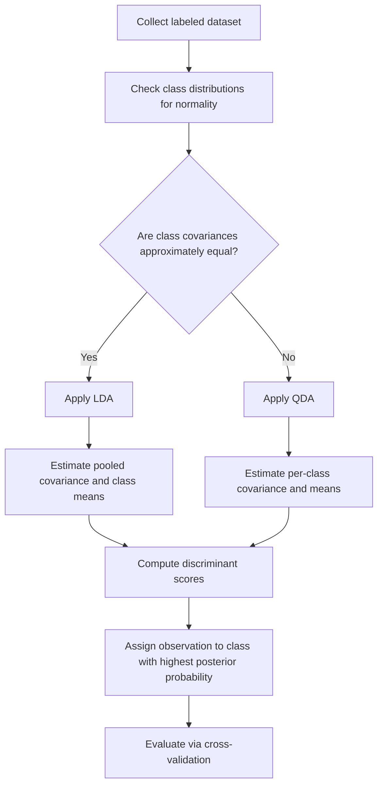

## Discriminant Analysis

### Overview

Discriminant analysis is a set of statistical techniques used to classify observations into predefined groups based on predictor variables. In machine learning, it serves as both a classification algorithm and a dimensionality reduction technique. It models the distribution of predictors separately for each class and uses Bayes' theorem to find the probability of class membership.

### Key Points

- Discriminant analysis assumes predictor variables are drawn from a distribution (typically Gaussian) within each class.
- The two dominant variants are **Linear Discriminant Analysis (LDA)** and **Quadratic Discriminant Analysis (QDA)**.
- LDA assumes a shared covariance matrix across all classes, producing linear decision boundaries.
- QDA allows each class its own covariance matrix, producing quadratic (curved) decision boundaries.
- Discriminant analysis is closely related to logistic regression but makes stronger distributional assumptions.
- [Inference] When the Gaussian assumption holds reasonably well, LDA and QDA tend to outperform logistic regression, particularly with smaller sample sizes, because they use additional distributional information.

### Mathematical Foundation

Discriminant analysis relies on Bayes' theorem to compute the posterior probability that an observation $x$ belongs to class $k$:

$$P(Y=k \mid X=x) = \frac{\pi_k f_k(x)}{\sum_{l=1}^{K} \pi_l f_l(x)}$$

Where:

- $\pi_k$ is the prior probability of class $k$
- $f_k(x)$ is the class-conditional density (typically multivariate Gaussian)
- $K$ is the total number of classes

The multivariate Gaussian density for class $k$ is:

$$f_k(x) = \frac{1}{(2\pi)^{p/2} |\Sigma_k|^{1/2}} \exp\left(-\frac{1}{2}(x - \mu_k)^T \Sigma_k^{-1} (x - \mu_k)\right)$$

Where $p$ is the number of predictors, $\mu_k$ is the mean vector for class $k$, and $\Sigma_k$ is the covariance matrix for class $k$.

### Linear Discriminant Analysis (LDA)

LDA assumes all classes share a common covariance matrix $\Sigma$. This simplification causes the quadratic terms in the discriminant function to cancel out, leaving a linear function of $x$.

The linear discriminant function for class $k$ is:

$$\delta_k(x) = x^T \Sigma^{-1} \mu_k - \frac{1}{2} \mu_k^T \Sigma^{-1} \mu_k + \log \pi_k$$

An observation is classified into the class $k$ that maximizes $\delta_k(x)$.

**Estimation of parameters:**

- $\hat{\pi}_k = n_k / n$ (proportion of training observations in class $k$)
- $\hat{\mu}_k$ = sample mean vector of class $k$
- $\hat{\Sigma}$ = pooled within-class covariance matrix, computed as a weighted average of individual class covariance matrices

### Quadratic Discriminant Analysis (QDA)

QDA relaxes the shared-covariance assumption, allowing each class $k$ to have its own covariance matrix $\Sigma_k$. This retains the quadratic term, producing a discriminant function:

$$\delta_k(x) = -\frac{1}{2}(x-\mu_k)^T \Sigma_k^{-1} (x-\mu_k) - \frac{1}{2}\log|\Sigma_k| + \log \pi_k$$

**Trade-offs:**

- QDA is more flexible and can model non-linear boundaries.
- QDA requires estimating a separate covariance matrix per class, which increases the number of parameters substantially as dimensionality grows.
- [Inference] QDA tends to perform better than LDA when class covariance structures genuinely differ and the training sample is large enough to estimate the additional parameters reliably; LDA tends to perform better with limited data because of its lower variance.

### LDA vs. QDA vs. Logistic Regression

| Aspect | LDA | QDA | Logistic Regression |
| --- | --- | --- | --- |
| Decision boundary | Linear | Quadratic | Linear |
| Distributional assumption | Gaussian, shared covariance | Gaussian, class-specific covariance | None on predictors |
| Parameter count | Lower | Higher | Lower |
| Robustness to non-Gaussian data | [Inference] Moderate | [Inference] Lower | Higher |
| Performs well with small samples | Often, if assumptions hold | Less so | Less so than LDA in this scenario |

[Unverified] Precise relative performance depends heavily on the dataset, and no universal ranking holds across all applications.

### Discriminant Analysis as Dimensionality Reduction

LDA can also be used to project data onto a lower-dimensional space that maximizes class separability, distinct from Principal Component Analysis (PCA), which maximizes variance without regard to class labels.

The objective is to find a projection that maximizes the ratio of between-class variance to within-class variance:

$$J(w) = \frac{w^T S_B w}{w^T S_W w}$$

Where:

- $S_B$ is the between-class scatter matrix
- $S_W$ is the within-class scatter matrix
- $w$ is the projection vector

This is solved as a generalized eigenvalue problem. The number of usable discriminant dimensions is at most $K - 1$, where $K$ is the number of classes.

### Decision Boundary Illustration (svg_diagram)

<svg xmlns="http://www.w3.org/2000/svg" viewBox="0 0 500 320">
<text x="20" y="25" font-size="14" font-weight="bold" fill="#222">LDA vs QDA Decision Boundaries (svg_diagram)</text>
<rect x="20" y="45" width="210" height="230" fill="#fafafa" stroke="#999" stroke-width="1" />
<text x="45" y="65" font-size="12" fill="#333" font-weight="bold">LDA (Linear Boundary)</text>
<line x1="30" y1="260" x2="30" y2="55" stroke="#666" stroke-width="1" />
<line x1="30" y1="260" x2="220" y2="260" stroke="#666" stroke-width="1" />
<line x1="35" y1="80" x2="215" y2="240" stroke="#d62728" stroke-width="2" stroke-dasharray="4,2" />
<circle cx="70" cy="100" r="5" fill="#1f77b4" />
<circle cx="90" cy="130" r="5" fill="#1f77b4" />
<circle cx="60" cy="150" r="5" fill="#1f77b4" />
<circle cx="100" cy="90" r="5" fill="#1f77b4" />
<circle cx="80" cy="160" r="5" fill="#1f77b4" />
<circle cx="150" cy="180" r="5" fill="#ff7f0e" />
<circle cx="170" cy="150" r="5" fill="#ff7f0e" />
<circle cx="190" cy="200" r="5" fill="#ff7f0e" />
<circle cx="160" cy="220" r="5" fill="#ff7f0e" />
<circle cx="180" cy="230" r="5" fill="#ff7f0e" />
<rect x="260" y="45" width="220" height="230" fill="#fafafa" stroke="#999" stroke-width="1" />
<text x="290" y="65" font-size="12" fill="#333" font-weight="bold">QDA (Curved Boundary)</text>
<line x1="270" y1="260" x2="270" y2="55" stroke="#666" stroke-width="1" />
<line x1="270" y1="260" x2="470" y2="260" stroke="#666" stroke-width="1" />
<path d="M 280 90 Q 350 150 300 240" fill="none" stroke="#d62728" stroke-width="2" stroke-dasharray="4,2" />
<circle cx="300" cy="100" r="5" fill="#1f77b4" />
<circle cx="310" cy="130" r="5" fill="#1f77b4" />
<circle cx="290" cy="150" r="5" fill="#1f77b4" />
<circle cx="320" cy="90" r="5" fill="#1f77b4" />
<circle cx="295" cy="200" r="5" fill="#1f77b4" />
<circle cx="400" cy="120" r="5" fill="#ff7f0e" />
<circle cx="420" cy="150" r="5" fill="#ff7f0e" />
<circle cx="440" cy="200" r="5" fill="#ff7f0e" />
<circle cx="410" cy="220" r="5" fill="#ff7f0e" />
<circle cx="430" cy="230" r="5" fill="#ff7f0e" />

<text x="20" y="300" font-size="11" fill="#555">Blue = Class A, Orange = Class B, Dashed red = decision boundary</text>

</svg>

### Assumptions and Limitations

- **Gaussian assumption**: Both LDA and QDA assume predictors within each class follow a multivariate normal distribution. [Unverified] Real-world data rarely satisfies this exactly, and the practical impact of violations depends on the specific dataset and degree of departure from normality.
- **Equal covariance (LDA only)**: LDA's linear boundary depends on the assumption that all classes share the same covariance matrix. Violations of this assumption can degrade classification accuracy, though the magnitude of degradation is [Inference] typically smaller when class covariances are only mildly different.
- **Sensitivity to outliers**: Because mean and covariance estimates are used directly, both methods can be affected by outliers.
- **Multicollinearity**: High correlation among predictors can make the covariance matrix estimate unstable or singular, particularly in QDA with limited per-class samples.
- **Curse of dimensionality**: QDA's parameter count grows quadratically with the number of features per class, which can lead to overfitting when $p$ is large relative to $n$.

### Workflow for Applying Discriminant Analysis

### Example

Consider a dataset with two predictors — annual income and credit score — used to classify loan applicants into "Approved" or "Denied" categories.

1. Compute class means: $\mu_{\text{Approved}}$ and $\mu_{\text{Denied}}$ for both predictors.
2. For LDA, compute a single pooled covariance matrix from both classes combined.
3. Compute discriminant scores $\delta_k(x)$ for a new applicant using the linear discriminant function.
4. Assign the applicant to whichever class produces the higher score.

[Inference] In this type of scenario, if the two classes have visibly different spread patterns (e.g., "Approved" applicants cluster tightly while "Denied" applicants show wide variance), QDA would likely be more appropriate than LDA, though this should be validated empirically rather than assumed.

### Regularized Discriminant Analysis

Regularized Discriminant Analysis (RDA) blends LDA and QDA by shrinking class-specific covariance matrices toward a pooled covariance matrix, controlled by a tuning parameter $\alpha$:

$$\Sigma_k(\alpha) = \alpha \Sigma_k + (1-\alpha)\Sigma$$

When $\alpha = 0$, RDA reduces to LDA. When $\alpha = 1$, it reduces to QDA. Intermediate values interpolate between the two, which [Inference] can help mitigate overfitting in QDA when sample sizes per class are limited, though the optimal $\alpha$ is typically determined via cross-validation rather than fixed in advance.

### Evaluation Considerations

- Standard classification metrics apply: accuracy, precision, recall, F1-score, and confusion matrices.
- Cross-validation is commonly used to select between LDA, QDA, and RDA, and to tune regularization parameters.
- [Unverified] No single evaluation metric universally determines model choice; selection depends on the cost structure of misclassification in the specific application (e.g., false negatives vs. false positives).

### Related Topics

- Logistic Regression and comparison with discriminant methods
- Naive Bayes Classifier
- Principal Component Analysis (PCA) vs. LDA for dimensionality reduction
- Covariance Matrix Estimation and Shrinkage Methods
- Bayesian Classification and Bayes' Theorem in Machine Learning
- Gaussian Mixture Models
- Cross-Validation Techniques for Model Selection
- Multivariate Normal Distribution properties