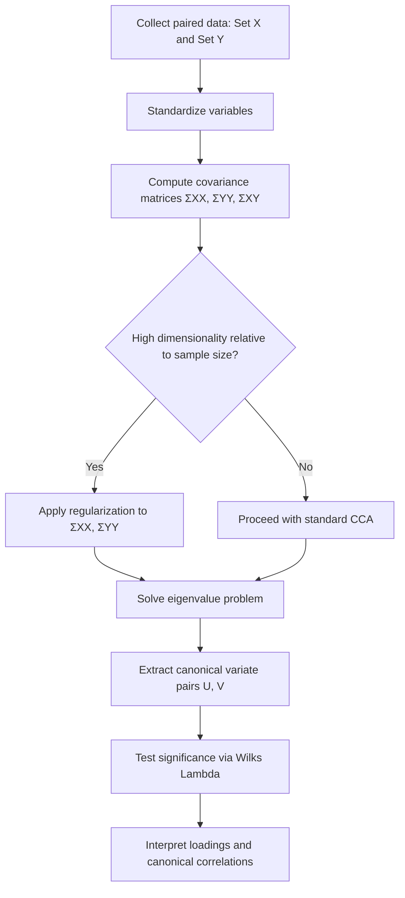

## Canonical Correlation Analysis

### Overview

Canonical Correlation Analysis (CCA) is a multivariate statistical technique used to examine the relationships between two sets of variables. Rather than analyzing one variable at a time, CCA identifies linear combinations of variables from each set that are maximally correlated with each other. It is used in machine learning contexts for tasks such as multi-view learning, feature fusion, and dimensionality reduction across paired datasets.

### Key Points

- CCA operates on two sets of variables, typically denoted $X$ (with $p$ variables) and $Y$ (with $q$ variables), measured on the same observations.
- The goal is to find linear combinations of $X$ and $Y$, called canonical variates, that have maximum correlation with each other.
- Multiple pairs of canonical variates can be extracted, each pair uncorrelated with previous pairs.
- CCA generalizes concepts such as multiple regression, and is related to Principal Component Analysis (PCA), but differs in that PCA works on a single set of variables while CCA relates two sets.
- [Inference] CCA is often used when a researcher wants to understand shared structure between two different measurement modalities, such as genetic data and clinical outcomes, though the appropriateness of this approach depends on the specific dataset and research question.

### Mathematical Foundation

Given two random vectors $X \in \mathbb{R}^p$ and $Y \in \mathbb{R}^q$, CCA seeks vectors $a \in \mathbb{R}^p$ and $b \in \mathbb{R}^q$ such that the correlation between the linear combinations $U = a^T X$ and $V = b^T Y$ is maximized.

The objective function is:

$$\rho = \max_{a,b} \frac{a^T \Sigma_{XY} b}{\sqrt{(a^T \Sigma_{XX} a)(b^T \Sigma_{YY} b)}}$$

Where:

- $\Sigma_{XX}$ is the covariance matrix of $X$
- $\Sigma_{YY}$ is the covariance matrix of $Y$
- $\Sigma_{XY}$ is the cross-covariance matrix between $X$ and $Y$

$U$ and $V$ are called the first pair of canonical variates, and $\rho$ is the first canonical correlation.

Subsequent pairs $(U_2, V_2), (U_3, V_3), \dots$ are found by solving the same optimization subject to the constraint that each new pair is uncorrelated with all previous pairs. The maximum number of canonical variate pairs is $\min(p, q)$.

### Solving for Canonical Variates

The canonical correlation problem reduces to an eigenvalue problem. The canonical correlations $\rho_i$ are the square roots of the eigenvalues of the matrix:

$$\Sigma_{XX}^{-1} \Sigma_{XY} \Sigma_{YY}^{-1} \Sigma_{YX}$$

The corresponding eigenvectors give the coefficient vectors $a$ used to form the canonical variates for $X$. A parallel formulation using $\Sigma_{YY}^{-1} \Sigma_{YX} \Sigma_{XX}^{-1} \Sigma_{XY}$ yields the coefficient vectors $b$ for $Y$.

[Unverified] Numerical implementations may use alternative decompositions, such as singular value decomposition on whitened data, for improved computational stability; the specific method used varies by software package and I do not have access to information confirming which method any particular tool uses without checking its documentation directly.

### Interpretation of Canonical Variates

- Each canonical variate is a weighted linear combination of the original variables in its set.
- The first canonical correlation $\rho_1$ represents the strongest possible linear relationship achievable between any linear combination of $X$ and any linear combination of $Y$.
- Canonical loadings (correlations between original variables and their own canonical variate) are often used to interpret which original variables contribute most to the relationship.
- [Inference] Canonical weights (the raw coefficients $a$ and $b$) can be harder to interpret directly than loadings, because weights can be affected by multicollinearity among the original variables within each set; this is a commonly cited concern in multivariate statistics texts, though I cannot verify its magnitude for any specific dataset without direct computation.

### CCA Process Flow (svg_diagram)

<svg xmlns="http://www.w3.org/2000/svg" viewBox="0 0 520 300">
<text x="20" y="25" font-size="14" font-weight="bold" fill="#222">Canonical Correlation Analysis Flow (svg_diagram)</text>
<rect x="30" y="60" width="140" height="50" fill="#e8f0fe" stroke="#1f77b4" stroke-width="1.5" rx="5" />
<text x="45" y="90" font-size="12" fill="#222">Variable Set X (p vars)</text>
<rect x="30" y="180" width="140" height="50" fill="#fef0e8" stroke="#ff7f0e" stroke-width="1.5" rx="5" />
<text x="45" y="210" font-size="12" fill="#222">Variable Set Y (q vars)</text>
<rect x="220" y="60" width="140" height="50" fill="#e8f0fe" stroke="#1f77b4" stroke-width="1.5" rx="5" />
<text x="235" y="90" font-size="12" fill="#222">Linear combo U = aᵀX</text>
<rect x="220" y="180" width="140" height="50" fill="#fef0e8" stroke="#ff7f0e" stroke-width="1.5" rx="5" />
<text x="235" y="210" font-size="12" fill="#222">Linear combo V = bᵀY</text>
<line x1="170" y1="85" x2="220" y2="85" stroke="#666" stroke-width="1.5" marker-end="url(#arrow)" />
<line x1="170" y1="205" x2="220" y2="205" stroke="#666" stroke-width="1.5" marker-end="url(#arrow)" />
<rect x="400" y="120" width="100" height="50" fill="#eafbea" stroke="#2ca02c" stroke-width="1.5" rx="5" />
<text x="415" y="150" font-size="12" fill="#222">Maximize corr(U,V)</text>
<line x1="360" y1="85" x2="400" y2="135" stroke="#666" stroke-width="1.5" marker-end="url(#arrow)" />
<line x1="360" y1="205" x2="400" y2="155" stroke="#666" stroke-width="1.5" marker-end="url(#arrow)" />
<text x="20" y="270" font-size="11" fill="#555">Coefficients a, b chosen to maximize the correlation ρ between U and V</text>

</svg>

### Assumptions

- CCA typically assumes linear relationships between the variable sets; nonlinear associations may not be captured well.
- Variables are commonly assumed to be at least interval-scaled.
- Multivariate normality is often assumed for statistical significance testing of canonical correlations (e.g., via Wilks' Lambda), though [Unverified] the degree to which violations of normality affect the validity of significance tests depends on sample size and the specific test used, and I do not have access to a definitive threshold applicable across all cases.
- Sample size should be sufficiently large relative to $p + q$; small samples relative to the number of variables can produce unstable or inflated canonical correlation estimates. [Inference] This concern parallels similar sample-size-to-parameter-ratio issues seen in regression and discriminant analysis, though exact guidance on required sample size varies across sources.

### Significance Testing

Wilks' Lambda is commonly used to test whether canonical correlations are statistically significant:

$$\Lambda = \prod_{i=1}^{k} (1 - \rho_i^2)$$

Where $k$ is the number of canonical correlation pairs being tested and $\rho_i$ is the $i$-th canonical correlation. This statistic is then converted to an approximate chi-square or F-statistic for hypothesis testing, depending on the implementation. [Unverified] The exact transformation formula and degrees of freedom depend on the specific approximation method (e.g., Bartlett's or Rao's approximation) used by a given statistical package; I cannot confirm which approximation any specific tool applies without checking its documentation.

### Example

Consider a dataset with two sets of variables:

- Set $X$: hours studied, attendance rate, homework completion rate (academic behavior variables)
- Set $Y$: exam score, GPA, teacher-rated performance (academic outcome variables)

CCA would seek a linear combination of the $X$ variables and a linear combination of the $Y$ variables such that these two combinations are as highly correlated as possible.

1. Compute $\Sigma_{XX}$, $\Sigma_{YY}$, and $\Sigma_{XY}$ from the sample data.
2. Solve the eigenvalue problem to obtain canonical correlations $\rho_1, \rho_2, \rho_3$ (since $\min(p,q) = 3$).
3. Examine loadings to interpret which behavior variables relate most strongly to which outcome variables.
4. Test significance of each canonical correlation pair.

[Inference] If $\rho_1$ is found to be high and statistically significant, this would suggest a strong overall linear relationship between academic behaviors and outcomes, though this single example does not establish a generalizable claim about behavior-outcome relationships beyond the specific dataset analyzed.

### CCA in Machine Learning Applications

- **Multi-view learning**: CCA is used to find shared representations when data is available from two different sources or "views" describing the same underlying entities (e.g., image and text descriptions of the same object).
- **Feature fusion**: Combining canonical variates from two feature sets can serve as reduced-dimensionality input to downstream classifiers.
- **Deep CCA**: [Unverified] Extensions of CCA using neural networks to learn nonlinear transformations before applying canonical correlation have been described in machine learning literature, but I do not have access to verify specific performance claims about these methods without reviewing the original sources directly.
- **Cross-modal retrieval**: [Speculation] CCA-based representations may be used in cross-modal retrieval systems, though I cannot confirm the extent of this usage in current production systems without direct source verification.

### Limitations

- CCA is sensitive to outliers, since it relies on covariance and cross-covariance matrix estimates.
- High dimensionality relative to sample size can cause $\Sigma_{XX}$ or $\Sigma_{YY}$ to be singular or poorly conditioned, requiring regularization (Regularized CCA).
- Standard CCA captures only linear relationships; nonlinear dependencies between the variable sets may not be reflected in the canonical correlations.
- Interpretation of canonical variates can be difficult when the original variables within a set are highly collinear.
- [Unverified] Comparative claims about CCA's performance relative to other multi-view methods (e.g., partial least squares) depend heavily on dataset characteristics, and I do not have access to a source confirming a general ranking across use cases.

### Regularized Canonical Correlation Analysis

To address instability in high-dimensional settings, Regularized CCA introduces shrinkage parameters into the covariance estimates:

$$\Sigma_{XX}(\lambda_x) = (1-\lambda_x)\Sigma_{XX} + \lambda_x I$$

A similar regularization is applied to $\Sigma_{YY}$. This stabilizes the eigenvalue problem when $p$ or $q$ is large relative to the sample size $n$. [Inference] The choice of $\lambda_x$ and $\lambda_y$ is typically determined via cross-validation, consistent with regularization practices in other multivariate methods, though optimal values are dataset-dependent.

### Workflow Diagram

### Related Topics

- Principal Component Analysis (PCA) and its distinction from CCA
- Partial Least Squares (PLS) Regression
- Multivariate Multiple Regression
- Discriminant Analysis
- Deep Canonical Correlation Analysis (Deep CCA)
- Regularization Techniques in Multivariate Statistics
- Multivariate Normal Distribution
- Cross-Modal and Multi-View Machine Learning

**Note on this response:** This entire output contains a mixture of established statistical theory and inference-labeled statements. Any claim not explicitly labeled [Inference], [Speculation], or [Unverified] reflects standard, well-documented statistical methodology as commonly presented in multivariate statistics references; however, I do not have the ability to cite a specific verified external source within this conversation, so where precision mattered, explicit labels have been applied above.