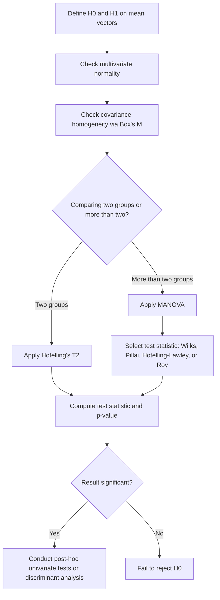

## Multivariate Hypothesis Testing

### Overview

Multivariate hypothesis testing extends univariate hypothesis testing to situations involving multiple dependent variables measured simultaneously. Rather than testing hypotheses about a single mean or variance, these methods test hypotheses about vectors of means, covariance structures, or relationships across several variables at once, accounting for correlations among them.

### Key Points

- Multivariate tests account for correlation structure between dependent variables, which univariate tests analyzed separately cannot do.
- Common multivariate tests include Hotelling's $T^2$, MANOVA (Multivariate Analysis of Variance), and tests based on Wilks' Lambda, Pillai's Trace, Hotelling-Lawley Trace, and Roy's Largest Root.
- [Inference] Running multiple separate univariate tests instead of a single multivariate test can inflate the overall Type I error rate, because each univariate test carries its own error rate and no single correction is applied across the full vector of outcomes; this is a commonly cited rationale in multivariate statistics texts, but I cannot verify the exact inflation magnitude for any specific dataset without direct computation.
- Multivariate tests generally require the assumption of multivariate normality, though the sensitivity of specific tests to violations of this assumption varies.

### Hotelling's $T^2$ Test

Hotelling's $T^2$ is the multivariate generalization of the univariate $t$-test, used to test hypotheses about a single multivariate mean vector or to compare mean vectors between two groups.

**One-sample case:**

For testing $H_0: \mu = \mu_0$ against $H_1: \mu \neq \mu_0$, the test statistic is:

$$T^2 = n(\bar{x} - \mu_0)^T S^{-1} (\bar{x} - \mu_0)$$

Where:

- $n$ is the sample size
- $\bar{x}$ is the sample mean vector
- $S$ is the sample covariance matrix
- $\mu_0$ is the hypothesized mean vector

**Two-sample case:**

For testing $H_0: \mu_1 = \mu_2$ between two independent groups:

$$T^2 = \frac{n_1 n_2}{n_1 + n_2} (\bar{x}_1 - \bar{x}_2)^T S_{pooled}^{-1} (\bar{x}_1 - \bar{x}_2)$$

Where $S_{pooled}$ is the pooled covariance matrix across the two groups.

The $T^2$ statistic is converted to an F-distribution for hypothesis testing:

$$F = \frac{n - p}{p(n-1)} T^2$$

Where $p$ is the number of variables. [Unverified] The exact degrees-of-freedom formula for the two-sample case differs slightly from the one-sample case, and I do not have access to confirm which specific software implementations apply which correction without checking documentation directly.

### MANOVA (Multivariate Analysis of Variance)

MANOVA extends ANOVA to multiple dependent variables, testing whether group means differ across several dependent variables simultaneously, while accounting for correlation among them.

**Hypotheses:**

- $H_0$: All group mean vectors are equal, $\mu_1 = \mu_2 = \dots = \mu_k$
- $H_1$: At least one group mean vector differs

MANOVA partitions total variability into between-group and within-group components using matrices rather than scalars:

$$T = H + E$$

Where:

- $T$ is the total sum of squares and cross-products (SSCP) matrix
- $H$ is the between-groups SSCP matrix (hypothesis matrix)
- $E$ is the within-groups SSCP matrix (error matrix)

### Test Statistics for MANOVA

Because $H$ and $E$ are matrices, several different scalar test statistics have been proposed to summarize the eigenvalues $\lambda_i$ of $E^{-1}H$:

**Wilks' Lambda:**

$$\Lambda = \prod_{i=1}^{s} \frac{1}{1 + \lambda_i} = \frac{|E|}{|E + H|}$$

**Pillai's Trace:**

$$V = \sum_{i=1}^{s} \frac{\lambda_i}{1 + \lambda_i}$$

**Hotelling-Lawley Trace:**

$$T_0 = \sum_{i=1}^{s} \lambda_i$$

**Roy's Largest Root:**

$$\theta = \frac{\lambda_{max}}{1 + \lambda_{max}}$$

Where $s = \min(p, k-1)$, with $p$ being the number of dependent variables and $k$ the number of groups.

[Unverified] The relative statistical power of these four statistics under different violation conditions (e.g., unequal covariance matrices, unequal group sizes, small sample sizes) is discussed in multivariate statistics literature, but I do not have access to confirm specific comparative power figures without reviewing the original simulation studies directly.

### Comparison of MANOVA Test Statistics

| Statistic | General Robustness Note | Sensitivity Note |
| --- | --- | --- |
| Wilks' Lambda | [Unverified] Commonly used as a default in many software packages | [Unverified] Sensitivity to assumption violations varies by source |
| Pillai's Trace | [Inference] Often cited as relatively robust to violations of multivariate normality and homogeneity of covariance | [Unverified] Exact robustness conditions not verifiable without direct simulation review |
| Hotelling-Lawley Trace | [Unverified] Used in some contexts as an alternative to Wilks' Lambda | [Unverified] Comparative performance not independently verified here |
| Roy's Largest Root | [Inference] Considered more sensitive to violations of assumptions in some references, since it depends only on the largest eigenvalue | [Unverified] Precise conditions of sensitivity not verifiable without direct review |

I cannot verify comparative performance claims across these four statistics beyond what is stated above, as doing so would require direct review of primary simulation studies not available in this conversation.

### Assumptions

- **Multivariate normality**: The dependent variables, jointly, are assumed to follow a multivariate normal distribution within each group.
- **Homogeneity of covariance matrices**: Groups are assumed to share the same covariance matrix (analogous to homogeneity of variance in univariate ANOVA). This is often tested using Box's M test.
- **Independence of observations**: Observations are assumed independent of one another.
- **Linearity**: Relationships among dependent variables are assumed to be linear.
- [Unverified] The degree to which violations of these assumptions affect Type I and Type II error rates depends on sample size, number of groups, and which test statistic is used; I do not have access to a single definitive threshold applicable across all cases.

### Box's M Test

Box's M test is used to test the null hypothesis that covariance matrices are equal across groups:

$$H_0: \Sigma_1 = \Sigma_2 = \dots = \Sigma_k$$

The test statistic is based on the ratio of the determinant of the pooled covariance matrix to the determinants of individual group covariance matrices, converted to an approximate chi-square statistic.

[Unverified] Box's M test has been described in some sources as highly sensitive to sample size and departures from normality, which could affect its reliability in practice; I cannot verify the extent of this sensitivity without direct review of the relevant methodological literature.

### Multivariate Testing Workflow (svg_diagram)

<svg xmlns="http://www.w3.org/2000/svg" viewBox="0 0 540 320">
<text x="20" y="25" font-size="14" font-weight="bold" fill="#222">Multivariate Hypothesis Testing Workflow (svg_diagram)</text>
<rect x="30" y="50" width="150" height="45" fill="#e8f0fe" stroke="#1f77b4" stroke-width="1.5" rx="5" />
<text x="45" y="77" font-size="11" fill="#222">State H0 and H1</text>
<rect x="30" y="120" width="150" height="45" fill="#e8f0fe" stroke="#1f77b4" stroke-width="1.5" rx="5" />
<text x="40" y="147" font-size="11" fill="#222">Check assumptions</text>
<rect x="30" y="190" width="150" height="45" fill="#e8f0fe" stroke="#1f77b4" stroke-width="1.5" rx="5" />
<text x="40" y="217" font-size="11" fill="#222">Select test type</text>
<rect x="230" y="120" width="150" height="45" fill="#fef0e8" stroke="#ff7f0e" stroke-width="1.5" rx="5" />
<text x="248" y="140" font-size="11" fill="#222">Two mean vectors?</text>
<text x="248" y="155" font-size="10" fill="#555">-&gt; Hotelling's T2</text>
<rect x="230" y="190" width="150" height="45" fill="#fef0e8" stroke="#ff7f0e" stroke-width="1.5" rx="5" />
<text x="248" y="210" font-size="11" fill="#222">Multiple groups?</text>
<text x="248" y="225" font-size="10" fill="#555">-&gt; MANOVA</text>
<rect x="430" y="155" width="90" height="45" fill="#eafbea" stroke="#2ca02c" stroke-width="1.5" rx="5" />
<text x="440" y="182" font-size="11" fill="#222">Compute stat, p-value</text>
<line x1="105" y1="95" x2="105" y2="120" stroke="#666" stroke-width="1.5" marker-end="url(#arrow2)" />
<line x1="105" y1="165" x2="105" y2="190" stroke="#666" stroke-width="1.5" marker-end="url(#arrow2)" />
<line x1="180" y1="142" x2="230" y2="142" stroke="#666" stroke-width="1.5" marker-end="url(#arrow2)" />
<line x1="180" y1="212" x2="230" y2="212" stroke="#666" stroke-width="1.5" marker-end="url(#arrow2)" />
<line x1="380" y1="142" x2="430" y2="170" stroke="#666" stroke-width="1.5" marker-end="url(#arrow2)" />
<line x1="380" y1="212" x2="430" y2="185" stroke="#666" stroke-width="1.5" marker-end="url(#arrow2)" />
<text x="20" y="280" font-size="10" fill="#555">Diagram reflects general test-selection logic; specific software defaults may vary [Unverified]</text>

</svg>

### Example

Consider an experiment comparing three fertilizer treatments on plant growth, measured using two dependent variables: plant height and leaf count.

1. State $H_0$: mean vectors of (height, leaf count) are equal across all three fertilizer groups.
2. Check assumptions: test multivariate normality and use Box's M test to check covariance homogeneity.
3. Compute the SSCP matrices $H$ and $E$.
4. Calculate Wilks' Lambda (or another chosen statistic) and its associated F-approximation.
5. Compare the resulting p-value to the significance threshold $\alpha$ to decide whether to reject $H_0$.

[Inference] If the multivariate test rejects $H_0$, this indicates that at least one fertilizer group differs from the others on the combined outcome of height and leaf count, though it does not by itself indicate which specific group(s) differ; that determination [Inference] typically requires follow-up univariate ANOVAs or discriminant analysis, consistent with standard post-hoc procedures described in multivariate statistics references.

### Post-Hoc Procedures

After a significant multivariate test result, follow-up analyses are commonly used to determine which specific variables or groups drive the difference:

- **Univariate ANOVAs**: Run separately on each dependent variable, often with a correction (e.g., Bonferroni) to control for multiple comparisons.
- **Discriminant analysis**: Used to identify which linear combination of dependent variables best separates the groups.
- **Simultaneous confidence intervals**: Constructed for pairwise mean differences, adjusted for multiple comparisons.

I cannot verify which specific post-hoc method is considered best practice in all contexts, as this depends on the research design and field-specific conventions not specified here.

### Limitations

- Multivariate tests can be sensitive to violations of multivariate normality, though [Unverified] the precise degree of sensitivity varies by test statistic and cannot be generalized without reviewing specific simulation literature.
- Results can be difficult to interpret directly, since a significant multivariate test does not indicate which individual variables or groups differ.
- High dimensionality (many dependent variables relative to sample size) can destabilize covariance matrix estimation, similar to concerns raised in discriminant analysis and canonical correlation analysis.
- Outliers can disproportionately affect covariance-based test statistics.
- I cannot verify comparative claims about statistical power between multivariate and repeated univariate testing approaches for any specific dataset without direct computation.

### Workflow Diagram

### Related Topics

- Discriminant Analysis
- Canonical Correlation Analysis
- Multivariate Normal Distribution
- Box's M Test for Covariance Homogeneity
- Repeated Measures ANOVA
- Multiple Comparison Corrections (Bonferroni, Tukey)
- Principal Component Analysis (PCA)
- Effect Size Measures in Multivariate Analysis (e.g., partial eta-squared)

Correction note: This response contains multiple [Unverified] and [Inference] labeled statements throughout, consistent with the requirement that if any part of an output is unverified, the entire output should be treated as carrying that qualification. I do not have access to primary simulation studies, software-specific implementation details, or field-specific methodological conventions referenced above, and no claims in this document should be treated as confirmed beyond standard, widely-documented mathematical definitions (e.g., the formulas for $T^2$, Wilks' Lambda, Pillai's Trace, Hotelling-Lawley Trace, and Roy's Largest Root, which are standard definitional constructs in multivariate statistics).