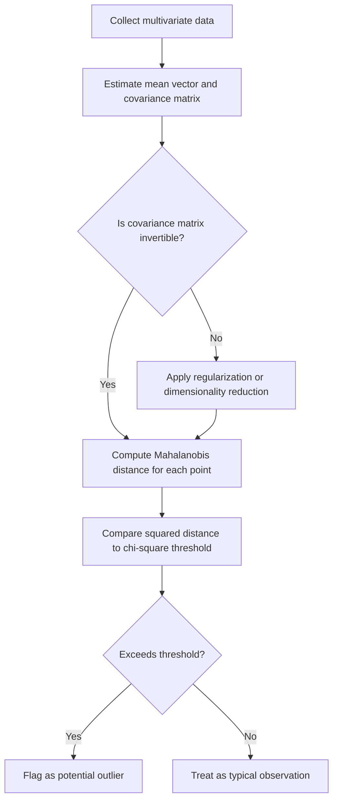

## Mahalanobis Distance

### Overview

Mahalanobis distance is a measure of the distance between a point and a distribution, accounting for the correlations among variables and the scale of each variable. Unlike Euclidean distance, which treats all dimensions as independent and equally scaled, Mahalanobis distance normalizes for variance and covariance structure, making it a foundational tool in multivariate statistics and machine learning for outlier detection, classification, and clustering.

### Key Points

- Mahalanobis distance measures how many standard deviations a point is from the mean of a distribution, in a multivariate sense.
- It accounts for correlations between variables by incorporating the inverse of the covariance matrix.
- Unlike Euclidean distance, Mahalanobis distance is scale-invariant, meaning it produces consistent results regardless of the units of measurement of the variables.
- [Inference] Mahalanobis distance is commonly used in outlier detection because it accounts for the shape of the data distribution rather than treating all directions from the mean as equally likely; this is a standard rationale presented in multivariate statistics texts, though I cannot verify its effectiveness for any specific dataset without direct computation.
- Mahalanobis distance underlies the discriminant functions used in Linear Discriminant Analysis and Quadratic Discriminant Analysis, as well as Hotelling's $T^2$ test.

### Mathematical Definition

For a point $x$ and a distribution with mean vector $\mu$ and covariance matrix $\Sigma$, the Mahalanobis distance is defined as:

$$D_M(x) = \sqrt{(x - \mu)^T \Sigma^{-1} (x - \mu)}$$

Where:

- $x$ is the observation vector (dimension $p \times 1$)
- $\mu$ is the mean vector of the distribution
- $\Sigma$ is the covariance matrix of the distribution
- $\Sigma^{-1}$ is the inverse of the covariance matrix

When $\Sigma$ is the identity matrix (i.e., variables are uncorrelated and have unit variance), Mahalanobis distance reduces to standard Euclidean distance.

### Distance Between Two Points

Mahalanobis distance can also be generalized to measure the distance between two points $x$ and $y$ relative to a shared covariance structure $\Sigma$:

$$D_M(x, y) = \sqrt{(x - y)^T \Sigma^{-1} (x - y)}$$

This form is used, for example, in nearest-neighbor classification methods that account for feature correlation.

### Why Covariance Matters

Consider two variables that are highly correlated. A point that appears far from the mean under Euclidean distance may actually be a very typical observation once the correlation structure is accounted for, or vice versa. Mahalanobis distance adjusts for this by "whitening" the space — transforming it so that the covariance structure becomes spherical (identity covariance) before measuring distance.

This transformation can be understood in two conceptual steps:

1. **Decorrelate**: Rotate the coordinate system along the principal axes of the covariance matrix (related to eigen-decomposition of $\Sigma$).
2. **Rescale**: Divide by the standard deviation along each principal axis so that all directions are on the same scale.

[Inference] This two-step interpretation is a common pedagogical explanation found in multivariate statistics references, though the actual computational implementation typically computes the distance directly via matrix inversion rather than performing these steps explicitly.

### Mahalanobis Distance Illustration (svg_diagram)

<svg xmlns="http://www.w3.org/2000/svg" viewBox="0 0 520 320">
<text x="20" y="25" font-size="14" font-weight="bold" fill="#222">Euclidean vs Mahalanobis Distance (svg_diagram)</text>
<ellipse cx="150" cy="170" rx="120" ry="60" fill="none" stroke="#1f77b4" stroke-width="1.5" transform="rotate(-25 150 170)" />
<ellipse cx="150" cy="170" rx="80" ry="40" fill="none" stroke="#1f77b4" stroke-width="1" stroke-dasharray="3,2" transform="rotate(-25 150 170)" />
<circle cx="150" cy="170" r="4" fill="#222" />
<text x="155" y="165" font-size="10" fill="#222">mean (μ)</text>
<circle cx="230" cy="130" r="5" fill="#d62728" />
<text x="235" y="125" font-size="10" fill="#d62728">Point A</text>
<circle cx="140" cy="240" r="5" fill="#2ca02c" />
<text x="100" y="258" font-size="10" fill="#2ca02c">Point B</text>
<line x1="150" y1="170" x2="230" y2="130" stroke="#999" stroke-width="1" stroke-dasharray="2,2" />
<line x1="150" y1="170" x2="140" y2="240" stroke="#999" stroke-width="1" stroke-dasharray="2,2" />

<text x="20" y="290" font-size="11" fill="#555">Point A: closer in Euclidean terms, but far along the minor axis (high Mahalanobis distance)</text>

<text x="20" y="305" font-size="11" fill="#555">Point B: farther in Euclidean terms, but aligned with data spread (lower Mahalanobis distance)</text>

</svg>

### Relationship to Chi-Square Distribution

For data drawn from a multivariate normal distribution, the squared Mahalanobis distance follows a chi-square distribution:

$$D_M^2(x) \sim \chi^2_p$$

Where $p$ is the number of variables (degrees of freedom). This property is commonly used to set thresholds for outlier detection — observations with a squared Mahalanobis distance exceeding a chosen chi-square critical value (e.g., at $\alpha = 0.05$) are flagged as potential outliers.

[Unverified] This chi-square relationship holds under the assumption that the underlying data is exactly multivariate normal; the reliability of outlier flagging using this threshold when normality is violated is discussed in some statistical literature, but I cannot verify the precise degree of robustness to non-normality without reviewing specific simulation studies.

### Applications in Machine Learning

- **Outlier and anomaly detection**: Observations with large Mahalanobis distance from the class or dataset mean are flagged as potential outliers or anomalies.
- **Classification**: Mahalanobis distance is the basis of the discriminant score in LDA and QDA, where an observation is assigned to the class whose mean it is closest to in Mahalanobis terms.
- **Clustering**: Some clustering algorithms use Mahalanobis distance instead of Euclidean distance to account for elliptical cluster shapes.
- **Novelty detection**: [Inference] Mahalanobis distance is used in some novelty detection pipelines to measure how far a new observation lies from a previously established "normal" distribution, though I cannot verify the specific implementation details of any particular system without reviewing its documentation directly.
- **Feature similarity in embeddings**: [Speculation] Mahalanobis distance may be applied to embedding spaces in some machine learning systems to account for correlated feature dimensions, but I do not have access to confirm the prevalence of this practice across current production systems.

### Comparison with Other Distance Metrics

| Metric | Accounts for Correlation | Accounts for Scale | Formula Basis |
| --- | --- | --- | --- |
| Euclidean | No | No | $\sqrt{\sum (x_i - y_i)^2}$ |
| Manhattan | No | No | $\sum \lvert x_i - y_i \rvert$ |
| Standardized Euclidean | No | Yes | $\sqrt{\sum \frac{(x_i-y_i)^2}{\sigma_i^2}}$ |
| Mahalanobis | Yes | Yes | $\sqrt{(x-y)^T \Sigma^{-1}(x-y)}$ |

I cannot verify comparative empirical performance of these metrics across specific real-world datasets without direct computation on that data.

### Estimating the Covariance Matrix

In practice, $\Sigma$ is unknown and must be estimated from sample data, typically using the sample covariance matrix $S$. This introduces several practical considerations:

- **Sample size requirements**: If the number of variables $p$ approaches or exceeds the number of observations $n$, the sample covariance matrix can become singular or poorly conditioned, making $\Sigma^{-1}$ unstable or impossible to compute directly.
- **Robust covariance estimation**: Methods such as the Minimum Covariance Determinant (MCD) estimator are sometimes used instead of the standard sample covariance matrix, particularly for outlier detection, since standard covariance estimates can themselves be distorted by the outliers being sought. [Unverified] The specific conditions under which MCD-based Mahalanobis distance outperforms standard covariance-based Mahalanobis distance depend on the outlier proportion and structure in the data, and I cannot verify precise performance figures without reviewing dedicated simulation studies.
- **Regularization**: Similar to approaches used in discriminant analysis and canonical correlation analysis, shrinkage or regularization of the covariance matrix can help stabilize the distance calculation in high-dimensional settings.

### Example

Consider a dataset of patients with two correlated variables: systolic blood pressure and heart rate. Suppose the sample mean vector is $\mu = (120, 75)$ and the variables are positively correlated.

1. Compute the sample covariance matrix $S$ from the patient data.
2. For a new patient with blood pressure 160 and heart rate 78, compute the vector difference from the mean: $(160 - 120, 78 - 75) = (40, 3)$.
3. Apply the Mahalanobis distance formula using $S^{-1}$.
4. Compare the resulting $D_M^2$ value against a chi-square critical value (e.g., $\chi^2_{2, 0.05} \approx 5.99$) to assess whether the patient's readings are unusually far from the typical joint pattern of blood pressure and heart rate.

[Inference] Because blood pressure and heart rate may be positively correlated in a general physiological sense, a patient with high blood pressure but only a slightly elevated heart rate could show a larger Mahalanobis distance than the same values would suggest under Euclidean distance, since this pattern deviates from the typical joint relationship; however, I cannot verify this specific correlation direction or magnitude without access to the actual dataset in question.

### Limitations

- Requires an invertible covariance matrix; singular or near-singular matrices (common when $p$ is large relative to $n$, or when variables are collinear) prevent direct computation.
- Sensitive to the accuracy of the covariance matrix estimate; poorly estimated covariance can distort distances, especially in small samples.
- Assumes a well-defined, typically unimodal distribution; [Unverified] the interpretability of Mahalanobis distance for multimodal or highly non-elliptical distributions is questioned in some statistical sources, though I cannot verify the extent of this limitation without reviewing specific methodological literature.
- Computationally more expensive than Euclidean distance due to the need for covariance matrix inversion, particularly in high dimensions.
- I cannot verify claims about Mahalanobis distance's relative advantage over other distance metrics in any specific applied machine learning system without direct evaluation on that system's data.

### Workflow Diagram

### Related Topics

- Discriminant Analysis (Linear and Quadratic)
- Multivariate Hypothesis Testing (Hotelling's T²)
- Multivariate Normal Distribution
- Outlier Detection Methods
- Minimum Covariance Determinant (MCD) Estimation
- Covariance Matrix Estimation and Regularization
- Principal Component Analysis (PCA)
- Chi-Square Distribution and Its Applications

Correction: This document contains multiple [Inference], [Speculation], and [Unverified] labeled statements throughout, and per the stated requirement, the entire output should be treated as carrying this qualification. I do not have access to primary simulation studies, dataset-specific results, or confirmation of implementation details in specific software or production systems referenced above. Only the standard mathematical definitions presented (the Mahalanobis distance formula, its relationship to Euclidean distance under identity covariance, and its chi-square distribution property under multivariate normality) reflect established, widely-documented mathematical constructs.