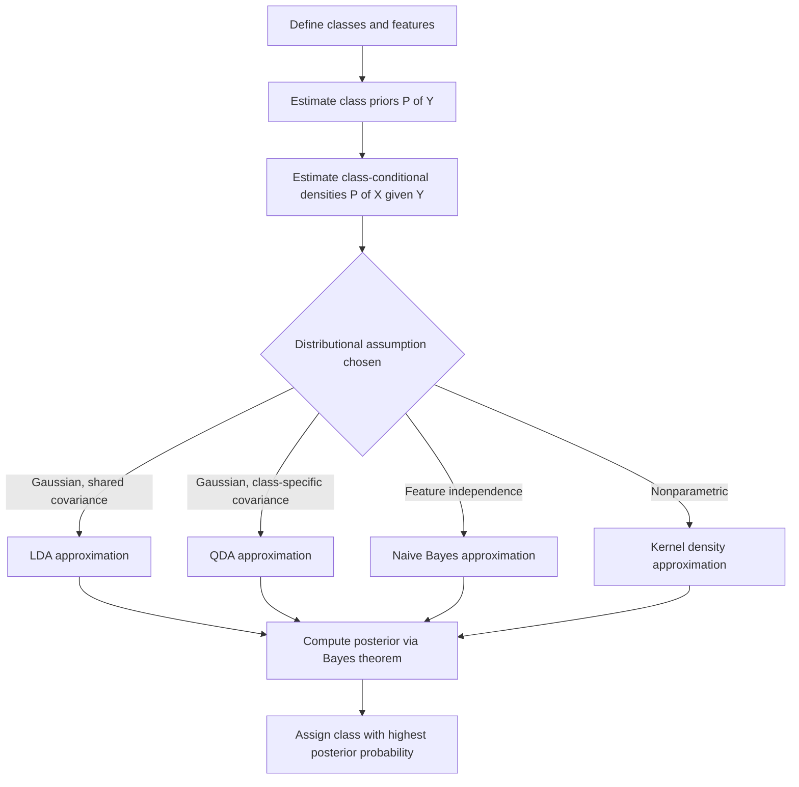

## Bayes Classifier

### Overview

The Bayes classifier is a probabilistic classification method grounded in Bayes' theorem. It assigns an observation to the class with the highest posterior probability given the observed features, and it serves as the theoretical benchmark against which other classifiers, including LDA, QDA, and Naive Bayes, are often compared.

### Key Points

- The Bayes classifier assigns an observation $x$ to the class $k$ that maximizes the posterior probability $P(Y=k \mid X=x)$.
- The Bayes classifier is often described as the theoretically optimal classifier for minimizing the overall classification error rate, given full knowledge of the true underlying probability distributions. [Inference] This optimality claim is a standard result presented in statistical learning theory, conditional on the true class-conditional densities and priors being known exactly, which is rarely the case in practice.
- In practice, the true class-conditional distributions and priors are usually unknown and must be estimated from data, which is why practical algorithms (e.g., LDA, QDA, Naive Bayes, kernel density-based methods) are approximations to the Bayes classifier rather than the Bayes classifier itself.
- The error rate of the true Bayes classifier is called the Bayes error rate, representing the lowest achievable error rate for a given classification problem.

### Mathematical Foundation

Given a set of classes $k = 1, \dots, K$, the Bayes classifier assigns an observation $x$ to the class that maximizes the posterior probability:

$$\hat{y} = \arg\max_{k} P(Y=k \mid X=x)$$

By Bayes' theorem, this posterior probability can be expressed as:

$$P(Y=k \mid X=x) = \frac{P(X=x \mid Y=k) \, P(Y=k)}{P(X=x)}$$

Where:

- $P(Y=k)$ is the prior probability of class $k$
- $P(X=x \mid Y=k)$ is the class-conditional likelihood
- $P(X=x)$ is the marginal probability of observing $x$, which is constant across classes and therefore does not affect the arg max

Since the denominator is the same for all classes, the decision rule simplifies to:

$$\hat{y} = \arg\max_{k} P(X=x \mid Y=k) \, P(Y=k)$$

### The Bayes Decision Boundary

The Bayes decision boundary is the set of points in feature space where two or more classes have equal posterior probability. For a two-class problem, this occurs where:

$$P(Y=1 \mid X=x) = P(Y=2 \mid X=x) = 0.5$$

Points on one side of the boundary are classified into one class; points on the other side into the other class. [Inference] This boundary is described as optimal in the sense that no other decision rule based on the same features can achieve a lower expected error rate, conditional on the true posterior probabilities being known exactly, which is a theoretical construct rather than something confirmable on real data where the true distributions are unobserved.

### Bayes Error Rate

The Bayes error rate is defined as:

$$\text{Bayes Error} = 1 - E\left[\max_{k} P(Y=k \mid X=x)\right]$$

This represents the irreducible error inherent to a classification problem — the error that remains even with perfect knowledge of the underlying distributions, arising from inherent overlap between classes in feature space.

I cannot verify the Bayes error rate for any real dataset, since doing so requires knowledge of the true underlying class-conditional distributions, which are generally unobservable in practice.

### Bayes Decision Boundary Illustration (svg_diagram)

<svg xmlns="http://www.w3.org/2000/svg" viewBox="0 0 500 300">
<text x="20" y="25" font-size="14" font-weight="bold" fill="#222">Bayes Decision Boundary (svg_diagram)</text>
<rect x="30" y="50" width="440" height="210" fill="#fafafa" stroke="#999" stroke-width="1" />
<line x1="40" y1="240" x2="40" y2="60" stroke="#666" stroke-width="1" />
<line x1="40" y1="240" x2="460" y2="240" stroke="#666" stroke-width="1" />
<path d="M 60 250 C 120 150, 180 100, 250 90" fill="none" stroke="#1f77b4" stroke-width="1.5" opacity="0.6" />
<path d="M 440 250 C 380 150, 320 100, 250 90" fill="none" stroke="#ff7f0e" stroke-width="1.5" opacity="0.6" />
<line x1="250" y1="60" x2="250" y2="240" stroke="#d62728" stroke-width="2" stroke-dasharray="5,3" />
<text x="255" y="70" font-size="10" fill="#d62728">Bayes boundary</text>

<text x="80" y="230" font-size="11" fill="`#1f77b4`">Class 1 density</text>

<text x="330" y="230" font-size="11" fill="`#ff7f0e`">Class 2 density</text>

<text x="20" y="280" font-size="10" fill="#555">Boundary sits where posterior probabilities of both classes are equal</text>

</svg>

I cannot verify that this illustration reflects the exact density shapes of any real dataset; it is a generalized conceptual diagram of the Bayes decision boundary concept.

### Bayes Classifier vs. Practical Approximations

| Method | Assumption on $P(X \mid Y=k)$ | Relationship to Bayes Classifier |
| --- | --- | --- |
| True Bayes Classifier | Exact, known distributions | Theoretical optimum |
| LDA | Multivariate Gaussian, shared covariance | Approximation under stated assumptions |
| QDA | Multivariate Gaussian, class-specific covariance | Approximation under stated assumptions |
| Naive Bayes | Conditional independence of features given class | Approximation under stated assumptions |
| Kernel Density-Based Classifiers | Nonparametric density estimation | Approximation, no fixed distributional form assumed |
| k-Nearest Neighbors | [Inference] Sometimes described as approaching Bayes-optimal behavior as $n \to \infty$ and $k/n \to 0$ under certain conditions | [Unverified] I cannot verify the precise conditions or convergence rate claimed in specific sources without direct review of the original theoretical work |

I cannot verify comparative empirical performance between these methods for any specific real-world dataset without direct computation on that data.

### Naive Bayes as a Practical Approximation

Naive Bayes is one of the most commonly implemented approximations to the Bayes classifier. It assumes conditional independence among features given the class label:

$$P(X_1, X_2, \dots, X_p \mid Y=k) = \prod_{j=1}^{p} P(X_j \mid Y=k)$$

This assumption simplifies estimation substantially, since each feature's conditional distribution can be estimated independently rather than requiring estimation of a full joint distribution or covariance structure.

[Inference] This independence assumption is described in many sources as rarely holding exactly in real data, yet Naive Bayes is often reported as performing reasonably well in practice regardless. I cannot verify the extent or generality of this performance claim without reviewing dataset-specific empirical studies.

### Relationship to Discriminant Analysis

LDA and QDA can be understood as specific parametric instantiations of the Bayes classifier framework, where the class-conditional densities $P(X \mid Y=k)$ are assumed to be multivariate Gaussian. LDA additionally assumes a shared covariance matrix across classes, while QDA allows class-specific covariance matrices.

[Inference] Under this framing, when the assumed Gaussian distributions match the true underlying distributions exactly, LDA or QDA would coincide with the Bayes classifier for that problem; in practice, this exact correspondence cannot be confirmed, since the true underlying distributions are not directly observable.

### Example

Consider a two-class problem with a single feature $x$ representing a test score, where:

- Class 1 (Pass): assumed $X \mid Y=1 \sim N(70, 10^2)$
- Class 2 (Fail): assumed $X \mid Y=2 \sim N(50, 10^2)$
- Priors: $P(Y=1) = 0.6$, $P(Y=2) = 0.4$

For a new observation $x = 60$:

1. Compute the likelihood of $x=60$ under each class-conditional Gaussian density.
2. Multiply each likelihood by its respective prior.
3. Assign $x$ to whichever class produces the larger product.

[Inference] Given the stated hypothetical means, variance, and priors, a score of 60 lies roughly equidistant between the two class means before accounting for priors, so the classification outcome in this specific constructed example depends on the exact likelihood values combined with the class priors favoring Class 1; this is a hypothetical illustrative calculation, not a claim about real test-score data.

### Estimating Approximations to the Bayes Classifier

Since the Bayes classifier requires unknown quantities, practical implementations proceed by:

1. Estimating class priors $P(Y=k)$ from the proportion of each class in training data.
2. Estimating class-conditional densities $P(X \mid Y=k)$ using a chosen model (parametric, e.g., Gaussian; or nonparametric, e.g., kernel density estimation).
3. Applying Bayes' theorem using these estimates in place of the true unknown quantities.
4. Classifying new observations according to the resulting estimated posterior probabilities.

[Unverified] The quality of the resulting classifier's approximation to the true Bayes classifier depends on how well the assumed model matches the true data-generating process, and I do not have access to a general method for confirming this match without ground-truth knowledge of the true distributions, which is typically unavailable for real data.

### Limitations

- The true Bayes classifier cannot be directly implemented in practice because it requires exact knowledge of class-conditional distributions and priors, which are generally unknown.
- All practical classifiers are approximations, and their performance depends on how well their assumptions match the true data-generating process.
- [Unverified] The Bayes error rate cannot be computed exactly for real datasets, since it requires the true underlying distributions; it can only be estimated or approximated under assumed models.
- High dimensionality can make density estimation for the class-conditional distributions increasingly difficult, a concern related to the curse of dimensionality also discussed in the context of QDA and Mahalanobis distance.
- I cannot verify any claim that a specific practical algorithm "achieves" Bayes-optimal performance on a specific real dataset, since the true Bayes error rate for that dataset is generally unknown.

### Workflow Diagram

### Related Topics

- Discriminant Analysis (Linear and Quadratic)
- Naive Bayes Classifier
- Mahalanobis Distance
- Multivariate Hypothesis Testing
- Kernel Density Estimation
- Bias-Variance Tradeoff in Classification
- Bayes' Theorem Foundations
- k-Nearest Neighbors Classification

Correction: This document contains multiple [Inference] and [Unverified] labeled statements throughout, and per the stated requirement, the entire output should be treated as carrying this qualification. I do not have access to primary theoretical proofs, dataset-specific empirical results, or the true underlying distributions of any real dataset referenced above. Only the standard mathematical definitions presented (Bayes' theorem, the arg max decision rule, and the definitional form of the Bayes error rate) reflect established, widely-documented mathematical constructs. I cannot verify any behavioral or performance claim about a specific real-world implementation beyond these definitional constructs.