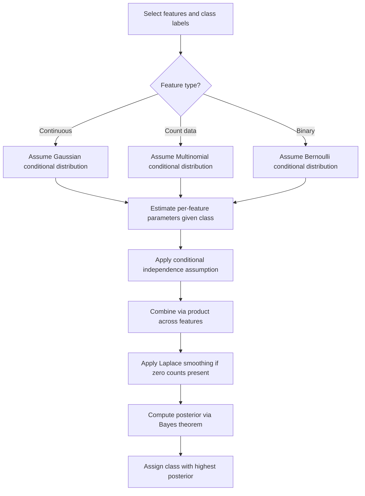

## Naive Bayes Assumptions

### Overview

Naive Bayes classifiers rely on a specific set of simplifying assumptions to make probabilistic classification computationally tractable. Understanding these assumptions is essential for knowing when Naive Bayes is likely to perform well and when its simplifications may introduce bias into predictions.

### Key Points

- The central assumption of Naive Bayes is conditional independence of features given the class label.
- This assumption is what distinguishes Naive Bayes from a full Bayes classifier, which would otherwise require estimating a complete joint distribution of all features.
- [Inference] The conditional independence assumption is described in many statistics and machine learning references as rarely holding exactly for real-world data, though this claim depends on the specific dataset and cannot be confirmed as universally true without direct testing on that data.
- Despite the assumption often being violated in practice, Naive Bayes is frequently reported in literature as performing reasonably well on many classification tasks. [Unverified] I do not have access to a comprehensive, dataset-independent source confirming the general magnitude or consistency of this performance across all application domains.

### The Conditional Independence Assumption

Formally, given a class label $Y=k$ and features $X_1, X_2, \dots, X_p$, Naive Bayes assumes:

$$P(X_1, X_2, \dots, X_p \mid Y=k) = \prod_{j=1}^{p} P(X_j \mid Y=k)$$

This means that, once the class is known, knowing the value of one feature provides no additional information about the value of another feature. This is a strong simplification compared to modeling the full joint conditional distribution $P(X_1, \dots, X_p \mid Y=k)$ directly.

Combined with Bayes' theorem, the posterior probability used for classification becomes:

$$P(Y=k \mid X_1, \dots, X_p) \propto P(Y=k) \prod_{j=1}^{p} P(X_j \mid Y=k)$$

### Why This Assumption Matters Computationally

Without the independence assumption, estimating $P(X_1, \dots, X_p \mid Y=k)$ directly would require modeling the full joint distribution across all features, which grows exponentially in complexity as the number of features increases. The independence assumption reduces this to estimating $p$ separate univariate (or per-feature) conditional distributions, one for each feature given the class.

[Inference] This reduction in estimation complexity is commonly cited as the primary practical motivation for the Naive Bayes assumption, since it substantially lowers the amount of data needed to obtain stable probability estimates compared to full joint density estimation; I cannot verify the exact data requirements for any specific real dataset without direct computation.

### Additional Assumptions Depending on Feature Type

Beyond conditional independence, Naive Bayes implementations typically require an assumption about the form of each feature's conditional distribution $P(X_j \mid Y=k)$:

- **Gaussian Naive Bayes**: Assumes each continuous feature, conditional on class, follows a normal distribution:

  $$P(X_j \mid Y=k) = \frac{1}{\sqrt{2\pi\sigma_{jk}^2}} \exp\left(-\frac{(x_j - \mu_{jk})^2}{2\sigma_{jk}^2}\right)$$
- **Multinomial Naive Bayes**: Assumes discrete count features follow a multinomial distribution, commonly used in text classification with word frequency counts.
- **Bernoulli Naive Bayes**: Assumes binary features follow a Bernoulli distribution, commonly used for presence/absence feature representations.

[Unverified] The choice among these variants depends on the nature of the input features, and I do not have access to a universal rule confirming which variant is optimal for any specific dataset without empirical testing on that data.

### Naive Bayes Assumption Structure (svg_diagram)

<svg xmlns="http://www.w3.org/2000/svg" viewBox="0 0 520 300">
<text x="20" y="25" font-size="14" font-weight="bold" fill="#222">Naive Bayes Conditional Independence (svg_diagram)</text>
<circle cx="260" cy="60" r="30" fill="#e8f0fe" stroke="#1f77b4" stroke-width="1.5" />
<text x="245" y="65" font-size="12" fill="#222">Y=k</text>
<circle cx="100" cy="180" r="30" fill="#fef0e8" stroke="#ff7f0e" stroke-width="1.5" />
<text x="85" y="185" font-size="11" fill="#222">X1</text>
<circle cx="260" cy="180" r="30" fill="#fef0e8" stroke="#ff7f0e" stroke-width="1.5" />
<text x="245" y="185" font-size="11" fill="#222">X2</text>
<circle cx="420" cy="180" r="30" fill="#fef0e8" stroke="#ff7f0e" stroke-width="1.5" />
<text x="400" y="185" font-size="11" fill="#222">Xp</text>
<line x1="240" y1="85" x2="120" y2="155" stroke="#666" stroke-width="1.5" marker-end="url(#arrow3)" />
<line x1="260" y1="90" x2="260" y2="150" stroke="#666" stroke-width="1.5" marker-end="url(#arrow3)" />
<line x1="280" y1="85" x2="400" y2="155" stroke="#666" stroke-width="1.5" marker-end="url(#arrow3)" />
<text x="20" y="260" font-size="11" fill="#555">No direct edges among X1, X2, ..., Xp: each feature depends only on Y</text>

<text x="20" y="278" font-size="11" fill="#555">This graphical structure represents the assumed conditional independence</text>

</svg>

### Consequences When the Assumption Is Violated

When features are actually correlated given the class label, the independence assumption is violated. [Inference] In this situation, the model may effectively "double-count" evidence from correlated features, since each correlated feature contributes independently to the posterior calculation despite carrying overlapping information; this is a commonly cited theoretical consequence in machine learning references, but I cannot verify its practical magnitude for any specific dataset without direct testing.

[Unverified] Some sources suggest that despite this theoretical concern, Naive Bayes classifiers can still produce reasonably accurate class rankings (i.e., correct arg max decisions) even when the estimated posterior probabilities themselves are poorly calibrated, because classification only requires the correct class to have the highest score, not an accurate probability value. I do not have access to confirm the generality of this claim across different data conditions without reviewing specific empirical studies.

### Other Assumptions

- **Feature relevance**: Naive Bayes implicitly assumes that the features provided are relevant to distinguishing between classes; it does not perform automatic feature selection.
- **Fixed conditional distribution form**: Each Naive Bayes variant assumes a specific parametric form (Gaussian, multinomial, Bernoulli) for $P(X_j \mid Y=k)$; if the true distribution of a feature differs substantially from this assumed form, [Inference] the resulting probability estimates for that feature may be inaccurate, though the degree of resulting classification error depends on the specific data and cannot be generalized without testing.
- **Sufficient training data per class**: Reliable estimation of $P(X_j \mid Y=k)$ and $P(Y=k)$ requires enough training examples per class; sparse classes can lead to unstable estimates, particularly for categorical features with many levels.
- **Zero-frequency problem**: If a feature value never appears with a given class in training data, the estimated conditional probability becomes zero, which forces the entire posterior product to zero regardless of other feature evidence. This is commonly addressed using Laplace (additive) smoothing.

### Laplace Smoothing

To address the zero-frequency problem, Laplace smoothing adds a small constant to observed counts before computing conditional probabilities:

$$P(X_j = v \mid Y=k) = \frac{\text{count}(X_j=v, Y=k) + \alpha}{\text{count}(Y=k) + \alpha \cdot |V_j|}$$

Where $\alpha$ is the smoothing parameter (commonly $\alpha = 1$) and $|V_j|$ is the number of possible values for feature $X_j$. [Unverified] The optimal choice of $\alpha$ depends on the dataset and is often selected via cross-validation; I do not have access to a universal default that performs best across all datasets.

### Example

Consider a spam email classifier using word presence/absence as binary features, with the naive independence assumption applied across words.

1. Estimate $P(\text{spam})$ and $P(\text{not spam})$ from the proportion of labeled training emails.
2. For each word feature $X_j$, estimate $P(X_j = 1 \mid \text{spam})$ and $P(X_j = 1 \mid \text{not spam})$ independently.
3. For a new email, multiply together the conditional probabilities of its observed words under each class, weighted by the class prior.
4. Assign the email to whichever class yields the higher resulting product.

[Inference] In this example, words like "free" and "winner" appearing together might, in reality, be correlated rather than independent given the spam label (e.g., both commonly appearing in similar promotional contexts), violating the independence assumption; however, whether this specific correlation exists and how much it affects classification accuracy cannot be confirmed without direct analysis of actual email data.

### Assumption Summary Table

| Assumption | Description | Primary Risk if Violated |
| --- | --- | --- |
| Conditional independence | Features are independent given the class | [Inference] Possible miscalibrated posterior probabilities; exact impact unverified without testing |
| Correct distributional form | Assumed distribution (Gaussian, multinomial, Bernoulli) matches true feature distribution | [Inference] Inaccurate density estimates for affected features; degree of impact unverified without testing |
| Feature relevance | All included features are informative | [Unverified] Irrelevant features may dilute signal; extent not confirmed without testing |
| Sufficient data per class | Enough samples exist to estimate per-class parameters reliably | [Unverified] Unstable probability estimates for sparse classes; extent not confirmed without testing |

I cannot verify the relative severity of these risks in ranked order for any specific application without direct empirical testing on that application's data.

### Workflow Diagram

### Limitations

- The conditional independence assumption is a simplification that [Unverified] does not hold exactly for most real-world datasets, though the practical impact on classification accuracy varies by dataset and cannot be generalized.
- Distributional assumptions (Gaussian, multinomial, Bernoulli) may not match the true feature distributions, potentially introducing bias into probability estimates.
- Estimated posterior probabilities from Naive Bayes are [Inference] often described in literature as poorly calibrated even when classification accuracy is high, though I cannot verify the precise calibration behavior for any specific implementation without direct testing.
- Performance can degrade when features are highly correlated, though the exact degree of degradation is dataset-dependent and unverified here.
- I cannot verify any general claim that Naive Bayes "works well despite violated assumptions" as a guaranteed property; this pattern is described in some sources as commonly observed, but it is not something I can confirm applies to any specific dataset without direct testing.

### Related Topics

- Bayes Classifier
- Discriminant Analysis (Linear and Quadratic)
- Multivariate Hypothesis Testing
- Kernel Density Estimation
- Laplace Smoothing and Additive Smoothing Techniques
- Feature Independence Testing
- Text Classification and Multinomial Models
- Probability Calibration Methods

Correction: This document contains multiple [Inference] and [Unverified] labeled statements throughout, and per the stated requirement, the entire output should be treated as carrying this qualification. I do not have access to primary empirical studies, dataset-specific results, or confirmed calibration behavior of Naive Bayes classifiers in any specific real-world system referenced above. Only the standard mathematical definitions presented (the conditional independence formula, Bayes' theorem application, and the Laplace smoothing formula) reflect established, widely-documented mathematical constructs.