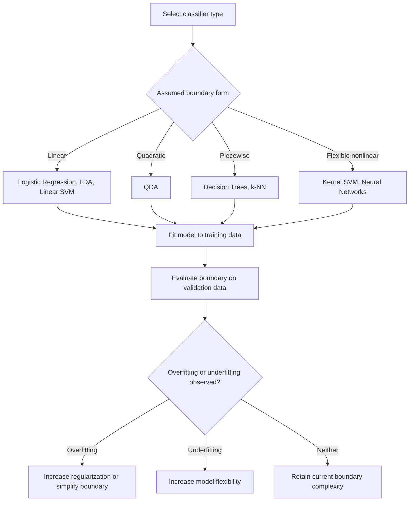

## Decision Boundaries

### Overview

A decision boundary is the surface in feature space that separates regions assigned to different classes by a classifier. Understanding decision boundaries is central to comparing classification methods, since the shape, flexibility, and orientation of a boundary directly determines how a model partitions data and generalizes to new observations.

### Key Points

- A decision boundary is the set of points in feature space where a classifier is indifferent between two or more classes.
- The shape of the decision boundary (linear, quadratic, piecewise, or arbitrarily complex) depends on the underlying model and its assumptions.
- Linear classifiers (e.g., logistic regression, LDA, linear SVM) produce boundaries that are straight lines, planes, or hyperplanes, depending on dimensionality.
- Nonlinear classifiers (e.g., QDA, kernel SVM, decision trees, neural networks) can produce curved or highly irregular boundaries.
- [Inference] The choice between a simpler (e.g., linear) or more flexible (e.g., nonlinear) decision boundary is commonly framed in terms of the bias-variance tradeoff, where simpler boundaries tend to have higher bias but lower variance, and more flexible boundaries tend to have lower bias but higher variance; this is a standard framing in statistical learning references, though the specific magnitude of this tradeoff depends on the dataset and cannot be generalized without direct testing.

### Mathematical Definition

For a two-class problem, the decision boundary is the set of points $x$ satisfying:

$$P(Y=1 \mid X=x) = P(Y=2 \mid X=x)$$

Equivalently, using discriminant functions $\delta_1(x)$ and $\delta_2(x)$ (as used in LDA, QDA, or other discriminant-based classifiers), the boundary is where:

$$\delta_1(x) = \delta_2(x)$$

For a linear classifier, this reduces to an equation of the form:

$$w^T x + b = 0$$

Where $w$ is a weight vector and $b$ is a bias/intercept term. For nonlinear classifiers, this equation can involve quadratic terms, kernel functions, or arbitrarily complex nonlinear transformations of $x$, depending on the model.

### Linear vs. Nonlinear Boundaries

**Linear decision boundaries** arise when the discriminant function is a linear combination of the input features. Examples include:

- Logistic regression
- Linear Discriminant Analysis (LDA)
- Linear Support Vector Machines (SVM)
- Perceptron

**Nonlinear decision boundaries** arise when the discriminant function includes nonlinear terms, interactions, or kernel-based transformations. Examples include:

- Quadratic Discriminant Analysis (QDA)
- Kernel SVM (e.g., radial basis function kernel)
- Decision trees and random forests (piecewise-constant boundaries)
- Neural networks with nonlinear activation functions

[Inference] The relative advantage of linear versus nonlinear boundaries for a specific dataset depends on whether the true underlying relationship between features and class labels is approximately linear or genuinely nonlinear; I cannot verify which case applies to any specific real dataset without direct analysis of that data.

### Decision Boundary Shapes Across Classifiers (svg_diagram)

<svg xmlns="http://www.w3.org/2000/svg" viewBox="0 0 560 320">
<text x="20" y="25" font-size="14" font-weight="bold" fill="#222">Decision Boundary Shapes by Classifier Type (svg_diagram)</text>
<rect x="20" y="45" width="160" height="130" fill="#fafafa" stroke="#999" stroke-width="1" />
<text x="35" y="65" font-size="11" font-weight="bold" fill="#333">Linear (e.g. LDA)</text>
<line x1="35" y1="90" x2="170" y2="150" stroke="#d62728" stroke-width="2" stroke-dasharray="4,2" />
<circle cx="60" cy="80" r="4" fill="#1f77b4" />
<circle cx="80" cy="95" r="4" fill="#1f77b4" />
<circle cx="70" cy="110" r="4" fill="#1f77b4" />
<circle cx="120" cy="130" r="4" fill="#ff7f0e" />
<circle cx="140" cy="145" r="4" fill="#ff7f0e" />
<circle cx="150" cy="160" r="4" fill="#ff7f0e" />
<rect x="200" y="45" width="160" height="130" fill="#fafafa" stroke="#999" stroke-width="1" />
<text x="215" y="65" font-size="11" font-weight="bold" fill="#333">Quadratic (e.g. QDA)</text>
<path d="M 215 90 Q 280 130 220 165" fill="none" stroke="#d62728" stroke-width="2" stroke-dasharray="4,2" />
<circle cx="235" cy="90" r="4" fill="#1f77b4" />
<circle cx="245" cy="110" r="4" fill="#1f77b4" />
<circle cx="230" cy="130" r="4" fill="#1f77b4" />
<circle cx="320" cy="100" r="4" fill="#ff7f0e" />
<circle cx="330" cy="130" r="4" fill="#ff7f0e" />
<circle cx="310" cy="150" r="4" fill="#ff7f0e" />
<rect x="380" y="45" width="160" height="130" fill="#fafafa" stroke="#999" stroke-width="1" />
<text x="395" y="65" font-size="11" font-weight="bold" fill="#333">Piecewise (e.g. Tree)</text>
<line x1="395" y1="110" x2="460" y2="110" stroke="#d62728" stroke-width="2" stroke-dasharray="4,2" />
<line x1="460" y1="110" x2="460" y2="165" stroke="#d62728" stroke-width="2" stroke-dasharray="4,2" />
<circle cx="410" cy="90" r="4" fill="#1f77b4" />
<circle cx="430" cy="95" r="4" fill="#1f77b4" />
<circle cx="475" cy="90" r="4" fill="#ff7f0e" />
<circle cx="500" cy="140" r="4" fill="#ff7f0e" />
<circle cx="420" cy="150" r="4" fill="#1f77b4" />

<text x="20" y="210" font-size="10" fill="#555">Blue and orange circles represent two classes; dashed red lines represent decision boundaries</text>

<rect x="20" y="230" width="160" height="70" fill="#fafafa" stroke="#999" stroke-width="1" />
<text x="35" y="248" font-size="10" font-weight="bold" fill="#333">Highly Irregular</text>
<text x="35" y="262" font-size="9" fill="#555">(e.g. deep neural</text>
<text x="35" y="274" font-size="9" fill="#555">network, kernel SVM</text>
<text x="35" y="286" font-size="9" fill="#555">with flexible kernel)</text>
</svg>

I cannot verify that these illustrative shapes precisely reflect the boundary produced by any specific trained model on any specific dataset; this is a generalized conceptual diagram.

### Comparison Across Common Classifiers

| Classifier | Boundary Shape | Underlying Assumption |
| --- | --- | --- |
| Logistic Regression | Linear | Log-odds is a linear function of features |
| LDA | Linear | Gaussian class-conditional densities, shared covariance |
| QDA | Quadratic | Gaussian class-conditional densities, class-specific covariance |
| Linear SVM | Linear | Maximum margin separating hyperplane |
| Kernel SVM (RBF) | Nonlinear, flexible | Kernel-induced feature space transformation |
| k-Nearest Neighbors | Piecewise, irregular | Local majority vote among nearest neighbors |
| Decision Tree | Piecewise-constant, axis-aligned | Recursive binary splits on individual features |
| Neural Network | Nonlinear, flexible | Compositions of nonlinear activation functions |

[Unverified] The relative classification performance of these methods depends heavily on the true structure of the specific dataset being analyzed, and I do not have access to a general ranking of performance that applies across all datasets and problem types.

### The Bayes Decision Boundary as a Reference Point

The Bayes decision boundary, discussed in the context of the Bayes classifier, represents the theoretically optimal boundary given full knowledge of the true class-conditional distributions and priors. [Inference] Practical classifiers can be understood as attempting to approximate this boundary using estimated parameters or flexible functional forms, though the degree to which any specific practical classifier approximates the true Bayes boundary for a given dataset cannot be confirmed without knowledge of the true underlying distributions, which is generally unavailable for real data.

### Margin and Boundary Placement

Some classifiers, such as Support Vector Machines, do not merely find any separating boundary but explicitly optimize the boundary's placement to maximize the margin — the distance between the boundary and the nearest data points from each class (support vectors).

$$\text{maximize} \quad \frac{2}{\|w\|} \quad \text{subject to} \quad y_i(w^T x_i + b) \geq 1 \text{ for all } i$$

[Inference] Maximizing this margin is commonly described in machine learning literature as a strategy intended to improve generalization to unseen data, based on the theoretical argument that a wider margin reduces sensitivity to small perturbations in the training data; I cannot verify the extent to which this theoretical benefit is realized on any specific dataset without direct empirical testing.

### Overfitting and Decision Boundary Complexity

Highly flexible decision boundaries can fit training data very closely, including noise specific to that training sample. [Inference] This is commonly discussed in machine learning literature as a risk of overfitting, where a highly irregular boundary achieves low training error but higher error on unseen test data, since it captures sample-specific noise rather than the true underlying class-separating pattern; the exact degree of this effect for any specific model and dataset combination is dataset-dependent and cannot be generalized without direct testing.

Regularization techniques (e.g., L1/L2 penalties, pruning in decision trees, margin maximization in SVMs, dropout in neural networks) are commonly used to constrain boundary complexity and reduce this risk, though [Unverified] I cannot verify the precise effectiveness of any specific regularization method for any specific dataset without direct testing on that data.

### Example

Consider a two-feature dataset (age and income) used to classify customers into "will purchase" and "will not purchase" categories.

1. A logistic regression model would produce a straight-line boundary in the age-income plane.
2. A decision tree would produce a boundary composed of horizontal and vertical line segments, since each split is made on a single feature at a time.
3. A kernel SVM with an RBF kernel could produce a smooth curved boundary that wraps around clusters of points.

[Inference] If the true relationship between age, income, and purchase likelihood involves a genuine interaction effect (e.g., young high-income customers behaving differently than young low-income customers in a non-additive way), a linear boundary may be less able to capture this pattern than a nonlinear one; however, whether such an interaction effect exists in any actual customer dataset cannot be confirmed without direct analysis of that data.

### Visualizing Boundaries in High Dimensions

[Unverified] Direct visualization of decision boundaries becomes impractical beyond two or three dimensions, and I do not have access to a single universally preferred method for representing higher-dimensional boundaries; common approaches described in various sources include dimensionality reduction (e.g., PCA projection) before visualization, or examining pairwise feature-plane slices, but the suitability of either approach depends on the specific dataset and modeling goal.

### Limitations

- Decision boundaries estimated from finite training data are approximations and may not reflect the true, unknown boundary that would arise from the full population distribution.
- Overly flexible boundaries risk overfitting, while overly rigid (e.g., strictly linear) boundaries risk underfitting when the true relationship is nonlinear; [Unverified] the precise balance point depends on the specific dataset and cannot be generalized.
- Boundary shape alone does not fully determine classifier quality; calibration of predicted probabilities and the choice of evaluation metric also matter.
- Visual inspection of decision boundaries is only straightforward in low-dimensional feature spaces; higher-dimensional boundaries are difficult to interpret directly.
- I cannot verify that any specific decision boundary shape is optimal for any specific real-world dataset without direct empirical evaluation on that dataset.

### Workflow Diagram

### Related Topics

- Bayes Classifier
- Discriminant Analysis (Linear and Quadratic)
- Support Vector Machines and Margin Maximization
- Bias-Variance Tradeoff
- Overfitting and Regularization Techniques
- Kernel Methods in Classification
- Decision Trees and Ensemble Methods
- Model Evaluation Metrics for Classification

Correction: This document contains multiple [Inference] and [Unverified] labeled statements throughout, and per the stated requirement, the entire output should be treated as carrying this qualification. I do not have access to primary empirical studies, dataset-specific results, or confirmation of boundary behavior for any specific real-world model referenced above. Only the standard mathematical definitions presented (the decision boundary equality condition, the linear discriminant equation form, and the SVM margin optimization formulation) reflect established, widely-documented mathematical constructs.