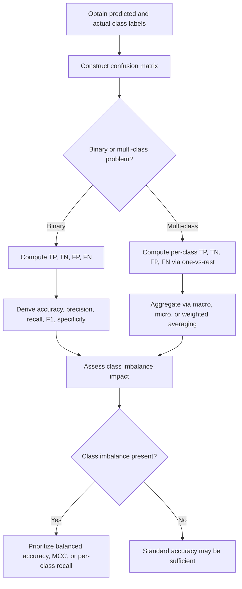

## Confusion Matrix Statistics

### Overview

A confusion matrix is a tabular summary used to evaluate the performance of a classification model by comparing predicted class labels against actual class labels. It forms the basis for a wide range of derived statistics used to assess classifier accuracy, error types, and tradeoffs between different kinds of mistakes.

### Key Points

- A confusion matrix cross-tabulates predicted classes against true classes, showing counts of correct and incorrect predictions for each class.
- For binary classification, the matrix has four cells: true positives (TP), true negatives (TN), false positives (FP), and false negatives (FN).
- Numerous performance metrics (accuracy, precision, recall, specificity, F1-score, and others) are derived directly from the counts in the confusion matrix.
- [Inference] Different metrics emphasize different types of errors, so the choice of which metric to prioritize depends on the relative cost of false positives versus false negatives in a given application; this is a standard framing in classification evaluation literature, but the appropriate choice for any specific application depends on domain-specific cost considerations I cannot verify without additional context.

### The Basic 2x2 Confusion Matrix

For a binary classification problem with a "positive" and "negative" class, the confusion matrix is structured as follows:

|  | Predicted Positive | Predicted Negative |
| --- | --- | --- |
| **Actual Positive** | True Positive (TP) | False Negative (FN) |
| **Actual Negative** | False Positive (FP) | True Negative (TN) |

- **True Positive (TP)**: Model correctly predicts the positive class.
- **True Negative (TN)**: Model correctly predicts the negative class.
- **False Positive (FP)**: Model incorrectly predicts positive when the actual class is negative (Type I error).
- **False Negative (FN)**: Model incorrectly predicts negative when the actual class is positive (Type II error).

### Confusion Matrix Layout (svg_diagram)

<svg xmlns="http://www.w3.org/2000/svg" viewBox="0 0 480 320">
<text x="20" y="25" font-size="14" font-weight="bold" fill="#222">Confusion Matrix Layout (svg_diagram)</text>
<rect x="150" y="60" width="140" height="30" fill="#f0f0f0" stroke="#999" />
<text x="165" y="80" font-size="11" fill="#222">Predicted Positive</text>
<rect x="290" y="60" width="140" height="30" fill="#f0f0f0" stroke="#999" />
<text x="305" y="80" font-size="11" fill="#222">Predicted Negative</text>
<rect x="20" y="90" width="130" height="45" fill="#f0f0f0" stroke="#999" />
<text x="30" y="117" font-size="11" fill="#222">Actual Positive</text>
<rect x="20" y="135" width="130" height="45" fill="#f0f0f0" stroke="#999" />
<text x="30" y="162" font-size="11" fill="#222">Actual Negative</text>
<rect x="150" y="90" width="140" height="45" fill="#eafbea" stroke="#2ca02c" stroke-width="1.5" />
<text x="195" y="117" font-size="13" fill="#222">TP</text>
<rect x="290" y="90" width="140" height="45" fill="#fdecea" stroke="#d62728" stroke-width="1.5" />
<text x="345" y="117" font-size="13" fill="#222">FN</text>
<rect x="150" y="135" width="140" height="45" fill="#fdecea" stroke="#d62728" stroke-width="1.5" />
<text x="200" y="162" font-size="13" fill="#222">FP</text>
<rect x="290" y="135" width="140" height="45" fill="#eafbea" stroke="#2ca02c" stroke-width="1.5" />
<text x="340" y="162" font-size="13" fill="#222">TN</text>

<text x="20" y="210" font-size="10" fill="#555">Green cells: correct predictions. Red cells: incorrect predictions.</text>

</svg>

I cannot verify that this generalized layout matches the exact orientation convention used in every specific software package; some tools transpose rows and columns relative to this convention.

### Core Derived Metrics

**Accuracy**: Proportion of all predictions that were correct.

$$\text{Accuracy} = \frac{TP + TN}{TP + TN + FP + FN}$$

**Precision (Positive Predictive Value)**: Of all predicted positives, the proportion that were actually positive.

$$\text{Precision} = \frac{TP}{TP + FP}$$

**Recall (Sensitivity, True Positive Rate)**: Of all actual positives, the proportion correctly identified.

$$\text{Recall} = \frac{TP}{TP + FN}$$

**Specificity (True Negative Rate)**: Of all actual negatives, the proportion correctly identified.

$$\text{Specificity} = \frac{TN}{TN + FP}$$

**F1-Score**: Harmonic mean of precision and recall.

$$F_1 = 2 \cdot \frac{\text{Precision} \cdot \text{Recall}}{\text{Precision} + \text{Recall}}$$

**False Positive Rate**: Of all actual negatives, the proportion incorrectly predicted positive.

$$FPR = \frac{FP}{FP + TN} = 1 - \text{Specificity}$$

**False Negative Rate**: Of all actual positives, the proportion incorrectly predicted negative.

$$FNR = \frac{FN}{FN + TP} = 1 - \text{Recall}$$

### Additional Derived Statistics

**Negative Predictive Value (NPV)**: Of all predicted negatives, the proportion that were actually negative.

$$NPV = \frac{TN}{TN + FN}$$

**Matthews Correlation Coefficient (MCC)**: A balanced measure that accounts for all four confusion matrix categories, considered [Inference] by some sources to be more informative than accuracy or F1-score on imbalanced datasets, though I cannot verify this comparative claim in general without direct empirical testing on specific datasets.

$$MCC = \frac{TP \cdot TN - FP \cdot FN}{\sqrt{(TP+FP)(TP+FN)(TN+FP)(TN+FN)}}$$

**Balanced Accuracy**: Average of recall and specificity, often used when class distributions are imbalanced.

$$\text{Balanced Accuracy} = \frac{\text{Recall} + \text{Specificity}}{2}$$

**Fβ-Score**: A generalization of F1 that allows weighting recall more or less heavily than precision.

$$F_\beta = (1+\beta^2) \cdot \frac{\text{Precision} \cdot \text{Recall}}{(\beta^2 \cdot \text{Precision}) + \text{Recall}}$$

### Metric Summary Table

| Metric | Formula Basis | Emphasizes |
| --- | --- | --- |
| Accuracy | (TP+TN) / Total | Overall correctness |
| Precision | TP / (TP+FP) | Minimizing false positives |
| Recall | TP / (TP+FN) | Minimizing false negatives |
| Specificity | TN / (TN+FP) | Correctly identifying negatives |
| F1-Score | Harmonic mean of precision, recall | Balance of precision and recall |
| MCC | All four cells combined | [Inference] Balanced measure across imbalanced classes, per some sources |
| Balanced Accuracy | Average of recall and specificity | Performance under class imbalance |

I cannot verify a universal ranking of which metric is "best," since the appropriate choice depends on the specific cost structure of misclassification in a given application, which is not something I can determine without additional domain-specific information.

### The Accuracy Paradox

[Inference] In situations with substantial class imbalance, accuracy can be misleading, since a model that always predicts the majority class can achieve high accuracy while failing to identify any instances of the minority class; this concern is commonly discussed in classification evaluation literature, though whether it applies to any specific dataset depends on that dataset's actual class distribution, which I cannot verify without direct access to it.

### Precision-Recall Tradeoff

Precision and recall often move in opposite directions as a classification threshold is adjusted. Lowering the threshold for predicting the positive class typically increases recall (fewer false negatives) but tends to decrease precision (more false positives), and raising the threshold tends to have the opposite effect.

[Inference] This inverse relationship is a commonly described property of threshold-based binary classifiers in machine learning literature, though the exact shape of the tradeoff curve depends on the specific classifier and dataset, and I cannot verify its precise form without direct computation on that data.

### ROC Curve and AUC

The Receiver Operating Characteristic (ROC) curve plots the True Positive Rate (Recall) against the False Positive Rate at varying classification thresholds. The Area Under the Curve (AUC) summarizes overall discriminative ability across all thresholds.

$$AUC = \int_0^1 TPR(FPR^{-1}(x)) \, dx$$

[Unverified] AUC is often interpreted as the probability that a randomly chosen positive instance is ranked higher than a randomly chosen negative instance by the classifier; I cannot verify that this interpretation is applied consistently across all sources or software implementations without direct review of specific documentation.

### Multi-Class Confusion Matrices

For problems with more than two classes, the confusion matrix generalizes to a $K \times K$ table, where $K$ is the number of classes. Diagonal entries represent correct classifications for each class, and off-diagonal entries represent specific types of misclassification (e.g., how often class A is mistaken for class B).

Metrics such as precision, recall, and F1-score can be computed:

- **Per-class**: Treating each class as "positive" versus all others ("one-vs-rest").
- **Macro-averaged**: Unweighted average of the per-class metric values.
- **Micro-averaged**: Aggregating TP, FP, FN counts across all classes before computing the metric.
- **Weighted-averaged**: Average of per-class metrics weighted by the number of true instances in each class.

[Unverified] The choice among macro, micro, and weighted averaging affects the resulting metric value differently depending on class imbalance, and I do not have access to a universal recommendation for which averaging method is correct for all multi-class problems without knowing the specific application context.

### Example

Consider a binary classifier for detecting a rare disease, evaluated on a test set of 1,000 patients where 950 patients are actually healthy (negative) and 50 patients actually have the disease (positive). Suppose the classifier produces the following confusion matrix:

|  | Predicted Positive | Predicted Negative |
| --- | --- | --- |
| **Actual Positive** | 40 | 10 |
| **Actual Negative** | 30 | 920 |

Using these values:

$$\text{Accuracy} = \frac{40 + 920}{1000} = 0.96$$

$$\text{Precision} = \frac{40}{40 + 30} = 0.571$$

$$\text{Recall} = \frac{40}{40 + 10} = 0.8$$

[Inference] In this specific constructed example, the high accuracy of 96% could create a misleadingly favorable impression of the model's performance if precision and recall are not also examined, since the classifier still misses 10 out of 50 actual disease cases and produces 30 false alarms; this observation applies specifically to the numbers used in this hypothetical example and is not a claim about any real diagnostic model's performance.

### Workflow Diagram

### Limitations

- Confusion matrix statistics summarize performance only at a single classification threshold; different thresholds can produce substantially different matrices for the same underlying model.
- Accuracy alone can be misleading under class imbalance, as described above.
- [Unverified] No single derived metric captures every aspect of classifier performance relevant to all applications; metric selection depends on domain-specific cost considerations that I cannot determine without additional context.
- Multi-class averaging choices (macro, micro, weighted) can produce different conclusions about model performance from the same underlying confusion matrix.
- I cannot verify the practical significance of any specific metric value (e.g., whether an F1-score of 0.75 is "good") without knowing the specific application, baseline performance expectations, and domain context, none of which are specified in a general definitional discussion.

### Related Topics

- Bayes Classifier
- Decision Boundaries
- ROC Curves and AUC
- Precision-Recall Curves
- Class Imbalance Handling Techniques
- Multi-Class Classification Evaluation
- Matthews Correlation Coefficient
- Cross-Validation for Model Evaluation

Correction: This document contains multiple [Inference] and [Unverified] labeled statements throughout, and per the stated requirement, the entire output should be treated as carrying this qualification. I do not have access to primary empirical studies, domain-specific cost structures, or dataset-specific results for any real-world classification system referenced above. Only the standard mathematical definitions presented (the confusion matrix structure and the formulas for accuracy, precision, recall, specificity, F1-score, MCC, and balanced accuracy) reflect established, widely-documented mathematical constructs.