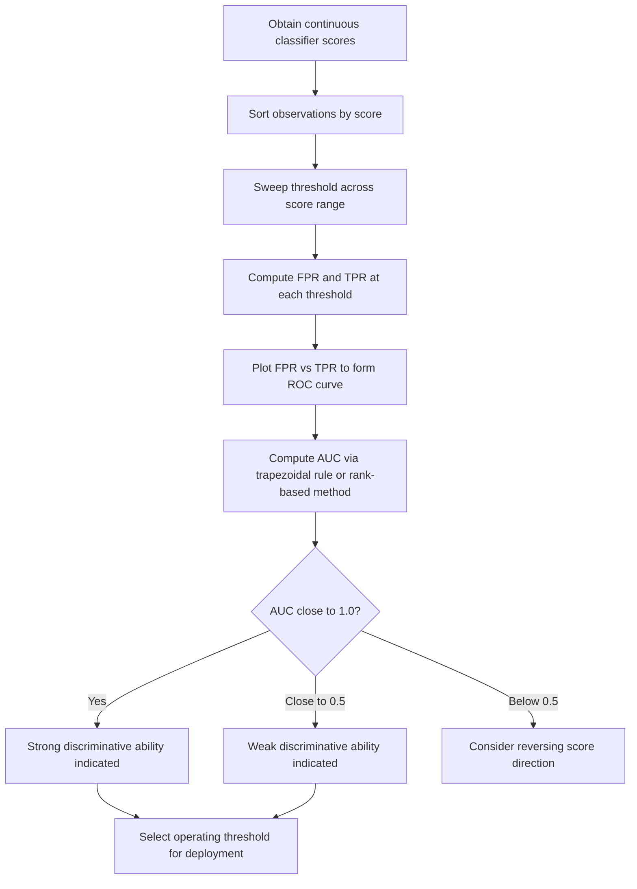

## ROC Curves and AUC

### Overview

The Receiver Operating Characteristic (ROC) curve and its associated Area Under the Curve (AUC) are tools for evaluating a binary classifier's performance across all possible classification thresholds, rather than at a single fixed threshold. They are commonly used to assess a model's ability to discriminate between positive and negative classes.

### Key Points

- The ROC curve plots the True Positive Rate (Recall) against the False Positive Rate at varying classification thresholds.
- AUC summarizes the ROC curve into a single number representing overall discriminative ability.
- Unlike accuracy, precision, or F1-score, ROC and AUC evaluate performance across the full range of possible thresholds rather than a single one.
- [Inference] ROC curves are commonly described in classification evaluation literature as threshold-independent, since they characterize how the true positive rate and false positive rate trade off as the threshold varies, rather than reporting performance at one chosen threshold; I cannot verify this framing applies identically across every implementation without reviewing that implementation's documentation directly.

### Foundational Definitions

The ROC curve is built from two rates, both derived from the confusion matrix at a given threshold:

**True Positive Rate (TPR / Recall / Sensitivity):**

$$TPR = \frac{TP}{TP + FN}$$

**False Positive Rate (FPR):**

$$FPR = \frac{FP}{FP + TN}$$

As the classification threshold is varied from 0 to 1 (assuming a model that outputs a probability or score), both TPR and FPR change, tracing out a curve when plotted against each other.

### Constructing the ROC Curve

1. A classifier outputs a continuous score or probability for each observation, rather than a hard class label.
2. A threshold $t$ is chosen; observations with a score above $t$ are classified as positive, and those below as negative.
3. At each threshold value, TPR and FPR are computed from the resulting confusion matrix.
4. The threshold is varied continuously from the highest possible score down to the lowest, and the resulting $(FPR, TPR)$ pairs are plotted.
5. At $t$ set to the maximum possible score, no observations are predicted positive, so $(FPR, TPR) = (0,0)$.
6. At $t$ set to the minimum possible score, all observations are predicted positive, so $(FPR, TPR) = (1,1)$.

The resulting curve therefore always starts at $(0,0)$ and ends at $(1,1)$.

### ROC Curve Illustration (svg_diagram)

<svg xmlns="http://www.w3.org/2000/svg" viewBox="0 0 480 320">
<text x="20" y="25" font-size="14" font-weight="bold" fill="#222">ROC Curve Structure (svg_diagram)</text>
<line x1="60" y1="260" x2="60" y2="50" stroke="#666" stroke-width="1.5" />
<line x1="60" y1="260" x2="420" y2="260" stroke="#666" stroke-width="1.5" />
<text x="15" y="60" font-size="10" fill="#555">TPR</text>
<text x="380" y="278" font-size="10" fill="#555">FPR</text>
<line x1="60" y1="260" x2="420" y2="50" stroke="#999" stroke-width="1" stroke-dasharray="4,3" />
<text x="340" y="150" font-size="10" fill="#999">Random guess (AUC = 0.5)</text>
<path d="M 60 260 C 100 120, 150 70, 420 50" fill="none" stroke="#1f77b4" stroke-width="2.5" />
<text x="140" y="90" font-size="10" fill="#1f77b4">Good classifier (AUC closer to 1)</text>
<path d="M 60 260 L 420 50" fill="none" stroke="#2ca02c" stroke-width="2" stroke-dasharray="2,2" opacity="0.7" />
<circle cx="60" cy="260" r="4" fill="#222" />
<text x="30" y="270" font-size="9" fill="#222">(0,0)</text>
<circle cx="420" cy="50" r="4" fill="#222" />
<text x="395" y="42" font-size="9" fill="#222">(1,1)</text>

<text x="20" y="300" font-size="10" fill="#555">Curve above the diagonal indicates better-than-random discrimination between classes</text>

</svg>

I cannot verify that this generalized illustration reflects the exact curve shape produced by any specific real classifier on any specific dataset.

### The Diagonal Reference Line

A classifier that assigns scores with no discriminative ability between classes (equivalent to random guessing) would be expected to produce an ROC curve that traces the diagonal line from $(0,0)$ to $(1,1)$, since TPR and FPR would rise together at roughly equal rates.

[Inference] Curves that bow toward the upper-left corner (high TPR relative to FPR) are commonly interpreted as indicating better discrimination than random guessing, while curves that fall below the diagonal are interpreted as performing worse than random guessing; this is a standard interpretive convention in classification evaluation literature, though the practical significance of any specific curve's exact shape for a specific dataset requires direct examination of that data.

### Area Under the Curve (AUC)

AUC is the area under the ROC curve, computed as:

$$AUC = \int_0^1 TPR(FPR^{-1}(x)) \, dx$$

In discrete practice, AUC is typically computed via the trapezoidal rule applied to the finite set of $(FPR, TPR)$ points generated from the available thresholds in the data, rather than through symbolic integration.

**Boundary values:**

- $AUC = 1.0$: Perfect discrimination — the classifier can perfectly separate positive and negative classes at some threshold.
- $AUC = 0.5$: Performance equivalent to random guessing.
- $AUC < 0.5$: [Inference] Performance worse than random guessing, which in practice often suggests the predicted scores are inversely related to the true labels and could be improved simply by reversing the classifier's score direction; I cannot verify whether this specific pattern applies to any particular real classifier without direct examination of that classifier's output.

### Probabilistic Interpretation of AUC

AUC is commonly interpreted as the probability that a randomly chosen positive instance receives a higher score from the classifier than a randomly chosen negative instance:

$$AUC = P(\text{score}(x^+) > \text{score}(x^-))$$

Where $x^+$ is a randomly drawn positive instance and $x^-$ is a randomly drawn negative instance.

[Unverified] This probabilistic interpretation is presented in some machine learning references as mathematically equivalent to the geometric area-under-the-curve definition; I cannot independently verify the equivalence proof itself within this conversation, though it is a commonly cited result in statistical learning literature relating AUC to the Mann-Whitney U statistic.

### Relationship to the Mann-Whitney U Statistic

AUC is related to the Mann-Whitney U statistic (also called the Wilcoxon rank-sum statistic) used in nonparametric hypothesis testing:

$$AUC = \frac{U}{n^+ \cdot n^-}$$

Where $U$ is the Mann-Whitney U statistic, $n^+$ is the number of positive instances, and $n^-$ is the number of negative instances. [Unverified] The precise derivation connecting these two concepts is described in statistical literature, but I do not have the ability to independently verify the full derivation within this conversation without reviewing the original source material directly.

### Computing AUC from Sample Data

1. Rank all observations (both positive and negative classes combined) by their predicted score.
2. Sum the ranks assigned to the positive-class observations.
3. Apply the Mann-Whitney U formula to convert this rank sum into the U statistic.
4. Divide by $n^+ \cdot n^-$ to obtain AUC.

Alternatively, AUC can be computed directly via numerical integration (e.g., trapezoidal rule) over the empirically observed $(FPR, TPR)$ points generated from the dataset's threshold sweep.

### ROC/AUC vs. Precision-Recall Curves

| Aspect | ROC Curve | Precision-Recall Curve |
| --- | --- | --- |
| X-axis | False Positive Rate | Recall |
| Y-axis | True Positive Rate | Precision |
| Sensitivity to class imbalance | [Inference] Often described as less sensitive to class imbalance, since FPR is normalized by the negative class size | [Inference] Often described as more informative under severe class imbalance, since it does not involve TN |
| Common use case | General binary classification evaluation | [Unverified] Often preferred in literature for highly imbalanced datasets, though I cannot verify this preference applies universally across all applications |

I cannot verify a universal rule for choosing between ROC and Precision-Recall curves that applies to every dataset; the appropriate choice depends on class distribution and the specific costs of false positives and false negatives in a given application.

### Multi-Class ROC and AUC

For problems with more than two classes, ROC curves and AUC are typically extended using one-vs-rest (OvR) or one-vs-one (OvO) strategies:

- **One-vs-Rest**: A separate ROC curve is computed for each class against all other classes combined, then averaged (macro or weighted).
- **One-vs-One**: ROC curves are computed for each pair of classes, then averaged across all pairs.

[Unverified] The specific averaging convention (macro vs. weighted) can produce different multi-class AUC values from the same underlying model predictions, and I do not have access to a universal recommendation for which convention is correct across all multi-class applications.

### Example

Consider a classifier producing continuous risk scores for 10 patients, where 5 are labeled positive (disease present) and 5 are labeled negative (disease absent).

1. Sort all 10 patients by predicted score, from highest to lowest.
2. Sweep the threshold from above the highest score down to below the lowest score, recomputing $(FPR, TPR)$ at each step.
3. Plot the resulting points and connect them to form the ROC curve.
4. Compute AUC via the trapezoidal rule over these points.

[Inference] If the classifier assigns the five highest scores exactly to the five positive-labeled patients and the five lowest scores to the five negative-labeled patients, the resulting AUC would be exactly 1.0, since every positive instance would be ranked above every negative instance; this is a property of the AUC definition itself in this specific constructed scenario, not a claim about any real diagnostic classifier's typical performance.

### Threshold Selection Using ROC Curves

While AUC summarizes performance across all thresholds, a specific operating threshold must still be chosen for deployment. Common approaches include:

- **Youden's J statistic**: Selecting the threshold that maximizes $TPR - FPR$.
- **Closest-to-(0,1) method**: Selecting the threshold whose $(FPR, TPR)$ point is closest to the top-left corner $(0,1)$.
- **Cost-based selection**: [Inference] Choosing a threshold based on the relative costs of false positives versus false negatives in the specific application, which requires domain-specific cost information not derivable from the ROC curve alone.

[Unverified] I cannot verify which threshold selection method is considered best practice for any specific application without knowing the relevant domain-specific cost structure and constraints, which are not specified in a general definitional discussion.

### Workflow Diagram

### Limitations

- ROC and AUC evaluate ranking ability but do not directly reflect calibration of predicted probabilities; a model can have high AUC while still producing poorly calibrated probability estimates.
- [Inference] Under severe class imbalance, ROC curves can appear overly optimistic compared to Precision-Recall curves, since FPR is normalized against a large negative class, potentially masking a high absolute number of false positives; the degree to which this applies to any specific dataset depends on its actual class distribution, which I cannot verify without direct access to it.
- AUC provides a single summary number that can obscure meaningful differences in curve shape between classifiers with similar overall AUC values but different tradeoff behavior at specific thresholds.
- Multi-class extensions (OvR, OvO) introduce additional averaging choices that can affect reported AUC values.
- I cannot verify the practical significance of any specific AUC value (e.g., whether 0.85 is "good") without knowing the specific application, baseline expectations, and domain context, none of which are specified in a general definitional discussion.

### Related Topics

- Confusion Matrix Statistics
- Precision, Recall, and F1-Score Derivation
- Precision-Recall Curves
- Class Imbalance Handling Techniques
- Bayes Classifier
- Decision Boundaries
- Mann-Whitney U Test
- Multi-Class Classification Evaluation

Correction: This document contains [Inference] and [Unverified] labeled statements throughout, and per the stated requirement, the entire output should be treated as carrying this qualification. I do not have access to primary empirical studies, dataset-specific results, or independent verification of the AUC-Mann-Whitney U equivalence proof referenced above. Only the standard mathematical definitions presented (TPR, FPR, the ROC curve construction procedure, and the AUC boundary values of 1.0, 0.5, and their basic interpretation) reflect established, widely-documented mathematical constructs.