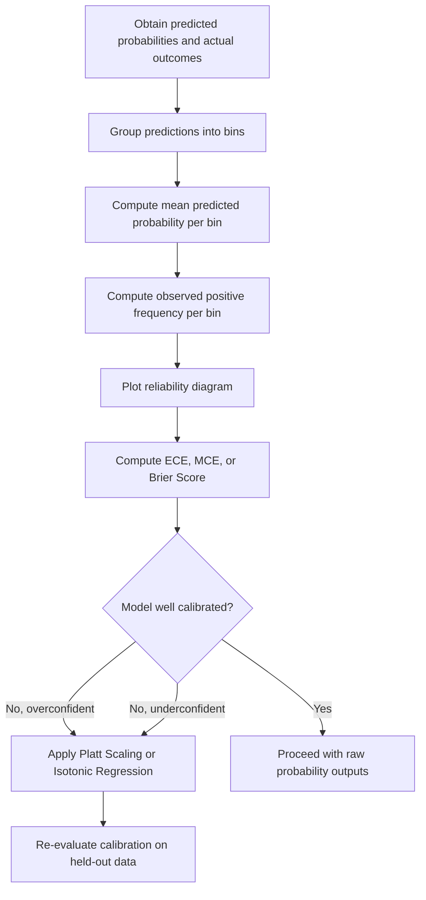

## Calibration of Probabilistic Classifiers

### Overview

Calibration refers to how well a classifier's predicted probabilities correspond to actual observed outcome frequencies. A well-calibrated classifier's predicted probability of 0.7 for an event should correspond to that event actually occurring approximately 70% of the time among all instances given that prediction. Calibration is distinct from discrimination (the ability to rank positive instances above negative ones), and a model can have strong discrimination while being poorly calibrated.

### Key Points

- Calibration measures agreement between predicted probabilities and observed outcome frequencies, not classification accuracy directly.
- A model can have high AUC (strong discrimination) while producing poorly calibrated probability estimates. [Inference] This is a commonly cited distinction in classification evaluation literature, since AUC depends only on the relative ranking of scores, not their absolute values, so monotonic transformations of a model's scores leave AUC unchanged while potentially changing calibration substantially. I cannot verify the magnitude of this effect for any specific real classifier without direct testing on that classifier's output.
- Some classifiers (e.g., logistic regression) are commonly described as tending to produce naturally well-calibrated probabilities under certain conditions, while others (e.g., Naive Bayes, some tree-based ensembles) are commonly described as tending to produce poorly calibrated probabilities. [Unverified] I do not have access to a general, dataset-independent confirmation of these tendencies, since calibration behavior depends on the specific dataset and model configuration used.

### Formal Definition of Calibration

A classifier is said to be perfectly calibrated if, for every predicted probability value $p$, the following holds:

$$P(Y=1 \mid \hat{p}(X) = p) = p$$

Where $\hat{p}(X)$ is the model's predicted probability for observation $X$, and $Y=1$ denotes the positive class. This means that among all instances where the model predicts probability $p$, the actual proportion of positive outcomes should equal $p$.

[Unverified] In practice, this exact condition cannot be verified precisely for continuous probability outputs, since it would require infinitely many observations at each exact probability value; empirical calibration assessment methods approximate this condition using binning or other approximation techniques described below.

### Reliability Diagrams (Calibration Curves)

A reliability diagram (also called a calibration curve) is the standard visual tool for assessing calibration. It is constructed as follows:

1. Predicted probabilities are grouped into bins (e.g., $[0, 0.1), [0.1, 0.2), \dots, [0.9, 1.0]$).
2. Within each bin, the mean predicted probability is computed.
3. Within each bin, the observed fraction of actual positives is computed.
4. These pairs (mean predicted probability, observed fraction positive) are plotted against each other.

A perfectly calibrated classifier would produce points lying exactly on the diagonal line $y=x$.

### Reliability Diagram Illustration (svg_diagram)

<svg xmlns="http://www.w3.org/2000/svg" viewBox="0 0 480 320">
<text x="20" y="25" font-size="14" font-weight="bold" fill="#222">Reliability Diagram Structure (svg_diagram)</text>
<line x1="60" y1="260" x2="60" y2="50" stroke="#666" stroke-width="1.5" />
<line x1="60" y1="260" x2="420" y2="260" stroke="#666" stroke-width="1.5" />
<text x="10" y="55" font-size="10" fill="#555">Observed frequency</text>
<text x="350" y="278" font-size="10" fill="#555">Predicted probability</text>
<line x1="60" y1="260" x2="420" y2="50" stroke="#999" stroke-width="1.5" stroke-dasharray="4,3" />
<text x="330" y="150" font-size="9" fill="#999">Perfect calibration</text>
<path d="M 60 260 L 130 220 L 200 190 L 270 110 L 340 90 L 420 50" fill="none" stroke="#1f77b4" stroke-width="2" />
<circle cx="130" cy="220" r="3" fill="#1f77b4" />
<circle cx="200" cy="190" r="3" fill="#1f77b4" />
<circle cx="270" cy="110" r="3" fill="#1f77b4" />
<circle cx="340" cy="90" r="3" fill="#1f77b4" />
<text x="140" y="240" font-size="9" fill="#1f77b4">Example model curve</text>

<text x="20" y="300" font-size="10" fill="#555">Points below the diagonal indicate overconfidence; points above indicate underconfidence</text>

</svg>

I cannot verify that this generalized illustration reflects the exact calibration curve produced by any specific real classifier on any specific dataset; this is a conceptual diagram only.

### Overconfidence and Underconfidence

- **Overconfidence**: When predicted probabilities are systematically more extreme (closer to 0 or 1) than the true observed frequencies. On a reliability diagram, this appears as a curve below the diagonal in the upper range and above the diagonal in the lower range.
- **Underconfidence**: When predicted probabilities are systematically less extreme than the true observed frequencies, producing the opposite pattern.

[Inference] Some model types are commonly discussed in machine learning literature as being prone to overconfidence (e.g., some deep neural networks with high capacity) or specific miscalibration patterns (e.g., Naive Bayes due to its independence assumption), but I cannot verify these tendencies for any specific trained model without direct calibration testing on that model's actual output.

### Quantitative Calibration Metrics

**Expected Calibration Error (ECE):**

$$ECE = \sum_{m=1}^{M} \frac{|B_m|}{n} \left| \text{acc}(B_m) - \text{conf}(B_m) \right|$$

Where:

- $M$ is the number of bins
- $B_m$ is the set of observations falling into bin $m$
- $\text{acc}(B_m)$ is the observed fraction of positives in bin $m$
- $\text{conf}(B_m)$ is the mean predicted probability in bin $m$
- $n$ is the total number of observations

**Maximum Calibration Error (MCE):**

$$MCE = \max_{m \in \{1,\dots,M\}} \left| \text{acc}(B_m) - \text{conf}(B_m) \right|$$

MCE reports the worst-case discrepancy across all bins, rather than the weighted average used in ECE.

**Brier Score:**

$$\text{Brier Score} = \frac{1}{n}\sum_{i=1}^{n} (\hat{p}_i - y_i)^2$$

Where $\hat{p}_i$ is the predicted probability for observation $i$ and $y_i \in \{0,1\}$ is the actual outcome. The Brier score combines both calibration and discrimination into a single measure. [Unverified] Some sources describe the Brier score as decomposable into separate calibration and refinement (discrimination-related) components; I cannot independently verify the exact decomposition formula without reviewing the specific source presenting it.

### Metric Comparison Table

| Metric | What It Captures | Range |
| --- | --- | --- |
| ECE | Weighted average calibration gap across bins | $[0, 1]$ |
| MCE | Worst-case calibration gap across bins | $[0, 1]$ |
| Brier Score | Combined calibration and discrimination error | $[0, 1]$ |
| AUC | Discrimination only (not calibration) | $[0, 1]$ |

[Unverified] I cannot verify a universal threshold for what constitutes "good" calibration on any of these metrics, since acceptable values depend on the specific application and consequences of miscalibration in that context.

### Calibration Methods

When a model's raw outputs are poorly calibrated, several post-hoc calibration techniques are commonly used to adjust predicted probabilities without retraining the underlying model:

**Platt Scaling**: Fits a logistic regression model on top of the classifier's raw output scores to map them to calibrated probabilities:

$$P(Y=1 \mid f(x)) = \frac{1}{1 + \exp(A \cdot f(x) + B)}$$

Where $f(x)$ is the original model's raw score and $A, B$ are parameters fit on a held-out calibration dataset.

**Isotonic Regression**: A nonparametric approach that fits a monotonically increasing step function mapping raw scores to calibrated probabilities, without assuming a specific parametric form like Platt scaling does.

[Unverified] Some sources describe Platt scaling as more suitable for smaller calibration datasets and isotonic regression as more flexible but requiring more data to avoid overfitting to the calibration set; I cannot verify the precise data size thresholds at which one method becomes preferable over the other without reviewing dedicated comparative studies.

### Calibration Method Comparison

| Method | Functional Form | Flexibility |
| --- | --- | --- |
| Platt Scaling | Parametric (sigmoid) | Lower; assumes specific functional relationship |
| Isotonic Regression | Nonparametric (monotonic step function) | Higher; no assumed functional form |

I cannot verify a universal recommendation for which method is preferable across all datasets and model types without reviewing dataset-specific comparative evidence.

### Why Some Models Tend Toward Miscalibration

[Inference] Naive Bayes classifiers are commonly discussed in machine learning literature as prone to producing overconfident (extreme) probability estimates, attributed to the conditional independence assumption causing repeated multiplication of correlated feature likelihoods, which can push posterior estimates toward 0 or 1 more aggressively than the true underlying probabilities warrant. This is a commonly cited theoretical explanation, but I cannot verify its magnitude for any specific dataset without direct calibration testing on that data.

[Unverified] Some ensemble tree-based methods and certain neural network architectures are also discussed in various sources as prone to specific calibration issues, but the specific mechanisms and their practical significance vary by source, and I do not have access to a single authoritative, generalizable explanation covering all such model types.

### Example

Consider a weather prediction model that outputs the probability of rain for 100 days, and suppose 20 of those days had a predicted probability of approximately 0.7.

1. Group these 20 days into a single bin (predicted probability ≈ 0.7).
2. Count how many of those 20 days actually experienced rain.
3. If, say, 14 out of 20 days actually had rain, the observed frequency is $14/20 = 0.7$, matching the predicted probability, suggesting good calibration for this bin.
4. If instead only 8 out of 20 days had rain, the observed frequency is $0.4$, indicating the model was overconfident for this bin, since it predicted 0.7 but the true frequency was closer to 0.4.

[Inference] This single-bin example illustrates the general logic of calibration assessment; however, a complete calibration assessment would require this same procedure applied across all bins spanning the full probability range, and no conclusion about the model's overall calibration can be drawn from a single bin alone.

### Calibration Assessment Workflow

### Calibration vs. Discrimination

| Aspect | Discrimination (e.g., AUC) | Calibration (e.g., ECE, Brier Score) |
| --- | --- | --- |
| What it measures | Relative ranking of positive vs. negative instances | Agreement between predicted probability and observed frequency |
| Affected by monotonic score transformations | No | Yes |
| Relevant when decisions depend on absolute probability values (e.g., risk thresholds) | Less directly relevant | Highly relevant |

[Inference] Applications that rely on comparing a predicted probability against a fixed absolute threshold (e.g., medical risk scoring, insurance underwriting) are commonly described in literature as requiring good calibration in addition to good discrimination, since a well-ranked but poorly calibrated model could still lead to systematically incorrect absolute risk estimates; I cannot verify the specific consequences of miscalibration for any particular real-world application without domain-specific analysis.

### Limitations

- Reliability diagrams and ECE depend on the choice of binning scheme (number and width of bins), which can affect the resulting visual pattern and metric value.
- [Unverified] There is no single universally agreed-upon binning strategy, and different choices can produce somewhat different calibration assessments for the same underlying model and dataset.
- Calibration assessed on one dataset (e.g., a validation set) does not guarantee calibration on a different dataset. Behavior may vary depending on distributional shift between datasets, and this cannot be assumed to hold without direct verification on the specific data of interest.
- Post-hoc calibration methods (Platt scaling, isotonic regression) require a held-out calibration dataset separate from training data, and applying them without proper data separation risks overfitting the calibration mapping itself.
- I cannot verify the practical significance of any specific ECE, MCE, or Brier score value (e.g., whether an ECE of 0.05 is acceptable) without knowing the specific application and consequences of miscalibration in that context.

### Related Topics

- ROC Curves and AUC
- Confusion Matrix Statistics
- Bayes Classifier
- Naive Bayes Assumptions
- Platt Scaling and Isotonic Regression
- Brier Score Decomposition
- Precision, Recall, and F1-Score Derivation
- Class Imbalance Handling Techniques

Correction: This document contains [Inference] and [Unverified] labeled statements throughout, and per the stated requirement, the entire output should be treated as carrying this qualification. I do not have access to primary empirical studies, dataset-specific calibration results, or independent verification of the Brier score decomposition or model-specific miscalibration tendencies referenced above. Only the standard mathematical definitions presented (the formal calibration condition, ECE, MCE, Brier score, and the Platt scaling sigmoid formula) reflect established, widely-documented mathematical constructs. For any claim regarding classifier behavior, actual outcomes are not guaranteed and may vary depending on the specific model, dataset, and implementation used.