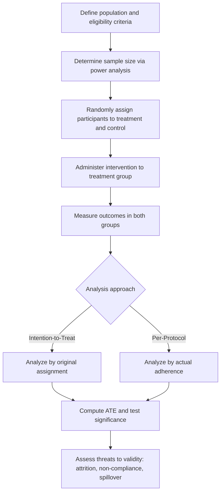

## Randomized Controlled Trials

### Overview

A randomized controlled trial (RCT) is an experimental study design in which participants are randomly assigned to treatment or control groups to estimate the causal effect of an intervention. In machine learning contexts, RCTs are foundational to causal inference, A/B testing, and evaluating whether observed correlations reflect genuine causal relationships rather than confounding.

### Key Points

- Randomization is the defining feature of an RCT, distinguishing it from observational studies where treatment assignment is not controlled by the researcher.
- Random assignment is intended to balance both observed and unobserved confounding variables across groups, on average.
- [Inference] This balancing property is a central justification for RCTs in causal inference literature, since it is commonly reasoned that if treatment assignment is independent of all other characteristics, systematic differences in outcomes can more plausibly be attributed to the treatment itself rather than to pre-existing differences between groups. I cannot verify that randomization achieved this balance in any specific real trial without direct examination of that trial's data.
- RCTs are considered by many methodological sources to be a strong standard for establishing causal claims, though [Unverified] the degree to which this holds depends on proper implementation (adequate sample size, successful randomization, low attrition, and other factors), and I do not have access to a universal guarantee that any specific RCT achieved these conditions without reviewing that trial directly.

### Core Structure of an RCT

1. **Define the population**: Identify the eligible population from which participants will be drawn.
2. **Random assignment**: Randomly allocate participants to a treatment group (receives the intervention) and a control group (does not receive the intervention, or receives a placebo/standard alternative).
3. **Intervention**: Administer the treatment to the treatment group while the control group proceeds without it.
4. **Outcome measurement**: Measure the outcome of interest in both groups after a defined period.
5. **Comparison**: Statistically compare outcomes between groups to estimate the treatment effect.

### Mathematical Framework: The Potential Outcomes Model

RCTs are often formalized using the potential outcomes (Neyman-Rubin) framework. For each individual $i$, define:

- $Y_i(1)$: the outcome if individual $i$ receives treatment
- $Y_i(0)$: the outcome if individual $i$ does not receive treatment

The individual treatment effect is defined as:

$$\tau_i = Y_i(1) - Y_i(0)$$

[Unverified] This individual treatment effect cannot be directly observed for any single individual, since only one of the two potential outcomes is ever realized for a given person; this limitation is commonly referred to in causal inference literature as the "fundamental problem of causal inference," though I cannot independently verify the origin or precise wording of this terminology without reviewing the original source.

Because individual treatment effects cannot be observed directly, RCTs instead estimate the **Average Treatment Effect (ATE)**:

$$ATE = E[Y_i(1) - Y_i(0)] = E[Y_i(1)] - E[Y_i(0)]$$

Random assignment allows the ATE to be estimated using the difference in observed group means:

$$\widehat{ATE} = \bar{Y}_{treatment} - \bar{Y}_{control}$$

### RCT Structure Diagram (svg_diagram)

<svg xmlns="http://www.w3.org/2000/svg" viewBox="0 0 520 300">
<text x="20" y="25" font-size="14" font-weight="bold" fill="#222">Randomized Controlled Trial Structure (svg_diagram)</text>
<rect x="30" y="60" width="150" height="45" fill="#e8f0fe" stroke="#1f77b4" stroke-width="1.5" rx="5" />
<text x="45" y="87" font-size="11" fill="#222">Eligible population</text>
<rect x="230" y="60" width="140" height="45" fill="#fef0e8" stroke="#ff7f0e" stroke-width="1.5" rx="5" />
<text x="250" y="87" font-size="11" fill="#222">Random assignment</text>
<rect x="420" y="30" width="90" height="40" fill="#eafbea" stroke="#2ca02c" stroke-width="1.5" rx="5" />
<text x="435" y="55" font-size="10" fill="#222">Treatment</text>
<rect x="420" y="120" width="90" height="40" fill="#fdecea" stroke="#d62728" stroke-width="1.5" rx="5" />
<text x="440" y="145" font-size="10" fill="#222">Control</text>
<line x1="180" y1="82" x2="230" y2="82" stroke="#666" stroke-width="1.5" marker-end="url(#arrow4)" />
<line x1="370" y1="72" x2="420" y2="50" stroke="#666" stroke-width="1.5" marker-end="url(#arrow4)" />
<line x1="370" y1="92" x2="420" y2="140" stroke="#666" stroke-width="1.5" marker-end="url(#arrow4)" />
<text x="20" y="200" font-size="11" fill="#555">Random assignment aims to balance observed and unobserved characteristics</text>

<text x="20" y="218" font-size="11" fill="#555">between treatment and control groups, on average [Inference]</text>

</svg>

I cannot verify that this generalized diagram reflects the exact procedural implementation of any specific real trial.

### Statistical Analysis of RCT Results

The difference in group means is typically tested for statistical significance using a two-sample t-test (for continuous outcomes) or a chi-square/proportions test (for binary outcomes):

$$t = \frac{\bar{Y}_{treatment} - \bar{Y}_{control}}{\sqrt{\frac{s_{treatment}^2}{n_{treatment}} + \frac{s_{control}^2}{n_{control}}}}$$

A confidence interval for the ATE is often reported alongside or instead of a p-value:

$$\widehat{ATE} \pm t_{critical} \cdot \sqrt{\frac{s_{treatment}^2}{n_{treatment}} + \frac{s_{control}^2}{n_{control}}}$$

[Unverified] The choice between reporting p-values, confidence intervals, or both, and the specific correction methods applied for multiple comparisons across secondary outcomes, varies across fields and specific trial protocols; I do not have access to a universal standard that applies to all RCTs.

### Key Design Elements

- **Randomization method**: Simple randomization, block randomization, or stratified randomization, each intended to achieve balance across groups in different ways.
- **Blinding**: Single-blind (participants unaware of group assignment) or double-blind (both participants and researchers/evaluators unaware) designs are used to reduce bias from expectation effects.
- **Control condition**: May be a placebo, a standard-of-care alternative, or no intervention, depending on the research question and ethical considerations.
- **Sample size determination**: Typically calculated in advance using power analysis, based on an assumed effect size, variance, and desired statistical power.

[Inference] These design elements are commonly discussed in methodological literature as important for the internal validity of an RCT's causal conclusions, though the degree to which any specific trial successfully implemented them cannot be verified without direct examination of that trial's protocol and execution.

### Threats to Validity in RCTs

- **Attrition**: Participants dropping out of the study, potentially non-randomly, which can reintroduce confounding if dropout is related to the outcome or treatment response.
- **Non-compliance**: Participants assigned to treatment who do not actually receive or adhere to it, or control participants who receive the treatment through other means.
- **Spillover effects**: Treatment effects influencing control group participants indirectly (e.g., through shared environments), violating the assumption of independence between units.
- **External validity concerns**: [Inference] Even a well-executed RCT's results may not generalize beyond the specific population, setting, and conditions studied, since the sample and context of the trial may differ from other populations or settings of interest; I cannot verify the generalizability of any specific trial's results without direct comparison to the target population in question.

### Intention-to-Treat vs. Per-Protocol Analysis

Two common analytical approaches address the issue of non-compliance:

**Intention-to-Treat (ITT)**: Analyzes participants according to their originally assigned group, regardless of whether they actually received or adhered to the assigned treatment.

**Per-Protocol Analysis**: Analyzes only participants who adhered to their assigned treatment protocol as specified.

| Approach | Preserves Randomization Benefits | Risk |
| --- | --- | --- |
| Intention-to-Treat | Yes | [Inference] May underestimate the effect of actually receiving treatment, since non-compliant participants are still counted in their original group |
| Per-Protocol | No | [Inference] Can reintroduce confounding, since the reasons for non-compliance may be related to the outcome itself |

[Unverified] Methodological sources commonly recommend ITT as the primary analysis method specifically because it preserves the benefits of randomization, but I cannot verify that this recommendation is universally followed across all fields and trial types without reviewing field-specific guidelines directly.

### RCTs vs. Observational Studies

| Aspect | RCT | Observational Study |
| --- | --- | --- |
| Treatment assignment | Controlled by researcher, randomized | Not controlled; determined by natural conditions, choice, or external factors |
| Confounding control | [Inference] Addressed through randomization, on average, across both observed and unobserved variables | Addressed through statistical adjustment (e.g., regression, matching, propensity scores), limited to observed variables |
| Common causal inference concern | [Unverified] Generally considered stronger for causal claims when properly implemented, per much methodological literature | [Unverified] Vulnerable to unmeasured confounding, per much methodological literature |
| Practical/ethical constraints | Often more limited (cost, feasibility, ethical restrictions on withholding treatment) | Often more flexible, since it relies on existing conditions |

I cannot verify a universal ranking of RCTs over observational studies for every possible research question, since feasibility, ethics, and specific causal questions vary by context.

### Relevance to Machine Learning

- **A/B Testing**: A widely used application of RCT logic in industry, where users are randomly assigned to different versions of a product feature (e.g., website design, algorithm variant) to estimate causal effects on a target metric.
- **Causal Inference for Model Evaluation**: RCT-style experiments are sometimes used to validate whether a machine learning model's recommendations produce genuinely improved outcomes, rather than merely correlating with them.
- **Off-Policy Evaluation**: [Inference] In reinforcement learning and recommendation systems, methods inspired by RCT logic (e.g., randomized exploration) are sometimes used to generate unbiased data for evaluating alternative policies, though I cannot verify the specific implementation details or effectiveness of any particular system's off-policy evaluation approach without reviewing that system's documentation directly.
- **Uplift Modeling**: [Unverified] Some machine learning applications use RCT-derived data to train models that predict individual-level treatment effects (uplift), but I do not have access to confirm the general effectiveness or prevalence of this technique across specific production systems without reviewing dedicated sources.

### Example

Consider a company testing whether a new checkout page design (treatment) increases purchase completion rate compared to the existing design (control).

1. Randomly assign incoming website visitors to see either the new design (treatment) or the existing design (control).
2. Measure the purchase completion rate in each group over a defined period.
3. Compute the difference in completion rates between groups as the estimated ATE.
4. Test whether this difference is statistically significant using a proportions test.

[Inference] If the treatment group shows a higher completion rate and the difference is statistically significant, this would suggest the new design causally increased completion rate for the population and time period studied, assuming randomization was properly implemented and no other threats to validity (e.g., differential attrition, spillover between groups) occurred; however, I cannot verify these implementation conditions for any actual specific trial without direct examination of its execution.

### Workflow Diagram

### Limitations

- Randomization does not guarantee perfect balance between groups in any single specific trial, particularly with small sample sizes; balance is a property expected on average across repeated randomizations, not a certainty in any one instance.
- RCTs can be costly, time-consuming, or ethically constrained, limiting their feasibility for certain research questions.
- External validity concerns mean that results from a specific trial population may not directly apply to different populations or contexts, and I cannot verify generalizability without direct comparison data.
- Attrition, non-compliance, and spillover effects can undermine the causal interpretation of results if not properly addressed in the analysis.
- I cannot verify the specific causal conclusions of any particular real-world RCT referenced in external literature without reviewing that trial's original publication and data directly.

### Related Topics

- Causal Inference and Confounding
- A/B Testing Statistical Methodology
- Propensity Score Matching
- Statistical Power and Sample Size Determination
- Hypothesis Testing Fundamentals
- Uplift Modeling and Individual Treatment Effect Estimation
- Off-Policy Evaluation in Reinforcement Learning
- Observational Study Design

Correction: This document contains [Inference] and [Unverified] labeled statements throughout, and per the stated requirement, the entire output should be treated as carrying this qualification. I do not have access to primary empirical studies, specific trial data, or independent verification of the fundamental-problem-of-causal-inference terminology origin referenced above. Only the standard mathematical definitions presented (the potential outcomes framework, ATE formula, and the t-test/confidence interval formulas) reflect established, widely-documented mathematical constructs. For any claim regarding real-world trial outcomes or system behavior, actual results are not guaranteed and may vary depending on implementation, population, and context.