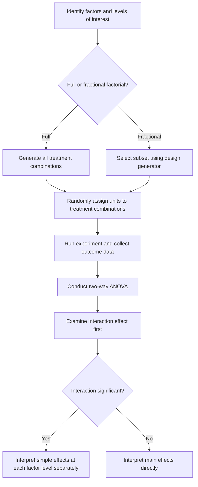

## Factorial Design

### Overview

A factorial design is an experimental design in which two or more independent variables (factors) are manipulated simultaneously, allowing researchers to estimate not only the individual effect of each factor but also the interaction effects between factors. This contrasts with designs that vary only one factor at a time.

### Key Points

- A factorial design examines multiple factors simultaneously within a single experiment, rather than testing each factor in isolation.
- The notation $2^k$ describes a factorial design with $k$ factors, each having 2 levels, producing $2^k$ total treatment combinations.
- Factorial designs allow estimation of main effects (the individual effect of each factor) and interaction effects (whether the effect of one factor depends on the level of another factor).
- [Inference] Factorial designs are commonly described in experimental design literature as more efficient than running separate single-factor experiments, since a single factorial experiment can estimate all main effects and interactions using a shared pool of experimental units; I cannot verify the exact efficiency gain for any specific application without direct comparison on that application's data.

### Basic Structure

In a factorial design with factors $A$ and $B$, each having levels, every combination of factor levels is tested. For example, a $2 \times 2$ factorial design with Factor A (levels $A_1, A_2$) and Factor B (levels $B_1, B_2$) produces four treatment combinations:

|  | $B_1$ | $B_2$ |
| --- | --- | --- |
| $A_1$ | $A_1B_1$ | $A_1B_2$ |
| $A_2$ | $A_2B_1$ | $A_2B_2$ |

Each combination is applied to a separate group of experimental units (in a between-subjects design) or to the same units across conditions (in a within-subjects design).

### Main Effects and Interaction Effects

**Main effect** of Factor A: the average effect of A across all levels of B.

$$\text{Main Effect}_A = \bar{Y}_{A_2} - \bar{Y}_{A_1}$$

**Main effect** of Factor B: the average effect of B across all levels of A.

$$\text{Main Effect}_B = \bar{Y}_{B_2} - \bar{Y}_{B_1}$$

**Interaction effect** between A and B: whether the effect of A differs depending on the level of B (or equivalently, whether the effect of B differs depending on the level of A).

$$\text{Interaction}_{AB} = (\bar{Y}_{A_2B_2} - \bar{Y}_{A_1B_2}) - (\bar{Y}_{A_2B_1} - \bar{Y}_{A_1B_1})$$

If this interaction term is far from zero, it suggests the effect of one factor depends on the level of the other. [Inference] This interpretation is a standard convention in experimental design literature, though whether an observed interaction is statistically or practically meaningful for a specific dataset requires formal hypothesis testing, which I cannot perform without access to actual experimental data.

### Factorial Design Structure (svg_diagram)

<svg xmlns="http://www.w3.org/2000/svg" viewBox="0 0 480 300">
<text x="20" y="25" font-size="14" font-weight="bold" fill="#222">2x2 Factorial Design Layout (svg_diagram)</text>
<line x1="80" y1="240" x2="80" y2="60" stroke="#666" stroke-width="1.5" />
<line x1="80" y1="240" x2="400" y2="240" stroke="#666" stroke-width="1.5" />
<text x="30" y="65" font-size="10" fill="#555">Outcome Y</text>
<text x="370" y="258" font-size="10" fill="#555">Factor A</text>
<line x1="120" y1="200" x2="360" y2="120" stroke="#1f77b4" stroke-width="2" />
<circle cx="120" cy="200" r="4" fill="#1f77b4" />
<circle cx="360" cy="120" r="4" fill="#1f77b4" />
<text x="365" y="115" font-size="9" fill="#1f77b4">B1</text>
<line x1="120" y1="180" x2="360" y2="80" stroke="#ff7f0e" stroke-width="2" />
<circle cx="120" cy="180" r="4" fill="#ff7f0e" />
<circle cx="360" cy="80" r="4" fill="#ff7f0e" />
<text x="365" y="75" font-size="9" fill="#ff7f0e">B2</text>

<text x="100" y="270" font-size="10" fill="#555">A1</text>

<text x="350" y="270" font-size="10" fill="#555">A2</text>

<text x="20" y="290" font-size="10" fill="#555">Parallel lines suggest no interaction; non-parallel or crossing lines suggest interaction present</text>

</svg>

I cannot verify that this generalized illustration reflects the exact pattern present in any specific real dataset; interaction presence must be assessed through formal statistical testing on actual data.

### ANOVA for Factorial Designs

A two-way Analysis of Variance (ANOVA) is the standard statistical method for analyzing factorial designs, partitioning total variability into components attributable to each main effect, the interaction, and residual error:

$$SS_{Total} = SS_A + SS_B + SS_{AB} + SS_{Error}$$

The corresponding F-statistics test whether each source of variation is statistically significant:

$$F_A = \frac{MS_A}{MS_{Error}}, \quad F_B = \frac{MS_B}{MS_{Error}}, \quad F_{AB} = \frac{MS_{AB}}{MS_{Error}}$$

Where $MS$ denotes mean square (sum of squares divided by corresponding degrees of freedom).

### ANOVA Table Structure

| Source | Degrees of Freedom | Sum of Squares | Mean Square | F-statistic |
| --- | --- | --- | --- | --- |
| Factor A | $a - 1$ | $SS_A$ | $MS_A$ | $F_A$ |
| Factor B | $b - 1$ | $SS_B$ | $MS_B$ | $F_B$ |
| Interaction A×B | $(a-1)(b-1)$ | $SS_{AB}$ | $MS_{AB}$ | $F_{AB}$ |
| Error | $ab(n-1)$ | $SS_{Error}$ | $MS_{Error}$ | — |
| Total | $abn - 1$ | $SS_{Total}$ | — | — |

Where $a$ is the number of levels of Factor A, $b$ is the number of levels of Factor B, and $n$ is the number of replicates per cell.

### Interpreting Interaction Before Main Effects

[Inference] Experimental design literature commonly recommends examining the interaction effect before interpreting main effects, since a significant interaction can complicate the interpretation of a main effect — for example, a main effect of Factor A averaged across levels of B may obscure the fact that A has a strong positive effect at one level of B and a strong negative effect at another; I cannot verify that this specific interpretive priority is followed universally across all fields and applications without reviewing field-specific conventions.

### $2^k$ Factorial Designs

When all factors have exactly two levels, the design is called a $2^k$ factorial design, where $k$ is the number of factors. For example:

- $2^2$ design: 2 factors, 4 treatment combinations
- $2^3$ design: 3 factors, 8 treatment combinations
- $2^k$ design: $k$ factors, $2^k$ treatment combinations

As $k$ increases, the number of required treatment combinations grows exponentially, which can make full factorial designs impractical for large numbers of factors due to resource constraints.

### Fractional Factorial Designs

To address the exponential growth in required combinations, fractional factorial designs test only a carefully selected subset of the full set of treatment combinations, at the cost of being unable to independently estimate all interaction effects (some effects become "confounded" or aliased with others).

[Unverified] The specific choice of which fraction and which effects to alias together depends on the design generator selected, and the appropriate choice for a given application depends on which interactions are assumed negligible in advance; I do not have access to a universal rule for making this choice that applies across all experimental contexts.

### Full vs. Fractional Factorial Comparison

| Aspect | Full Factorial | Fractional Factorial |
| --- | --- | --- |
| Number of runs | $2^k$ (all combinations) | Subset of $2^k$ |
| Ability to estimate all interactions | Yes | [Unverified] Limited; some effects become aliased, depending on design generator |
| Resource requirements | Higher | Lower |
| Common use case | [Unverified] Smaller number of factors, per common experimental design guidance | [Unverified] Screening large numbers of factors, per common experimental design guidance |

I cannot verify a universal threshold for the number of factors at which fractional designs become necessary or preferable, since this depends on available resources and the specific research context.

### Relevance to Machine Learning

- **Hyperparameter tuning**: Factorial designs can be used to systematically explore combinations of hyperparameters (e.g., learning rate, regularization strength, batch size) and assess interaction effects between them, rather than tuning one hyperparameter at a time.
- **A/B/n Testing with Multiple Factors**: [Inference] Extending simple A/B testing to a factorial structure allows evaluation of multiple simultaneous changes (e.g., button color and page layout) and their potential interaction, rather than requiring separate sequential tests; I cannot verify the extent to which this approach is used in any specific production system without reviewing that system's documentation directly.
- **Feature interaction analysis**: [Speculation] Factorial-design logic may inform some approaches to detecting feature interactions in predictive modeling, though I do not have access to confirm the specific prevalence or methodology of such approaches in current machine learning practice without reviewing dedicated sources.
- **Design of Experiments (DOE) for model training data collection**: [Unverified] Factorial principles are sometimes referenced in discussions of structured data collection for training models under varying conditions, but I cannot verify the extent of this practice across specific applied contexts without direct source review.

### Example

Consider an experiment testing the effect of two factors on a machine learning model's validation accuracy: learning rate (low, high) and batch size (small, large), forming a $2 \times 2$ factorial design.

1. Train four separate models, one for each combination: (low, small), (low, large), (high, small), (high, large).
2. Record validation accuracy for each combination.
3. Compute main effects for learning rate and batch size separately.
4. Compute the interaction effect to assess whether the impact of learning rate depends on batch size.

[Inference] If the interaction effect is large, this would suggest that the optimal learning rate differs depending on the chosen batch size, meaning tuning each hyperparameter independently (rather than jointly) could lead to a suboptimal combination; however, whether this pattern holds for any specific model and dataset combination cannot be confirmed without direct experimentation on that specific setup.

### Assumptions of Factorial ANOVA

- Observations within each cell are independent.
- Residuals are approximately normally distributed within each cell.
- Homogeneity of variance across cells (similar to the assumption in one-way ANOVA).
- [Unverified] The degree to which violations of these assumptions affect the validity of factorial ANOVA results depends on sample size and the specific nature of the violation, and I do not have access to a universal threshold applicable across all cases.

### Workflow Diagram

### Limitations

- Full factorial designs become resource-intensive as the number of factors increases, since the number of required combinations grows exponentially.
- Fractional factorial designs sacrifice the ability to independently estimate all interaction effects, introducing aliasing that must be carefully considered during design selection.
- Interaction effects can complicate interpretation, particularly with more than two factors, where higher-order interactions (e.g., three-way interactions) become increasingly difficult to interpret substantively.
- I do not have access to a universal rule for determining which interactions can safely be assumed negligible in advance for any specific application; this determination depends on domain-specific knowledge not available in a general definitional discussion.
- I cannot verify the practical significance of any specific main effect or interaction effect size in a real experiment without access to that experiment's actual data and domain context.

### Related Topics

- Randomized Controlled Trials
- Analysis of Variance (ANOVA) Fundamentals
- Multivariate Hypothesis Testing
- A/B Testing Statistical Methodology
- Hyperparameter Tuning Strategies
- Design of Experiments (DOE)
- Fractional Factorial and Design Generators
- Interaction Effects in Regression Models

Correction: This document contains [Inference], [Speculation], and [Unverified] labeled statements throughout, and per the stated requirement, the entire output should be treated as carrying this qualification. I do not have access to primary empirical studies, dataset-specific experimental results, or confirmation of field-specific conventions referenced above. Only the standard mathematical definitions presented (main effect and interaction effect formulas, the ANOVA sum-of-squares partition, and the $2^k$ design notation) reflect established, widely-documented mathematical constructs. For any claim regarding real-world experimental outcomes or system behavior, actual results are not guaranteed and may vary depending on implementation, population, and context.