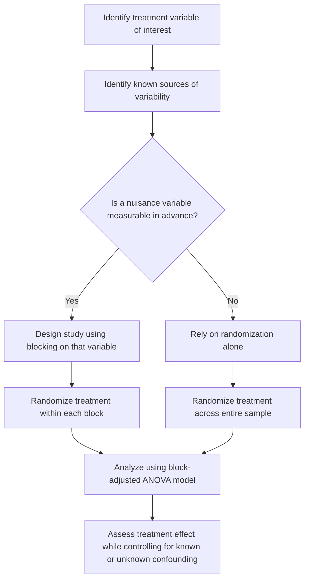

## Blocking and Confounding

### Overview

Blocking and confounding are foundational concepts in experimental design concerned with controlling unwanted sources of variability. Confounding refers to a situation where the effect of a variable of interest cannot be separated from the effect of another variable, while blocking is a design technique used to reduce the impact of known sources of variability by grouping similar experimental units together.

### Key Points

- Confounding occurs when the effect of the treatment variable is mixed with the effect of another variable, making it impossible to attribute observed differences to the treatment alone.
- Blocking is a design strategy that groups experimental units into homogeneous subsets (blocks) based on a known source of variability, then randomizes treatment assignment within each block.
- [Inference] Blocking is commonly described in experimental design literature as a way to reduce the residual error variance in an analysis, since some of the variability that would otherwise appear as unexplained error is instead attributed to the blocking variable; I cannot verify the exact reduction in error variance for any specific dataset without direct computation on that data.
- Randomization addresses confounding from unmeasured variables on average across an experiment, while blocking specifically addresses confounding from a known, measurable variable.

### Confounding Defined

A confounding variable is a variable that is associated with both the treatment assignment and the outcome, distorting the apparent relationship between them. Formally, if $Z$ is a confounder, $T$ is the treatment, and $Y$ is the outcome, confounding exists when:

$$Z \text{ is associated with } T \quad \text{and} \quad Z \text{ is associated with } Y \quad \text{(independent of } T\text{)}$$

If $Z$ is not properly accounted for, the observed association between $T$ and $Y$ may reflect the influence of $Z$ rather than a genuine causal effect of $T$ on $Y$.

[Unverified] I cannot verify whether any specific observed association in a real dataset is due to confounding, direct causation, or both, without detailed knowledge of that dataset's data-generating process, which is generally not fully knowable from the data alone.

### Confounding Diagram (svg_diagram)

<svg xmlns="http://www.w3.org/2000/svg" viewBox="0 0 480 280">
<text x="20" y="25" font-size="14" font-weight="bold" fill="#222">Confounding Structure (svg_diagram)</text>
<circle cx="240" cy="60" r="35" fill="#fdecea" stroke="#d62728" stroke-width="1.5" />
<text x="220" y="65" font-size="12" fill="#222">Confounder Z</text>
<circle cx="100" cy="180" r="40" fill="#e8f0fe" stroke="#1f77b4" stroke-width="1.5" />
<text x="80" y="185" font-size="12" fill="#222">Treatment T</text>
<circle cx="380" cy="180" r="40" fill="#eafbea" stroke="#2ca02c" stroke-width="1.5" />
<text x="360" y="185" font-size="12" fill="#222">Outcome Y</text>
<line x1="215" y1="90" x2="130" y2="150" stroke="#666" stroke-width="1.5" marker-end="url(#arrowc)" />
<line x1="265" y1="90" x2="350" y2="150" stroke="#666" stroke-width="1.5" marker-end="url(#arrowc)" />
<line x1="140" y1="180" x2="340" y2="180" stroke="#999" stroke-width="1.5" stroke-dasharray="4,2" marker-end="url(#arrowc)" />
<text x="200" y="205" font-size="9" fill="#999">apparent association</text>
<text x="20" y="250" font-size="10" fill="#555">Z influences both T and Y, creating a spurious or distorted apparent T-Y relationship</text>

</svg>

I cannot verify that this generalized diagram structure applies to any specific real dataset without domain-specific causal analysis of that data.

### How Randomization Addresses Confounding

In a properly randomized experiment, treatment assignment $T$ is made independent of all other variables, including potential confounders $Z$, by design. [Inference] This is commonly reasoned to break the association between $Z$ and $T$ shown in the diagram above, since random assignment does not depend on any characteristic of the experimental unit, including $Z$; if $Z$ is no longer associated with $T$, it cannot confound the estimated relationship between $T$ and $Y$, at least on average across repeated randomizations. I cannot verify that this held precisely in any specific completed trial without reviewing that trial's actual randomization outcomes.

### Blocking Defined

Blocking is a design technique in which experimental units are first grouped into blocks based on a variable believed to affect the outcome, and treatment is then randomly assigned within each block, rather than across the entire sample.

**Purpose**: To remove the variability due to the blocking variable from the estimate of treatment effect, thereby increasing the precision of that estimate.

**Example structure**: In a randomized block design with $b$ blocks and $t$ treatments, each block contains one experimental unit per treatment level, and treatment is randomly assigned to units within each block.

### Randomized Complete Block Design (RCBD)

The statistical model for a randomized complete block design is often written as:

$$Y_{ij} = \mu + \tau_i + \beta_j + \epsilon_{ij}$$

Where:

- $Y_{ij}$ is the outcome for treatment $i$ in block $j$
- $\mu$ is the overall mean
- $\tau_i$ is the effect of treatment $i$
- $\beta_j$ is the effect of block $j$
- $\epsilon_{ij}$ is random error

This model partitions total variability into treatment effects, block effects, and residual error, analogous to the partition used in factorial ANOVA but with the block treated as an additional source of variation rather than a factor of primary interest.

### ANOVA Table for RCBD

| Source | Degrees of Freedom | Sum of Squares | Mean Square | F-statistic |
| --- | --- | --- | --- | --- |
| Treatment | $t - 1$ | $SS_{Treatment}$ | $MS_{Treatment}$ | $F = MS_{Treatment}/MS_{Error}$ |
| Block | $b - 1$ | $SS_{Block}$ | $MS_{Block}$ | (often not tested directly) |
| Error | $(t-1)(b-1)$ | $SS_{Error}$ | $MS_{Error}$ | — |
| Total | $tb - 1$ | $SS_{Total}$ | — | — |

[Unverified] Some methodological sources note that the block effect's F-statistic is not always tested for significance in the same way as the treatment effect, since blocks are typically included based on prior knowledge that they matter rather than to test a hypothesis about them; I cannot verify that this convention is followed uniformly across all fields and software implementations without reviewing specific field guidelines.

### Blocking Diagram (svg_diagram)

<svg xmlns="http://www.w3.org/2000/svg" viewBox="0 0 500 300">
<text x="20" y="25" font-size="14" font-weight="bold" fill="#222">Randomized Block Design Layout (svg_diagram)</text>
<rect x="30" y="50" width="440" height="50" fill="#fafafa" stroke="#999" />
<text x="40" y="70" font-size="11" fill="#222">Block 1</text>
<rect x="120" y="60" width="60" height="30" fill="#e8f0fe" stroke="#1f77b4" />
<text x="130" y="80" font-size="9" fill="#222">Treat A</text>
<rect x="200" y="60" width="60" height="30" fill="#fef0e8" stroke="#ff7f0e" />
<text x="210" y="80" font-size="9" fill="#222">Treat B</text>
<rect x="280" y="60" width="60" height="30" fill="#eafbea" stroke="#2ca02c" />
<text x="290" y="80" font-size="9" fill="#222">Treat C</text>
<rect x="30" y="110" width="440" height="50" fill="#fafafa" stroke="#999" />
<text x="40" y="130" font-size="11" fill="#222">Block 2</text>
<rect x="200" y="120" width="60" height="30" fill="#e8f0fe" stroke="#1f77b4" />
<text x="210" y="140" font-size="9" fill="#222">Treat A</text>
<rect x="280" y="120" width="60" height="30" fill="#fef0e8" stroke="#ff7f0e" />
<text x="290" y="140" font-size="9" fill="#222">Treat B</text>
<rect x="120" y="120" width="60" height="30" fill="#eafbea" stroke="#2ca02c" />
<text x="130" y="140" font-size="9" fill="#222">Treat C</text>
<rect x="30" y="170" width="440" height="50" fill="#fafafa" stroke="#999" />
<text x="40" y="190" font-size="11" fill="#222">Block 3</text>
<rect x="280" y="180" width="60" height="30" fill="#e8f0fe" stroke="#1f77b4" />
<text x="290" y="200" font-size="9" fill="#222">Treat A</text>
<rect x="120" y="180" width="60" height="30" fill="#fef0e8" stroke="#ff7f0e" />
<text x="130" y="200" font-size="9" fill="#222">Treat B</text>
<rect x="200" y="180" width="60" height="30" fill="#eafbea" stroke="#2ca02c" />
<text x="210" y="200" font-size="9" fill="#222">Treat C</text>

<text x="20" y="250" font-size="10" fill="#555">Treatment order is randomized within each block; each block receives all treatments once</text>

</svg>

I cannot verify that this generalized layout matches the exact block structure used in any specific real experiment.

### Blocking vs. Confounding: A Key Distinction

| Aspect | Confounding | Blocking |
| --- | --- | --- |
| Nature | An unwanted, often unintended distortion of the treatment-outcome relationship | An intentional design strategy to control a known source of variability |
| Relationship to treatment assignment | Confounder is associated with treatment assignment, distorting inference | Blocking variable is deliberately used to structure treatment assignment, not distorting inference |
| Effect on analysis | [Inference] Can lead to biased estimates of the treatment effect if not addressed | [Inference] Intended to reduce error variance and improve precision without biasing the treatment effect estimate, when implemented correctly |

I cannot verify that blocking was implemented correctly, or that confounding was successfully avoided, in any specific real study without direct examination of that study's design and data.

### Confounding by Design vs. Confounding by Analysis Failure

[Unverified] Some experimental design sources distinguish between confounding that arises from a flawed design (e.g., failing to randomize) versus confounding that arises from failing to statistically control for a known variable during analysis, even when the design itself was sound; I cannot verify that this exact distinction is drawn consistently across all methodological sources without reviewing them directly.

### When Blocking Is Used

Blocking is commonly applied when a variable is known or suspected to affect the outcome but is not the primary variable of interest. Common blocking variables include:

- Time period (e.g., day of experiment, batch of materials)
- Location (e.g., different labs, different geographic sites)
- Subject-level characteristics (e.g., age group, prior condition) in studies where the same treatments are applied across different subject subgroups

[Inference] The choice of blocking variable is commonly guided by prior domain knowledge about what is likely to affect the outcome, though I cannot verify the appropriateness of any specific blocking variable for a given study without domain-specific knowledge of that study's context.

### Relevance to Machine Learning

- **Cross-validation fold design**: [Inference] Some cross-validation strategies (e.g., stratified k-fold, grouped k-fold) can be understood as applying blocking-like logic, ensuring that known sources of variability (e.g., class distribution, subject identity) are balanced or controlled across folds rather than left to chance; I cannot verify that this framing is explicitly used in the design rationale of any specific cross-validation implementation without reviewing that implementation's documentation.
- **Confounding in observational training data**: When training data is collected observationally rather than experimentally, confounding variables can bias a model's learned associations, potentially leading it to rely on spurious correlations. [Unverified] The degree to which this affects any specific trained model's predictions depends on the particular dataset and modeling approach, and I cannot verify this for any specific system without direct analysis of that system's training data.
- **Batch effects**: [Inference] In machine learning applied to domains like genomics or multi-site data collection, "batch effects" are a commonly discussed form of confounding, where systematic differences between data collection batches or sites can be mistaken for genuine signal; I cannot verify the presence or magnitude of batch effects in any specific dataset without direct statistical examination of that data.

### Example

Consider an agricultural experiment testing three fertilizer types on crop yield, conducted across three different fields with potentially different soil quality.

1. If fertilizer type were assigned entirely by field (e.g., Field 1 always gets Fertilizer A), field and fertilizer type would be completely confounded, making it impossible to separate the effect of fertilizer from the effect of field-specific soil quality.
2. Using a randomized block design, each field is treated as a block, and all three fertilizers are randomly assigned to different plots within each field.
3. This ensures that field-level differences (the blocking variable) do not confound the estimated effect of fertilizer type, since every fertilizer is tested within every field.

[Inference] In this specific constructed example, blocking by field would be expected to reduce the residual error attributable to field-to-field soil variability, improving the precision of the fertilizer effect estimate compared to a design that ignored field differences entirely; however, this is an illustration of the general logic of blocking, not a claim about the outcome of any actual agricultural trial.

### Workflow Diagram

### Limitations

- Blocking is only effective if the chosen blocking variable is genuinely associated with the outcome; blocking on an irrelevant variable does not improve precision and may reduce degrees of freedom available for estimating error, [Inference] potentially reducing statistical power without a compensating benefit, though the practical significance of this depends on the specific study design.
- Confounding from variables not identified or measured cannot be addressed through blocking, since blocking requires the confounding variable to be known and measurable in advance.
- Randomization addresses confounding on average across repeated experiments but does not guarantee perfect balance in any single specific study, particularly with small sample sizes.
- [Unverified] I cannot verify whether any specific real study successfully identified and controlled for all relevant confounding variables, since unmeasured confounding can never be fully ruled out without complete knowledge of the true data-generating process.
- I cannot verify the practical significance of any specific blocking or confounding scenario in a real dataset without direct access to that dataset and its underlying causal structure.

### Related Topics

- Randomized Controlled Trials
- Factorial Design
- Analysis of Variance (ANOVA) Fundamentals
- Causal Inference and the Potential Outcomes Framework
- Propensity Score Matching
- Stratified and Grouped Cross-Validation
- Batch Effect Correction in Data Analysis
- Observational Study Design

Correction: This document contains [Inference] and [Unverified] labeled statements throughout, and per the stated requirement, the entire output should be treated as carrying this qualification. I do not have access to primary empirical studies, dataset-specific results, or independent verification of field-specific methodological conventions referenced above. Only the standard mathematical definitions presented (the confounding association conditions, the RCBD statistical model, and the ANOVA sum-of-squares partition) reflect established, widely-documented mathematical constructs. For any claim regarding real-world experimental or model outcomes, actual results are not guaranteed and may vary depending on implementation, population, and context.