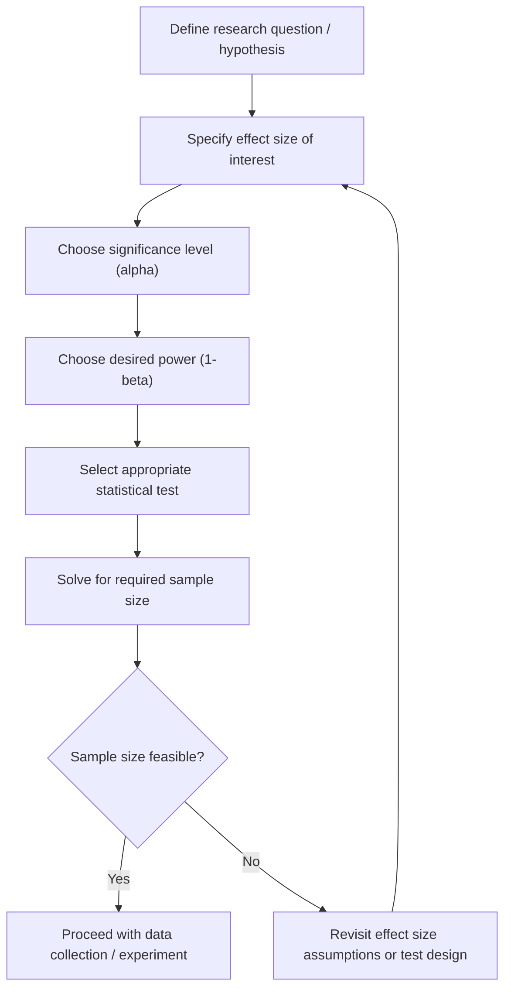

## Power Analysis

### Definition

Statistical power is the probability that a hypothesis test correctly rejects a false null hypothesis. Formally, power is defined as:

$$\text{Power} = 1 - \beta$$

where $\beta$ is the probability of a Type II error (failing to reject a false null hypothesis).

### The Four Interrelated Quantities

Power analysis rests on a relationship among four quantities. Given any three, the fourth can be solved for.

- **Sample size** ($n$): number of observations
- **Effect size** ($d$, $f$, $r$, or similar): magnitude of the phenomenon being detected
- **Significance level** ($\alpha$): probability of a Type I error, typically set at $0.05$
- **Power** ($1-\beta$): probability of detecting a true effect, conventionally targeted at $0.80$

[Inference] Because these four quantities are mathematically linked through the sampling distribution of the test statistic, fixing three of them determines the fourth. This is a standard result in the statistical power literature, though the exact functional form differs by test type.

### Why Power Analysis Matters for Machine Learning

- **Sample size planning**: Determines how much labeled data is needed before a study or experiment (e.g., A/B test, model comparison) can detect a meaningful effect.
- **Avoiding underpowered experiments**: An underpowered study has a high chance of failing to detect a real effect, wasting data collection effort.
- **Avoiding overpowered experiments**: Excessively large samples can detect trivially small effects as "statistically significant," which may not be practically meaningful.
- **Model comparison validity**: When comparing two ML models' performance (e.g., accuracy, AUC) on a test set, power analysis informs whether the test set size is sufficient to detect a real performance difference.

[Unverified] The specific threshold at which a performance difference becomes "practically meaningful" is domain-dependent and cannot be stated as a general numeric rule.

### Type I and Type II Errors — Context

|  | $H_0$ True | $H_0$ False |
| --- | --- | --- |
| Reject $H_0$ | Type I Error ($\alpha$) | Correct (Power, $1-\beta$) |
| Fail to Reject $H_0$ | Correct ($1-\alpha$) | Type II Error ($\beta$) |

Power analysis specifically addresses the bottom-right and top-right cells: it quantifies the probability of correctly detecting a true effect versus missing it.

<svg xmlns="http://www.w3.org/2000/svg" viewBox="0 0 700 320">
<text x="350" y="25" font-size="16" font-weight="bold" text-anchor="middle" fill="#222">Null vs Alternative Distributions (svg_diagram)</text>

<line x1="50" y1="270" x2="650" y2="270" stroke="#333" stroke-width="1.5" />

<path d="M 80 270 C 130 270, 150 90, 220 90 C 290 90, 310 270, 360 270" fill="none" stroke="`#3366cc`" stroke-width="2" />

<text x="220" y="80" font-size="12" fill="`#3366cc`" text-anchor="middle">H0 distribution</text>

<path d="M 300 270 C 350 270, 370 130, 440 130 C 510 130, 530 270, 580 270" fill="none" stroke="`#cc3333`" stroke-width="2" />

<text x="460" y="120" font-size="12" fill="`#cc3333`" text-anchor="middle">H1 distribution</text>

<line x1="360" y1="270" x2="360" y2="90" stroke="#444" stroke-width="1" stroke-dasharray="4,3" />
<text x="365" y="60" font-size="11" fill="#444">critical value</text>

<path d="M 360 270 C 340 270, 320 200, 300 175 L 360 175 Z" fill="#3366cc" opacity="0.25" />
<text x="330" y="290" font-size="11" fill="#3366cc" text-anchor="middle">alpha</text>

<path d="M 360 270 L 360 130 C 400 130, 420 170, 440 200 C 460 230, 470 260, 480 270 Z" fill="#cc3333" opacity="0.25" />
<text x="450" y="245" font-size="11" fill="#cc3333" text-anchor="middle">power (1-beta)</text>

<path d="M 300 270 C 320 270, 340 230, 360 200 L 360 270 Z" fill="#999999" opacity="0.35" />
<text x="330" y="255" font-size="10" fill="#555" text-anchor="middle">beta</text>

<text x="350" y="310" font-size="12" fill="#333" text-anchor="middle">Test statistic value</text>

</svg>

### Effect Size Measures

Effect size quantifies the magnitude of a difference or relationship independent of sample size.

**Cohen's d** (difference between two means):

$$d = \frac{\bar{x}_1 - \bar{x}_2}{s_{pooled}}$$

Conventional [Unverified] benchmark interpretations attributed to Cohen: $d = 0.2$ (small), $d = 0.5$ (medium), $d = 0.8$ (large). These thresholds are context-dependent and are not universal cutoffs.

**Cohen's f** (ANOVA, multiple groups):

$$f = \sqrt{\frac{\eta^2}{1-\eta^2}}$$

where $\eta^2$ is the proportion of variance explained by group membership.

**Correlation coefficient** ($r$): used directly as an effect size for correlation-based tests.

**Odds ratio / Cohen's h**: used for proportions and binary outcomes (e.g., classification accuracy comparisons).

### Power Analysis for a Two-Sample t-test

The sample size per group required for a two-sample t-test can be approximated as:

$$n \approx \frac{2(z_{\alpha/2} + z_{\beta})^2 \sigma^2}{\delta^2}$$

where:

- $z_{\alpha/2}$ is the critical value for the chosen significance level
- $z_{\beta}$ is the critical value corresponding to desired power
- $\sigma^2$ is the population variance
- $\delta$ is the minimum detectable difference between means

[Inference] This formula is a large-sample normal approximation to the exact noncentral t-distribution-based calculation; exact software implementations (e.g., G*Power, statsmodels) typically use the noncentral t or F distribution rather than this approximation for small samples.

### Worked Example — Comparing Two Model Accuracies

**Example**

Suppose an ML practitioner wants to determine whether Model A and Model B differ in accuracy on a held-out test set, and wants to know how many test samples are needed.

- Desired power: $1 - \beta = 0.80$
- Significance level: $\alpha = 0.05$ (two-tailed)
- Expected effect size: $d = 0.3$ (small-to-medium)

Using the normal approximation:

$$n \approx \frac{2(1.96 + 0.84)^2}{0.3^2} \approx \frac{2 \times 7.84}{0.09} \approx 174$$

This suggests approximately 174 samples per group (348 total) would be needed to detect an effect of this size with 80% power.

[Unverified] This is an illustrative arithmetic example only; actual required sample size depends on the specific test statistic distribution, variance assumptions, and whether the comparison involves paired or independent samples. Exact figures should be computed using dedicated statistical software rather than manual approximation.

### Power Analysis for Proportions (Classification Accuracy)

When comparing classification accuracy (a proportion) between two models, a two-proportion test power formula is commonly used:

$$n \approx \frac{(z_{\alpha/2}\sqrt{2\bar{p}(1-\bar{p})} + z_{\beta}\sqrt{p_1(1-p_1)+p_2(1-p_2)})^2}{(p_1 - p_2)^2}$$

where $p_1, p_2$ are the two accuracy rates being compared and $\bar{p}$ is their average.

[Inference] This formula assumes independent test sets or independent errors, an assumption that often does not hold when two models are evaluated on the same test set — a scenario more appropriately handled by McNemar's test, which has its own power considerations.

### Power Considerations for McNemar's Test

When two classifiers are evaluated on the *same* test set, their errors are paired, and McNemar's test is typically used rather than an independent two-proportion test. Power analysis for McNemar's test depends on the discordant proportion (cases where the two models disagree), not simply on the overall accuracy difference.

[Unverified] There is no single universal closed-form power formula for McNemar's test that applies without specifying the joint distribution of model agreement/disagreement; power calculations for this test typically require simulation or specialized software.

### A Priori vs. Post Hoc Power Analysis

- **A priori power analysis**: Conducted before data collection to determine required sample size given a target power, effect size, and $\alpha$. This is the methodologically preferred approach.
- **Post hoc (observed) power analysis**: Computed after a study using the observed effect size. [Inference] This approach is widely criticized in the statistical literature because observed power is mathematically determined by the p-value, making it circular and uninformative — this criticism appears consistently across methodological sources, though this content does not cite a specific paper.

### Power Analysis Workflow

### Common Pitfalls

- **Using observed (post hoc) power** instead of a priori planning — considered statistically circular by many methodologists [Unverified specific citation].
- **Underestimating variance**, which leads to underpowered studies when the true variance is higher than assumed.
- **Ignoring multiple comparisons**, where testing many hypotheses (e.g., many hyperparameter configurations) without adjusting $\alpha$ inflates the effective Type I error rate, which in turn affects the power calculus for each individual test.
- **Conflating statistical significance with practical significance**, especially relevant in ML where very large datasets can make trivially small effect sizes statistically significant.
- **Assuming independence when data is paired or clustered**, which invalidates standard power formulas designed for independent samples.

### Power Analysis in A/B Testing for ML Systems

[Inference] In production ML contexts (e.g., testing a new recommendation model against a baseline), power analysis is commonly used to determine the minimum experiment duration or user traffic needed to detect a target lift in a business metric (e.g., click-through rate) with adequate power. The specific implementation details (sequential testing, multi-armed bandits, variance reduction techniques like CUPED) vary substantially by organization and are not standardized, so behavior of any specific platform's built-in power calculator should not be assumed to generalize.

### Software Tools Commonly Referenced for Power Analysis

- **G*Power**: A widely referenced standalone application for power analysis across many test types.
- **Python `statsmodels.stats.power`**: Provides functions such as `TTestPower`, `FTestAnovaPower`, and `NormalIndPower`.
- **R `pwr` package**: Provides functions such as `pwr.t.test()`, `pwr.anova.test()`, and `pwr.chisq.test()`.

[Unverified] Exact function names, parameters, and default behaviors of these libraries should be verified against current documentation, since library APIs change across versions.

### Relationship to Confidence Intervals

[Inference] Power analysis and confidence interval width are related in that both depend on sample size, variance, and desired certainty level; a study designed with adequate power to detect an effect will generally also produce a reasonably narrow confidence interval around that effect estimate, though the two concepts answer different questions (power addresses probability of detection under a hypothesized true effect; confidence intervals quantify estimation uncertainty around the observed effect).

**Next Steps**

- Multiple comparisons correction (Bonferroni, Holm, Benjamini-Hochberg / FDR control)
- Sequential testing and always-valid p-values in online experimentation
- Bootstrap and permutation-based approaches to power estimation
- Bayesian approaches to sample size determination (Bayesian power / assurance)
- McNemar's test and paired classifier comparison in depth
- Variance reduction techniques (CUPED) in A/B testing
- Multi-armed bandits as an alternative to fixed-sample hypothesis testing