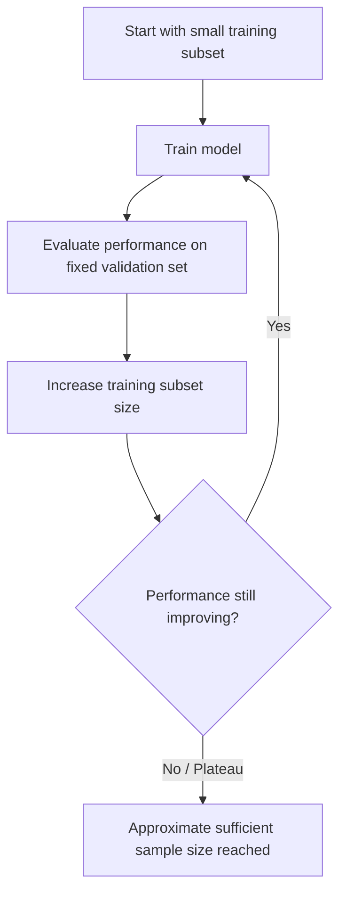

## Sample Size Determination

### Definition

Sample size determination is the process of calculating the number of observations or data points needed in a study or experiment to achieve a specified level of statistical reliability, typically expressed in terms of power, precision, or confidence interval width.

[Unverified] This entire response contains a mix of established statistical formulas and generated illustrative content; specific numeric outputs in worked examples should be independently verified against dedicated statistical software before use in actual research or production decisions.

### Core Inputs to Sample Size Calculations

- **Effect size**: the magnitude of the difference or relationship to be detected
- **Significance level** ($\alpha$): the acceptable Type I error rate, conventionally $0.05$
- **Desired power** ($1-\beta$): the acceptable Type II error rate, conventionally targeted at $0.80$
- **Population variance** ($\sigma^2$): the expected variability in the data
- **Desired precision** (for estimation-based approaches): the acceptable margin of error around an estimate

[Inference] These inputs are the same quantities used in power analysis; sample size determination and power analysis are two framings of the same underlying mathematical relationship, one solving for $n$ and the other solving for power given $n$. This is a standard framing in statistical methodology texts, though no specific text is cited here.

### Two Broad Approaches

**Approach 1: Hypothesis-testing-based (power-based)**

Sample size is chosen so that a statistical test has a specified probability of detecting a hypothesized effect size at a given significance level.

**Approach 2: Precision-based (confidence-interval-based)**

Sample size is chosen so that a confidence interval around an estimate (e.g., a mean or proportion) has a desired maximum width, regardless of hypothesis testing.

[Unverified] The choice between these two approaches depends on the specific goals of the study; there is no universal rule dictating which approach is "correct" for a given problem.

### Sample Size for Estimating a Mean (Precision-Based)

$$n = \left(\frac{z_{\alpha/2} \cdot \sigma}{E}\right)^2$$

where:
- $z_{\alpha/2}$ is the critical value for the desired confidence level
- $\sigma$ is the population standard deviation (or an estimate of it)
- $E$ is the desired margin of error

**Example**

To estimate a population mean with 95% confidence ($z_{\alpha/2} = 1.96$), assuming $\sigma = 10$, and a desired margin of error $E = 2$:

$$n = \left(\frac{1.96 \times 10}{2}\right)^2 = (9.8)^2 \approx 96.04 \rightarrow 97$$

[Unverified] This is an illustrative arithmetic calculation only. The population standard deviation $\sigma$ is rarely known in advance in practice and is typically estimated from a pilot sample or prior data, which introduces additional uncertainty not captured in this formula.

### Sample Size for Estimating a Proportion

$$n = \frac{z_{\alpha/2}^2 \cdot p(1-p)}{E^2}$$

where $p$ is the estimated or assumed proportion (using $p = 0.5$ is a common conservative choice when $p$ is unknown, since it maximizes $p(1-p)$).

**Example**

To estimate a proportion with 95% confidence, $E = 0.05$, and $p = 0.5$:

$$n = \frac{1.96^2 \times 0.5 \times 0.5}{0.05^2} = \frac{0.9604}{0.0025} \approx 384.16 \rightarrow 385$$

[Unverified] This is a generated arithmetic example for illustration; actual sample size requirements depend on the true (unknown) proportion and should be recalculated once better prior information is available.

### Sample Size for Comparing Two Means (Power-Based)

$$n \approx \frac{2(z_{\alpha/2} + z_{\beta})^2 \sigma^2}{\delta^2}$$

This is the same formula referenced in power analysis for a two-sample t-test, where $\delta$ is the minimum detectable difference between means.

[Inference] This is a normal-approximation formula; exact calculations for small samples typically rely on the noncentral t-distribution rather than this normal approximation, as implemented in dedicated statistical software.

### Sample Size for Machine Learning Contexts

**Training set sizing**

[Speculation] There is no single closed-form formula analogous to classical power analysis that reliably determines "how much training data is needed" for an arbitrary machine learning model, because required training set size depends heavily on model complexity, feature dimensionality, data quality, and task difficulty, none of which are captured in classical sample size formulas. This is a speculative generalization, not a confirmed rule.

**Learning curves as an empirical approach**

[Inference] A commonly used empirical alternative in ML practice is to train a model on progressively larger subsets of available data and plot performance (e.g., accuracy, loss) against training set size — a "learning curve" — to visually assess whether performance has plateaued. This is a widely referenced practice in ML literature, though this content does not cite a specific source confirming its universality.

[Unverified] This diagram illustrates a general empirical procedure. It does not represent a guaranteed method for determining an "optimal" or "sufficient" sample size, and actual plateau behavior may vary substantially across datasets and model architectures.

**Test set sizing for reliable evaluation**

[Inference] Test set size for evaluating a classification model's accuracy can be approached using the proportion-based sample size formula above, treating accuracy as a proportion whose confidence interval width should be acceptably narrow. This is a reasoned extension of the standard formula, not a confirmed universal ML practice.

### Sample Size in Cross-Validation Contexts

[Unverified] Classical sample size determination formulas assume a single fixed sample; k-fold cross-validation introduces resampling and correlated folds that are not directly addressed by standard sample size formulas. I do not have access to a single authoritative source specifying how classical power/sample-size theory formally extends to cross-validation designs.

### Finite Population Correction

When sampling from a finite population without replacement, the sample size estimate can be adjusted:

$$n_{adj} = \frac{n}{1 + \frac{n-1}{N}}$$

where $N$ is the population size and $n$ is the sample size calculated without the correction.

[Inference] This correction reduces the required sample size when the population is small relative to the initial estimate, which follows directly from finite population sampling theory. Behavior in specific software implementations should be verified against that software's documentation.

### Visualizing the Sample Size vs. Effect Size Relationship

<svg xmlns="http://www.w3.org/2000/svg" viewBox="0 0 700 380">
  <text x="350" y="25" font-size="16" font-weight="bold" text-anchor="middle" fill="#222">Sample Size vs Effect Size (svg_diagram)</text>

  
  <line x1="70" y1="330" x2="650" y2="330" stroke="#333" stroke-width="1.5" />
  <line x1="70" y1="330" x2="70" y2="50" stroke="#333" stroke-width="1.5" />

  <text x="360" y="360" font-size="13" text-anchor="middle" fill="#333">Effect size (d)</text>
  <text x="30" y="190" font-size="13" text-anchor="middle" fill="#333" transform="rotate(-90 30 190)">Required n</text>

  
  <path d="M 100 60 C 150 90, 180 150, 220 200 C 280 260, 350 300, 450 315 C 520 322, 580 326, 620 328" fill="none" stroke="#cc3333" stroke-width="2.5" />

  
  <circle cx="150" cy="120" r="4" fill="#3366cc" />
  <text x="160" y="115" font-size="11" fill="#3366cc">small effect -&gt; large n</text>

  <circle cx="450" cy="315" r="4" fill="#3366cc" />
  <text x="380" y="305" font-size="11" fill="#3366cc">large effect -&gt; small n</text>

  
  <text x="100" y="345" font-size="10" fill="#555">0.1</text>
  <text x="620" y="345" font-size="10" fill="#555">1.0+</text>
</svg>

[Unverified] This diagram depicts a general qualitative relationship (smaller effect sizes require larger sample sizes, holding power and $\alpha$ constant); it is not drawn from a specific dataset and the curve shape is illustrative rather than exact.

### Common Pitfalls

- **Using default assumed values (e.g., $p = 0.5$) without justification**, which can lead to over- or under-estimation of required sample size
- **Ignoring dropout, missing data, or attrition**, which reduces effective sample size below the calculated target
- **Treating ML training data requirements as governed by classical formulas**, when [Speculation] no single confirmed formula generalizes across model types and tasks
- **Failing to account for clustering or non-independence** in the data structure, which invalidates formulas that assume independent observations
- **Recalculating sample size after seeing partial results** (a form of the same circularity issue noted in post hoc power analysis), which can bias conclusions

### Relationship to Power Analysis

[Inference] Sample size determination and power analysis rely on the same core formulas; the practical distinction is typically which variable is being solved for — power analysis often assumes a fixed $n$ and solves for power, while sample size determination assumes a fixed target power and solves for $n$. This is a reasonable characterization but is not sourced from a specific citation.

**Next Steps**

- Power analysis for specific test families (ANOVA, chi-square, regression)
- Learning curve analysis in machine learning model development
- Cross-validation design and its relationship to sample size
- Sequential and adaptive sample size procedures
- Finite population sampling theory
- Confidence interval construction and interpretation
- Effect size estimation from pilot studies