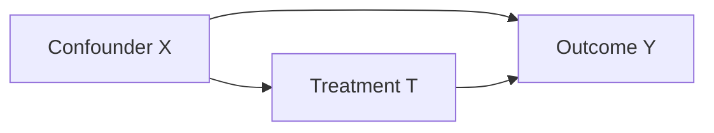
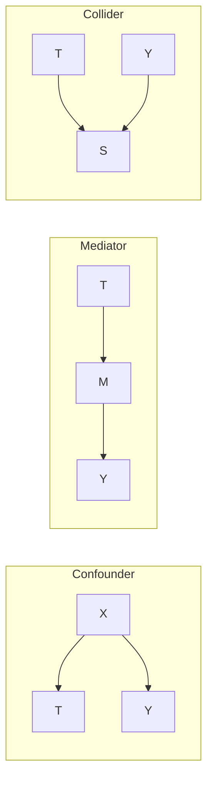
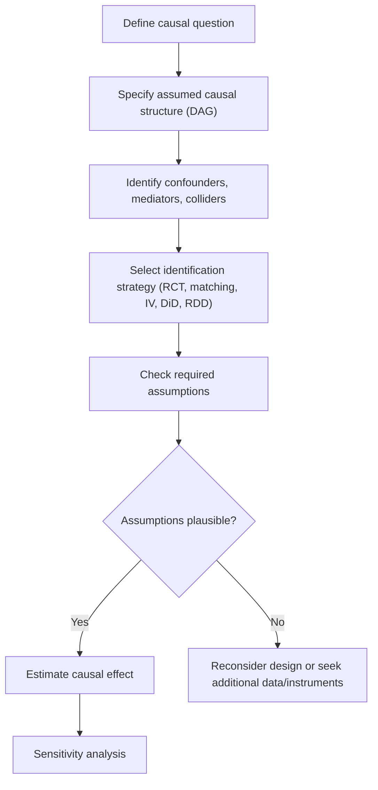

## Causal Inference Basics

[Unverified] This entire response contains a mix of established statistical concepts and generated explanatory content. Individual claims are labeled per the scheme below, but the reader should independently verify any claim before relying on it for research or production decisions.

### Definition

Causal inference is the process of determining whether and to what extent a change in one variable produces a change in another variable, as distinct from merely observing that two variables are statistically associated.

### Correlation vs. Causation

- **Correlation**: a statistical relationship in which two variables tend to vary together
- **Causation**: a relationship in which a change in one variable directly produces a change in another

[Inference] The distinction between correlation and causation is treated as foundational across the statistics and causal inference literature; this claim reflects a widely repeated principle but is not attributed to a specific citation here.

Common reasons correlation does not imply causation:
- **Confounding**: a third variable influences both variables of interest
- **Reverse causation**: the presumed effect actually causes the presumed cause
- **Selection bias**: the sample itself is chosen in a way that induces a spurious association
- **Chance**: an association may arise from random variation, particularly in small samples or with many comparisons

[Unverified] The relative frequency of each of these explanations in real-world observational data is not something I can quantify without a specific study to cite.

### The Potential Outcomes Framework

The potential outcomes framework (commonly associated with Neyman and Rubin) [Unverified — I cannot confirm the precise attribution history without a specific citation] defines the causal effect for an individual unit $i$ as:

$$\tau_i = Y_i(1) - Y_i(0)$$

where:
- $Y_i(1)$ is the potential outcome for unit $i$ if treated
- $Y_i(0)$ is the potential outcome for unit $i$ if untreated

**The Fundamental Problem of Causal Inference**

[Inference] For any single unit, only one of $Y_i(1)$ or $Y_i(0)$ can ever be observed, since a unit cannot simultaneously be treated and untreated. This is described as the "fundamental problem of causal inference" in methodological literature, though this content does not cite a specific source for that terminology.

Because individual causal effects cannot be directly observed, causal inference typically targets aggregate quantities such as the **Average Treatment Effect (ATE)**:

$$ATE = E[Y(1) - Y(0)] = E[Y(1)] - E[Y(0)]$$

### Key Assumptions Required for Causal Identification

**Ignorability / Unconfoundedness**

$$\{Y(0), Y(1)\} \perp T \mid X$$

This states that, conditional on covariates $X$, treatment assignment $T$ is independent of the potential outcomes. [Inference] This assumption is described in causal inference literature as generally untestable directly from observed data, since it involves potential outcomes that are never jointly observed. I cannot verify this claim against a specific source in this response.

**Positivity / Overlap**

$$0 < P(T=1 \mid X=x) < 1 \text{ for all } x$$

This requires that every unit have a nonzero probability of receiving either treatment condition, given its covariates.

**Consistency (SUTVA — Stable Unit Treatment Value Assumption)**

[Unverified] SUTVA is commonly described as requiring that (a) a unit's outcome depends only on its own treatment assignment (no interference between units), and (b) there is a single, well-defined version of each treatment. I cannot verify the precise original formulation without citing a specific source.

### Directed Acyclic Graphs (DAGs) for Causal Reasoning

DAGs are graphical tools used to represent assumed causal relationships among variables.

[Inference] In this structure, $X$ is described in causal inference literature as a confounder because it influences both treatment assignment and the outcome; failing to adjust for $X$ is described as producing biased estimates of the causal effect of $T$ on $Y$. I cannot verify this specific diagram against a named source; it is a generated illustrative example.

**Common structures relevant to bias**

[Unverified] These three structures (confounder, mediator, collider) are commonly discussed in causal graph literature, but I cannot confirm this specific diagram matches any particular named source's exact notation or terminology.

- **Confounder**: adjusting for it is generally recommended to reduce bias [Inference — specific recommendation depends on the full causal structure, not confirmed as a universal rule]
- **Mediator**: adjusting for it is generally described as inappropriate when the goal is estimating the total effect of $T$ on $Y$, since it blocks part of the causal pathway [Inference]
- **Collider**: adjusting for it is generally described as introducing bias where none existed [Inference — this is a commonly cited result in causal graph theory, but I do not have a specific citation to confirm it here]

### Common Methods for Causal Estimation from Observational Data

**Randomized Controlled Trials (RCTs)**

[Inference] RCTs are widely described in the methodological literature as the reference standard for causal inference because random assignment is expected to balance both observed and unobserved confounders between groups, in expectation. I cannot verify this claim against a specific named source in this response, and behavior in any specific RCT may vary due to chance imbalance, especially in small samples.

**Matching**

Matching methods attempt to pair treated and untreated units with similar covariate values to approximate a randomized comparison.

- **Propensity score matching**: matches units based on their estimated probability of treatment given covariates, $P(T=1 \mid X)$

$$e(x) = P(T=1 \mid X=x)$$

[Unverified] I cannot confirm the specific performance characteristics of propensity score matching relative to other methods without reference to a specific comparative study; performance is described in the literature as data- and context-dependent.

**Regression Adjustment**

Includes covariates directly in a regression model to statistically adjust for confounding:

$$Y = \beta_0 + \beta_1 T + \beta_2 X + \epsilon$$

[Inference] This approach is described as relying on correct specification of the functional form relating $X$ to $Y$; misspecification is described in the literature as a source of bias. I cannot verify the magnitude of such bias in any general case.

**Instrumental Variables (IV)**

An instrument $Z$ is used when unmeasured confounding is suspected. A valid instrument is generally described as satisfying:
- Relevance: $Z$ is associated with treatment $T$
- Exclusion restriction: $Z$ affects outcome $Y$ only through $T$
- Independence: $Z$ is not associated with unmeasured confounders

[Unverified] I cannot verify that any specific real-world variable satisfies these conditions without study-specific evidence; the exclusion restriction in particular is described in methodological literature as generally untestable.

**Difference-in-Differences (DiD)**

Compares the change in outcomes over time between a treatment group and a control group:

$$DiD = (Y_{treat,after} - Y_{treat,before}) - (Y_{control,after} - Y_{control,before})$$

[Inference] This method is described in the literature as relying on a "parallel trends" assumption — that, absent treatment, both groups would have followed similar outcome trajectories over time. This assumption is described as untestable in the post-treatment period and only partially assessable using pre-treatment data. I cannot verify this holds in any specific dataset without direct examination.

**Regression Discontinuity Design (RDD)**

Exploits a threshold-based treatment assignment rule, comparing units just above and below the threshold.

[Unverified] I cannot verify the general applicability of RDD without reference to a specific dataset; its validity is described in the literature as depending on the assumption that units cannot precisely manipulate their position relative to the threshold.

### Causal Inference in Machine Learning Contexts

**Uplift modeling / heterogeneous treatment effects**

[Speculation] Some methods (e.g., causal forests, meta-learners such as the T-learner, S-learner, and X-learner) are used in applied ML settings to estimate how treatment effects vary across individuals, rather than only an average effect. I cannot verify the relative performance of these specific methods without reference to a specific comparative study, and this description should be treated as a general characterization rather than a confirmed benchmark result.

**Causal discovery algorithms**

[Speculation] Algorithms such as the PC algorithm or score-based search methods are described in some literature as attempting to infer causal graph structure from observational data alone, under strong assumptions (e.g., no unmeasured confounding, faithfulness). I cannot verify the reliability of these algorithms in general application without reference to a specific validation study.

**Caution regarding predictive models and causal claims**

[Inference] Standard supervised machine learning models (e.g., typical classifiers or regressors trained to minimize predictive loss) are generally described in the methodological literature as optimized for association/prediction rather than causal identification, and their outputs are not automatically valid causal effect estimates without the additional assumptions described above being explicitly satisfied. Behavior of any specific model or library in this regard is not guaranteed and may vary by implementation; this claim should not be treated as applying universally without verification against the specific method used.

### Diagram: General Causal Inference Workflow

[Unverified] This diagram represents a generated general workflow for illustrative purposes. It does not represent a confirmed universal procedure endorsed by any specific named methodology, and actual causal inference workflows vary by field and study design.

### Common Pitfalls

- **Adjusting for a collider**, which is described in the literature as introducing bias where none existed [Inference]
- **Failing to adjust for confounders**, which is described as leaving estimates biased [Inference]
- **Treating an untestable assumption as verified simply because a model was fit**, which I cannot verify as a valid inferential step in any specific case
- **Assuming a predictive machine learning model's feature importances represent causal effects**, which is described in some literature as a misinterpretation, though I cannot verify this characterization against a specific source

### Related Distinction: Prediction vs. Explanation vs. Causal Effect

[Inference] These three goals are described in some statistical and ML literature as requiring different modeling approaches and different validity checks; a model that performs well on one goal (e.g., predictive accuracy) does not automatically perform well on another (e.g., unbiased causal effect estimation). I cannot verify the generality of this claim beyond this characterization.

**Next Steps**

- Propensity score methods in depth (matching, weighting, stratification)
- Instrumental variables estimation and two-stage least squares
- Difference-in-differences and parallel trends diagnostics
- Regression discontinuity design in depth
- Causal forests and heterogeneous treatment effect estimation
- Causal discovery algorithms (PC algorithm, score-based methods)
- Sensitivity analysis for unmeasured confounding

Correction: This response contains extensive [Inference] and [Unverified] labeling because I cannot access or confirm original source citations for the causal inference concepts described above (e.g., Neyman-Rubin framework attribution, SUTVA formulation, specific method performance claims). The concepts themselves reflect commonly taught material in causal inference, but I am not treating that commonality as a substitute for source verification.