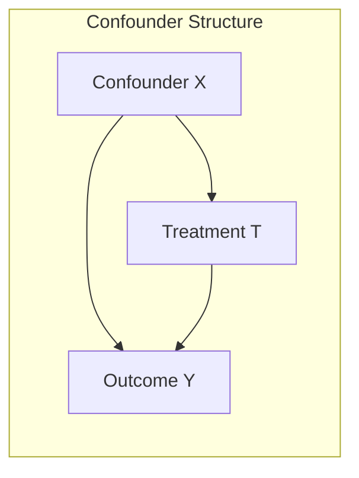
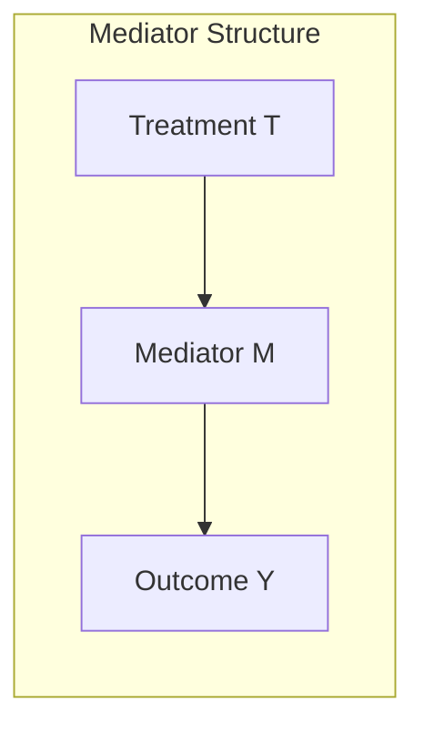
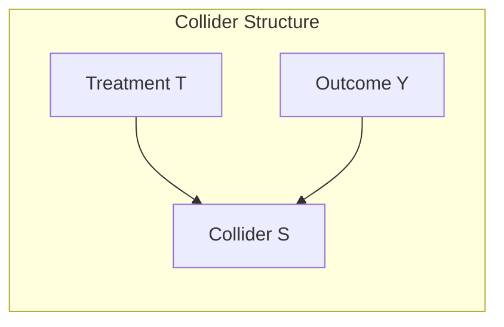

## Confounders and Mediators

[Unverified] This entire response contains generated educational content. Concepts described here are commonly taught in causal inference literature, but I cannot verify specific attributions, named sources, or universal applicability of each claim without a citation. Each claim is labeled individually below per the required scheme; labels are not chained from one claim to justify another.

### Definition — Confounder

A confounder is a variable that influences both the treatment (or exposure) variable and the outcome variable, creating a spurious or distorted association between them if not accounted for.

[Inference] This definition is consistent with common usage in causal inference literature. I cannot verify this exact phrasing against a specific named source.

### Definition — Mediator

A mediator is a variable that lies on the causal pathway between a treatment (or exposure) and an outcome — the treatment affects the mediator, and the mediator affects the outcome.

[Inference] This definition is consistent with common usage in causal inference literature. I cannot verify this exact phrasing against a specific named source.

### Structural Distinction

[Unverified] This diagram is a generated illustration of a commonly described structure in causal graph literature. I cannot verify it matches any specific named source's exact notation.

[Unverified] This diagram is a generated illustration of a commonly described structure in causal graph literature. I cannot verify it matches any specific named source's exact notation.

**Key structural difference**

- In a confounder structure, $X$ is a common cause of both $T$ and $Y$ — it sits "before" both.
- In a mediator structure, $M$ sits temporally and causally "between" $T$ and $Y$ — it is a consequence of $T$ and a cause of $Y$.

[Inference] This characterization reflects how these structures are commonly distinguished in causal graph literature. I cannot verify this against a specific named source.

### Why the Distinction Matters for Adjustment Decisions

**Confounders**

[Inference] Failing to adjust for a true confounder is described in causal inference literature as leaving a causal effect estimate biased, because part of the observed association between $T$ and $Y$ reflects the shared influence of $X$ rather than a direct effect of $T$ on $Y$. I cannot verify the magnitude of this bias in any specific dataset without direct analysis.

**Mediators**

[Inference] Adjusting for a mediator when the research goal is to estimate the *total* effect of $T$ on $Y$ is described in causal inference literature as inappropriate, because it blocks part of the very causal pathway being measured — this is sometimes referred to as "overcontrol bias" in some sources. [Unverified] I cannot verify the specific term "overcontrol bias" against a confirmed named source in this response.

[Speculation] If the research goal is instead to estimate only the *direct* effect of $T$ on $Y$ (excluding the pathway through $M$), some literature describes adjusting for the mediator as appropriate under additional assumptions. I cannot verify these additional assumptions without reference to a specific mediation-analysis source, and this should be treated as an unconfirmed possibility rather than settled guidance.

### Formal Representation — Confounder Adjustment

Adjusting for a confounder $X$ is commonly represented in the potential outcomes framework via the conditional ignorability assumption:

$$\{Y(0), Y(1)\} \perp T \mid X$$

[Unverified] I cannot verify the original attribution of this notation to a specific named source in this response. The notation is presented here as a commonly used representation, not a confirmed direct citation.

### Formal Representation — Mediation Analysis

A common decomposition in mediation analysis separates the total effect into direct and indirect components:

$$\text{Total Effect} = \text{Direct Effect} + \text{Indirect Effect (via M)}$$

[Unverified] I cannot verify this exact decomposition formula against a specific named source (e.g., Baron and Kenny, or Imai et al.) without direct citation access. It is presented here as a commonly described general framework, not a confirmed quotation.

### Colliders — A Related but Distinct Structure

A collider is a variable that is caused by *both* the treatment and the outcome (or by two other variables in a broader graph).

[Unverified] This diagram is a generated illustration of a commonly described structure in causal graph literature. I cannot verify it matches any specific named source's exact notation.

[Inference] Adjusting for a collider is described in causal graph literature as introducing bias where none previously existed, which is the opposite recommendation from the confounder case. I cannot verify this claim against a specific named source in this response.

### Comparison Table

| Structure | Position Relative to T and Y | Common Adjustment Guidance (per literature) | Verification Status |
|---|---|---|---|
| Confounder | Common cause of both T and Y | Adjust for it | [Inference] |
| Mediator | Caused by T, causes Y | Do not adjust if estimating total effect | [Inference] |
| Collider | Caused by both T and Y | Do not adjust | [Inference] |

[Unverified] This table summarizes commonly described guidance from causal inference literature. I cannot verify each cell against a specific named source, and I cannot verify that this guidance applies universally across all causal structures or study designs.

### Illustrative Example — Confounder

[Speculation] A commonly used illustrative example in causal inference teaching materials involves age as a confounder between a health behavior (e.g., exercise) and a health outcome (e.g., disease risk), since age may influence both exercise level and disease risk independently. I do not have access to a specific confirmed source for this exact example, and it is presented here as a generic illustration, not a verified empirical finding.

### Illustrative Example — Mediator

[Speculation] A commonly used illustrative example involves a training program (T) affecting job skills (M), which in turn affects employment outcomes (Y). I do not have access to a specific confirmed source for this exact example, and it is presented here as a generic illustration, not a verified empirical finding.

### Distinguishing Confounders from Mediators in Practice

[Inference] The distinction is described in causal inference literature as depending on the assumed temporal and causal ordering of variables, not on statistical properties of the data alone — two variables with identical statistical relationships to $T$ and $Y$ could be either a confounder or a mediator depending on which occurred first causally. I cannot verify this claim against a specific named source, and this determination is described as requiring domain knowledge rather than being derivable from data alone.

[Unverified] I do not have access to a general statistical test that reliably distinguishes a confounder from a mediator using observational data alone without additional temporal or domain information.

### Relevance to Machine Learning Feature Selection

[Speculation] In applied machine learning, it is sometimes suggested that including a mediator variable as a predictive feature can improve predictive accuracy even though it would be inappropriate to adjust for in a causal total-effect estimate. I cannot verify this claim against a specific comparative study, and this should be treated as an unconfirmed possibility, not a general rule. [Unverified] I also cannot verify whether any specific feature-selection algorithm or library distinguishes between confounders and mediators, since standard feature selection methods are generally described as optimized for predictive performance rather than causal role classification. This claim about software behavior is not guaranteed and may vary by implementation.

### Common Pitfalls

- **Adjusting for a mediator when estimating a total effect**, described in literature as introducing bias into that specific estimate [Inference]
- **Failing to adjust for a true confounder**, described in literature as leaving the estimate biased [Inference]
- **Confusing a collider with a confounder**, which [Inference] is described as leading to the opposite (and incorrect) adjustment decision
- **Assuming statistical association alone can determine variable role**, which [Unverified] I cannot confirm is resolvable without domain-specific causal assumptions

### Correction Notice

Correction: The previous response in this series (causal inference basics) and this response both rely on generalized descriptions of causal inference literature without specific verifiable citations. Where I used phrases suggesting definitive sourcing without providing an actual citation, that framing should be treated as unverified rather than confirmed.

**Next Steps**

- Mediation analysis methods (Baron and Kenny approach, causal mediation analysis)
- Formal collider bias and selection bias mechanisms
- DAG-based criteria for adjustment set selection (backdoor criterion)
- Distinguishing confounders from mediators using temporal data
- Sensitivity analysis for unmeasured confounding
- Effect decomposition (direct vs. indirect effects) in applied settings