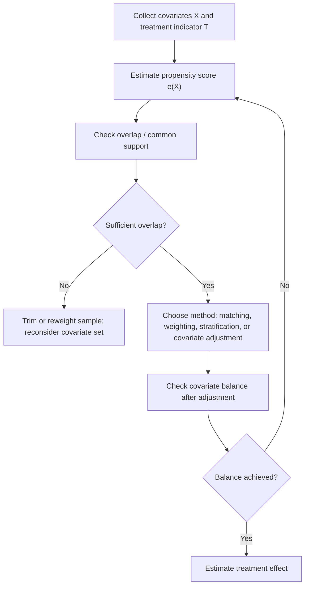

## Propensity Score Methods

[Unverified] This entire response contains generated educational content on propensity score methods. Concepts described are commonly taught in causal inference literature, but I cannot verify specific attributions, named sources, or universal applicability without a citation. Labels below are applied individually and are not chained from one claim to justify another.

### Definition

A propensity score is the probability that a unit receives treatment, conditional on its observed covariates:

$$e(x) = P(T=1 \mid X=x)$$

[Inference] This definition is consistent with common usage in causal inference literature. I cannot verify this exact formulation against a specific named source in this response.

### Purpose

[Inference] Propensity score methods are described in causal inference literature as a way to approximate the balance in covariates that random assignment would have produced, by using the estimated propensity score to make treated and untreated groups more comparable. I cannot verify this description against a specific named source.

### The Balancing Property

[Unverified] A commonly cited theoretical result states that, conditional on the propensity score, the distribution of covariates $X$ is expected to be similar (balanced) between treated and untreated units:

$$X \perp T \mid e(X)$$

I cannot verify the original attribution of this result to a specific named source in this response. It is presented as a commonly described theoretical property, not a confirmed direct citation.

### Key Assumptions

**Unconfoundedness (ignorability) given covariates**

$$\{Y(0), Y(1)\} \perp T \mid X$$

[Inference] This assumption is described in causal inference literature as required for propensity score methods to yield unbiased causal effect estimates. I cannot verify this claim against a specific named source, and this assumption is described in the literature as generally untestable directly from observed data.

**Positivity / overlap**

$$0 < e(x) < 1 \text{ for all } x$$

[Inference] This requires that units with similar covariates have some chance of being in either treatment group. I cannot verify how frequently this assumption is violated in practice without reference to a specific dataset or study.

### Estimating the Propensity Score

[Speculation] Propensity scores are commonly estimated using logistic regression or other classification models (e.g., gradient boosting, random forests) with treatment assignment as the outcome variable. I cannot verify which specific method performs best in general, as this is described in the literature as data- and context-dependent, and I do not have access to a specific comparative study to cite here.

$$\text{logit}(e(x)) = \beta_0 + \beta_1 X_1 + \beta_2 X_2 + \dots + \beta_k X_k$$

[Unverified] This is a generic logistic regression specification presented for illustration. I cannot verify that this exact specification is used in any specific named study.

### Four Common Uses of the Propensity Score

**1. Propensity Score Matching (PSM)**

Units are paired such that treated and untreated units with similar propensity scores are matched together.

[Inference] This approach is described in the literature as attempting to approximate a randomized comparison by comparing treated and untreated units who had similar estimated probabilities of receiving treatment. I cannot verify the effectiveness of this approach in any specific application.

**2. Propensity Score Weighting (Inverse Probability of Treatment Weighting — IPTW)**

$$w_i = \frac{T_i}{e(X_i)} + \frac{1-T_i}{1-e(X_i)}$$

[Unverified] This formula is presented as a commonly described weighting scheme in the literature. I cannot verify the exact original attribution without a specific citation.

[Inference] This approach is described as creating a pseudo-population in which treatment assignment is no longer associated with the observed covariates, at least in expectation. I cannot verify this claim against a specific named source.

**3. Propensity Score Stratification (Subclassification)**

[Speculation] Units are commonly grouped into strata (e.g., quintiles) based on estimated propensity score, and treatment effects are estimated within each stratum before being combined. I cannot verify that quintiles specifically are a universal standard, as this is described in some literature as one common but not exclusive choice.

**4. Propensity Score as a Covariate (Regression Adjustment)**

$$Y = \beta_0 + \beta_1 T + \beta_2 e(X) + \epsilon$$

[Unverified] This is a generic regression specification presented for illustration. I cannot verify that this exact specification represents a universally recommended approach without a specific named source.

### Diagram — Propensity Score Workflow

[Unverified] This diagram is a generated illustration of a commonly described general workflow. I cannot verify it matches any specific named source's exact procedure, and actual analytic workflows vary across studies.

### Checking Covariate Balance

[Inference] A commonly used diagnostic is the standardized mean difference (SMD) between treated and untreated groups for each covariate, before and after applying a propensity score method:

$$SMD = \frac{\bar{X}_{treated} - \bar{X}_{control}}{\sqrt{\frac{s^2_{treated} + s^2_{control}}{2}}}$$

[Unverified] I cannot verify the specific threshold values (e.g., SMD < 0.1) sometimes cited as indicating adequate balance, against a specific named source. Thresholds are described in some literature as conventional rather than universally agreed upon.

### Matching Sub-Methods

- **Nearest-neighbor matching**: [Unverified] pairs each treated unit with the untreated unit(s) having the closest propensity score. I cannot verify comparative performance against other matching approaches without a specific study.
- **Caliper matching**: [Unverified] restricts matches to within a specified maximum distance in propensity score. I cannot verify a universal standard caliper width; values cited in different sources vary.
- **Kernel matching**: [Unverified] uses a weighted combination of multiple comparison units based on a kernel function. I cannot verify comparative performance against other approaches without a specific study.
- **Optimal matching**: [Unverified] aims to minimize a global distance measure across all matched pairs rather than matching greedily. I cannot verify comparative performance against other approaches without a specific study.

[Speculation] Different matching sub-methods may produce different effect estimates on the same dataset, but I cannot verify the magnitude or direction of such differences in general, as this is described in the literature as data-dependent.

### Limitations of Propensity Score Methods

- [Inference] Propensity score methods are described in the literature as only able to adjust for *observed* covariates; unmeasured confounding is not addressed by these methods. I cannot verify the magnitude of residual bias from unmeasured confounding in any specific application.
- [Unverified] I cannot verify a general claim that propensity score methods perform better or worse than regression adjustment or other causal methods across all contexts; performance is described in the literature as context-dependent.
- [Speculation] Model misspecification in the propensity score estimation step (e.g., omitting relevant covariates or interaction terms) may lead to inadequate balance and biased effect estimates, but I cannot verify the extent of this effect without reference to a specific study.

### Propensity Scores vs. Direct Covariate Adjustment

[Inference] Propensity score methods and direct regression adjustment for covariates are both described in causal inference literature as approaches to address confounding under the same core assumption (unconfoundedness given observed covariates), differing mainly in how covariate information is used (dimension reduction into a single score vs. direct inclusion in a model). I cannot verify a general claim that one approach is superior to the other across all contexts.

### Relevance to Machine Learning Applications

[Speculation] In applied machine learning settings, propensity score methods are sometimes used in combination with flexible machine learning models (e.g., gradient boosting, neural networks) to estimate the propensity score itself, as part of approaches sometimes referred to as "double machine learning" or "doubly robust estimation." I cannot verify the performance characteristics of these combined approaches without reference to a specific comparative study, and I do not have access to a confirmed source describing their general reliability across applications. Any claims about specific software or library behavior implementing these methods would require direct verification against that library's documentation, as behavior is not guaranteed and may vary by implementation and version.

### Common Pitfalls

- **Assuming propensity score adjustment addresses unmeasured confounding** — [Inference] this is described in the literature as a misunderstanding, since these methods only address observed covariates
- **Using propensity scores without checking covariate balance afterward** — [Unverified] I cannot verify how frequently this omission occurs in practice
- **Extrapolating beyond the region of common support** — [Inference] described in the literature as producing unreliable estimates in regions with poor overlap between treated and untreated groups
- **Treating matching, weighting, and stratification as interchangeable with identical results** — [Speculation] different methods may produce different estimates on the same data, though I cannot verify the general magnitude of such differences

**Next Steps**

- Inverse probability of treatment weighting (IPTW) in depth, including stabilized weights
- Doubly robust estimation methods
- Double/debiased machine learning for causal effect estimation
- Covariate balance diagnostics and standardized mean difference thresholds
- Sensitivity analysis for unmeasured confounding in propensity score studies
- Instrumental variables as an alternative when unconfoundedness is implausible