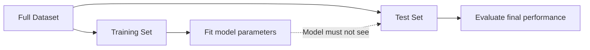
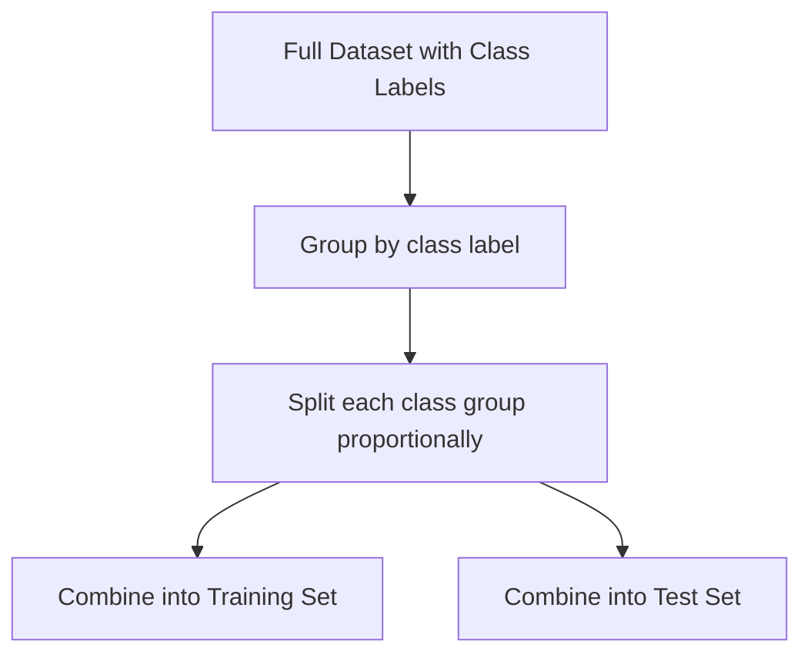
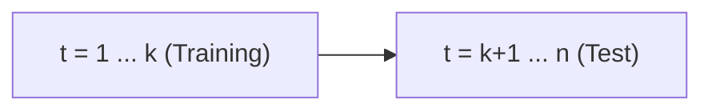

## Train-Test Split Theory

[Unverified] This entire response contains generated educational content. Labels are applied individually per claim and are not chained from one claim to justify another.

### Definition

A train-test split is the practice of partitioning an available dataset into separate subsets — typically a training set used to fit a model and a test set used to evaluate its performance on data not used during fitting.

[Inference] This definition is consistent with common usage in machine learning literature. I cannot verify this exact phrasing against a specific named source.

### Purpose

[Inference] The train-test split is described in machine learning literature as a method for estimating how a model is expected to perform on new, unseen data, by holding out a portion of the data that the model does not access during training. I cannot verify this description against a specific named source, and actual generalization performance on genuinely new data may differ from test-set performance for reasons discussed below.

### The Core Statistical Rationale

[Inference] A model's performance measured on the same data used to fit it is described in statistical and machine learning literature as an optimistically biased estimate of true generalization performance, because the model's parameters have been chosen specifically to fit that data. I cannot verify the magnitude of this bias in any general case without reference to a specific model and dataset.

$$\hat{R}_{train} \leq \hat{R}_{test} \quad \text{[Inference — expected tendency, not a guaranteed inequality]}$$

[Unverified] This inequality represents a commonly described tendency in machine learning literature, not a mathematical guarantee that holds for every model and dataset in every instance.

### Diagram — Basic Split

[Unverified] This diagram is a generated illustration of a commonly described general procedure. I cannot verify it matches any specific named source's exact notation.

### Common Split Ratios

[Speculation] Commonly cited split ratios in applied machine learning include 80/20, 70/30, and 90/10 (train/test), though I cannot verify that any one ratio is universally optimal, as the appropriate ratio is described in some literature as depending on total dataset size, model complexity, and the variance of the estimate desired. This should be treated as an unconfirmed general practice, not a settled rule.

### Statistical Considerations in Choosing Split Size

**Test set size and estimate precision**

[Inference] A larger test set is described in statistical literature as generally producing a more precise (lower-variance) estimate of a model's true generalization performance, following the same logic as the sample size formulas used for estimating a proportion or mean (see confidence interval width formulas). I cannot verify the exact precision achieved in any specific case without direct calculation.

Using the proportion-based margin-of-error formula as an approximation for a classification accuracy estimate:

$$E \approx z_{\alpha/2}\sqrt{\frac{p(1-p)}{n}}$$

where $n$ is the test set size and $p$ is the true (unknown) accuracy.

[Unverified] This is a generic statistical formula applied here by analogy to test-set accuracy estimation; I cannot verify that this exact application is standard practice in any specific named machine learning source, though the underlying formula itself is a standard result for proportion confidence intervals.

**Training set size and model quality**

[Inference] A larger training set is generally described in machine learning literature as allowing a model to learn more reliable parameter estimates, particularly for complex models with many parameters, though the relationship between training set size and model performance is described as task- and model-dependent rather than following a single universal curve. I cannot verify the specific shape of this relationship for any given model without empirical evaluation.

**The size trade-off**

[Inference] Because the same finite dataset must be divided between training and test sets, allocating more data to training reduces the precision of the test-set performance estimate, and allocating more to testing reduces the data available for model fitting. This trade-off is described in machine learning literature as a general characteristic of the train-test split approach. I cannot verify the optimal balance point for any specific dataset without direct experimentation.

### Random Sampling Assumption

[Inference] Standard train-test splitting is described in machine learning literature as typically assuming the split is performed via random sampling, such that both subsets are representative of the same underlying data distribution. I cannot verify that this assumption holds in any specific dataset without direct examination.

**Consequences when this assumption is violated**

- [Speculation] If the split is not random (e.g., time-ordered data split arbitrarily, or data collected in a way that clusters similar examples together), the test set may not be representative of the training distribution, which could bias performance estimates in an unknown direction. I cannot verify the direction or magnitude of such bias in any specific case.

### Stratified Splitting

[Inference] Stratified splitting is described in machine learning literature as a technique that preserves the proportion of class labels (in classification tasks) between the training and test sets, which is described as particularly relevant when class distributions are imbalanced. I cannot verify the performance benefit of stratification in any specific dataset without direct comparison.

[Unverified] This diagram is a generated illustration of a commonly described technique. I cannot verify it matches any specific named source's exact procedure.

### Time-Series Considerations

[Inference] For time-ordered data, a random train-test split is described in some machine learning literature as generally inappropriate, because it can allow information from the future to influence predictions about the past (a form of data leakage), which would not reflect a realistic deployment scenario. I cannot verify the magnitude of this issue in any specific dataset without direct examination.

[Speculation] A commonly suggested alternative for time-ordered data is a chronological split, where earlier data forms the training set and later data forms the test set. I cannot verify that this is universally sufficient to avoid all forms of leakage in every time-series context, as additional issues (e.g., feature leakage from future-derived variables) may still occur.

[Unverified] This diagram is a generated illustration of a commonly described chronological splitting approach. I cannot verify it matches any specific named source's exact procedure.

### Data Leakage

[Inference] Data leakage is described in machine learning literature as occurring when information from the test set (or from data that would not be available at prediction time) influences model training, leading to overly optimistic performance estimates. I cannot verify the frequency of this issue across applied machine learning projects without reference to a specific study.

Common described sources of leakage:
- [Speculation] Performing feature scaling, imputation, or feature selection using statistics computed from the full dataset (including the test set) before splitting
- [Speculation] Duplicate or near-duplicate records appearing in both training and test sets
- [Speculation] Target-derived features that indirectly encode the outcome

[Unverified] I cannot verify the relative frequency or impact of each of these specific leakage sources without reference to a specific empirical study.

### Relationship to the Bias-Variance Trade-off of the Performance Estimate

[Inference] The choice of split ratio and method is described in statistical literature as affecting the bias and variance of the resulting performance estimate itself (distinct from the bias-variance trade-off of the model's predictions) — a very small test set produces a high-variance estimate of generalization performance, while a non-representative split can introduce bias into that estimate. I cannot verify the exact magnitude of either effect without empirical calculation for a specific dataset.

### Limitations of a Single Train-Test Split

- [Inference] A single split is described in machine learning literature as producing a performance estimate that depends on the particular random partition chosen, and a different split of the same data could produce a different estimate. I cannot verify the typical magnitude of this variability without reference to a specific dataset.
- [Speculation] This limitation is commonly cited as a motivation for cross-validation approaches, which use multiple splits and average results. I cannot verify that cross-validation eliminates this variability, only that it is described as a way to reduce dependence on any single split.

### Relationship to Sample Size Determination

[Inference] The statistical logic connecting test-set size to estimate precision parallels the sample size determination formulas described for estimating a proportion (see sample size determination), since classification accuracy is itself a proportion. I cannot verify that this parallel is drawn explicitly in any specific named source, though the underlying formulas are standard results in statistical estimation theory.

### Common Pitfalls

- **Fitting preprocessing steps (scaling, imputation) on the full dataset before splitting** — [Inference] described in the literature as a form of data leakage that can bias performance estimates optimistically
- **Using a non-random or non-representative split without justification** — [Speculation] may introduce unknown bias into the performance estimate
- **Applying random splitting to time-ordered data** — [Inference] described in the literature as risking future-to-past information leakage
- **Relying on a single split without acknowledging estimate variance** — [Inference] described in the literature as understating uncertainty in the reported performance metric
- **Using an undersized test set** — [Inference] described in the literature as producing a high-variance, unreliable performance estimate

[Unverified] I cannot verify that any specific software library's default train-test split behavior (e.g., random seed handling, stratification defaults, shuffling behavior) matches the general descriptions above without checking that library's current documentation directly; behavior may vary by implementation and version and is not guaranteed to remain consistent across releases.

**Next Steps**

- Cross-validation (k-fold, stratified k-fold, leave-one-out)
- Data leakage prevention in preprocessing pipelines
- Time-series cross-validation and walk-forward validation
- Confidence intervals for model performance metrics
- Nested cross-validation for hyperparameter tuning
- Sample size determination as applied to test set sizing