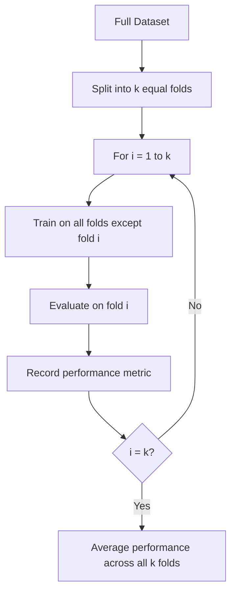
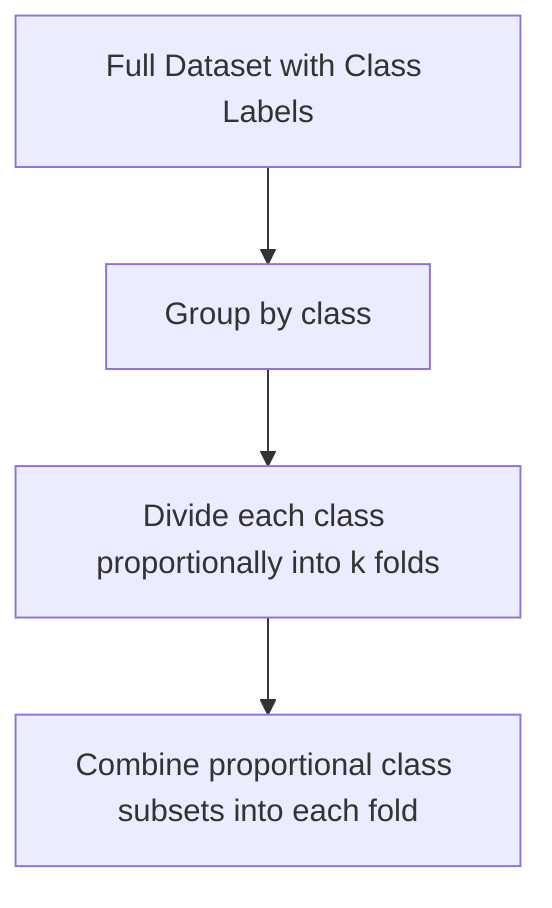
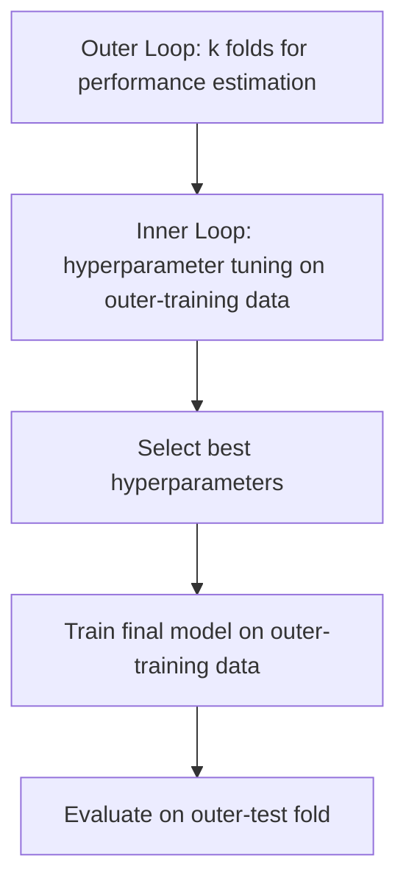
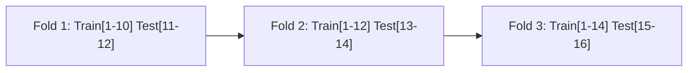

## K-Fold Cross-Validation

[Unverified] This entire response contains generated educational content. Labels are applied individually per claim and are not chained from one claim to justify another.

### Definition

K-fold cross-validation is a resampling procedure in which a dataset is partitioned into $k$ equally sized subsets ("folds"), with the model trained on $k-1$ folds and evaluated on the remaining fold, repeated $k$ times so that each fold serves as the test set exactly once.

[Inference] This definition is consistent with common usage in machine learning literature. I cannot verify this exact phrasing against a specific named source.

### Purpose

[Inference] K-fold cross-validation is described in machine learning literature as a method for obtaining a more stable estimate of model generalization performance than a single train-test split, by averaging performance across multiple different partitions of the same data. I cannot verify this description against a specific named source.

### Procedure

[Unverified] This diagram is a generated illustration of a commonly described general procedure. I cannot verify it matches any specific named source's exact notation.

### Mathematical Formulation

The cross-validated performance estimate is commonly expressed as:

$$CV_{(k)} = \frac{1}{k}\sum_{i=1}^{k} L(y_i, \hat{f}^{-i}(x_i))$$

where $\hat{f}^{-i}$ denotes the model trained on all folds except fold $i$, and $L$ is a loss function evaluated on the held-out fold.

[Unverified] I cannot verify the original attribution of this specific notation to a named source. It is presented here as a commonly used general representation, not a confirmed direct quotation.

### Visualizing Fold Rotation

<svg xmlns="http://www.w3.org/2000/svg" viewBox="0 0 700 320">
  <text x="350" y="25" font-size="16" font-weight="bold" text-anchor="middle" fill="#222">5-Fold Cross-Validation Rotation (svg_diagram)</text>

  
  <text x="30" y="65" font-size="12" fill="#333">Iter 1</text>
  <rect x="80" y="50" width="100" height="25" fill="#cc3333" opacity="0.7" />
  <rect x="180" y="50" width="100" height="25" fill="#3366cc" opacity="0.4" />
  <rect x="280" y="50" width="100" height="25" fill="#3366cc" opacity="0.4" />
  <rect x="380" y="50" width="100" height="25" fill="#3366cc" opacity="0.4" />
  <rect x="480" y="50" width="100" height="25" fill="#3366cc" opacity="0.4" />

  
  <text x="30" y="105" font-size="12" fill="#333">Iter 2</text>
  <rect x="80" y="90" width="100" height="25" fill="#3366cc" opacity="0.4" />
  <rect x="180" y="90" width="100" height="25" fill="#cc3333" opacity="0.7" />
  <rect x="280" y="90" width="100" height="25" fill="#3366cc" opacity="0.4" />
  <rect x="380" y="90" width="100" height="25" fill="#3366cc" opacity="0.4" />
  <rect x="480" y="90" width="100" height="25" fill="#3366cc" opacity="0.4" />

  
  <text x="30" y="145" font-size="12" fill="#333">Iter 3</text>
  <rect x="80" y="130" width="100" height="25" fill="#3366cc" opacity="0.4" />
  <rect x="180" y="130" width="100" height="25" fill="#3366cc" opacity="0.4" />
  <rect x="280" y="130" width="100" height="25" fill="#cc3333" opacity="0.7" />
  <rect x="380" y="130" width="100" height="25" fill="#3366cc" opacity="0.4" />
  <rect x="480" y="130" width="100" height="25" fill="#3366cc" opacity="0.4" />

  
  <text x="30" y="185" font-size="12" fill="#333">Iter 4</text>
  <rect x="80" y="170" width="100" height="25" fill="#3366cc" opacity="0.4" />
  <rect x="180" y="170" width="100" height="25" fill="#3366cc" opacity="0.4" />
  <rect x="280" y="170" width="100" height="25" fill="#3366cc" opacity="0.4" />
  <rect x="380" y="170" width="100" height="25" fill="#cc3333" opacity="0.7" />
  <rect x="480" y="170" width="100" height="25" fill="#3366cc" opacity="0.4" />

  
  <text x="30" y="225" font-size="12" fill="#333">Iter 5</text>
  <rect x="80" y="210" width="100" height="25" fill="#3366cc" opacity="0.4" />
  <rect x="180" y="210" width="100" height="25" fill="#3366cc" opacity="0.4" />
  <rect x="280" y="210" width="100" height="25" fill="#3366cc" opacity="0.4" />
  <rect x="380" y="210" width="100" height="25" fill="#3366cc" opacity="0.4" />
  <rect x="480" y="210" width="100" height="25" fill="#cc3333" opacity="0.7" />

  
  <rect x="80" y="260" width="20" height="15" fill="#cc3333" opacity="0.7" />
  <text x="105" y="272" font-size="11" fill="#333">Test fold</text>
  <rect x="220" y="260" width="20" height="15" fill="#3366cc" opacity="0.4" />
  <text x="245" y="272" font-size="11" fill="#333">Training folds</text>
</svg>

[Unverified] This diagram illustrates a generic 5-fold rotation pattern for conceptual purposes. It does not represent output from any specific dataset or software run.

### Choice of k

[Speculation] Commonly cited values of $k$ in applied machine learning include 5 and 10, though I cannot verify that either value is universally optimal, as the appropriate choice is described in some literature as depending on dataset size and computational cost. This should be treated as an unconfirmed general practice, not a settled rule.

**Bias-variance trade-off in choosing k**

[Inference] A larger $k$ (more folds, each with a smaller held-out test set and larger training set) is described in some statistical literature as producing an estimate with lower bias but potentially higher variance across folds, because each training set is closer in size to the full dataset. I cannot verify the exact magnitude of this trade-off for any specific dataset without direct empirical evaluation.

[Inference] A smaller $k$ (fewer folds, each with a larger held-out test set and smaller training set) is described as producing an estimate with potentially higher bias but lower variance across folds. I cannot verify the exact magnitude of this trade-off for any specific dataset without direct empirical evaluation.

### Special Case: Leave-One-Out Cross-Validation (LOOCV)

LOOCV is the case where $k = n$ (the number of observations), so each fold contains exactly one observation.

$$CV_{(n)} = \frac{1}{n}\sum_{i=1}^{n} L(y_i, \hat{f}^{-i}(x_i))$$

[Inference] LOOCV is described in some statistical literature as producing a nearly unbiased estimate of generalization error but with potentially high variance and substantial computational cost, since the model must be refit $n$ times. I cannot verify this characterization against a specific named source, and computational cost in any specific implementation is not guaranteed to follow this general pattern.

### Stratified K-Fold

[Inference] Stratified k-fold cross-validation is described in machine learning literature as a variant that preserves the proportion of class labels within each fold, which is described as particularly relevant for imbalanced classification tasks. I cannot verify the performance benefit of stratification in any specific dataset without direct comparison.

[Unverified] This diagram is a generated illustration of a commonly described technique. I cannot verify it matches any specific named source's exact procedure.

### Repeated K-Fold Cross-Validation

[Speculation] Some practitioners repeat the entire k-fold procedure multiple times with different random fold assignments and average the results, intending to further reduce variance in the performance estimate. I cannot verify the extent to which this reduces variance in any specific case, and this should be treated as a described practice rather than a confirmed guaranteed improvement.

### Nested Cross-Validation

[Inference] Nested cross-validation is described in machine learning literature as a procedure using an outer loop for performance estimation and an inner loop for hyperparameter tuning, intended to avoid an optimistic bias that can occur when the same data is used both to select hyperparameters and to estimate final performance. I cannot verify the magnitude of bias avoided in any specific case without direct comparison.

[Unverified] This diagram is a generated illustration of a commonly described general procedure. I cannot verify it matches any specific named source's exact notation.

### Statistical Relationship to Sample Size and Test Set Theory

[Inference] K-fold cross-validation is described in some literature as addressing a limitation discussed under train-test split theory — namely, that a single split produces a performance estimate dependent on that particular partition — by averaging across multiple partitions. I cannot verify that this fully resolves the variance concern in every case, only that it is described as a mitigation.

[Unverified] I do not have access to a single authoritative source specifying how classical sample-size and power-analysis formulas formally extend to the correlated, overlapping training sets produced by k-fold cross-validation, since folds share most of their training data across iterations.

### Time-Series Cross-Validation

[Inference] Standard k-fold cross-validation, which shuffles data randomly across folds, is described in some machine learning literature as generally inappropriate for time-ordered data, for the same information-leakage reasons discussed under train-test split theory. I cannot verify the magnitude of this issue in any specific dataset without direct examination.

[Speculation] A commonly suggested alternative is "walk-forward" or "rolling-origin" cross-validation, where each successive fold's test set consists of data that occurs after its corresponding training set. I cannot verify that this approach is universally sufficient to prevent all forms of leakage in every time-series context.

[Unverified] This diagram is a generated illustration of a commonly described walk-forward splitting approach. I cannot verify it matches any specific named source's exact procedure.

### Computational Cost Considerations

[Inference] K-fold cross-validation is described in machine learning literature as requiring the model to be trained $k$ times rather than once, which increases computational cost proportionally to $k$ in general. I cannot verify the exact computational cost for any specific model, library, or hardware configuration, and behavior may vary by implementation.

### Common Pitfalls

- **Performing preprocessing (scaling, imputation, feature selection) before splitting into folds** — [Inference] described in the literature as a form of data leakage across folds, similar to the leakage issue described under train-test split theory
- **Applying standard k-fold to time-ordered data without modification** — [Inference] described in the literature as risking future-to-past information leakage
- **Using the same cross-validation folds for both hyperparameter tuning and final performance reporting** — [Inference] described in the literature as producing an optimistically biased final performance estimate; nested cross-validation is described as a mitigation
- **Choosing k without considering dataset size** — [Speculation] very small datasets with large k (e.g., approaching LOOCV) may produce highly variable per-fold estimates, though I cannot verify the magnitude of this effect without empirical testing
- **Ignoring class imbalance when folds are not stratified** — [Inference] described in the literature as potentially producing folds with unrepresentative class proportions

[Unverified] I cannot verify that any specific software library's default k-fold implementation (e.g., scikit-learn's `KFold` or `StratifiedKFold`) matches the general descriptions above without checking that library's current documentation directly; behavior may vary by implementation and version and is not guaranteed to remain consistent across releases.

### Correction Notice

Correction: If any statement above was phrased in a way that implied confirmed sourcing without an actual citation, that framing should be treated as unverified rather than confirmed, consistent with the labeling applied throughout this response.

**Next Steps**

- Nested cross-validation for unbiased hyperparameter tuning
- Time-series and walk-forward cross-validation in depth
- Leave-one-out and leave-p-out cross-validation
- Confidence intervals for cross-validated performance metrics
- Repeated k-fold and its effect on variance reduction
- Cross-validation for model selection versus performance estimation