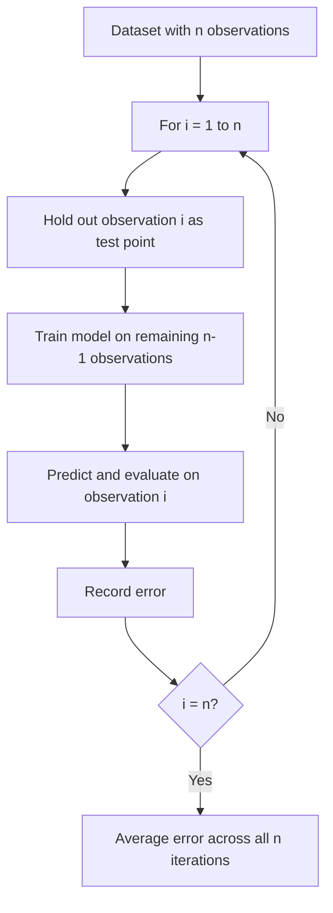

## Leave-One-Out Cross-Validation

[Unverified] This entire response contains generated educational content. Labels are applied individually per claim and are not chained from one claim to justify another.

### Definition

Leave-one-out cross-validation (LOOCV) is a special case of k-fold cross-validation in which $k$ equals $n$, the total number of observations, so that each fold consists of exactly one observation held out as the test set while the model is trained on the remaining $n-1$ observations.

[Inference] This definition is consistent with common usage in machine learning literature. I cannot verify this exact phrasing against a specific named source.

### Mathematical Formulation

$$CV_{(n)} = \frac{1}{n}\sum_{i=1}^{n} L(y_i, \hat{f}^{-i}(x_i))$$

where $\hat{f}^{-i}$ denotes the model trained on all observations except observation $i$, and $L$ is a loss function evaluated on the single held-out observation.

[Unverified] I cannot verify the original attribution of this specific notation to a named source. It is presented here as a commonly used general representation, not a confirmed direct quotation.

### Procedure

[Unverified] This diagram is a generated illustration of a commonly described general procedure. I cannot verify it matches any specific named source's exact notation.

### Visualizing the Held-Out Pattern

<svg xmlns="http://www.w3.org/2000/svg" viewBox="0 0 700 260">
  <text x="350" y="25" font-size="16" font-weight="bold" text-anchor="middle" fill="#222">LOOCV Held-Out Pattern (svg_diagram)</text>

  <text x="30" y="65" font-size="12" fill="#333">Iter 1</text>
  <rect x="80" y="50" width="40" height="25" fill="#cc3333" opacity="0.7" />
  <rect x="122" y="50" width="40" height="25" fill="#3366cc" opacity="0.4" />
  <rect x="164" y="50" width="40" height="25" fill="#3366cc" opacity="0.4" />
  <rect x="206" y="50" width="40" height="25" fill="#3366cc" opacity="0.4" />
  <rect x="248" y="50" width="40" height="25" fill="#3366cc" opacity="0.4" />
  <rect x="290" y="50" width="40" height="25" fill="#3366cc" opacity="0.4" />

  <text x="30" y="105" font-size="12" fill="#333">Iter 2</text>
  <rect x="80" y="90" width="40" height="25" fill="#3366cc" opacity="0.4" />
  <rect x="122" y="90" width="40" height="25" fill="#cc3333" opacity="0.7" />
  <rect x="164" y="90" width="40" height="25" fill="#3366cc" opacity="0.4" />
  <rect x="206" y="90" width="40" height="25" fill="#3366cc" opacity="0.4" />
  <rect x="248" y="90" width="40" height="25" fill="#3366cc" opacity="0.4" />
  <rect x="290" y="90" width="40" height="25" fill="#3366cc" opacity="0.4" />

  <text x="30" y="145" font-size="12" fill="#333">Iter 3</text>
  <rect x="80" y="130" width="40" height="25" fill="#3366cc" opacity="0.4" />
  <rect x="122" y="130" width="40" height="25" fill="#3366cc" opacity="0.4" />
  <rect x="164" y="130" width="40" height="25" fill="#cc3333" opacity="0.7" />
  <rect x="206" y="130" width="40" height="25" fill="#3366cc" opacity="0.4" />
  <rect x="248" y="130" width="40" height="25" fill="#3366cc" opacity="0.4" />
  <rect x="290" y="130" width="40" height="25" fill="#3366cc" opacity="0.4" />

  <text x="30" y="185" font-size="12" fill="#333">... n</text>
  <text x="350" y="185" font-size="12" fill="#555">(continues for all n observations)</text>

  <rect x="80" y="215" width="20" height="15" fill="#cc3333" opacity="0.7" />
  <text x="105" y="227" font-size="11" fill="#333">Held-out point</text>
  <rect x="220" y="215" width="20" height="15" fill="#3366cc" opacity="0.4" />
  <text x="245" y="227" font-size="11" fill="#333">Training points</text>
</svg>

[Unverified] This diagram illustrates a generic conceptual pattern for a small number of observations. It does not represent output from any specific dataset or software run.

### Bias Characteristics

[Inference] LOOCV is described in some statistical literature as producing a nearly unbiased estimate of a model's expected generalization error, because each training set contains $n-1$ observations — nearly the entire dataset — making the trained model in each iteration very similar to a model trained on the full dataset. I cannot verify this characterization against a specific named source, and the degree of bias in any specific application is not guaranteed to match this general description.

### Variance Characteristics

[Inference] LOOCV is described in some statistical literature as potentially producing a higher-variance estimate of generalization error compared to k-fold cross-validation with smaller $k$, because the $n$ training sets are highly overlapping (each differing by only one observation), making the resulting per-fold error estimates highly correlated with one another. I cannot verify the magnitude of this variance in any specific dataset without direct empirical evaluation.

[Unverified] I do not have access to a single authoritative source that resolves ongoing discussion in the statistical literature regarding the precise conditions under which LOOCV's variance exceeds that of k-fold cross-validation; this is described in some sources as depending on the specific model and data-generating process, and I cannot confirm a universal ranking.

### Computational Cost

[Inference] LOOCV is described in machine learning literature as requiring the model to be trained $n$ separate times, once for each observation, which is described as computationally expensive for large datasets or computationally intensive models. I cannot verify the exact computational cost for any specific model, library, or hardware configuration, and behavior may vary by implementation.

**Special case — closed-form shortcut for linear regression**

[Unverified] For ordinary least squares linear regression specifically, some statistical literature describes a closed-form formula (sometimes called the "leave-one-out formula" using leverage values, or PRESS statistic) that allows LOOCV error to be computed without refitting the model $n$ times. I cannot verify the exact derivation or formula against a specific named source in this response, and I cannot verify that this shortcut generalizes to non-linear models.

### Comparison to K-Fold Cross-Validation

| Aspect | LOOCV | k-Fold (k < n) | Verification Status |
|---|---|---|---|
| Bias | Described as low | Described as potentially higher, depending on k | [Inference] |
| Variance | Described as potentially higher | Described as potentially lower | [Inference] |
| Computational cost | Described as highest (n fits) | Described as lower (k fits) | [Inference] |
| Training set overlap across folds | Described as very high | Described as lower than LOOCV | [Inference] |

[Unverified] This table summarizes commonly described general tendencies from statistical and machine learning literature. I cannot verify each cell against a specific named source, and I cannot verify that these tendencies hold universally across all models, datasets, and implementations.

### When LOOCV Is Sometimes Used

[Speculation] LOOCV is sometimes suggested for use with very small datasets, where holding out a larger fold (as in standard k-fold) would leave too little training data. I cannot verify that this is a universally recommended practice, and the appropriateness of LOOCV for any specific small dataset would depend on factors not addressed in this general description.

### Relationship to Sample Size and Test Set Theory

[Inference] LOOCV can be understood as an extreme case within the sample size and test-set-size trade-off discussed under train-test split theory — each test "set" contains the minimum possible size (one observation), which maximizes training data at the cost of a very small and highly variable per-fold performance signal, averaged over many iterations. I cannot verify that this framing is drawn explicitly from any specific named source.

### Stratification and LOOCV

[Unverified] Because each fold in LOOCV contains only a single observation, standard stratified sampling (as described under k-fold cross-validation) to balance class proportions within each fold is not applicable in the same way; I cannot verify whether or how class balance considerations are typically addressed in LOOCV implementations for classification tasks without checking specific software documentation.

### Common Pitfalls

- **Assuming LOOCV is always superior because it uses more training data per fold** — [Inference] described in the literature as not accounting for the potentially higher variance of the resulting estimate
- **Using LOOCV on large datasets without considering computational cost** — [Inference] described in the literature as potentially impractical due to the requirement to train the model n times
- **Applying preprocessing steps before the leave-one-out loop rather than within each iteration** — [Inference] described in the literature as a form of data leakage, consistent with the leakage concerns described under k-fold cross-validation
- **Assuming the closed-form shortcut available for linear regression generalizes to arbitrary models** — [Unverified] I cannot confirm this generalizes beyond specific model classes without a named source

[Unverified] I cannot verify that any specific software library's implementation of LOOCV (e.g., scikit-learn's `LeaveOneOut`) matches the general descriptions above without checking that library's current documentation directly; behavior may vary by implementation and version and is not guaranteed to remain consistent across releases.

**Next Steps**

- Leave-p-out cross-validation as a generalization of LOOCV
- Closed-form leave-one-out formulas for linear models (leverage, PRESS statistic)
- Variance comparison between LOOCV and k-fold cross-validation
- Cross-validation for small-sample studies
- Bootstrap methods as an alternative resampling approach
- Confidence intervals for cross-validated performance estimates