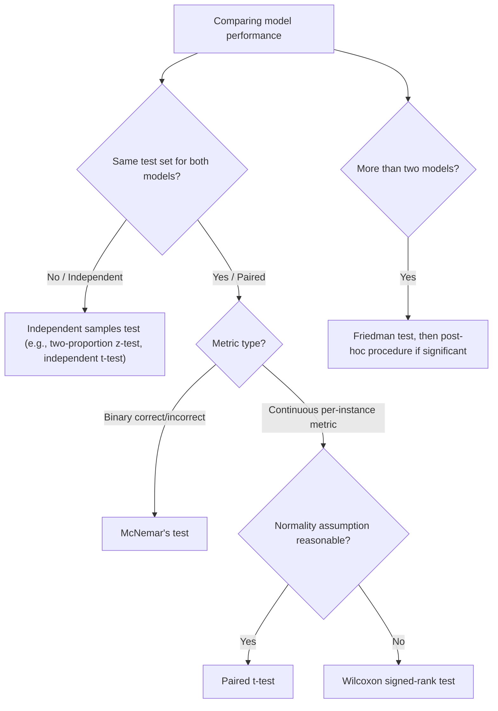

## Statistical Significance of Model Comparisons

[Unverified] This entire response contains generated educational content. Labels are applied individually per claim and are not chained from one claim to justify another.

### Definition

Statistical significance of a model comparison refers to the use of a formal hypothesis test to assess whether an observed difference in performance between two or more models is unlikely to have arisen from random variation alone, under a specified null hypothesis.

[Inference] This definition is consistent with common usage in statistical and machine learning literature. I cannot verify this exact phrasing against a specific named source.

### Why This Differs from Simply Comparing Metric Values

[Inference] A raw difference in observed metrics (e.g., Model A: 91% accuracy, Model B: 89% accuracy) is described in statistical literature as insufficient on its own to conclude that Model A is genuinely better, because the observed difference could reflect sampling variability in the specific test set used rather than a true underlying performance difference. I cannot verify the magnitude of this variability in any specific case without a formal test.

### The General Hypothesis-Testing Framework

**Null hypothesis**

$$H_0: \text{Model A and Model B have equal expected performance}$$

**Alternative hypothesis**

$$H_1: \text{Model A and Model B have different expected performance}$$

[Unverified] This is a generic hypothesis specification presented for illustration. I cannot verify that this exact phrasing is used in any specific named source, though the underlying framework is a standard result in hypothesis testing theory.

### Paired vs. Independent Comparisons

**Independent samples**

[Inference] If two models are evaluated on separate, non-overlapping test sets, their performance estimates are described in statistical literature as independent, and comparison methods for independent samples (e.g., two-proportion z-test, independent t-test) are described as appropriate. I cannot verify that this scenario is common in applied machine learning practice without reference to a specific survey of practices.

**Paired samples**

[Inference] If two models are evaluated on the *same* test set, their per-instance predictions are described in statistical literature as paired, since each test instance provides a matched pair of outcomes (correct/incorrect for Model A, correct/incorrect for Model B). Paired comparison methods (e.g., paired t-test, McNemar's test, Wilcoxon signed-rank test) are described as generally more appropriate in this scenario. I cannot verify that paired methods are universally preferred over independent methods in every implementation encountered in practice, only that this is the general recommendation described in statistical literature.

### McNemar's Test for Paired Classifier Comparison

McNemar's test is commonly used when comparing two classifiers evaluated on the same test set, focusing on the instances where the two models disagree.

**Contingency table structure**

| | Model B Correct | Model B Incorrect |
|---|---|---|
| Model A Correct | $n_{11}$ | $n_{10}$ |
| Model A Incorrect | $n_{01}$ | $n_{00}$ |

The test statistic:

$$\chi^2 = \frac{(n_{10} - n_{01})^2}{n_{10} + n_{01}}$$

[Unverified] I cannot verify the original attribution of this exact formula to a specific named source in this response. It is presented here as a commonly described general representation, not a confirmed direct quotation. Some sources describe a continuity-corrected version of this formula; I cannot verify which version is used in any specific software implementation without checking that implementation's documentation.

[Inference] This test statistic is described in statistical literature as focusing only on the discordant pairs ($n_{10}$ and $n_{01}$ — cases where the models disagree), under the null hypothesis that disagreements are equally likely to favor either model. I cannot verify this description against a specific named source.

### Paired t-test for Continuous Performance Metrics

[Inference] When comparing models using a continuous per-instance metric (e.g., per-instance loss) across the same test set, a paired t-test on the differences is described in some statistical literature as a common approach:

$$t = \frac{\bar{d}}{s_d / \sqrt{n}}$$

where $\bar{d}$ is the mean of the paired differences and $s_d$ is the standard deviation of those differences.

[Unverified] I cannot verify the original attribution of this exact formula to a specific named source. It is presented here as a standard general representation from statistical hypothesis testing theory, not a confirmed direct quotation from a machine learning-specific source.

### The 5x2 Cross-Validation Paired t-test

[Speculation] Some machine learning literature describes a modified approach sometimes referred to as the "5x2cv paired t-test," intended to address concerns about the standard paired t-test's assumptions when applied to cross-validation fold results, which are not independent. I cannot verify the specific formula, original attribution, or general effectiveness of this method against a specific named source in this response, and this should be treated as an unconfirmed description rather than a settled recommendation.

### Wilcoxon Signed-Rank Test

[Inference] The Wilcoxon signed-rank test is described in statistical literature as a non-parametric alternative to the paired t-test, used when the paired differences are not assumed to follow a normal distribution. I cannot verify the specific conditions under which this test is preferred over the paired t-test in machine learning contexts without reference to a specific comparative study.

### Comparing More Than Two Models

**Friedman test**

[Inference] The Friedman test is described in statistical literature as a non-parametric method for comparing three or more models across multiple datasets or evaluation folds, analogous to a repeated-measures ANOVA. I cannot verify the specific formula or original attribution to a named source in this response.

**Post-hoc tests**

[Speculation] Following a significant Friedman test result, some literature describes post-hoc procedures (e.g., Nemenyi test) as commonly used to determine which specific pairs of models differ significantly. I cannot verify the specific formula, original attribution, or general reliability of this procedure against a named source in this response.

### Diagram — Decision Process for Selecting a Comparison Test

[Unverified] This diagram is a generated illustration of a commonly described general decision process. I cannot verify it matches any specific named source's exact decision criteria, and appropriate test selection may depend on additional factors not captured in this simplified diagram.

### Multiple Comparisons Problem

[Inference] When comparing many models or many hyperparameter configurations simultaneously, performing multiple hypothesis tests without adjustment is described in statistical literature as inflating the overall probability of at least one false positive (Type I error) across the set of comparisons. I cannot verify the exact magnitude of this inflation in any specific case without direct calculation.

**Common corrections**

- **Bonferroni correction**: [Unverified] adjusts the significance threshold by dividing $\alpha$ by the number of comparisons; I cannot verify this is the optimal correction in every context, as it is described in some literature as conservative.
- **Benjamini-Hochberg (False Discovery Rate) procedure**: [Unverified] controls the expected proportion of false positives among rejected hypotheses rather than the family-wise error rate; I cannot verify comparative performance against Bonferroni correction in every context without a specific study.

### Effect Size in Model Comparisons

[Inference] Statistical significance alone is described in statistical literature as not indicating whether an observed performance difference is practically meaningful, particularly with large test sets where very small differences can become statistically significant. Reporting an effect size measure alongside a p-value is described as a common recommendation. I cannot verify that any specific effect size threshold constitutes "practical significance" in a given machine learning application, as this is described as context-dependent.

### Confidence Intervals as a Complementary Approach

[Inference] Reporting a confidence interval around the estimated performance difference between two models is described in statistical literature as providing additional information beyond a single p-value, including the direction and plausible range of the true difference. I cannot verify that confidence intervals are used more or less frequently than p-values in applied machine learning reporting without reference to a specific survey.

### Assumptions and Their Violations

[Inference] Each test described above relies on specific assumptions (e.g., normality of differences for the paired t-test, sufficient sample size for the chi-square approximation in McNemar's test) that are described in statistical literature as required for the test's stated error rates to hold as claimed. I cannot verify how frequently these assumptions are violated in applied machine learning practice, nor can I verify the exact consequences of violation for any specific dataset without direct examination.

[Unverified] I cannot verify that any specific software library's implementation of these tests (e.g., `mlxtend`, `scipy.stats`) correctly enforces or checks these assumptions without checking that library's current documentation directly; behavior may vary by implementation and version and is not guaranteed to remain consistent across releases.

### Relationship to Earlier Topics in This Series

[Inference] The statistical logic underlying model comparison tests connects to the sample size and power analysis concepts described earlier in this series, since the ability to detect a true performance difference with a given test depends on test set size, the magnitude of the true difference (effect size), and the chosen significance level. I cannot verify that this connection is drawn explicitly in any specific named source, though the underlying statistical relationship follows from standard hypothesis testing theory.

### Common Pitfalls

- **Comparing raw metric values without a formal statistical test** — [Inference] described in the literature as risking conclusions based on noise rather than genuine performance differences
- **Using an independent-samples test on paired data (or vice versa)** — [Inference] described in the literature as potentially producing an incorrect estimate of significance
- **Performing many comparisons without correcting for multiple testing** — [Inference] described in the literature as inflating the false positive rate
- **Treating statistical significance as equivalent to practical significance** — [Inference] described in the literature as a common misinterpretation, particularly with large test sets
- **Assuming test assumptions (e.g., normality) hold without checking** — [Unverified] I cannot verify how frequently this is checked in applied practice

Correction: If any statement in this response was phrased in a way that implied confirmed sourcing without an actual citation, that framing should be treated as unverified rather than confirmed, consistent with the labeling applied throughout.

**Next Steps**

- McNemar's test in depth, including continuity correction and exact variants
- The 5x2cv paired t-test and other cross-validation-aware comparison methods
- Friedman test and Nemenyi post-hoc procedure for multi-model comparison
- Multiple comparisons correction methods (Bonferroni, Benjamini-Hochberg)
- Effect size measures for classification and regression performance differences
- Confidence intervals for model performance metrics