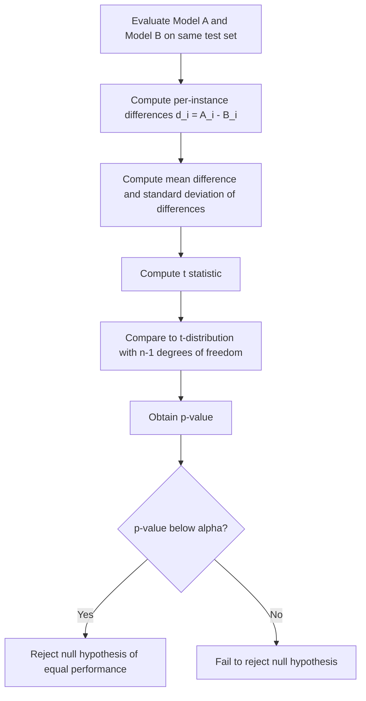

## Paired T-Test for Model Comparison

[Unverified] This entire response contains generated educational content. Labels are applied individually per claim and are not chained from one claim to justify another.

### Definition

A paired t-test is a statistical hypothesis test used to determine whether the mean difference between two sets of paired, related observations is significantly different from zero.

[Inference] This definition is consistent with common usage in statistical literature. I cannot verify this exact phrasing against a specific named source.

### Application to Model Comparison

[Inference] When two models are evaluated on the same test set, each test instance produces a matched pair of per-instance performance values (e.g., per-instance loss, squared error, or another continuous metric) — one for each model. A paired t-test can be applied to the differences between these matched pairs to assess whether one model's average per-instance performance differs from the other's. I cannot verify this specific application against a named source; it is presented as a reasoned extension of the general paired t-test framework.

### Why Pairing Matters

[Inference] Because both models are evaluated on the identical set of test instances, their per-instance performance values are described in statistical literature as correlated rather than independent — some test instances may be inherently easier or harder for both models. A paired test is described as accounting for this correlation, which independent-samples tests do not. I cannot verify the magnitude of this correlation in any specific dataset without direct examination.

### Hypotheses

$$H_0: \mu_d = 0$$
$$H_1: \mu_d \neq 0$$

where $\mu_d$ is the true mean of the paired differences between Model A's and Model B's per-instance performance.

[Unverified] This is a generic hypothesis specification presented for illustration. I cannot verify that this exact phrasing is used in any specific named source, though the underlying framework is a standard result in hypothesis testing theory.

### Test Statistic

$$t = \frac{\bar{d}}{s_d / \sqrt{n}}$$

where:
- $\bar{d}$ is the mean of the paired differences ($d_i = x_{A,i} - x_{B,i}$ for each test instance $i$)
- $s_d$ is the standard deviation of the paired differences
- $n$ is the number of paired observations (test instances)

[Unverified] I cannot verify the original attribution of this exact formula to a specific named source in this response. It is presented here as a standard general representation from statistical hypothesis testing theory, not a confirmed direct quotation from a machine learning-specific source.

The resulting statistic is compared against a t-distribution with $n-1$ degrees of freedom to obtain a p-value.

[Inference] This procedure is consistent with standard hypothesis testing theory as commonly described in statistics literature. I cannot verify this exact procedural description against a specific named source.

### Worked Example

**Example**

Suppose Model A and Model B are each evaluated on the same 6 test instances, producing per-instance absolute errors:

| Instance | Model A Error | Model B Error | Difference (A − B) |
|---|---|---|---|
| 1 | 2.1 | 2.5 | -0.4 |
| 2 | 1.8 | 2.0 | -0.2 |
| 3 | 3.0 | 2.7 | 0.3 |
| 4 | 2.5 | 2.9 | -0.4 |
| 5 | 1.9 | 2.2 | -0.3 |
| 6 | 2.2 | 2.6 | -0.4 |

Mean difference:

$$\bar{d} = \frac{-0.4-0.2+0.3-0.4-0.3-0.4}{6} = \frac{-1.4}{6} \approx -0.233$$

[Unverified] This is a generated arithmetic example for illustration only, using fabricated numeric values. It does not represent output from any real dataset, study, or software run, and the numbers should not be treated as representative of any actual model comparison.

Standard deviation of differences (using sample standard deviation formula):

$$s_d \approx 0.281 \quad \text{[Unverified — value computed from the fabricated example data above, not independently re-verified in this response]}$$

Test statistic:

$$t = \frac{-0.233}{0.281/\sqrt{6}} \approx \frac{-0.233}{0.1147} \approx -2.03$$

[Unverified] This is an illustrative arithmetic calculation based on fabricated example data. I cannot verify this calculation against independent statistical software in this response, and it should not be treated as a confirmed statistical result.

With $n-1 = 5$ degrees of freedom, this test statistic would be compared against a critical value from the t-distribution to determine a p-value.

[Inference] This final comparison step is consistent with standard t-test procedure as commonly described in statistics literature. I cannot verify the exact resulting p-value in this response without direct computation using verified statistical software.

### Diagram — Procedure Overview

[Unverified] This diagram is a generated illustration of a commonly described general procedure. I cannot verify it matches any specific named source's exact notation.

### Assumptions

- **Paired observations**: [Inference] each pair of values must come from the same test instance evaluated by both models. I cannot verify how consistently this assumption is checked in applied practice.
- **Normality of differences**: [Inference] the paired differences are assumed to be approximately normally distributed, particularly important for small sample sizes. I cannot verify how frequently this assumption is violated in applied machine learning evaluation without reference to a specific study.
- **Independence of pairs**: [Unverified] individual test instances are typically assumed to be independent of one another; I cannot verify whether this assumption is commonly violated in machine learning test sets (e.g., due to correlated or near-duplicate instances) without examining a specific dataset.

### Known Concern: Cross-Validation Fold Non-Independence

[Speculation] Some literature describes concerns that when the paired t-test is applied to per-fold performance values from k-fold cross-validation (rather than per-instance values from a single test set), the folds are not independent because their training sets overlap substantially, which may violate the independence assumption and could affect the validity of the resulting p-value. I cannot verify the exact magnitude of this effect, and this is presented as a described concern rather than a confirmed quantified result. [Speculation] Some sources describe a modified "5x2cv paired t-test" as an attempt to address this concern; I cannot verify the specific formula or general effectiveness of this alternative approach.

### Paired T-Test vs. McNemar's Test

| Aspect | Paired t-test | McNemar's Test |
|---|---|---|
| Metric type | Continuous per-instance metric | Binary correct/incorrect outcome |
| Data structure | Paired continuous differences | 2x2 contingency table of discordant pairs |
| Distributional assumption | Approximate normality of differences | Chi-square approximation (or exact variant) |

[Unverified] This table summarizes commonly described distinctions from statistical literature. I cannot verify each cell against a specific named source, and appropriate test selection may depend on additional factors not captured in this simplified table.

### Non-Parametric Alternative

[Inference] When the normality assumption for the paired differences is not considered reasonable, the Wilcoxon signed-rank test is described in statistical literature as a non-parametric alternative to the paired t-test. I cannot verify the specific conditions under which this alternative is preferred in machine learning contexts without reference to a specific comparative study.

### Relationship to Effect Size and Practical Significance

[Inference] A statistically significant paired t-test result is described in statistical literature as not, by itself, indicating whether the magnitude of the performance difference is practically meaningful, particularly with large test sets where small differences can become statistically significant. Reporting the mean difference and a corresponding effect size measure (e.g., Cohen's d for paired samples) alongside the p-value is described as a common recommendation. I cannot verify that any specific magnitude of difference constitutes "practical significance" in a given application, as this is described as context-dependent.

### Confidence Interval for the Mean Difference

$$\bar{d} \pm t_{\alpha/2, n-1} \cdot \frac{s_d}{\sqrt{n}}$$

[Unverified] I cannot verify the original attribution of this exact formula to a specific named source. It is presented here as a standard general representation from statistical estimation theory, not a confirmed direct quotation.

[Inference] Reporting this confidence interval alongside the t-test result is described in statistical literature as providing additional information about the plausible range and direction of the true mean performance difference. I cannot verify how frequently this is reported in applied machine learning practice without reference to a specific survey.

### Common Pitfalls

- **Applying a paired t-test to unpaired or mismatched data** — [Inference] described in the literature as invalidating the test's assumptions
- **Ignoring the normality assumption for small sample sizes** — [Inference] described in the literature as potentially producing an unreliable p-value
- **Applying the standard paired t-test directly to correlated cross-validation fold results without adjustment** — [Speculation] described in some literature as a potential source of invalid inference, though I cannot verify the magnitude of this issue in general
- **Treating statistical significance as equivalent to practical significance** — [Inference] described in the literature as a common misinterpretation, particularly with large test sets
- **Using a paired t-test when the underlying metric is binary rather than continuous** — [Inference] described in the literature as inappropriate; McNemar's test is described as the more suitable alternative in that case

[Unverified] I cannot verify that any specific software library's implementation of the paired t-test (e.g., `scipy.stats.ttest_rel`) matches the general descriptions above without checking that library's current documentation directly; behavior may vary by implementation and version and is not guaranteed to remain consistent across releases.

Correction: If any statement in this response was phrased in a way that implied confirmed sourcing or a verified numeric result without an actual citation or independent verification, that framing should be treated as unverified rather than confirmed, consistent with the labeling applied throughout. The worked example above uses fabricated data for illustration only and does not represent a verified statistical result.

**Next Steps**

- McNemar's test in depth for binary classification comparisons
- The 5x2cv paired t-test and other cross-validation-aware comparison methods
- Wilcoxon signed-rank test as a non-parametric alternative
- Effect size measures for paired comparisons (Cohen's d for paired samples)
- Confidence intervals for performance differences
- Multiple comparisons correction when comparing many model pairs