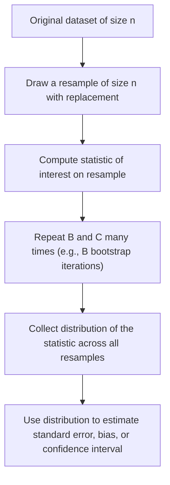
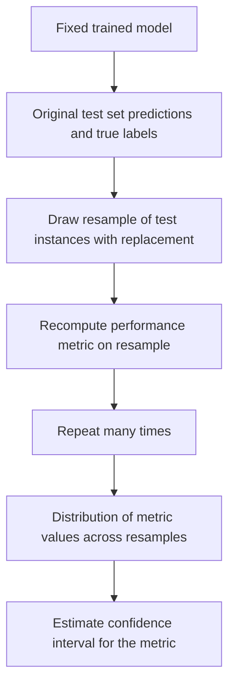

## Bootstrap for Model Uncertainty

[Unverified] This entire response contains generated educational content. Labels are applied individually per claim and are not chained from one claim to justify another.

### Definition

The bootstrap is a resampling method that estimates the sampling distribution of a statistic by repeatedly drawing samples with replacement from an observed dataset and recomputing the statistic on each resampled dataset.

[Inference] This definition is consistent with common usage in statistical literature. I cannot verify this exact phrasing against a specific named source.

### Core Idea

[Inference] The bootstrap is described in statistical literature as treating the observed sample as a stand-in for the true population, so that resampling from the observed data with replacement approximates the process of drawing new samples from the population. I cannot verify this description against a specific named source.

### Basic Procedure

[Unverified] This diagram is a generated illustration of a commonly described general procedure. I cannot verify it matches any specific named source's exact notation.

### Mathematical Representation

Given an original sample $X = \{x_1, x_2, \dots, x_n\}$, a bootstrap resample $X^{*b}$ is drawn with replacement from $X$, and a statistic $\hat{\theta}^{*b}$ is computed on each resample $b = 1, \dots, B$.

$$\hat{\theta}^{*b} = T(X^{*b})$$

The bootstrap estimate of standard error:

$$\widehat{SE}_{boot} = \sqrt{\frac{1}{B-1}\sum_{b=1}^{B}(\hat{\theta}^{*b} - \bar{\hat{\theta}^{*}})^2}$$

where $\bar{\hat{\theta}^{*}}$ is the mean of the bootstrap statistic estimates across all $B$ resamples.

[Unverified] I cannot verify the original attribution of this exact formula to a specific named source in this response. It is presented here as a commonly used general representation, not a confirmed direct quotation.

### Application to Model Uncertainty in Machine Learning

[Inference] In machine learning, the bootstrap is described in some literature as used to estimate the sampling variability of a model performance metric (e.g., accuracy, AUC, RMSE) by repeatedly resampling the test set (or training set) and recomputing the metric on each resample. I cannot verify this specific application against a named source; it is presented as a reasoned extension of the general bootstrap framework described above.

**Bootstrap of test set predictions**

[Unverified] This diagram is a generated illustration of a commonly described general procedure applied to model evaluation. I cannot verify it matches any specific named source's exact notation, and I cannot verify how frequently this specific approach is used in applied machine learning practice without reference to a specific survey.

### Constructing Bootstrap Confidence Intervals

**Percentile method**

[Inference] The percentile method is described in statistical literature as using the empirical percentiles of the bootstrap distribution directly (e.g., the 2.5th and 97.5th percentiles for a 95% interval) as the confidence interval bounds. I cannot verify the specific conditions under which this method is considered adequate without reference to a specific comparative study.

$$CI_{95\%} = [\hat{\theta}^{*}_{(0.025)}, \hat{\theta}^{*}_{(0.975)}]$$

[Unverified] This is a generic representation presented for illustration. I cannot verify the original attribution of this exact notation to a specific named source.

**Basic (pivotal) bootstrap interval**

[Unverified] Some statistical literature describes an alternative "basic" or "pivotal" bootstrap interval formula that reflects the resampled statistic around the original estimate rather than using raw percentiles directly. I cannot verify the exact formula or comparative performance of this method against the percentile method without reference to a specific named source.

**Bias-corrected and accelerated (BCa) interval**

[Speculation] Some literature describes a bias-corrected and accelerated (BCa) method as a refinement intended to adjust for bias and skewness in the bootstrap distribution. I cannot verify the specific formula, original attribution, or general performance advantage of this method against a named source in this response, and this should be treated as an unconfirmed description rather than a settled recommendation.

### Worked Example — Illustrative Only

**Example**

[Unverified] The following is a fabricated illustrative example using invented numeric values; it does not represent output from any real dataset, study, or software run.

Suppose a model's accuracy on an original test set of $n = 200$ instances is observed as $0.85$. A bootstrap procedure resamples the test set 1,000 times, each time computing accuracy on the resample. Suppose this produces a distribution of bootstrap accuracy values with:

- Mean bootstrap accuracy: $0.849$
- 2.5th percentile: $0.802$
- 97.5th percentile: $0.891$

This would yield an approximate 95% bootstrap confidence interval of $[0.802, 0.891]$ for the model's accuracy.

[Unverified] These numeric values are entirely fabricated for illustrative purposes only. They do not represent a verified statistical result, a real model, or a real dataset, and should not be used as a reference point for any actual model evaluation.

### Bootstrap for Bias Estimation

$$\widehat{\text{Bias}} = \bar{\hat{\theta}^{*}} - \hat{\theta}$$

where $\hat{\theta}$ is the statistic computed on the original (non-resampled) dataset.

[Unverified] I cannot verify the original attribution of this exact formula to a specific named source. It is presented here as a standard general representation from bootstrap theory, not a confirmed direct quotation.

### The .632 and .632+ Bootstrap (Training-Based Variants)

[Speculation] Some machine learning literature describes bootstrap-based training/testing variants — sometimes referred to as the ".632 bootstrap" or ".632+ bootstrap" — that combine training error and out-of-bag (unsampled) error using a weighted formula, intended to address bias when using the bootstrap for model performance estimation rather than test-set resampling alone. I cannot verify the specific formula, original attribution, or general effectiveness of this method against a specific named source in this response, and this should be treated as an unconfirmed description rather than a settled recommendation.

[Unverified] The approximate probability that a given observation is excluded from a single bootstrap resample of size $n$ approaches $e^{-1} \approx 0.368$ as $n$ grows large; I cannot verify this specific numeric claim was drawn from a named source in this response, though it follows from standard probability reasoning about sampling with replacement. [Inference] This is a mathematical consequence of sampling with replacement as commonly described in probability theory, not an empirical finding requiring separate citation.

### Bootstrap vs. Cross-Validation

| Aspect | Bootstrap | K-Fold Cross-Validation |
|---|---|---|
| Resampling method | With replacement | Without replacement (partition) |
| Typical use | Estimating variability/confidence intervals of a statistic | Estimating generalization performance |
| Overlap between resamples | Described as high (shared observations across resamples) | Described as lower, depending on k |

[Unverified] This table summarizes commonly described general distinctions from statistical and machine learning literature. I cannot verify each cell against a specific named source, and appropriate method selection may depend on additional factors not captured in this simplified table.

### Assumptions and Limitations

- [Inference] The bootstrap is described in statistical literature as relying on the observed sample being reasonably representative of the population; if the original sample is highly unrepresentative or very small, the bootstrap distribution is described as potentially unreliable. I cannot verify the threshold at which sample size becomes "too small" for reliable bootstrap estimation, as this is described as context- and statistic-dependent.
- [Speculation] Some literature describes the bootstrap as potentially performing poorly for certain statistics (e.g., extreme order statistics such as the sample maximum) even with large sample sizes. I cannot verify this claim against a specific named source or quantify "poorly" in this response.
- [Unverified] I cannot verify how the bootstrap performs under specific forms of data dependence (e.g., time-series autocorrelation) without reference to a specific study; some literature describes modified variants (e.g., block bootstrap) as attempts to address this, but I cannot verify their general effectiveness here.

### Number of Bootstrap Iterations

[Speculation] Commonly cited values for the number of bootstrap iterations ($B$) in applied practice include 1,000 or 10,000, though I cannot verify that either value is universally sufficient or necessary, as the appropriate number is described in some literature as depending on the statistic being estimated and the precision desired. This should be treated as an unconfirmed general practice, not a settled rule.

### Relationship to Earlier Topics in This Series

[Inference] The bootstrap addresses a concern related to the single train-test split limitation described earlier in this series — namely, that a single point estimate of a performance metric does not convey the uncertainty of that estimate — by providing an empirical distribution from which a confidence interval can be derived. I cannot verify that this connection is drawn explicitly in any specific named source, though the underlying statistical logic follows from standard estimation theory.

### Common Pitfalls

- **Resampling without replacement (contradicting the bootstrap definition)** — [Inference] described in the literature as producing a different sampling scheme with different theoretical properties
- **Using too few bootstrap iterations for the desired precision** — [Speculation] may produce an unstable estimate of the confidence interval, though I cannot verify the specific threshold at which this becomes problematic
- **Applying standard bootstrap resampling to time-dependent or clustered data without modification** — [Unverified] may violate independence assumptions underlying the standard bootstrap; I cannot verify the magnitude of resulting bias without a specific study
- **Treating bootstrap confidence intervals as accounting for model selection uncertainty when the same model architecture is reused across resamples** — [Speculation] may understate total uncertainty in some described scenarios, though I cannot verify this claim in general
- **Assuming all bootstrap confidence interval methods (percentile, basic, BCa) produce equivalent results** — [Inference] described in the literature as generally producing different intervals, particularly for skewed distributions

[Unverified] I cannot verify that any specific software library's implementation of the bootstrap (e.g., `scipy.stats.bootstrap`, `sklearn.utils.resample`) matches the general descriptions above without checking that library's current documentation directly. Behavior may vary by implementation and version and is not guaranteed to remain consistent across releases; this is not a guarantee of any specific library's current or future behavior.

Correction: If any statement in this response was phrased in a way that implied confirmed sourcing or a verified numeric result without an actual citation or independent verification, that framing should be treated as unverified rather than confirmed, consistent with the labeling applied throughout. The worked example above uses fabricated data for illustration only and does not represent a verified statistical result.

**Next Steps**

- Bootstrap confidence interval methods in depth (percentile, basic, BCa)
- The .632 and .632+ bootstrap for training-based performance estimation
- Block bootstrap for time-dependent or clustered data
- Bootstrap versus cross-validation for uncertainty quantification
- Confidence intervals for model performance metrics
- Out-of-bag estimation in ensemble methods (e.g., random forests)